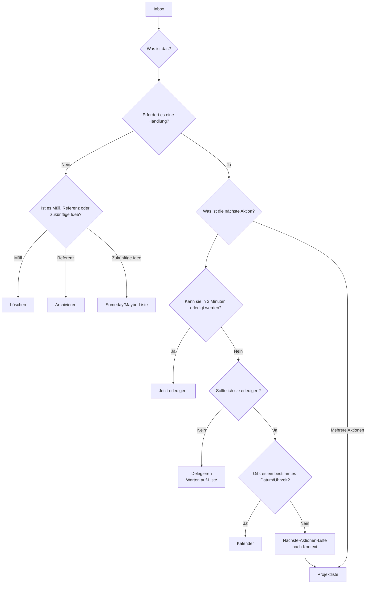

# GTD (Getting Things Done)

Unser Gehirn ist von Natur aus eine hervorragende „CPU“ zum **Erzeugen von Ideen**, aber ein äußerst schlechter „Speicher“ zum **Speichern von Informationen**. Wenn wir unser Gehirn dazu verwenden, uns an all unsere To-Dos, Termine, Ideen und Verpflichtungen zu erinnern, wird es mit diesen „offenen Themen“ beschäftigt, was zu Stress, Angst und geistiger Unordnung führt und es unmöglich macht, sich auf die aktuelle Aufgabe zu konzentrieren. **GTD (Getting Things Done)**, entwickelt vom Produktivitätsexperten David Allen, ist ein weltweit bekanntes **Persönlichkeitsproduktivitätssystem und Workflow-Management-Verfahren**.

Die Kernphilosophie von GTD besteht darin, einen Zustand von **„Geist wie Wasser“** zu erreichen – stressfreie, hochkonzentrierte und effiziente Arbeit – indem alle ausstehenden „Dinge“ aus Ihrem Kopf in ein **externes, vertrauenswürdiges System** übertragen werden und anschließend ein klarer, strenger Prozess angewandt wird, um sie zu **organisieren und zu bearbeiten**. Es ist kein einfacher Zeitmanagement-Trick, sondern ein vollständiges Betriebssystem, das entwickelt wurde, um Ihren Geist zu befreien und Ihnen ermöglicht, komplexe Arbeit und Leben gelassen zu bewältigen.

## Die Fünf Kernschritte von GTD

1.  **Erfassen**: Bringe alles, was deine Aufmerksamkeit erregt – sei es eine Arbeitstätigkeit, eine private Aufgabe, eine plötzliche Eingebung oder ein zukünftiger Termin – **sofort** aus deinem Kopf heraus in deine **„Inbox“**. Die Inbox kann physisch (z. B. ein Aktenkorb, ein Notizbuch) oder digital (z. B. ein E-Mail-Postfach, eine To-Do-App) sein. Der Schlüssel ist, so wenige Posteingänge wie möglich zu haben, denen du vollständig vertrauen kannst und die du zu 100 % leeren kannst.

2.  **Verarbeiten**: Leere deine Inbox **regelmäßig** (mindestens einmal täglich). Halte dich strikt an das Prinzip **ein Element nach dem anderen**, nimm jedes „Ding“ in deiner Inbox einzeln auf und stelle dir die Kernfrage: **„Was ist das? Erfordert es eine Handlung?“**
    *   Wenn **keine Handlung erforderlich ist**: Es handelt sich entweder um **Müll** (direkt löschen), **Informationen, die in Zukunft benötigt werden könnten** (in eine Referenzdatei legen), oder um eine **Idee in der Entstehungsphase** (in eine Liste „Irgendwann/Möglicherweise“ legen).
    *   Wenn **eine Handlung erforderlich ist**: Fahre mit dem nächsten Organisationsschritt fort.

3.  **Organisieren**: Sortiere die Elemente, die eine Handlung erfordern, anhand ihrer Natur in verschiedene „Behälter“.
    *   **„Zwei-Minuten-Regel“**: Wenn die Handlung **innerhalb von zwei Minuten** ausgeführt werden kann, **führe sie sofort aus**, ohne weitere Organisation.
    *   **Delegieren**: Wenn die Aufgabe von jemand anderem erledigt werden sollte, **delegiere** sie sofort und lege sie in eine Liste **„Warten auf“**, um sie zu verfolgen.
    *   **Kalender**: Für Handlungen mit einem **bestimmten Datum oder einer bestimmten Uhrzeit** (z. B. Meetings, Termine), lege sie in deinen **Kalender**.
    *   **Nächste-Aktionen-Liste**: Für Handlungen, die deine persönliche Aufmerksamkeit erfordern, mehr als einen Schritt benötigen und kein bestimmtes Datum haben, zerlege sie in die **erste konkrete, sichtbare physische Handlung** und lege sie in verschiedene **„Nächste-Aktionen-Listen“** entsprechend dem **Kontext**. Kontexte können sein: „@Computer“, „@Büro“, „@Telefon“, „@Supermarkt“ usw.
    *   **Projektliste**: Jedes Ergebnis, das **mehr als eine Handlung** erfordert, um abgeschlossen zu werden, sollte als **„Projekt“** definiert und in die **„Projektliste“** aufgenommen werden. Diese Liste enthält nur den Projektnamen; die konkreten nächsten Schritte befinden sich in der entsprechenden nächsten-Aktionen-Liste.

4.  **Überprüfen**: Um die Vertrauenswürdigkeit des Systems zu gewährleisten, musst du **regelmäßige Überprüfungen** durchführen.
    *   **Tägliche Überprüfung**: Schaue täglich schnell in deinen Kalender und deine nächste-Aktionen-Liste, um deinen Arbeitstag zu planen.
    *   **Wöchentliche Überprüfung**: Dies ist ein **entscheidender Bestandteil von GTD**. Einmal pro Woche (meist am Wochenende) solltest du 1–2 Stunden einplanen, um das gesamte System umfassend zu überprüfen, zu aktualisieren und aufzuräumen, um sicherzustellen, dass alle Projekte unter Kontrolle sind und alle Listen aktuell sind.

5.  **Handeln**: Zu jedem Zeitpunkt, wenn du entscheiden musst „Was soll ich jetzt tun?“, kannst du eine kluge und gelassene Wahl aus deiner Aktionsliste treffen, basierend auf folgenden Kriterien:
    *   **Kontext**: Wo bist du gerade? Welche Werkzeuge hast du zur Verfügung? (z. B. wenn du im Büro bist, sieh dir die Liste „@Büro“ an)
    *   **Verfügbare Zeit**: Wie viel Freizeit hast du gerade? (z. B. wenn du nur 10 Minuten hast, wähle eine Aufgabe, die schnell erledigt werden kann)
    *   **Verfügbare Energie**: Wie hoch ist deine aktuelle Energie? (z. B. wenn du energiegeladen bist, übernimm eine Aufgabe, die hohe Konzentration erfordert)
    *   **Priorität**: Unter den obigen Bedingungen, welche Aufgabe ist am wichtigsten?

### GTD-Workflow-Verarbeitungsdiagramm

## Anwendungsbeispiele

**Beispiel 1: Ein beschäftigter Abteilungsleiter**

*   **Erfassen**: Seine Inbox könnte folgende Elemente enthalten: E-Mail-Postfach, WeChat-Nachrichten, Notizen aus Meetings und plötzliche Ideen, die ihm einfallen.
*   **Verarbeiten und Organisieren**:
    *   Eine E-Mail „Hinweis zum Budget der nächsten Quartals“ -> Keine Handlung erforderlich -> **Archivieren** in den Ordner „Firmenfinanzen“.
    *   Eine Idee „Untergebenen Xiao Zhang an die Abgabe des Wochenberichts erinnern“ -> Kann in 2 Minuten erledigt werden -> **Sofort** eine Nachricht an Xiao Zhang senden.
    *   Eine Aufgabe „Vorbereitung des jährlichen Teambuildings“ -> Erfordert mehrere Schritte -> Füge „Teambuilding“ der **„Projektliste“** hinzu; lege die erste Aktion „Kommunikation mit HR, um eine Liste möglicher Veranstaltungsorte zu erhalten“ in die **„@Büro“**-Liste der nächsten Aktionen.
    *   Ein Termin „Meeting mit Kunde nächsten Mittwoch um 15 Uhr“ -> **In den Kalender eintragen**.
*   **Handeln**: Wenn er sich im Büro befindet, eine Stunde Freizeit hat und sich energiegeladen fühlt, kann er die Liste „@Büro“ öffnen und sich entscheiden, an der Aufgabe „Kommunikation mit HR“ zu arbeiten.

**Beispiel 2: Projektmanagement eines Freiberuflers**

*   **Projektliste**: Könnte enthalten „Webdesignprojekt für Kunde A“, „Redesign des persönlichen Blogs“, „Lernen einer neuen Programmiersprache“ usw.
*   **Nächste-Aktionen-Liste**:
    *   **@Telefon**: Rufe Kunde A an, um Feedback zu den Designentwürfen zu bestätigen.
    *   **@Computer-Design**: Basierend auf dem Feedback, das Design der Startseite überarbeiten.
    *   **@Computer-Schreiben**: Einen Blogbeitrag über „responsives Design“ schreiben.
    *   **@Lesen/Lernen**: Das dritte Kapitel des Programmierkurses ansehen.
*   **Wöchentliche Überprüfung**: Am Freitagnachmittag überprüft er den Fortschritt aller Projekte, stellt sicher, dass jedes Projekt mindestens eine „nächste Aktion“ hat, und plant die Prioritäten für die nächste Woche.

**Beispiel 3: Ein Student, der Studium und Leben organisiert**

*   **Inbox**: Benachrichtigungen aus Kurs-WeChat-Gruppen, von Lehrern zugewiesene Hausaufgaben, Ideen zu Vereinsaktivitäten, eine Einkaufsliste für den täglichen Bedarf.
*   **Projektliste**: „Geschichtsarbeit fertigstellen“, „Vorbereitung auf die Abschlussprüfung“, „Planung der Begrüßungsfeier für Erstsemester.“
*   **Nächste-Aktionen-Liste**:
    *   **@Bibliothek**: Drei Referenzbücher zum Thema der Arbeit ausleihen.
    *   **@Wohnheim**: Mathematiknotizen ordnen.
    *   **@Supermarkt**: Zahnpasta und Shampoo kaufen.
*   Das **GTD-System** hilft ihm dabei, akademische Aufgaben klar von alltäglichen Pflichten zu trennen und sicherzustellen, dass die richtigen Dinge zur richtigen Zeit und am richtigen Ort erledigt werden.

## Vorteile und Herausforderungen von GTD

**Kernvorteile**

*   **Reduziert geistigen Stress, befreit mentale Kapazitäten**: Durch das Auslagern aller „offenen Themen“ wird die Gedächtnisbelastung des Gehirns und die ständige Angst vor dem „Vergessen“ stark reduziert.
*   **Erhöht das Gefühl von Kontrolle und Gelassenheit**: Ein vertrauenswürdiges System gibt dir Sicherheit, dass alles unter Kontrolle ist, und ermöglicht es dir, aktuelle Aufgaben gelassener und konzentrierter anzugehen.
*   **Stellt sicher, dass „wichtige Dinge“ nicht vergessen werden**: Die entscheidende „wöchentliche Überprüfung“ stellt sicher, dass alle wichtigen Projekte und langfristigen Ziele kontinuierlich im Fokus bleiben und Fortschritte machen.
*   **Sehr anpassbar und flexibel**: GTD legt keine Prioritäten fest, sondern bietet ein Gerüst, das es dir ermöglicht, dynamisch und flexibel die passendste Aktion basierend auf dem aktuellen Kontext auszuwählen.

**Potenzielle Herausforderungen**

*   **Hoher Aufwand bei der Einrichtung des Systems**: Beim ersten Mal, alle „Dinge“ zu erfassen und das vollständige Listensystem einzurichten, kann es mehrere Stunden oder sogar einen ganzen Tag dauern.
*   **Erfordert strikte Selbstdisziplin und Gewohnheitsbildung**: Der Erfolg von GTD hängt stark davon ab, ob du die Kerngewohnheiten **kontinuierliches Erfassen** und **regelmäßiges Überprüfen** entwickeln kannst. Sobald das System nicht mehr vertrauenswürdig und aktualisiert ist, bricht es schnell zusammen.
*   **Wahl der richtigen Tools**: Es gibt viele GTD-Software-Tools auf dem Markt, und Anfänger können leicht in die Falle geraten, zu sehr auf das „perfekte Tool“ zu achten und dabei die Methode selbst zu vernachlässigen.

## Erweiterungen und Verbindungen

*   **Eisenhower-Matrix**: Kann im Schritt **„Handeln“** von GTD als effektives Denkmodell zur Beurteilung der **Priorität** verwendet werden.
*   **Pomodoro-Technik**: Ist eine hervorragende konkrete Taktik, um Aufgaben aus der GTD-Liste **„Nächste Aktionen“**, die hohe Konzentration erfordern, auszuführen.

---
*Referenz: David Allens weltweiter Bestseller „Getting Things Done: The Art of Stress-Free Productivity“ ist die einzige und autoritativste Quelle, um die vollständige Philosophie, den Prozess und die besten Praktiken hinter der GTD-Methode zu verstehen.*