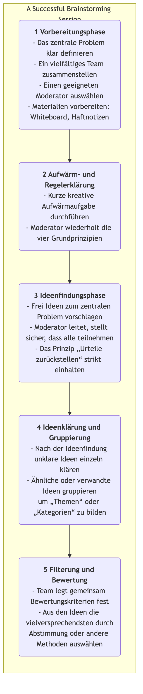

# Brainstorming

Wenn es darum geht, Innovationen zu schaffen und komplexe Probleme zu lösen, ist unser größter Feind oft das tief verwurzelte, einschränkende Denken in unseren eigenen Köpfen. **Brainstorming** ist eine klassische, mächtige und weit verbreitete **Gruppen-Ideenfindungstechnik**, die entwickelt wurde, um diese mentalen Fesseln zu sprengen. Sie wurde in den 1940er Jahren von dem Werbemanager Alex F. Osborn vorgeschlagen, und ihr Kernziel besteht darin, die Teilnehmer zu motivieren, innerhalb kurzer Zeit möglichst viele neue, vielfältige und sogar scheinbar unrealistische Ideen zu generieren, indem eine völlig offene, freie und nicht bewertende Diskussionsatmosphäre geschaffen wird.

Das Wesen des Brainstormings liegt in der Devise **"Quantität vor Qualität"**. Es vertraut fest darauf, dass die Qualität von Ideen durch die Akkumulation von Quantität gefördert werden kann. Indem Urteile zurückgestellt und wilde Ideen ermutigt werden, kann Brainstorming effektiv die Kreativität eines Teams von einem „kritischen Modus“ in einen „generativen Modus“ verschieben, dadurch verschiedene unbekannte Möglichkeiten in einer sicheren Umgebung erkunden und reichhaltiges, vielfältiges Rohmaterial für die spätere Filterung und Vertiefung bereitstellen.

## Vier Grundprinzipien des Brainstormings

Um sicherzustellen, dass Brainstorming seine beabsichtigten Ergebnisse erzielt, müssen die folgenden vier Grundprinzipien, die von Osborn formuliert wurden, strikt eingehalten werden. Sie sind die Grundlage für die Schaffung einer sicheren und freien Umgebung.

1.  **Urteile zurückstellen**: Dies ist das zentralste und unverrückbarste Prinzip. Während des Brainstormings ist **absolut keine** Kritik, kein Hinterfragen oder Urteilen jeglicher Art für jede vorgeschlagene Idee erlaubt, egal wie absurd oder unrealistisch sie klingen mag. Bewertungen finden erst in der anschließenden Filterphase statt.

2.  **Wilde Ideen ermutigen**: Die Teilnehmer sollen ermutigt werden, außerhalb der üblichen Denkmuster zu denken. Ideen, die verrückt oder logisch unzusammenhängend erscheinen, können oft mentale Starre durchbrechen und andere inspirieren, noch bahnbrechendere Ideen zu entwickeln.

3.  **Streben nach Quantität**: Setzen Sie ein klares, herausforderndes quantitatives Ziel (z. B. „100 Ideen in 20 Minuten generieren“). Je mehr Ideen, desto größer die Wahrscheinlichkeit, dass hochwertige Ideen entstehen.

4.  **Auf den Ideen anderer aufbauen**: Dies wird auch als „Piggybacking“ oder „Schneeballeffekt“ bezeichnet. Die Teilnehmer sollen angeregt werden, sorgfältig auf die Ideen anderer zu hören und darüber nachzudenken, wie sie kombiniert, verbessert oder erweitert werden können, um neue, weiterentwickelte Ideen zu generieren. Dies spiegelt den synergetischen Effekt von „1+1>2“ wider.

### Brainstorming-Prozess

<!-- mermaid 源文件：Brainstorming-Tutorial-de-mermaid-live-1.mmd -->

## Wie man eine effektive Brainstorming-Session organisiert

1.  **Sorgfältige Vorbereitung**
    *   **Ein klares zentrales Problem definieren**: Das Problem sollte weder zu weit noch zu eng gefasst sein. Zum Beispiel das zu allgemeine Problem „Wie können wir den Gewinn des Unternehmens steigern?“ auf „Wie können wir die Wiederkaufsrate bestehender Kunden um 20 % erhöhen?“ eingrenzen.
    *   **Ein vielfältiges Team zusammenstellen**: Laden Sie 5–10 Personen mit unterschiedlichem Hintergrund und aus verschiedenen Abteilungen ein. Vielfältige Perspektiven führen zu reichhaltigeren Ideen.
    *   **Einen exzellenten Moderator auswählen**: Der Moderator trägt nicht direkt Ideen bei; seine Rolle besteht darin, den Prozess zu leiten, die Zeit zu verwalten, die Teilnahme zu fördern und strikt jede bewertende Äußerung zu unterbinden.

2.  **Die richtige Atmosphäre schaffen**
    *   Wählen Sie eine entspannte, angenehme Umgebung und bereiten Sie Werkzeuge wie Whiteboards, Haftnotizen und Marker vor.
    *   Vor Beginn können kurze kreative Aufwärmübungen (z. B. „100 Verwendungsmöglichkeiten für eine Büroklammer“) helfen, die Teilnehmer zu entspannen und in einen kreativen Denkmodus zu versetzen.

3.  **Ideen generieren und aufzeichnen**
    *   Der Moderator gibt den Startschuss und legt eine klare Zeitbegrenzung fest (meist 15–30 Minuten).
    *   Die Teilnehmer sollen laut alle Ideen äußern, die ihnen einfallen, oder sie auf Haftnotizen schreiben und an die Wand heften. Der Moderator oder ein festgelegter Protokollant muss alle Ideen schnell erfassen, ohne sie zu verändern oder zu streichen.

4.  **Konvergieren und bewerten**
    *   Nach der Ideenfindungsphase beginnt die Konvergenzphase. Zunächst führt der Moderator alle in einer schnellen Runde durch alle Ideen und klärt unklare Punkte.
    *   Danach werden ähnliche Ideen kategorisiert und zu einigen zentralen Themenrichtungen zusammengefasst.
    *   Schließlich legt das Team gemeinsam einige Bewertungskriterien fest (z. B. „Durchführbarkeit“, „Innovationsgehalt“, „Nutzen für den Benutzer“) und wählt durch Abstimmung (z. B. mit Klebepunkten) 2–3 am meisten anerkannte und vielversprechende Ideen aus, die für eine weitere vertiefte Bearbeitung ausgewählt werden.

## Anwendungsbeispiele

**Beispiel 1: Benennen einer neuen App**

*   **Zentrales Problem**: „Entwickeln Sie einen prägnanten, leicht zu merkenden Namen für unsere soziale App mit dem Schwerpunkt ‚Lebensmittelteilen‘.“
*   **Anwendung**: Das Marketingteam führte eine 30-minütige Brainstorming-Session durch. Es wurden über 80 mögliche Namen generiert, darunter „Foodie Notes“, „Taste Buddies“ und „Snap & Eat“. In der anschließenden Filterung wählten sie letztendlich einen Namen aus, der sowohl die Produktmerkmale als auch die sozialen Aspekte widerspiegelte.

**Beispiel 2: Umgang mit Kundenbeschwerden**

*   **Zentrales Problem**: „Wie können wir die Kundenbeschwerden über ‚langsame Lieferung durch die Logistik‘ um 50 % reduzieren?“
*   **Anwendung**: Ein interdisziplinäres Team aus Mitarbeitern des Kundendienstes, der Logistik und des Betriebs führte gemeinsam Brainstorming durch. Unter den erzeugten Ideen befanden sich: „Zusammenarbeit mit schnelleren Kurierdiensten“, „Einrichtung von Vorlagern“, „Optimierung der Verpackungsprozesse“ und „Angebot von Rabattgutscheinen bei verspäteter Lieferung“. Diese Ideen bildeten eine reichhaltige Grundlage für die Entwicklung konkreter Lösungen.

**Beispiel 3: Planung einer Marketingkampagne**

*   **Zentrales Problem**: „Wie können wir für unsere Saftmarke eine kreative Online-Marketingkampagne für den kommenden Sommer planen?“
*   **Anwendung**: Die Teammitglieder ließen ihrer Fantasie freien Lauf und schlugen verschiedene Ideen vor, wie z. B.: „Veranstaltung eines ‚Sommer-Specials‘-UGC-Wettbewerbs“, „Zusammenarbeit mit beliebten Inselreise-Bloggern für Live-Streams“, „Einführung von Verpackungen, die zu Eis am Stiel gefroren werden können“ und „Start einer Social-Media-Herausforderung zum Geschmack des Sommers“. Diese Ideen wurden nach Kombination und Verfeinerung zu einem vollständigen Marketingplan zusammengefasst.

## Vorteile und Herausforderungen des Brainstormings

**Kernvorteile**

*   **Effiziente Ideenfindung**: Kann innerhalb kurzer Zeit schnell eine große Anzahl vielfältiger Ideen generieren.
*   **Förderung von Teamarbeit und Zusammenhalt**: Schafft eine gleichberechtigte, stressfreie Umgebung, die hilft, den Zusammenhalt und die kollektive Kreativität des Teams zu stärken.
*   **Durchbruch mentaler Starre**: Indem wilde Ideen ermutigt und Urteile zurückgestellt werden, hilft Brainstorming effektiv dabei, Teams aus den Fesseln des konventionellen Denkens zu befreien.

**Potenzielle Herausforderungen**

*   **Risiko von „Groupthink“**: Wenn die Moderation nicht richtig erfolgt, könnten die Meinungen weniger Einzelpersonen die Diskussion dominieren oder die Teilnehmer dazu neigen, „sichere“ Ideen vorzuschlagen.
*   **„Free-Riding“-Phänomen**: In einem Team könnten einige Einzelpersonen weniger aktiv sein und einfach „mitreiten“, ohne viele eigene Ideen beizusteuern.
*   **Schwierigkeiten bei der Umsetzung**: Die strikte Einhaltung des Prinzips „Urteile zurückstellen“ erfordert hohe Moderationskompetenz und eine reife Teamkultur.
*   **Unvollständige Nachbereitung**: Brainstorming selbst ist nur für die Ideenfindung verantwortlich. Ohne anschließende, systematische Filterung, Bewertung und Umsetzungsmechanismen bleiben selbst die besten Ideen Luftschlösser.

## Erweiterungen und Verknüpfungen

*   **Reverse Brainstorming**: Eine interessante Variante. Anstatt zu fragen „Wie können wir Erfolg haben?“, wird gefragt „Wie können wir das völlig vermasseln?“. Indem alle Faktoren identifiziert werden, die zum Scheitern führen könnten, kann das Team dann umgekehrt Lösungen entwickeln, um diese Risiken zu vermeiden.
*   **Brainwriting**: Um zu verhindern, dass eloquente Sprecher die Diskussion dominieren, können schriftliche Formen verwendet werden. Zum Beispiel die 6-3-5-Methode, bei der 6 Teilnehmer jeweils 3 Ideen in 5 Minuten aufschreiben und dann das Blatt an die nächste Person weitergeben, um Inspiration und Erweiterungen zu erhalten.
*   **Six Thinking Hats**: Kann als strukturelles Werkzeug für die anschließende „Bewertungsphase“ des Brainstormings dienen und das Team dabei unterstützen, die gefilterten Ideen aus verschiedenen Perspektiven umfassend zu betrachten.
*   **Mind Mapping**: Ein hervorragendes visuelles Werkzeug zur Organisation und Strukturierung der Ergebnisse von Brainstorming.

---
*Referenz: Alex F. Osborn beschrieb erstmals systematisch die Prinzipien und Methoden des Brainstormings in seinem 1953 erschienenen Buch „Applied Imagination“. Es zählt bis heute zu den weltweit am häufigsten verwendeten Techniken zur Ideenfindung.*