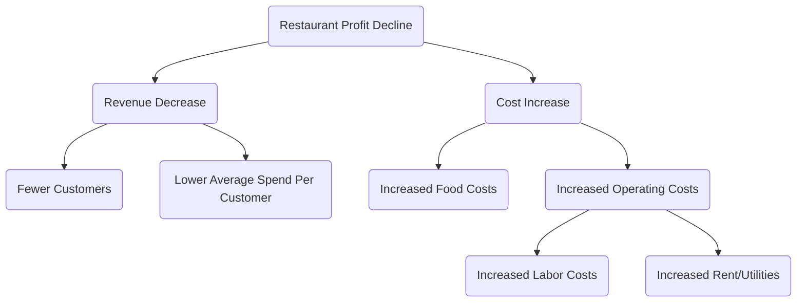

# Logikbaum-Analyse-Tutorial

## 1. Was ist ein Logikbaum?

**Logikbaum** ist ein leistungsfähliches, visuelles Analysewerkzeug, das verwendet wird, um komplexe Probleme oder Fragestellungen systematisch in kleinere, überschaubarere Bestandteile zu zerlegen. Sein grundlegendes Prinzip ist **MECE (Mutually Exclusive, Collectively Exhaustive)**, was bedeutet, dass die zerlegten Bestandteile sich nicht überschneiden und keine Aspekte ausgelassen werden.

Ein Logikbaum hilft uns, ein klares Denkgerüst aufzubauen und stellt sicher, dass die Analyse gründlich und umfassend ist.

## 2. Haupttypen von Logikbäumen

Logikbäume lassen sich hauptsächlich in zwei Typen unterteilen, die zur Lösung von Problemen unterschiedlicher Art verwendet werden:

### a. Problem-Baum (Diagnose-Baum)

-   **Zweck**: Wird verwendet, um Ursachen dafür zu diagnostizieren und zu erforschen, **warum** ein Problem auftritt.

-   **Struktur**: Ausgehend von einem Kernproblem (die Wurzel) wird kontinuierlich in immer kleinere Bestandteile zerlegt, um mögliche Ursachen für das Problem zu finden. Jede Ebene der Äste ist eine tiefere Erklärung des Problems der vorherigen Ebene.

-   **Anwendbare Szenarien**: Ursachenanalyse, Diagnose von Leistungseinbrüchen, Fehlersuche usw.

### b. "Wie"-Baum (Lösungs-Baum)

-   **Zweck**: Wird verwendet, um Konzepte zu entwickeln und zu planen, **wie** ein Ziel erreicht oder ein Problem gelöst werden kann.
-   **Struktur**: Ausgehend von einem Gesamtziel (die Wurzel) wird in konkrete, umsetzbare Strategien oder Aktionspläne zerlegt.
-   **Anwendbare Szenarien**: Strategische Planung, Zieldefinition, Projektplanung, Lösungssuche usw.

## 3. Wie erstellt man einen Logikbaum?

### Schritt Eins: Definieren des Kernproblems oder Ziels

-   **Problem-Baum**: Formulieren Sie klar das zu analysierende "Problem". Beispiel: "Warum steigt die Abwanderungsrate der Nutzer auf unserer Website?"
-   **"Wie"-Baum**: Definieren Sie klar das zu erreichende "Ziel". Beispiel: "Wie können wir die monatlich aktiven Nutzer der Website um 20 % steigern?"
-   Verwenden Sie dieses Problem oder Ziel als Ausgangspunkt (Wurzel) des Logikbaums.

### Schritt Zwei: Erste Zerlegungsebene (MECE-Prinzip anwenden)

-   **Brainstorming**: Denken Sie über die Hauptbestandteile nach, in die das Kernproblem/das Ziel zerlegt werden kann.
-   **MECE-Prinzip anwenden**: Stellen Sie sicher, dass die Äste der ersten Ebene sich gegenseitig ausschließen (keine Überschneidungen) und gemeinsam alle wichtigen Aspekte abdecken (keine wesentlichen Punkte werden ausgelassen).
    -   **Beispiel (Problem-Baum)**: Die steigende Abwanderungsrate kann aufgeteilt werden in: "Abwanderung neuer Nutzer" und "Abwanderung bestehender Nutzer".
    -   **Beispiel ("Wie"-Baum)**: Die Erhöhung der monatlich aktiven Nutzer kann aufgeteilt werden in: "Gewinnung neuer Nutzer", "Steigerung der Aktivität bestehender Nutzer" und "Rückgewinnung abgewanderter Nutzer".

### Schritt Drei: Schichtenweise Zerlegung

-   **Weiterfragen**: Für jeden Ast weiterhin die Frage stellen: "Warum passiert das?" (Problem-Baum) oder "Wie kann das genau umgesetzt werden?" ("Wie"-Baum), um tiefere Zerlegungsebenen zu erhalten.
-   **Klare Struktur beibehalten**: Wenden Sie auf jeder Ebene weiterhin das MECE-Prinzip an, bis das Problem auf eine ausreichend konkrete Ebene zerlegt ist, die mit Daten überprüft oder direkt bearbeitet werden kann.

### Schritt Vier: Hypothesen validieren und priorisieren

-   **Datenvalidierung**: Sammeln Sie bei Problem-Bäumen Daten, um zu prüfen, welche Äste tatsächlich die Ursache sind.
-   **Lösungen bewerten**: Bewerten Sie bei "Wie"-Bäumen die Umsetzbarkeit, Kosten und erwartete Wirkung jedes Aktionsplans.
-   **Kritischen Pfad bestimmen**: Identifizieren Sie die wesentlichen Ursachen oder Maßnahmen, die den größten Einfluss auf die Problemlösung oder Zieldurchsetzung haben, und priorisieren Sie diese.

## 4. Praxisfälle

### Fall 1: Problem-Baum - Analyse von "Warum sinkt der Gewinn des Restaurants?"

<!--


-->

**Analyse**: Mit diesem Baumdiagramm können Manager die Hauptfaktoren für den Gewinnverlust klar erkennen und für jeden Ast (z. B. "Weniger Kunden") Daten sammeln, um eine tiefere Analyse durchzuführen.

### Fall 2: "Wie"-Baum - Planung von "Wie kann man die persönliche Arbeitsproduktivität verbessern?"

```mermaid
graph TD
    A(Improve Personal Work Efficiency) --> B(Better Time Management)
    A --> C(Optimize Workflow)
    A --> D(Reduce Distractions)

    B --> E(Use Pomodoro Technique)
    B --> F(Create Daily Task List)

    C --> G(Automate Repetitive Tasks)
    C --> H(Use Templates and Tools)

    D --> I(Turn Off Unnecessary Notifications)
    D --> J(Set Fixed "Do Not Disturb" Work Hours)
```

**Analyse**: Dieses Diagramm zerlegt ein abstraktes Ziel in eine Reihe konkreter, umsetzbarer Schritte und hilft Einzelpersonen dabei, klare Verbesserungspläne zu erstellen.

Logikbäume sind eine der zentralen Fähigkeiten, die für Berater, Produktmanager und Strategieplaner unerlässlich sind, da sie das Denken in Tiefe und Breite erheblich verbessern können.