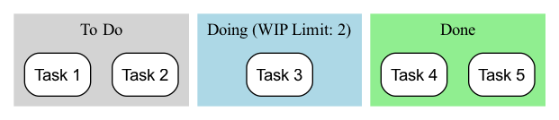

# Kanban

Beim Streben nach effizienten, reibungslosen Arbeitsabläufen stoßen wir oft auf Probleme wie: sich häufende Arbeitstasks, unklare Vorstellung davon, womit jeder beschäftigt ist, unbekannte Engpässe und die Unfähigkeit, Fertigstellungszeiten genau vorherzusagen. **Kanban**, ein Begriff, der vom japanischen Wort für „Signaltafel“ abgeleitet ist, ist eine mächtige, intuitive **visuelle Arbeitsablauf-Management-Methode**, die entwickelt wurde, um diese Probleme zu lösen. Es ist nicht ein starres Framework wie Scrum, das Rollen und Ereignisse vorschreibt, sondern eine flexiblere Agile-Praxis und -Denkweise, die sich auf die **Optimierung der Effizienz des Wertflusses** konzentriert.

Das Herzstück der Kanban-Methode besteht darin, zuvor unsichtbare Arbeitsabläufe und Aufgaben klar und vollständig transparent zu machen, und zwar mithilfe eines **Kanban-Bretts**. Anschließend identifiziert und beseitigt sie systematisch Engpässe im Prozess, indem **Arbeit in Bearbeitung (Work in Progress, WIP)** begrenzt und ein klarer **Pull-System** etabliert wird, sodass Werte schneller, reibungsloser und vorhersagbarer von „zu erledigen“ zu „erledigt“ fließen. Ziel ist es, einen stabilen, nachhaltigen Arbeitsrhythmus zu schaffen und Teams daran zu hindern, aufgrund von Arbeitsüberlastung in Chaos und Ineffizienz zu geraten.

## Die sechs Kernelemente der Kanban-Methode

Der Erfolg von Kanban beruht auf der kontinuierlichen Anwendung der folgenden sechs Kernelemente.

1.  **Arbeitsabläufe visualisieren**: Dies ist der Ausgangspunkt von Kanban. Sie müssen mit Ihrem Team alle Arbeitsschritte von Anfang bis Ende abbilden (z. B. „Zu erledigen“, „Design“, „Entwicklung“, „Testen“, „Erledigt“) auf einer Tafel oder einem elektronischen Kanban-Brett und jedes Arbeitselement (z. B. eine User Story, ein Fehler) als Karte auf dem Brett darstellen.

2.  **Begrenzung der Arbeit in Bearbeitung (WIP)**: Dies ist die Seele von Kanban. Für jeden oder einige Schritte im Prozess wird eine klare **Obergrenze** für die Anzahl der gleichzeitig bearbeiteten Aufgaben festgelegt. Zum Beispiel wird festgelegt, dass die Spalte „Entwicklung“ maximal 3 Karten enthalten darf. Ist diese Spalte voll, darf niemand neue Arbeit aus dem vorherigen Schritt „ziehen“, bis eine laufende Aufgabe abgeschlossen und aus der Spalte entfernt wurde. Durch die Begrenzung von WIP wird **Arbeitsanfall verhindert, Engpässe werden offengelegt und eine fokussierte Arbeitsumgebung geschaffen**.

3.  **Flussmanagement**: Ziel von Kanban ist es, die Geschwindigkeit und Reibungslosigkeit des Wertflusses zu maximieren. Sie müssen den Fluss der Arbeitselemente auf dem Brett kontinuierlich überwachen, herausfinden, wo sie am längsten hängen bleiben (also Engpässe), und dann die Teamressourcen darauf konzentrieren, diese Engpässe zu beseitigen, damit das gesamte System reibungslos fließt.

4.  **Prozessregeln explizit machen**: Die Arbeitsregeln des Teams müssen klar und transparent sein. Zum Beispiel muss klar definiert sein, was „Erledigt“ bedeutet (Definition of Done)? Wie hoch sind die WIP-Grenzen für jede Swimlane? Wie wird die Priorität von Aufgaben festgelegt? Klare Regeln bilden die Grundlage dafür, dass das Team autonom und koordiniert arbeiten kann.

5.  **Einführung von Feedback-Schleifen**: Kanban fördert die Einrichtung von Feedback-Schleifen in verschiedenen Rhythmen. Zum Beispiel tägliche Team-Stand-up-Meetings (zur Abstimmung des Tagesgeschäfts), regelmäßige Kanban-Review-Meetings (zur Prozessüberprüfung und -optimierung) und Kundenliefer-Meetings.

6.  **Gemeinsam verbessern, experimentell weiterentwickeln**: Kanban ist eine Methode, die „mit dem Startpunkt, an dem Sie sich gerade befinden, und kontinuierlicher Weiterentwicklung“ fördert. Es ist nicht erforderlich, disruptive organisatorische Veränderungen vorzunehmen. Das Team sollte kontinuierlich und gemeinsam kleine, experimentelle Verbesserungen seines Arbeitsablaufs auf der Grundlage von Daten und gemeinsamem Verständnis vornehmen.

### Beispiel für die Struktur eines Kanban-Bretts

<!--

<!--

*   **Arbeitsablauf**: Eine Karte (repräsentiert eine Aufgabe) bewegt sich von links nach rechts durch jede Phase. Ein Teammitglied kann nur dann eine neue Karte aus der linken Spalte „ziehen“, wenn in der rechten Spalte Platz ist (d. h. die WIP-Grenze dieser Spalte noch nicht erreicht ist).

## Wie implementiert man die Kanban-Methode

1.  **Schritt Eins: Visualisieren Sie Ihren aktuellen Arbeitsablauf**
    Versuchen Sie nicht, einen „perfekten“ Prozess zu entwerfen. Beginnen Sie mit der Art und Weise, wie Sie und Ihr Team **momentan** arbeiten. Zeichnen Sie Ihre tatsächlichen Arbeitsschritte auf eine Tafel und platzieren Sie alle laufenden Arbeitselemente als Karten darauf. Ziel dieses Schritts ist es, den aktuellen Zustand transparent zu machen.

2.  **Schritt Zwei: Legen Sie anfängliche WIP-Grenzen fest**
    Arbeiten Sie mit Ihrem Team daran, für wichtige Schritte im Prozess (meistens diejenigen, die anfällig für Engpässe sind, wie z. B. „In Bearbeitung“, „In Test“) anfängliche WIP-Grenzen festzulegen. Ein guter Ausgangspunkt kann „die Hälfte der Anzahl der Teammitglieder“ oder „etwas weniger als die aktuelle Anzahl der laufenden Arbeitselemente“ sein. WIP-Grenzen sind nicht statisch und können später je nach tatsächlichen Bedingungen angepasst werden.

3.  **Schritt Drei: Beginnen Sie mit dem „Ziehen“ von Arbeit**
    Legen Sie eine einfache Regel fest: Wenn ein Teammitglied seine aktuelle Arbeit abgeschlossen hat, sollte es sich die rechteste Spalte auf dem Brett anschauen und dort helfen, wo Unterstützung benötigt wird. Gibt es nichts zu tun, kann es dann eine neue, dringendste Aufgabe aus der linksten Spalte ziehen, von der aus gezogen werden darf.

4.  **Schritt Vier: Einführung täglicher Stand-up-Meetings und Review-Meetings**
    *   Halten Sie ein kurzes tägliches Stand-up-Meeting vor dem Kanban-Brett ab. Der Schwerpunkt des Meetings liegt nicht darauf, was jeder getan hat, sondern auf dem **Fluss der Karten**: „Welche Karten haben sich gestern bewegt?“ „Welche Karten stecken fest? Wie können wir helfen, sie in Fluss zu bringen?“
    *   Führen Sie regelmäßig (z. B. zweiwöchentlich) Review-Meetings durch, um Daten vom Kanban-Brett (z. B. „durchschnittliche Durchlaufzeit“) zu analysieren und zu besprechen, wie Sie Ihre Prozesse und WIP-Grenzen verbessern können.

## Anwendungsbeispiele

**Fall 1: IT-Operations-Team**

*   **Problem**: Das Operations-Team ist täglich von verschiedenen dringenden Anfragen aus verschiedenen Kanälen überfordert, was zu chaotischer Arbeit und verzögerten Antworten führt.
*   **Anwendung von Kanban**: Sie richteten ein einfaches Kanban-Brett mit Swimlanes wie „Zu erledigen“, „In Bearbeitung“, „Warten auf externes Feedback“ und „Gelöst“ ein. Durch Begrenzung der WIP-Grenze in der Spalte „In Bearbeitung“ auf die Anzahl der Teammitglieder stellten sie sicher, dass das Team sich darauf konzentrieren konnte, aktuelle Probleme schnell zu lösen, statt gleichzeitig viele Aufgaben zu beginnen. Kanban machte außerdem alle Anfragen transparent, sodass Manager die tatsächliche Arbeitsbelastung des Teams erkennen konnten.

**Fall 2: Persönliches Aufgabenmanagement (Personal Kanban)**

*   **Problem**: Eine Einzelperson arbeitet gleichzeitig an mehreren Projekten und fühlt sich überfordert und ausgelaugt.
*   **Anwendung von Kanban**: Sie kann Trello oder ein einfaches Notizbuch verwenden, um ein persönliches Kanban-Brett mit Listen wie „Ziel dieser Woche“, „Heutige Aufgaben“, „In Bearbeitung (WIP-Grenze: 1)“ und „Erledigt“ zu erstellen. Indem sie sich strikt an eine WIP-Grenze von 1 für „In Bearbeitung“ hält, zwingt sie sich dazu, sich jeweils auf die wichtigste Aufgabe zu konzentrieren, wodurch Konzentration und Qualität der Fertigstellung stark verbessert werden.

**Fall 3: Content-Erstellungs-Team (z. B. ein Zeitschriftenverlag)**

*   **Prozess**: „Ideenpool“ -> „Schreiben“ -> „Lektorat“ -> „Gestaltung/Layout“ -> „Veröffentlicht“.
*   **Anwendung von Kanban**: Durch das Festlegen von WIP-Grenzen für jede Phase können sie sicherstellen, dass Redakteure keine weiteren Artikel in Auftrag geben, wenn sich bereits ein großer Rückstau an Manuskripten angesammelt hat. Dadurch wird der gesamte Content-Produktionsprozess reibungsloser gestaltet und Engpässe werden deutlich sichtbar gemacht (z. B. wenn die Spalte „Lektorat“ ständig mit Manuskripten überfüllt ist, zeigt dies einen Mangel an Lektoratsressourcen an).

## Vorteile und Herausforderungen der Kanban-Methode

**Kernvorteile**

*   **Flexibilität und Anpassbarkeit**: Es sind keine disruptiven Änderungen bestehender Prozesse und Rollen erforderlich; Sie können „mit Ihrem aktuellen Standpunkt beginnen“ und sich schrittweise weiterentwickeln.
*   **Verbesserte Effizienz und Vorhersagbarkeit**: Durch Flussmanagement und Begrenzung von WIP wird die Durchlaufzeit erheblich verkürzt und die Vorhersagbarkeit von Lieferzeiten verbessert.
*   **Verminderte Teambelastung**: WIP-Grenzen verhindern, dass Teams durch Multitasking und Überlastung unter Druck geraten, und schaffen so einen nachhaltigen Arbeitsrhythmus.
*   **Aufdeckung systemischer Probleme**: Engpässe und Hemmnisse im Prozess können intuitiv und eindeutig aufgedeckt werden.

**Potenzielle Herausforderungen**

*   **Gefahr der Formalisierung**: Wenn das Team nur „Visualisierung“ umsetzt, ohne „WIP-Begrenzung“ und „Flussmanagement“ strikt durchzusetzen, wird Kanban lediglich zu einer hübschen „Aufgabentafel“ und kann seine wahre Wirkung nicht entfalten.
*   **Erfordert Team-Selbstdisziplin**: Das Pull-System und WIP-Grenzen erfordern ein hohes Maß an Selbstdisziplin und kooperativem Geist von Teammitgliedern.
*   **Missverständnis des „Keine Time-Box“-Prinzips**: Obwohl Kanban selbst keine festen Sprints wie Scrum vorsieht, bedeutet dies nicht, dass es kein Planungsrhythmus oder Struktur gibt. Kanban-Teams müssen ebenfalls Prioritäten setzen, Lieferzeiten prognostizieren und regelmäßig Reviews durchführen.

## Erweiterungen und Verbindungen

*   **Scrum**: Kanban und Scrum sind die beiden wichtigsten Methoden im agilen Umfeld. Scrum basiert auf einem „zeitlich begrenzten“ Iterationsrhythmus, während Kanban auf einem „kontinuierlichen Fluss“-Pull-Rhythmus basiert. Beide haben Vor- und Nachteile und sind für unterschiedliche Szenarien geeignet. **Scrumban** ist eine hybride Methode, die die Vorteile beider kombiniert.
*   **Lean Denken**: Die Kanban-Methode ist die zentrale und direkteste Anwendung des Lean Denkens in der Wissensarbeit. Sie verkörpert perfekt die Kernprinzipien des Lean wie „Visualisierung“, „Pull-System“, „Wegfall von Verschwendung“ und „kontinuierliche Verbesserung“.
*   **Theorie der Einschränkungen (TOC)**: Durch die Aufdeckung von Engpässen stimmt die Kanban-Methode stark mit dem TOC-Prinzip überein, „Einschränkungen zu identifizieren und zu optimieren“.

---
*Referenz: Die Anwendung der Kanban-Methode in der Softwareentwicklung wurde erstmals von David J. Anderson in seiner Arbeit bei Microsoft und Corbis praktiziert und zusammengefasst. Sein Buch „Kanban: Successful Evolutionary Change for Your Technology Business“ ist ein grundlegendes Werk zu dieser Methode. Die Ideen von Kanban sind tief verwurzelt im Toyota Production System (TPS) und Lean Manufacturing.*