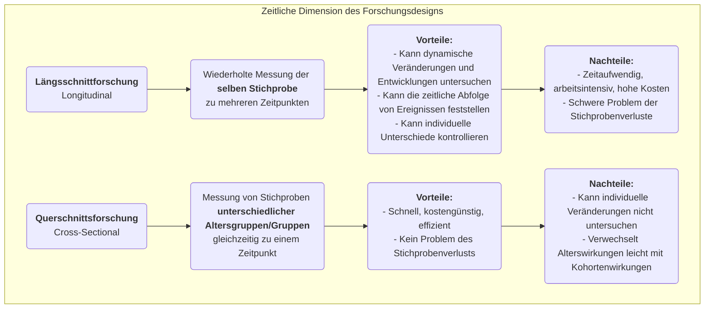

# Längsschnittforschung

Wenn wir das lange Geflecht der menschlichen Entwicklung, sozialen Veränderung und der Evolution von Krankheiten erforschen, benötigen wir eine Forschungsmethode, die in der Lage ist, die entscheidende Dimension der „Zeit“ abzubilden. **Längsschnittforschung** ist genau diese „Kamera“, die wiederholt und kontinuierlich dieselbe Stichprobe über einen langen Zeitraum hinweg beobachtet und misst. Ihr zentrales Ziel ist es, aufzuzeigen, wie Phänomene sich **verändern, entwickeln und weiterentwickeln**, und den langfristigen Einfluss früher Ereignisse auf spätere Ergebnisse zu untersuchen.

Im Gegensatz zu Querschnittsstudien, die lediglich einen „Schnappschuss“ zu einem bestimmten Zeitpunkt liefern, bietet die Längsschnittforschung uns ein „Dokumentarfilmgefühl“. Sie erlaubt uns, die Entwicklungsverläufe individuellen Wachstums, den Prozess konzeptueller Veränderungen und den gesamten Krankheitsverlauf von der Entstehung bis zur vollen Ausprägung zu beobachten. Dies hilft uns, bei der Erforschung kausaler Beziehungen die zeitliche Abfolge von Ereignissen klarer zu bestimmen. Wenn Sie dynamische Fragen zu Prozessen und Entwicklungen beantworten möchten, wie etwa „Wie beeinflussen Lese gewohnheiten in der Kindheit das Einkommensniveau im Erwachsenenalter?“ oder „Welchen nachhaltigen Einfluss hatte eine politische Reform über das nächste Jahrzehnt hinweg?“, wird die Längsschnittforschung zu einem unverzichtbaren und mächtigen Werkzeug.

## Kernmerkmale und Arten der Längsschnittforschung

Die Gemeinsamkeit aller Längsschnittstudien ist ihre Erfassung der „Zeit“, doch sie lassen sich hauptsächlich anhand der Art dessen, was verfolgt wird, in drei Typen unterteilen:

*   **Kohortenstudie**: Dies ist die häufigste Form. Forschende wählen eine bestimmte Gruppe von Personen (eine „Kohorte“) aus, die eine gemeinsame Eigenschaft oder Erfahrung teilen (z. B. „alle im Jahr 2000 geborenen Säuglinge“ oder „Mitarbeiter, die 2010 ein bestimmtes Unternehmen beigetreten sind“), und verfolgen diese Kohorte über mehrere Jahrzehnte hinweg.
*   **Panelstudie**: Ähnlich wie eine Kohortenstudie, verfolgt jedoch exakt dieselbe **individuelle** Stichprobe. Jede Befragung erreicht dieselbe Gruppe von Personen, sodass Forschende die Verläufe der Veränderungen jedes Einzelnen präzise analysieren können.
*   **Trendstudie**: Diese Art der Forschung konzentriert sich auf Veränderungen in den Eigenschaften einer „Population“ im Zeitverlauf, doch die individuellen Stichproben, die für jede Befragung gezogen werden, sind unterschiedlich. Um beispielsweise Veränderungen in der öffentlichen Einstellung zu Umweltfragen zu untersuchen, könnte eine Forschungseinrichtung alle fünf Jahre zufällig eine neue Stichprobe aus der gesamten Bevölkerung auswählen und befragen.

### Vergleich von Längsschnitt- und Querschnittsforschung

## Wie man eine Längsschnittstudie durchführt

1.  **Langfristige Forschungsziele festlegen**
    Definieren Sie klar, welche Veränderungen oder Entwicklungen Sie verfolgen möchten und welche potenziellen Einflussfaktoren Sie interessieren. Längsschnittforschung ist eine langfristige Investition und muss durch klare, bedeutende Forschungsziele gestützt werden.

2.  **Definition und Auswahl der Kohorte oder Panelstichprobe**
    Definieren Sie Ihre Studienpopulation präzise und wählen Sie mit geeigneten Stichprobenmethoden die ursprüngliche Stichprobe aus. Die Qualität und Repräsentativität der Ausgangsstichprobe sind entscheidend.

3.  **Durchführung der Baseline-Erhebung**
    Zu Beginn der Studie wird die erste umfassende Datenerhebung (Baseline-Erhebung) durchgeführt, um den Ausgangszustand aller interessierenden Variablen zu messen.

4.  **Planung und Durchführung nachfolgender Folgeerhebungen**
    Legen Sie die Zeitintervalle für nachfolgende Folgeerhebungen fest (z. B. jährlich, alle fünf Jahre) und entwickeln Sie einheitliche Messinstrumente. Der Erhalt des Kontakts zur Stichprobe und die Reduzierung der Abwanderungsrate zählen zu den größten Herausforderungen während der langen Forschungsdauer.

5.  **Datenmanagement und Analyse**
    Längsschnittdaten sind strukturell komplex und benötigen professionelle Datenbanken zur Verwaltung. Bei der Analyse verwenden Forschende fortgeschrittene statistische Modelle (z. B. Wachstumskurvenmodelle, Überlebenszeitanalyse), um die Verläufe von Variablen im Zeitverlauf und deren Einflussfaktoren zu untersuchen.

## Klassische Anwendungsbeispiele

**Fall 1: Die Harvard-Studie zur Erwachsenenentwicklung**

*   **Szenario**: Eine der längsten Längsschnittstudien der Geschichte, die 1938 begann und 724 Männer über fast 80 Jahre verfolgte.
*   **Anwendung**: Forschende sammelten regelmäßig Daten zu deren Arbeit, Familie, Gesundheit und anderen Aspekten mithilfe von Fragebögen, Interviews, medizinischen Akten usw. Die bekannteste Schlussfolgerung dieser Studie ist, dass gute, warme zwischenmenschliche Beziehungen der wichtigste Faktor sind, um langfristiges Glück und Gesundheit vorherzusagen, sogar wichtiger als Reichtum, Ruhm und Gene. Diese Schlussfolgerung konnte nur durch lebenslange Beobachtung gezogen werden.

**Fall 2: UK Millennium Cohort Study**

*   **Szenario**: Eine nationale Geburtenkohortenstudie, die etwa 19.000 britische Kinder verfolgt, die zwischen 2000 und 2002 geboren wurden.
*   **Anwendung**: Die Studie führte mehrfach umfassende Datenerhebungen durch (z. B. im Alter von 9 Monaten, 3, 5, 7, 11, 14, 17 Jahren), wobei sie alle Aspekte von Gesundheit, kognitiven Fähigkeiten und Verhalten bis hin zur Familienumgebung abdeckte. Diese Studie lieferte umfangreiche und äußerst wertvolle Erkenntnisse für die Regierung, um Kinder- und Familienpolitik zu gestalten. So zeigte sie beispielsweise den langfristigen negativen Einfluss von Armut auf die frühkindliche Entwicklung.

**Fall 3: Kohortenanalyse zur Kundenabwanderung bei Produkten**

*   **Szenario**: Ein SaaS-Unternehmen (Software as a Service) möchte die Bindung neuer Nutzer verstehen.
*   **Anwendung**: Das Unternehmen nutzte die **Kohortenanalyse**. Es betrachtete „neue Nutzer, die jeden Monat registriert wurden“ als Kohorte (z. B. „Januar-Kohorte“, „Februar-Kohorte“). Anschließend verfolgte es die Retentionsrate jeder Kohorte im ersten, zweiten, dritten Monat usw. nach der Registrierung. Durch den Vergleich der Retentionskurven verschiedener Kohorten konnte das Unternehmen beurteilen, ob Produktverbesserungen und Marketingmaßnahmen einen positiven Einfluss auf die langfristige Bindung neuer Nutzer hatten.

## Vorteile und Herausforderungen der Längsschnittforschung

**Kernvorteile**

*   **Fähigkeit, dynamische Prozesse zu untersuchen**: Sie ist die effektivste Methode, um „Entwicklung“ und „Veränderung“ selbst zu erforschen.
*   **Festlegung der zeitlichen Abfolge**: Kann die zeitliche Reihenfolge von Ereignissen eindeutig bestimmen, was eine wichtige Voraussetzung für die Schlussfolgerung von Kausalität ist (allerdings müssen weiterhin Störfaktoren beachtet werden).
*   **Kontrolle individueller Unterschiede**: Da dieselben Personen über die Zeit verfolgt werden, können konstante individuelle Unterschiede (z. B. Intelligenz, Persönlichkeit), die sich nicht verändern, aus den Ergebnissen herausgerechnet werden.

**Potenzielle Herausforderungen**

*   **Hohe Kosten**: Erfordert langfristige finanzielle Unterstützung, ein stabiles Forschungsteam und hohe Verwaltungskosten.
*   **Zeitaufwand**: Der Erkenntnisgewinn benötigt lange, oftmals Jahre oder sogar Jahrzehnte.
*   **Stichprobenverluste**: Dies ist der größte „natürliche Feind“ der Längsschnittforschung. Im Laufe der Zeit können einige Teilnehmer aufgrund von Umzug, Kontaktabbruch, Tod oder fehlendem Interesse aus der Studie ausscheiden, was zu Verzerrungen in der Endstichprobe führen kann.
*   **Einfluss wiederholter Messungen**: Wiederholte Tests oder Fragebögen können das Verhalten oder die Antworten der Teilnehmer beeinflussen, was als „Übungseffekt“ bekannt ist.

## Erweiterungen und Verbindungen

*   **Querschnittsforschung**: Dient oft als kostengünstige und schnelle Alternative zur Längsschnittforschung. Es ist jedoch wichtig, sich der Unfähigkeit bewusst zu sein, Alterswirkungen von Kohortenwirkungen zu unterscheiden.
*   **Überlebenszeitanalyse**: Eine statistische Methode, die häufig in der Längsschnittforschung verwendet wird, insbesondere um die Dauer bis zu einem Ereignis (z. B. Genesung, Abwanderung, Tod) und deren Einflussfaktoren zu analysieren.

---
*Referenz: Das Designkonzept der Längsschnittforschung hat eine lange Tradition in der Epidemiologie und den Sozialwissenschaften. Glen H. Elder Jr.'s Theorie des Lebensverlaufs (Life Course Theory) stellt einen wichtigen theoretischen Rahmen für moderne Längsschnittforschung bereit.*