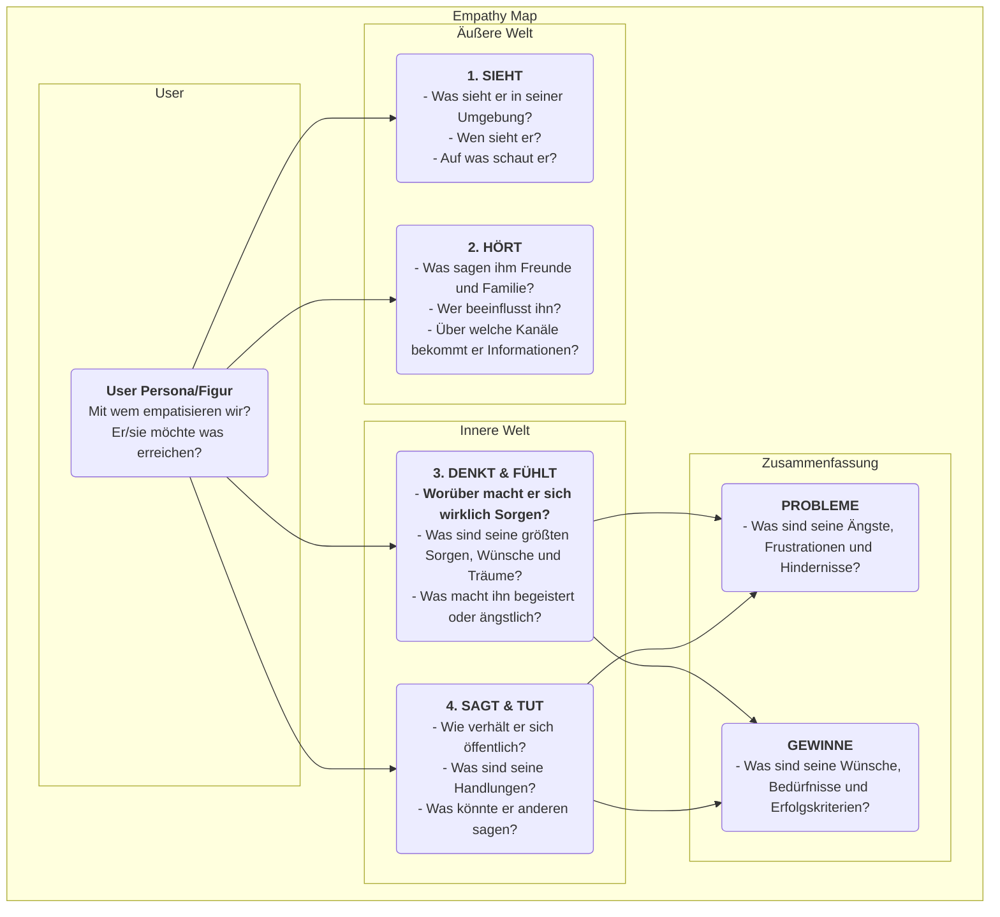

# Empathy-Map

In der Produktgestaltung und Benutzerforschung ist „Empathie“ eine Kernqualität, die häufig erwähnt, aber äußerst schwer zu erreichen ist. Wie können wir wirklich „in die Schuhe des Benutzers schlüpfen“ und seine Welt aus erster Hand erfahren? Die **Empathy Map** ist ein einfaches, intuitives, aber äußerst mächtiges **kollaboratives Empathie-Werkzeug**, das genau diesem Zweck dient. Es soll Teams dabei helfen, über das Oberflächliche des Benutzerverhaltens hinauszugehen und in die tiefere Welt der **Sinneswahrnehmungen, Gedanken und Emotionen** einzutauchen, um so ein umfassenderes und mehrdimensionales Benutzerverständnis zu entwickeln.

Der Kern der Empathy Map besteht darin, alle verstreuten, qualitativen Beobachtungen und Interviewdaten über Benutzer systematisch in ein visuelles Gerüst zu ordnen. Dieses Gerüst ist typischerweise in vier Hauptquadranten unterteilt: **Sieht, Hört, Denkt & Fühlt, Sagt & Tut**. Indem das Team gemeinsam die Map ausfüllt, wird es gezwungen, die Perspektive des Benutzers einzunehmen und ein gemeinsames Verständnis seiner inneren Welt und seiner äußeren Umgebung aufzubauen. Es ist ein Spiegel, der die wahre Situation des Benutzers klar widerspiegelt, und ein Katalysator, um kollektive Empathie im Team zu entwickeln.

## Bestandteile einer Empathy Map

Eine klassische Empathy Map ist benutzerzentriert und gliedert sich um vier Kernquadranten der äußeren und inneren Erfahrung.

<!--

*   **Sieht**: Beschreibt, was der Benutzer mit seinen Augen in seiner Umgebung sieht. Zum Beispiel: Was tun die Menschen um ihn herum? Welche Marktdaten begegnen ihm täglich?
*   **Hört**: Beschreibt die Informationen, die der Benutzer aus der Außenwelt hört. Was sagen ihm Freunde, Familie und Kollegen? Welche Meinungsführer oder Medienkanäle beeinflussen ihn?
*   **Denkt & Fühlt**: Dies ist der Kern der Map, der versucht, die innere Welt des Benutzers zu erforschen. Was ist ihm wirklich wichtig (auch wenn er es niemals laut aussprechen würde)? Welche Sorgen, Ängste, Hoffnungen und Träume hat er?
*   **Sagt & Tut**: Beschreibt die Worte und Handlungen des Benutzers in der Öffentlichkeit. Was hat er uns in einem Interview erzählt? Wie verhält er sich tatsächlich beim Produktnutzung? Hier ist besonders auf mögliche Widersprüche zwischen „Sagt“ und „Denkt“ zu achten.
*   **Probleme** und **Gewinne**: Nach der Analyse der vier oben genannten Quadranten fasst man die inneren Kämpfe und Wünsche des Benutzers zusammen. Probleme repräsentieren die Hindernisse und negativen Emotionen, mit denen er konfrontiert ist, während Gewinne die Ziele und Wünsche repräsentieren, die er wirklich erreichen möchte.

## Wie man eine Empathy Map verwendet

Eine Empathy Map eignet sich am besten in Form eines Team-Workshops.

1.  **Schritt 1: Umfang und Ziele definieren**
    *   **Benutzer auswählen**: Definieren Sie klar, für welche spezifische Benutzer-Persönlichkeit oder Figur diese Empathy Map erstellt wird. Es ist hilfreich, dem Benutzer einen Namen und ein grundlegendes Profil zu geben.
    *   **Ziele klären**: Definieren Sie die Ziele, die Sie mit dieser Übung erreichen möchten. Wollen Sie bestehende Benutzer besser verstehen oder potenzielle Benutzer für ein neues Produkt erforschen?

2.  **Schritt 2: Forschungsmaterialien sammeln**
    Eine Empathy Map muss auf echten Forschung basieren, nicht auf Fiktion. Bereiten Sie alle relevanten Benutzerforschungsmaterialien vor, wie z. B.: Aufzeichnungen und Transkripte von Benutzerinterviews, Videos von Usability-Tests, offene Antworten aus Umfragen, Fotos der Benutzer usw.

3.  **Schritt 3: Die Map gemeinsam ausfüllen**
    *   Zeichnen Sie eine große Empathy-Map-Vorlage auf einer Tafel oder verwenden Sie ein Online-Zusammenarbeitstool.
    *   Die Teammitglieder schreiben gemeinsam Erkenntnisse aus den Forschungsmaterialien auf Haftnotizen und platzieren diese nacheinander in den entsprechenden Quadranten der Map. Wenn z. B. ein Interviewton abgespielt wird, könnte ein Teammitglied schreiben: „Benutzer sagt, er arbeite jede Woche Überstunden (Sagt)“, während ein anderes schreibt: „Ich habe das Gefühl, er klingt müde und hat die Begeisterung für die Arbeit verloren (Fühlt).“
    *   Fordern Sie die Teammitglieder dazu auf, den Inhalt der Haftnotizen laut vorzulesen und zu erklären, warum sie diese in diesen Quadranten platziert haben.

4.  **Schritt 4: Tiefer eintauchen und synthetisieren**
    Wenn alle Informationen auf der Tafel sind, leiten Sie das Team zu einer tiefergehenden Diskussion an.
    *   „Welche Widersprüche erkennen wir? Zum Beispiel: Sind die Worte und Handlungen der Benutzer inkonsistent?“
    *   „Hinter all diesen Details – worüber macht er sich wirklich Sorgen, ohne es auszudrücken?“
    *   „Was haben wir Unerwartetes gelernt?“
    *   Fassen Sie am Ende gemeinsam die wichtigsten **Probleme** und **Gewinne** des Benutzers zusammen.

5.  **Schritt 5: Teilen und anwenden**
    Organisieren und teilen Sie die fertige Empathy Map und verwenden Sie diese als wichtige Grundlage für nachfolgende Design- und Entscheidungsprozesse.

## Anwendungsbeispiele

**Fall 1: Gestaltung eines Smartphones für Senioren**

*   **Benutzer**: Großvater Wang, 70 Jahre alt, hat kürzlich von seinen Kindern ein Smartphone geschenkt bekommen.
*   **Sieht**: Die Symbole auf dem Bildschirm sind klein und zahlreich, schwer zu erkennen; junge Leute nutzen alle mobile Zahlungen und chatten.
*   **Hört**: Die Kinder sagen: „Es ist ganz einfach, du wirst es schnell lernen“; alte Freunde sagen: „Das Ding ist zu kompliziert, ich kann es nicht lernen.“
*   **Denkt & Fühlt**: Er fühlt sich sehr **frustriert**, hat Angst, von der Technik zurückgelassen zu werden; ist aber **bemüht**, zu lernen, wie man mit Enkelkindern Videotelefonie betreibt.
*   **Sagt & Tut**: Er sagt: „Ich brauche das nicht“, versucht aber heimlich immer wieder, den Bildschirm zu entsperren.
*   **Probleme**: Angst, Fehler zu machen und Schäden zu verursachen; Gefühl, von der Technik im Stich gelassen zu werden.
*   **Gewinne**: Er hofft, engeren Kontakt mit der Familie zu halten; möchte unabhängig einige alltägliche Aufgaben erledigen können (z. B. Buslinien abrufen).
*   **Design-Impuls**: Das zentrale Designprinzip für dieses Telefon sollte nicht „vielfältige Funktionen“ sein, sondern „keine Frustration“. Es müssen Funktionen wie „extra-große Schriftmodus“, „Fernunterstützung durch Familie“ usw. bereitgestellt werden.

**Fall 2: Gestaltung einer Jobbörse-App für Studierende**

*   **Benutzer**: Li Xue, 22 Jahre alt, Absolventin einer Universität.
*   **Sieht**: Jobbörsen im Internet sind voller Informationen, schwer zu unterscheiden, was wahr oder falsch ist; Kommilitonen haben bereits mehrere Stellenangebote erhalten.
*   **Hört**: Ehemalige Studenten sagen: „Der erste Job ist sehr wichtig“; die Eltern sagen: „Ein stabiler Job ist am wichtigsten.“
*   **Denkt & Fühlt**: Sie fühlt sich sehr **verwirrt und ängstlich** wegen der Zukunft; weiß nicht, welcher Job zu ihr passt; **ängstlich**, schlecht im Vorstellungsgespräch abzuschneiden.
*   **Sagt & Tut**: Sie hat hunderte von Bewerbungen abgeschickt; ihre Bewerbung hat sie immer wieder überarbeitet.
*   **Probleme**: Fehlende Richtung bei der Jobsuche; Informationsungleichheit; fehlendes Selbstvertrauen.
*   **Gewinne**: Sie hofft, einen Job zu finden, der sie wirklich interessiert und gute Perspektiven bietet; wünscht sich professionelle Begleitung und Ratschläge.
*   **Design-Impuls**: Die zentrale Funktion der App sollte nicht nur Stellenanzeigen sein, sondern auch Module wie „Berufspersönlichkeitstest“, „Online-Beratung durch Branchen-Mentoren“, „Simulierte Vorstellungsgespräche“ usw. hinzufügen.

**Fall 3: Gestaltung eines Schreibwerkzeugs für Content-Ersteller**

*   **Benutzer**: Zhang Wei, Blogger nebenberuflich.
*   **Sieht**: Andere Blogger veröffentlichen täglich hochwertige Artikel; seine eigenen Artikelaufrufe stagnieren.
*   **Hört**: Leser kommentieren: „Sehr gut geschrieben, freue mich auf Updates“; Freunde sagen: „Als Blogger Geld zu verdienen ist schwer.“
*   **Denkt & Fühlt**: Er fühlt sich sehr **schmerzhaft**, wenn die Inspiration versiegt; **wünscht sich** Anerkennung und Resonanz von Lesern; **kämpft** zwischen Idealverfolgung und realem Einkommen.
*   **Sagt & Tut**: Er verbringt viel Zeit mit Recherche und Strukturierung des Inhalts; schreibt oft bis spät in die Nacht.
*   **Probleme**: Der Schreibprozess wird unterbrochen, geringe Effizienz; fehlende Motivation für kontinuierliche Erstellung.
*   **Gewinne**: Er wünscht sich ein Werkzeug, das ihm hilft, Gedanken zu ordnen und Inspiration zu finden; möchte tiefer mit Lesern verbunden sein.
*   **Design-Impuls**: Neben den grundlegenden Bearbeitungsfunktionen sollte das Schreibwerkzeug auch besondere Funktionen wie „Inspiration-Karten-Sammlung“, „Mind-Map-Modus“, „Leser-Interaktions-Datenanalyse“ usw. bieten.

## Vorteile und Herausforderungen der Empathy Map

**Kernvorteile**

*   **Schnell und effizient**: Eine effektive Methode, um innerhalb kurzer Zeit Empathie im Team aufzubauen (meist innerhalb von 60 Minuten).
*   **Fördert Teamzusammenarbeit**: Aufgrund ihres kollaborativen Charakters kann sie Abteilungssilos überwinden und zu einem einheitlichen, tiefgehenden Benutzerverständnis im gesamten Team führen.
*   **Deckt verborgene Bedürfnisse auf**: Indem sie sich auf die innere Welt des Benutzers konzentriert, hilft sie dabei, potenzielle Bedürfnisse und Schmerzpunkte zu entdecken, die Benutzer selbst möglicherweise nicht klar artikulieren können.

**Potenzielle Herausforderungen**

*   **Kein Ersatz für Benutzerpersonas**: Eine Empathy Map konzentriert sich in der Regel auf den Zustand eines Benutzers in einem spezifischen Szenario, während eine Benutzer-Persönlichkeit ein vollständigeres, dauerhafteres Charaktermodell beschreibt. Eine Empathy Map ist eine hervorragende Grundlage für die Erstellung von Benutzerpersonas, kann diese aber nicht vollständig ersetzen.
*   **Erfordert reale Datengrundlage**: Wie alle Benutzerforschungsinstrumente benötigt auch eine Empathy Map reale Forschungsdaten. Ohne diese kann sie zu einer „fiktiven Geschichtensession“ werden, die auf subjektiven Annahmen der Teammitglieder basiert.

## Erweiterungen und Verknüpfungen

*   **Benutzerpersona**: Die Empathy Map ist ein **entscheidender Vorarbeitsschritt**, um eine lebendige, emotional reiche Benutzerpersona zu erstellen. Durch die Analyse der Empathy Map können äußerst lebendige Materialien für die Module „Probleme“, „Ziele“ usw. einer Benutzerpersona bereitgestellt werden.
*   **User Journey Map**: In jedem Schritt der Journey Map kann eine Mini-Empathy Map verwendet werden, um die Gedanken, Gefühle und Handlungen des Benutzers in diesem Schritt tiefer zu analysieren und so präziser die Schmerzpunkte in jedem Schritt zu identifizieren.

---
*Quellenangabe: Die Empathy Map wurde ursprünglich von Dave Gray, Gründer von XPLANE (heute Teil von Deloitte), vorgeschlagen und wird in Design Thinking und Agile-Entwicklungspraktiken weit verbreitet eingesetzt. Sie ist ein grundlegendes und zentrales Empathie-Werkzeug in benutzerzentrierten Designprozessen.*