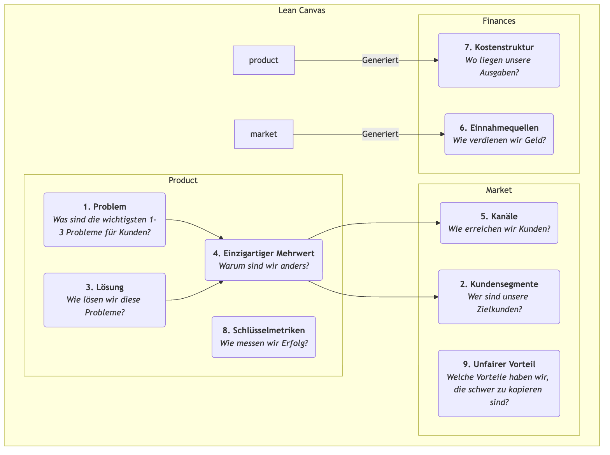

# Lean Canvas

In den frühen Phasen eines Startups ist das größte Risiko oft nicht „Können wir das Produkt bauen?“, sondern „Wird überhaupt jemand das Produkt wollen, das wir bauen?“ Traditionelle Geschäftspläne und Business-Modelle sind hervorragende Werkzeuge für etablierte Unternehmen, aber für Startups, die unter hoher Unsicherheit operieren, können sie zu komplex sein und nicht ausreichend auf die kritischsten Risiken fokussieren. **Lean Canvas** wurde entwickelt, um dieses Problem zu lösen. Es ist eine brillante Anpassung des Business Model Canvas, speziell zugeschnitten auf **Entrepreneure in der Frühphase**.

Lean Canvas, vorgestellt von Ash Maurya in seinem Buch *Running Lean*, übernimmt die Einfachheit und Intuitivität des Business Model Canvas, verlagert den Fokus jedoch von einer „vollständigen Beschreibung des Geschäftsmodells“ hin zu **„systematischen Identifizieren und Validieren der risikoreichsten Startup-Hypothesen.“** Es konzentriert sich auf **Problem-Lösung**, legt zudem Wert auf Schlüsselmetriken und Wettbewerbsvorteile und verkörpert so stärker den „Build-Measure-Learn“-Zyklus des Lean Startup. Es ist eine risikoorientierte Schlachtenkarte, die Entrepreneure durch den Nebel führt.

## Die Neun Blöcke von Lean Canvas

Lean Canvas behält die neun Blöcke des Business Model Canvas bei, ersetzt jedoch vier davon, um es handlungsorientierter und risikofokussierter zu gestalten.

<!-- mermaid 源文件：Lean-Canvas-Tutorial-de-mermaid-live-1.mmd -->

**Unterschiede zum Business Model Canvas:**

*   **Problem** ersetzt „Kernpartnerschaften“: Dies ist die wichtigste Änderung. Sie zwingt Entrepreneure, zunächst klar zu definieren, welche die wichtigsten 1-3 Probleme ihrer Zielkunden sind, die dringend gelöst werden müssen.
*   **Lösung** ersetzt „Kernaktivitäten“: Nachdem das Problem definiert ist, wird eine spezifische Lösung vorgeschlagen (meist die Kernfunktionen des Produkts).
*   **Schlüsselmetriken** ersetzen „Schlüsselressourcen“: Für ein Startup ist nicht so wichtig, welche Ressourcen es besitzt, sondern wie der Erfolg und Wachstum des Geschäfts gemessen werden. Schlüsselmetriken sind der Maßstab, der alle Handlungen antreibt.
*   **Unfairer Vorteil** ersetzt „Kundenbeziehungen“: Auch bekannt als „unfairer Vorteil“ oder „Moat“, bezieht sich dies auf Kernkompetenzen, die von Wettbewerbern nicht leicht kopiert oder erworben werden können. Dies ist entscheidend für das langfristige Überleben des Geschäftsmodells.

## So wird Lean Canvas verwendet

Der Prozess der Verwendung von Lean Canvas ist ein kontinuierlicher Zyklus aus Validierung und Iteration.

1.  **Zeichnen Sie Ihren „Plan A“**
    Bevor Sie mit Kunden sprechen, füllen Sie schnell einen Lean Canvas mit all Ihren initialen Ideen und Hypothesen für das Startup-Projekt aus. Dies dauert in der Regel nur 15–20 Minuten. Dies ist Ihr „Plan A“, eine Sammlung aller zu validierenden Hypothesen.

2.  **Identifizieren Sie die risikoreichsten Hypothesen**
    Prüfen Sie Ihre erste Version des Canvas und identifizieren Sie die Bereiche mit dem höchsten Risiko und der größten Unsicherheit. Typischerweise sind die risikoreichsten Hypothesen für ein neues Projekt in dieser Reihenfolge:
    *   **Problem-Kunden-Hypothese**: Existiert dieses Problem wirklich? Sind diese Personen tatsächlich Ihre Zielkunden?
    *   **Problem-Lösungs-Hypothese**: Kann Ihre Lösung das Problem wirklich lösen?
    *   **Preis-Wert-Hypothese**: Sind Kunden bereit, für Ihre Lösung zu bezahlen?

3.  **Validieren Sie Hypothesen systematisch**
    Entwerfen und führen Sie eine Reihe von „Minimum Viable Experiments“ durch (meist **Problem-Interviews** und **Lösungs-Interviews**), um Ihre risikoreichsten Hypothesen systematisch zu validieren. Zum Beispiel:
    *   **Führen Sie Problem-Interviews durch**: Sprechen Sie mit Ihren Zielkunden, erwähnen Sie aber nicht Ihr Produkt. Ihr einziger Zweck ist es, ihre Probleme, bestehenden Verhaltensweisen und Schmerzpunkte tief zu verstehen, um die Blöcke „Problem“ und „Kundensegmente“ auf dem Canvas zu validieren.
    *   **Führen Sie Lösungs-Interviews durch**: Nachdem Sie bestätigt haben, dass das Problem besteht, zeigen Sie Kunden Ihre Lösung (z. B. ein Prototyp, eine Demo), um Ihre „Lösung“ und „Wertversprechen“ zu validieren und ihre Bereitschaft zu testen, zu bezahlen („Einnahmequellen“).

4.  **Iterieren Sie Ihren Canvas**
    Aktualisieren und verbessern Sie Ihren Lean Canvas kontinuierlich basierend auf Erkenntnissen aus Interviews und Experimenten. Einige Hypothesen werden bestätigt, andere widerlegt. Der Canvas ist wie ein Versuchsheft, das den kompletten Entwicklungsprozess Ihres Startup-Projekts von der ursprünglichen Idee bis zur „Product-Market Fit“ aufzeichnet.

## Anwendungsbeispiele

**Beispiel 1: Dropbox (Cloud-Speicherdienst) – Früher Canvas**

*   **Problem**: Dateien zwischen mehreren Geräten synchronisieren ist umständlich; große Dateien per USB-Stick oder E-Mail senden ist lästig; vergessenes Backup führt zu Datenverlust.
*   **Kundensegmente**: Technikbegeisterte mit mehreren Computern, Freiberufler.
*   **Einzigartiger Mehrwert**: „Legen Sie Ihre Dateien in eine ‚magische Tasche‘, überall zugänglich, niemals verloren.“
*   **Lösung**: Eine Desktop-Anwendung, die im Hintergrund nahtlos läuft und automatisch den Inhalt eines bestimmten Ordners synchronisiert.
*   **Schlüsselmetriken**: Anzahl der Benutzerregistrierungen, **Erfolgsquote beim Hochladen von Dateien**, Anzahl aktiver Benutzer.
*   **Unfairer Vorteil**: Netzwerkeffekt – je mehr Menschen ihn nutzen, desto einfacher ist das Teilen und Zusammenarbeiten.
*   **Validierung**: Gründer Drew Houston erstellte ein einfaches Produkt-Demo-Video und veröffentlichte es in einer Technik-Community. Über Nacht stieg die Warteliste von 5.000 auf 75.000 Personen, was die „Problem-Lösungs-Passung“ stark bestätigte.

**Beispiel 2: Geplante „Gesunde Mahlzeit-Lieferung“**

*   **Problem**: Büroangestellte finden es schwer, gesunde, ausgewogene Mittagessen zu essen; selbst zuzubereiten ist zu zeitaufwendig; Takeaway ist meist fettig.
*   **Kundensegmente**: Gesundheitsbewusste junge Berufstätige mit Fitnessgewohnheiten.
*   **Einzigartiger Mehrwert**: „Von Ernährungsberatern gestaltete, frisch zubereitete Fitness-Mahlzeiten, pünktlich im Büro geliefert.“
*   **Lösung**: Wöchentliche Mittagsmenüs anbieten, wöchentlich aktualisierte Speisepläne mit Kalorien- und Nährwertangaben.
*   **Schlüsselmetriken**: **Wöchentliche Wiederholungskaufrate**, Lebenszeitwert des Kunden.
*   **Unfairer Vorteil**: Exklusive Partnerschaften mit hochwertigen Zulieferern, professionelles Ernährungsteam.
*   **Validierung**: Der Gründer könnte zunächst darauf verzichten, eine App zu entwickeln, und stattdessen Bestellungen über eine WeChat-Gruppe oder eine Umfrageplattform annehmen und Mahlzeiten manuell an die ersten 20 Kunden liefern, um den gesamten Prozess und die Kundennachfrage zu validieren.

**Beispiel 3: Airbnbs früher Canvas**

*   **Problem**: Während beliebter Konferenzen sind Stadthotels teuer und ausgebucht.
*   **Kundensegmente**: Designern mit begrenztem Budget, die an Designkonferenzen teilnehmen.
*   **Lösung**: Eine Plattform bereitstellen, auf der Einwohner (Gastgeber) ihre freien Luftmatratzen an diese Designer vermieten können.
*   **Einzigartiger Mehrwert**: Günstiger wohnen und die Möglichkeit, mit Einheimischen in Kontakt zu kommen.
*   **Validierung**: Die Gründer stellten selbst drei Luftmatratzen in ihrem Zuhause auf und vermieteten sie erfolgreich an Designer, die an der Konferenz teilnahmen, und validierten so persönlich die Machbarkeit des gesamten Geschäftsmodells.

## Wert und Grenzen von Lean Canvas

**Kernwert**

*   **Risikofokus**: Zwingt Entrepreneure, sich von Anfang an den risikoreichsten Hypothesen zu stellen.
*   **Schnelligkeit und Iteration**: Sehr geeignet, um Geschäftsmodelle schnell zu skizzieren, zu besprechen und zu verbessern, perfekt abgestimmt auf den Lean-Startup-Rhythmus.
*   **Problemzentrierung**: Stellt sicher, dass der Ausgangspunkt des Unternehmens ist, ein reales, wertvolles Kundenproblem zu lösen.

**Mögliche Grenzen**

*   **Unzureichende Berücksichtigung der externen Umwelt**: Wie der Business Model Canvas enthält er nicht automatisch eine Analyse des Wettbewerbs und der Makroumgebung.
*   **Nicht für alle Geschäftsmodelle geeignet**: Am besten geeignet für Startups mit hoher Unsicherheit. Für etablierte Unternehmen mit validierten Geschäftsmodellen könnte der Business Model Canvas das umfassendere Werkzeug sein.

## Erweiterungen und Verbindungen

*   **Business Model Canvas**: Lean Canvas ist eine wichtige Variante und Weiterentwicklung des Business Model Canvas im Kontext des Lean Startup.
*   **Customer Development**: Eine von Steve Blank vorgeschlagene Methode, die das „Verlassen des Gebäudes“ betont, um Hypothesen zu validieren, und als Leitprinzip für Lean Canvas auf der Handlungsebene dient.
*   **Value Proposition Canvas**: Kann als Vertiefungswerkzeug für die Blöcke „Problem“, „Lösung“ und „Einzigartiger Mehrwert“ in Lean Canvas dienen, um Entrepreneure dabei zu helfen, die Passung zwischen Produkt und Markt präziser zu optimieren.

---
*Referenz: Ash Mauryas „Running Lean“ ist die maßgebliche Quelle für Lean Canvas und beschreibt detailliert, wie man Lean Canvas Schritt für Schritt zusammen mit Customer Development anwendet und weiterentwickelt. Diese Methode ist stark von Eric Ries' „The Lean Startup“ und Steve Blanks Customer Development-Modell beeinflusst.*