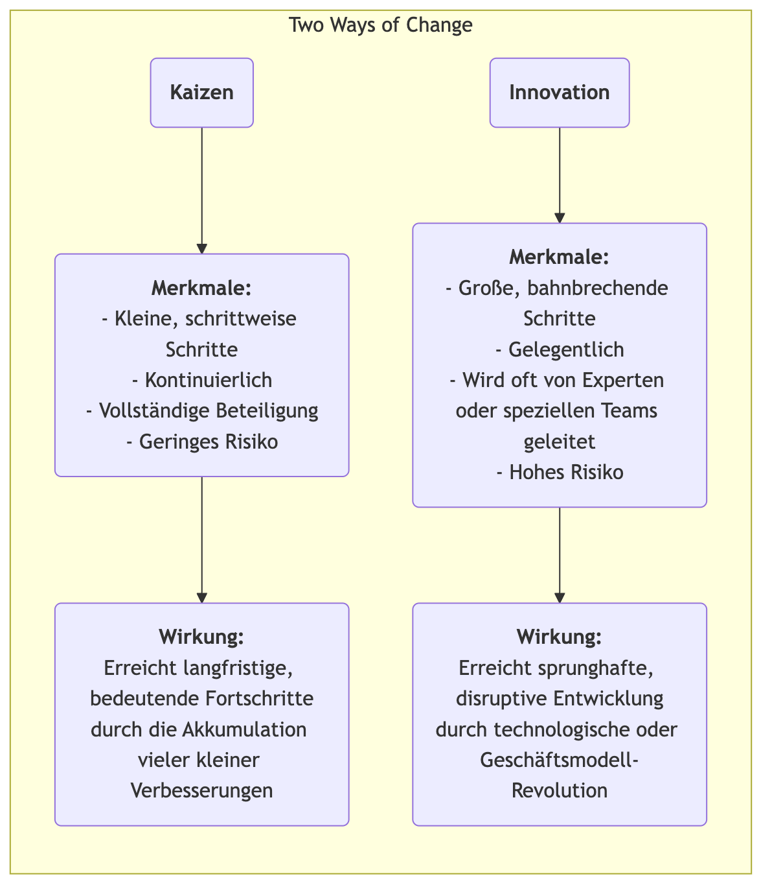

# Kaizen

In vielen Organisationen wird „Verbesserung“ oft als ein großes „Projekt“ angesehen, das erhebliche Investitionen erfordert, von Experten geleitet wird und top-down umgesetzt wird. Es gibt jedoch eine Management-Philosophie, die davon ausgeht, dass echter, starker und nachhaltiger Fortschritt aus scheinbar unbedeutenden **kleinen und kontinuierlichen Verbesserungen** entsteht, die jeden Tag von jedem Mitarbeiter geleistet werden. Dies ist der Kern von **Kaizen**. Kaizen ist ein japanisches Wort, das „Veränderung zum Besseren“ bedeutet, und es ist sowohl eine kulturelle Philosophie, die nach Perfektion strebt, als auch eine praktische Methode, die die aktive Beteiligung aller fördert und kontinuierliche Verbesserung von unten nach oben anregt.

Die Kernidee von Kaizen besteht darin, **nicht nach revolutionären Durchbrüchen über Nacht zu suchen, sondern nach endloser, schrittweiser Optimierung**. Sie geht davon aus, dass die Mitarbeiter an vorderster Front die Experten sind, die die tatsächliche Situation am besten verstehen, und dass sie unerschöpfliche Weisheit und Kreativität besitzen. Indem eine Kultur etabliert wird, die Problemlösung fördert, kleine Innovationen belohnt und Fehler toleriert, können Organisationen die Kraft jedes Einzelnen nutzen und so einen unaufhaltsamen, stetig nach oben gerichteten Schwung erzeugen. Kaizen ist kein komplexes Managementinstrument, sondern eine einfache, unaufdringliche, jedoch tiefgreifend wirksame Arbeits- und Denkweise.

## Kernprinzipien von Kaizen

*   **Kontinuierlich**: Kaizen ist keine einmalige Aktivität, sondern ein unendlicher, kumulativer Prozess.
*   **Jeder Einzelne**: Vom CEO bis zum Reinigungspersonal wird von jedem in der Organisation erwartet und ermutigt, an Verbesserungsaktivitäten teilzunehmen.
*   **Geringe Kosten, hohe Weisheit**: Kaizen verlässt sich nicht auf große Kapitalinvestitionen, sondern betont den Einsatz der Weisheit und Kreativität der Mitarbeiter, um Probleme zu lösen und Verschwendung kostengünstig zu beseitigen.
*   **Prozessorientierung**: Der Fokus von Kaizen liegt auf der Optimierung von Arbeitsprozessen, nicht auf der Schuldzuweisung gegenüber Einzelpersonen.
*   **Visuelles Management**: Es wird Wert darauf gelegt, Probleme, Standards und Prozesse „sichtbar“ zu machen, sodass Abweichungen auf einen Blick erkennbar sind.
*   **„Geh zum Gemba“**: Manager müssen den tatsächlichen Arbeitsort (Gemba) aufsuchen, um die reale Situation zu beobachten und mit Mitarbeitern zu sprechen, statt Dinge sich im Büro auszudenken.

### Kaizen vs. Innovation

<!-- mermaid 源文件：Kaizen-Tutorial-de-mermaid-live-1.mmd -->

*   **Beziehung**: Kaizen und Innovation schließen sich gegenseitig nicht aus; vielmehr sind sie zwei Fähigkeiten, die eine exzellente Organisation gleichzeitig besitzen muss. Kaizen ist dafür verantwortlich, bestehende Systeme kontinuierlich zu optimieren und zu festigen, während Innovation dafür sorgt, völlig neue Systeme zu schaffen.

## Wie man Kaizen in einer Organisation praktiziert

Der Schlüssel zur Umsetzung von Kaizen besteht darin, eine Kultur und ein System zu schaffen, das kontinuierliche Verbesserung fördert.

1.  **Einführung eines Kaizen-Vorschlags-Systems**
    Einrichtung eines einfachen und bequemen Kanals (z. B. Vorschlagskasten, Online-Formular), damit jeder Mitarbeiter jederzeit Probleme oder Verbesserungsvorschläge einreichen kann. Es ist wichtig, auf jeden Vorschlag zu reagieren und ihn zu verfolgen, sowie hervorragende Vorschläge, die umgesetzt werden, zeitnah und öffentlich anzuerkennen (Belohnungen müssen nicht materiell sein; öffentliche Anerkennung, eine Urkunde usw. sind oft effektivere spirituelle Anreize).

2.  **Durchführung von „Kaizen-Wochen“ oder „Kaizen Blitzes“**
    Regelmäßige Organisation von interdisziplinären Teams, die sich für einen begrenzten Zeitraum (meist 3–5 Tage) auf einen bestimmten Prozess oder Arbeitsbereich konzentrieren, unter Verwendung von Lean- und Qualitätsinstrumenten (z. B. Value Stream Mapping, 5S), um eine schnelle, intensive Verbesserungsaktion durchzuführen und Lösungen unverzüglich umzusetzen.

3.  **Verbreitung des PDCA-Zyklus als Denkwerkzeug**
    Der **PDCA-Zyklus (Plan-Do-Check-Act)** wird zum Standard-Denkrahmen aller Mitarbeiter bei der Problemlösung. Mitarbeiter sollen ermutigt werden, diesem wissenschaftlichen Zyklus zu folgen:
    *   **P**lan: Problem identifizieren, Ursachen analysieren und einen kleinen Verbesserungsplan entwickeln.
    *   **D**o: Versuch, den Plan umzusetzen.
    *   **C**heck: Überprüfen, ob die Ergebnisse des Versuchs den Erwartungen entsprachen.
    *   **A**ct: Falls erfolgreich, als neuer Prozess standardisieren; falls nicht, aus dem Versuch lernen und einen neuen PDCA-Zyklus starten.

4.  **Rollenwechsel des Managers**
    In einer Kaizen-Kultur verändert sich die Rolle des Managers von „Befehlshaber“ und „Aufseher“ hin zum „**Coach**“ und „**Unterstützer**“. Zu seinen Hauptaufgaben gehören: Mitarbeiter inspirieren und ermutigen, Probleme zu erkennen, Ressourcen und Unterstützung für Verbesserungsaktivitäten bereitzustellen und ihnen bei der Beseitigung von Hindernissen zu helfen.

## Anwendungsbeispiele

**Beispiel 1: Toyotas „Ein-Zentimeter-Verbesserung“**

*   **Szenario**: Auf der Produktionslinie von Toyota ist Kaizen Teil der Unternehmens-DNA.
*   **Anwendung**: Ein Mitarbeiter an der Produktionslinie bemerkte, dass er jedes Mal, wenn er eine Schraube aus dem Bauteilkasten nahm, sein Handgelenk eine kleine, aber unnatürliche Drehbewegung machen musste. Er schlug vor, den Bauteilkasten um 15 Grad zu kippen. Diese scheinbar unbedeutende Verbesserung sparte ihm täglich einige Sekunden und reduzierte das Risiko einer Verletzung am Handgelenk. Als diese „Ein-Zentimeter-Verbesserung“ auf Tausende Arbeitsplätze im Unternehmen ausgedehnt wurde, waren die kumulierten Zeitersparnisse und die Verbesserung der Arbeitssicherheit beeindruckend.

**Beispiel 2: Station der Krankenschwestern in einem Krankenhaus**

*   **Problem**: Krankenschwestern beklagten, dass sie täglich viel Zeit damit verbrachten, nach häufig benötigten medizinischen Materialien (z. B. Mullbinden, Klebeband) zu suchen.
*   **Kaizen-Anwendung**: Die Stationsleiterin organisierte eine kleine Kaizen-Aktivität. Die Teammitglieder nutzten die **5S-Methode**, um die Schränke am Schwesternzimmer gründlich zu **Sortieren** (überflüssige Gegenstände entsorgen), **Ordnung zu schaffen** (häufig verwendete Gegenstände an leicht zugänglichen Stellen platzieren und klar beschriften), zu reinigen (**Shine**), zu standardisieren (**Standardize**) und aufrechtzuerhalten (**Sustain**). Diese Aktivität dauerte nur einen Nachmittag, reduzierte jedoch die Suchzeiten der Krankenschwestern erheblich und ermöglichte es ihnen, mehr Zeit für die direkte Patientenversorgung aufzuwenden.

**Beispiel 3: Anwendung im privaten Leben**

*   **Problem**: Eine Person vergaß stets, beim Verlassen des Hauses den Schlüssel mitzunehmen.
*   **Kaizen-Anwendung**: Statt sich selbst für „schlechtes Gedächtnis“ zu beschuldigen, dachte sie darüber nach, wie man den **Prozess verbessern** könnte. Sie beschloss, alle Gegenstände, die sie am nächsten Tag benötigte (Schlüssel, Geldbörse, Dienstausweis), bereits am Abend zuvor auf den Schuhschrank neben der Tür zu legen. Diese kleine Gewohnheitsänderung ist ein typisches Beispiel für persönliches Kaizen, das das Problem durch Prozessoptimierung grundlegend löst.

## Vorteile und Herausforderungen von Kaizen

**Kernvorteile**

*   **Geringe Kosten, geringes Risiko**: Die meisten Verbesserungen stammen aus der Weisheit der Mitarbeiter an vorderster Front, erfordern fast keine zusätzlichen Investitionen, und die Kosten für Versuch und Irrtum sind äußerst gering.
*   **Steigerung der Mitarbeiterbindung und des Zugehörigkeitsgefühls**: Wenn die Vorschläge der Mitarbeiter gehört und umgesetzt werden, fühlen sie sich respektiert und wandeln sich von „passiven Ausführern“ zu „aktiven Denkern“.
*   **Förderung von Teamarbeit**: Viele Kaizen-Aktivitäten erfordern interdisziplinäre und überabteilungsgreifende Zusammenarbeit, was dazu beiträgt, Abteilungsdenken abzubauen.
*   **Schaffung starker kultureller Trägheit**: Sobald eine Kultur der kontinuierlichen Verbesserung etabliert ist, gewinnt die Organisation eine mächtige interne Triebkraft für Selbstentwicklung und kontinuierliches Wachstum.

**Potenzielle Herausforderungen**

*   **Langsame Ergebnisse, kaum sichtbar**: Im Vergleich zu radikalen „Innovationen“ wirkt Kaizen langsam und kumulativ und zeigt kurzfristig möglicherweise keine offensichtlichen Ergebnisse. Manager müssen ausreichend Geduld und eine langfristige Perspektive haben.
*   **Erfordert echte Beteiligung aller**: Wenn Kaizen nur ein Lippenbekenntnis bleibt oder nur von wenigen Mitarbeitern praktiziert wird, können die Aktivitäten nicht nachhaltig sein.
*   **Kann in ein „lokales Optimum“ geraten**: Eine zu starke Konzentration auf kleine Verbesserungen bestehender Prozesse kann manchmal dazu führen, dass größere Chancen für disruptive, revolutionäre Innovation übersehen werden.

## Erweiterungen und Verbindungen

*   **Lean Operations**: Kaizen ist eine der zentralen Säulen des Lean Denkens und der grundlegende Weg, um das Prinzip „Streben nach Perfektion“ umzusetzen.
*   **Total Quality Management (TQM)**: Kaizen ist die direkteste und anschaulichste Verkörperung des Prinzips der „kontinuierlichen Verbesserung“ im TQM.
*   **PDCA-Zyklus**: Er ist das am häufigsten verwendete und grundlegende wissenschaftliche Denk- und Handlungsgerüst bei der Umsetzung von Kaizen.

---
*Quellenangabe: Kaizen, als Managementphilosophie, ist tief in der japanischen Kultur und Managementpraxis verwurzelt, insbesondere durch das Toyota Production System (TPS) bekannt gemacht. Das Buch „Kaizen: The Key to Japan's Competitive Success“ von Masaaki Imai stellte dieses Konzept erstmals systematisch der westlichen Welt vor und hatte einen tiefgreifenden Einfluss.*