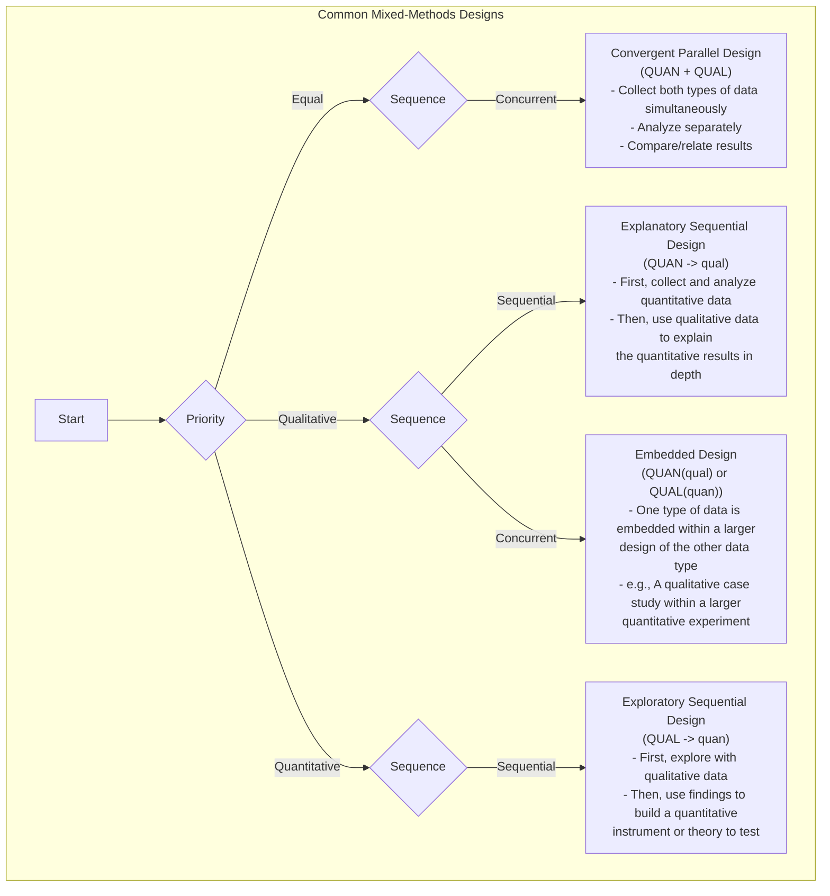

# Mixed-Methods Research

In the field of research, there have long been two mainstream paradigms: **quantitative research**, which uses numbers and statistics as its weapons, striving for objective and systematic measurement of social and natural phenomena; and **qualitative research**, which focuses on language and context, exploring the deep meanings of human experience. The former pursues objectivity and universality, while the latter seeks depth and meaning. However, more and more researchers are finding that any single method is like a blind man touching an elephant, only touching a part of reality. **Mixed-Methods Research** emerged not as a simple addition of two methods, but as a more mature and wise research philosophy.

Its core idea is to strategically and systematically integrate both quantitative and qualitative data and their analysis methods within a research project, in order to gain a more comprehensive, in-depth, and multi-dimensional understanding than any single method could provide. It believes that numbers can reveal the breadth of patterns, while stories can reveal the depth behind patterns. The combination of the two can make research conclusions more robust and insightful.

## Why Mix? The Synergistic Effect of Research

The charm of mixed-methods research lies in its ability to achieve a "1+1>2" synergistic effect. Depending on the purpose of integration, its core value is mainly reflected in the following aspects:

*   **Triangulation**: This is the most common purpose. It involves using data from one method to verify or corroborate conclusions drawn from another method. If the results of a quantitative survey and the findings of qualitative interviews corroborate each other, the reliability of the research conclusions will be greatly enhanced.
*   **Complementarity**: Using the strengths of one method to compensate for the weaknesses of another. For example, using qualitative interviews to deeply explain an unexpected statistical relationship found in a quantitative survey, allowing us to know not only "what" but also "why."
*   **Development**: Using the findings of one method to guide the implementation of another. For example, conducting exploratory qualitative interviews first to identify key themes and variables, and then designing a more targeted large-scale survey questionnaire based on these findings.
*   **Initiation**: When quantitative and qualitative research yield contradictory or paradoxical results, this itself is a valuable and significant discovery. It can challenge existing theories and inspire new thinking and deeper research.

### Core Mixed-Methods Design Types

Mixed-methods research has various design patterns, among which the three core ones are:

<!--

<!--

<!--

-->

## How to Conduct Mixed-Methods Research

1.  **Determine the Necessity of the Research**
    First, clarify why a single method is insufficient to answer your research question. What is the purpose of mixing? Is it for verification, complementarity, development, or initiation? A clear rationale is a prerequisite for success.

2.  **Choose the Appropriate Mixed Design**
    Based on your research purpose and questions, select the most suitable integration pattern. Is it simultaneous (convergent design) or sequential (sequential design)? Which method should precede the other?

3.  **Collect and Analyze Data in Stages**
    According to your chosen design, systematically execute data collection and analysis at each stage. This requires researchers to be proficient in both quantitative and qualitative research skills.

4.  **Key Integration Phase**
    This is the core and most challenging part of mixed-methods research. You need to meaningfully connect two different types of data at the "integration point." This might involve comparing the two in the results discussion, or using qualitative data to explain specific groups in quantitative data, or building quantitative survey items based on qualitative findings.

5.  **Draw Integrated Conclusions**
    The final conclusions should not be a simple list of quantitative and qualitative findings, but rather integrated insights that are more profound and multi-dimensional, generated from the collision and fusion of the two.

## Application Cases

**Case 1: Evaluating a New Employee Benefit Program**

* **Scenario**: A company launched a new flexible work benefit and wants to comprehensively evaluate its effectiveness.
* **Application (Explanatory Sequential Design: QUAN → qual)**:

    1. **Quantitative Phase**: The company first distributed an anonymous questionnaire to all employees, collecting quantitative data on the frequency of new benefit usage, job satisfaction, work stress, etc. The data showed that overall satisfaction significantly increased, but the increase in satisfaction among engineers was not obvious.

    2. **Qualitative Phase**: To explain this "unexpected" finding, researchers conducted in-depth interviews with 10 engineers. The interviews revealed that due to the specificity of project cycles, engineers found it difficult to truly benefit from flexible work, and instead, communication costs increased due to the need to collaborate with colleagues on non-flexible schedules.

    3. **Integrated Conclusion**: The new benefit was generally successful, but more targeted supporting measures need to be designed for specific positions (e.g., engineers).

---

**Case 2: Developing a Social App for Generation Z**

* **Scenario**: A startup team wants to develop a social product that truly appeals to Generation Z.
* **Application (Exploratory Sequential Design: QUAL → quan)**:

    1. **Qualitative Phase**: The team first conducted a one-month "digital ethnography" study on 20 Gen Z users, deeply observing and interviewing their online social behaviors, slang systems, and core social needs. The study found that "pressure-free social interaction" and "circle identity" were two core needs.

    2. **Quantitative Phase**: Based on these qualitative insights, the team designed a large-scale survey questionnaire to verify the universality of these needs and tested the attractiveness of several product concepts developed based on this (e.g., "ephemeral messaging," "interest circle matching"). The survey results showed that the "interest circle matching" feature received the highest expectation.

    3. **Integrated Conclusion**: The core of the product should be built around "interest circle matching" and incorporate a "pressure-free" design philosophy.

---

**Case 3: Researching the Impact of Climate Change on Farmers' Livelihoods**

* **Scenario**: An international development organization wants to understand the specific impact of climate change on smallholder farmers in a certain region.
* **Application (Convergent Design: QUAN + QUAL)**:

    * The research team **simultaneously** conducted two tasks: on one hand, they collected and analyzed meteorological data and crop yield data from the region over the past 20 years (quantitative); on the other hand, they went deep into the villages and conducted in-depth interviews with elderly farmers, listening to their experiences of weather changes, coping strategies, and concerns about the future (qualitative).

    * **Integration**: In the final report, the cold yield decline curves (quantitative) were presented alongside the emotional and life-wisdom-filled stories of the elderly farmers (qualitative), powerfully revealing the severity of climate change and providing strong evidence for policymakers.

## Advantages and Challenges of Mixed-Methods Research

**Core Advantages**

*   **Comprehensive and In-depth**: Can simultaneously see the "big picture" and "close-up" of a problem, leading to more convincing conclusions.
*   **Enhanced Credibility**: Mutual verification between different methods (triangulation) can greatly improve the reliability of research conclusions.
*   **Answers More Complex Questions**: Can handle multi-layered, complex research questions that single methods cannot address.

**Potential Challenges**

*   **Complex Design**: Requires careful design of integration points and timelines for both methods.
*   **Time and Labor Intensive**: Usually requires more time, resources, and budget than single-method research.
*   **High Skill Requirements**: Requires researchers or research teams to be proficient in both quantitative and qualitative research paradigms.
*   **Potentially Contradictory Results**: When the two methods yield inconsistent conclusions, how to explain and integrate them becomes a significant challenge (though it can also be an opportunity for major discoveries).

## Extensions and Connections

*   **Quantitative Research** and **Qualitative Research**: Are the two basic constituent modules of mixed-methods research. Understanding the philosophical foundations and technical details of both is a prerequisite for conducting mixed-methods research.

---
*Reference: John W. Creswell is one of the most important and prolific scholars in the field of mixed-methods research. His works, such as "Research Design: Qualitative, Quantitative, and Mixed Methods Approaches," are essential introductory and advanced readings in this field.*