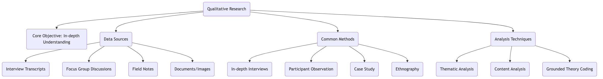
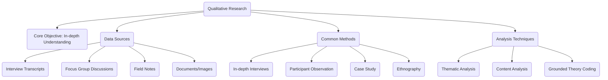

# Qualitative Research

Unlike quantitative research, which pursues objective measurement and statistical patterns, **Qualitative Research** is an exploratory journey towards understanding the deeper meanings of human experience. It is not satisfied with answers to "what is it" or "how much," but persistently asks "why" and "how." The core of qualitative research lies in deeply and comprehensively exploring the behavior, motivations, beliefs, and experiences of individuals or groups, aiming to discover meaning and construct theories from non-numerical, descriptive data (such as language, text, images, behavior).

When you want to understand why users are confused by your product, or want to explore the internal logic of a specific socio-cultural phenomenon, qualitative research reveals its unique charm. It does not generalize with numbers but reveals with stories; it does not verify preconceived hypotheses but discovers new insights in rich real-world contexts.

## Core Philosophy of Qualitative Research

Qualitative research is built on the philosophical foundations of interpretivism or constructivism, holding that reality is subjective, multiple, and constructed through social interaction.

*   **Contextual**: Qualitative research emphasizes that researchers must understand the subjects within their natural, real environment. Without context, behavior and language may lose their original meaning.
*   **Interpretive**: The researcher themselves is the most important research instrument. The research process involves in-depth, subjective interpretation and analysis of collected data to extract core themes and patterns.
*   **Emergent**: Research designs are typically flexible and open, and research questions and foci may be adjusted and evolve as the research deepens. Its goal is often to "grow" theories from data, rather than to test existing theories.
*   **Holistic**: Qualitative research attempts to understand the research subject as a complex whole, focusing on the interconnections and dynamic interactions between various parts.

### Qualitative Research Methods Map

<!--

-->

## How to Conduct Qualitative Research

1.  **Establish Exploratory Research Questions**
    Qualitative research questions are usually open-ended, starting with "how," "in what way," or "what." For example: "What is the user's mental journey and operational obstacles when first using our App?"

2.  **Select Research Participants**
    Qualitative research does not aim for statistical representativeness of the sample but uses **purposive sampling**, meaning intentionally selecting individuals or cases that can provide the richest, most in-depth information for the research question.

3.  **Collect Data**
    Collect data using appropriate qualitative methods. This can be a long and in-depth process.
    *   **In-depth Interviews**: Conduct one-on-one, semi-structured conversations, encouraging participants to share their stories and feelings.
    *   **Focus Groups**: Organize a small group (usually 6-8 people) of participants for collective discussion, observing their interactions and the clash of opinions.
    *   **Observation**: Observe people's behavior in their natural environment without disturbing or participating.

4.  **Data Analysis and Coding**
    This is the most challenging step in qualitative research. Researchers need to repeatedly read and organize large amounts of text or image data, using **coding** to break down, compare, and re-aggregate the data, identifying recurring themes, patterns, and categories.

5.  **Interpretation and Theory Building**
    Based on the analyzed core themes, researchers need to construct a logical, in-depth explanatory framework or storyline to answer the initial research questions, and potentially derive new theoretical insights.

## Application Cases

**Case 1: Exploring the User Experience of Smart Speakers in Elderly Households**

*   **Scenario**: A tech company wants to understand if its newly developed smart speaker is suitable for elderly users.
*   **Application**: The research team recruited 10 elderly households and installed smart speakers for free. Over the next month, researchers regularly conducted home interviews and non-intrusive observations in living room corners, recording how the elderly interacted with the speaker, difficulties encountered (e.g., accent recognition issues), creative uses (e.g., as a weather forecast and opera player), and their emotional reactions to this "new family member." The final report was full of vivid stories and details, providing extremely valuable insights that data alone could not capture for product iteration.

**Case 2: Understanding Why Corporate Innovation Culture is Difficult to Implement**

*   **Scenario**: A large company's CEO found that despite repeated emphasis on "innovation" at the company level, the innovation vitality of grassroots employees remained insufficient.
*   **Application**: An organizational development consultant conducted a two-week "ethnographic" study in three different departments of the company. He participated in the daily work and meetings of the departments as an "intern," having lunch and casual chats with employees. He found that although slogans were loud, the company's performance appraisal system still only rewarded short-term performance, and its tolerance for failure was extremely low. Employees generally believed privately that "innovation is high-risk, low-reward," and this deep-seated belief was the root cause hindering innovation.

**Case 3: Finding Design Inspiration for a New Travel App**

*   **Scenario**: A startup team wants to develop a unique travel app.
*   **Application**: The team organized three focus group discussions, inviting backpackers, family travelers, and business travelers separately. In the discussions, the team did not directly ask "what features do you need," but guided them to share their most memorable and worst travel experiences. By analyzing these stories, the team found that "unexpected surprises" and "genuine connections with locals" were key to creating good memories, while "information overload" and "generic guides" were the biggest pain points. These insights ultimately led to the concept of an app focusing on "exploring the unknown" and "local-led tours."

## Advantages and Limitations of Qualitative Research

**Core Advantages**

*   **Depth and Richness**: Can provide a rich, in-depth understanding of phenomena.
*   **Contextual**: Understands behavior and meaning in real, natural environments.
*   **Flexibility**: Can flexibly adjust research direction based on new discoveries during the research process.
*   **Discovery of New Theories**: Very suitable for exploring unknown areas and constructing new theoretical frameworks from them.

**Potential Limitations**

*   **Highly Subjective**: Research results largely depend on the researcher's personal interpretation and analytical abilities.
*   **Small Sample Size, Limited Generalizability**: Research conclusions usually cannot be directly generalized to larger populations.
*   **Time and Labor Intensive**: Data collection and analysis processes are usually very time-consuming and demanding.
*   **Difficult to Replicate**: Due to its contextual nature and researcher subjectivity, the research process is difficult to replicate precisely.

## Extensions and Connections

*   **Quantitative Research**: Qualitative research perfectly complements quantitative research. After quantitative research discovers macro patterns, qualitative research can be used to explore the underlying reasons in depth.
*   **Mixed Methods Research**: Combining qualitative and quantitative research is a mainstream trend in current research, aiming to achieve complementary advantages.

---
*Reference: The roots of qualitative research can be traced back to Max Weber's "interpretive sociology." "The SAGE Handbook of Qualitative Research," edited by Norman K. Denzin and Yvonna S. Lincoln, is one of the most authoritative and comprehensive references in this field.*