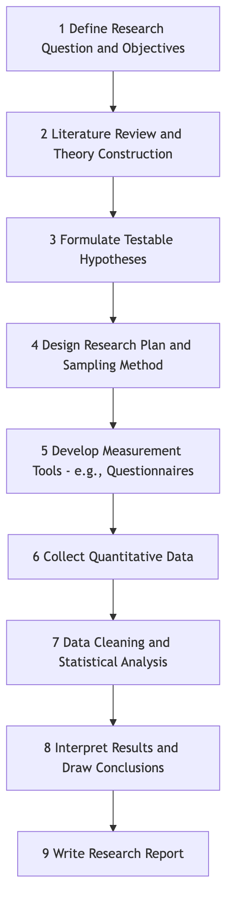
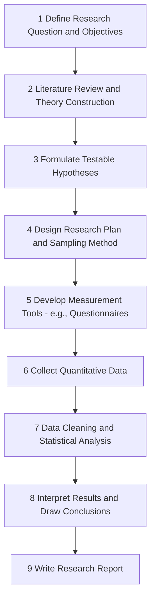

# Quantitative Research

Among the many ways to explore the world, **Quantitative Research** is a core method that uses numbers and statistics as its language, striving to objectively and systematically measure social and natural phenomena. It is not simply about dealing with numbers; its essence is an empirical paradigm that verifies hypotheses, reveals patterns, and predicts future trends through quantifiable data. When you need to answer questions like "How many?", "How frequent?", or "Is there a significant relationship between the two?", quantitative research becomes an indispensable tool.

It attempts to transform complex phenomena into measurable, comparable variables, and through rigorous statistical analysis, draw conclusions that are generalizable and verifiable. From testing drug efficacy in medicine to surveying consumer preferences in marketing, and analyzing macro trends in sociology, quantitative research provides solid logical and data support for us to understand and transform the world.

## Core Logic of Quantitative Research

The entire process of quantitative research is like a rigorous logical deduction, with its core being the verification of theoretical hypotheses through data.

*   **Variables**: These are the basic units of quantitative research. Researchers typically focus on two core variables: **independent variables**, which are factors manipulated or changed by the researcher; and **dependent variables**, which are the measured outcomes that change with the independent variables.
*   **Hypothesis**: Before starting the research, researchers propose a testable prediction about the relationship between variables, based on existing theories or observations. For example, "Increasing the size of a website button (independent variable) will increase its click-through rate (dependent variable)."
*   **Sampling**: Since it is impossible to study the entire target population (universe), quantitative research selects a representative portion of individuals (sample) for study. To ensure the generalizability of conclusions, the sampling process must be scientific, commonly including random sampling, stratified sampling, etc.
*   **Data Analysis**: After collecting data, researchers use statistical tools (such as descriptive statistics, inferential statistics) to analyze the data and test whether the initial hypothesis holds true.

### Quantitative Research Flowchart

<!--

---!>
 <!--

<!--

-->
 -->

## How to Conduct Quantitative Research

1.  **Clarify Research Question**
    First, you need a clear, specific, and measurable question. For example, refine the vague idea "I want to understand college students' happiness" into "Is there a positive correlation between household income level and college students' subjective well-being scores?"

2.  **Construct Theory and Hypotheses**
    Review relevant literature and theories to understand previous research on this question. Based on this, propose your hypotheses, such as: "H1: The higher the household income level, the higher the college students' subjective well-being score."

3.  **Design Research and Measurement**
    Determine your research design (is it a survey, experiment, or correlational study?) and design your data collection tools. For example, design a questionnaire that includes "household monthly income range" options and an internationally recognized "Subjective Well-being Scale."

4.  **Sampling and Data Collection**
    Determine your target research population (e.g., "college students nationwide") and use appropriate sampling methods (e.g., random sampling from multiple universities) to distribute questionnaires and collect data.

5.  **Analysis and Interpretation**
    Enter the collected data into statistical software (e.g., SPSS, R) and perform descriptive statistics (e.g., calculating average well-being scores) and inferential statistics (e.g., performing correlation analysis or regression analysis) to test whether your hypotheses are supported by the data.

6.  **Write Report**
    Finally, systematically write a research report detailing the entire research process, data analysis results, conclusions, and limitations of the study.

## Application Cases

**Case 1: A/B Testing in Web Page Optimization**

*   **Scenario**: An e-commerce company wants to increase the conversion rate of its product page's "Add to Cart" button.
*   **Application**: They designed two versions of the button: Version A was red, and Version B was green. By randomly distributing website traffic to the two versions, they collected data from tens of thousands of visitors. Statistical analysis showed that the green button's click-through rate (dependent variable) was 15% higher than the red button's, and the difference was statistically significant. The company therefore decided to adopt the green button across the entire site.

**Case 2: Clinical Trials for New Drugs**

*   **Scenario**: A pharmaceutical company developed a new blood pressure-lowering drug.
*   **Application**: Researchers recruited 500 hypertensive patients and randomly divided them into two groups. The experimental group took the new drug, and the control group took a placebo with no active ingredients. After three months, the change in blood pressure (dependent variable) of all patients was measured. The results showed that the average blood pressure reduction in the experimental group was significantly greater than that in the control group, proving the efficacy of the new drug.

**Case 3: Public Policy Effectiveness Evaluation**

*   **Scenario**: A city implemented a "odd-even license plate restriction" policy to alleviate traffic congestion.
*   **Application**: The government quantitatively evaluated the actual effect of the policy by analyzing traffic flow monitoring data, average commute time data, and air quality index (dependent variable) for one year before and after the policy implementation. They found that after the policy, average weekday traffic volume decreased by 20%, but weekend traffic congestion worsened.

## Advantages and Limitations of Quantitative Research

**Core Advantages**

*   **Objectivity and Replicability**: Due to reliance on numerical values and standardized procedures, research results are relatively objective and can be replicated by other researchers.
*   **Strong Generalizability**: Through scientific sampling, research conclusions can be generalized from the sample to a larger population.
*   **Facilitates Statistical Analysis**: Allows for complex statistical modeling to discover precise relationships between variables.

**Potential Limitations**

*   **Simplifies Reality**: Reducing complex social phenomena to a limited number of variables may overlook the rich context and deeper reasons behind them.
*   **Cannot Answer "Why"**: It can effectively reveal "what" and "how much," but often struggles to explain the motivations and processes behind phenomena in depth.
*   **Measurement Error**: Questionnaire design and participant responses may have biases, affecting data accuracy.

## Extensions and Connections

*   **Qualitative Research**: Qualitative research perfectly complements quantitative research. After quantitative research discovers macro patterns, qualitative research can be used to explore the underlying reasons in depth.
*   **Mixed Methods Research**: Combines quantitative and qualitative research to gain the most comprehensive and in-depth understanding of a problem.
*   **Correlational Research** and **Experimental Research**: Both are specific types of quantitative research; the former focuses on relationships between variables, while the latter aims to establish causality.

---
*Reference: The methodology of quantitative research is rooted in positivist philosophy, and its statistical foundations were laid by statisticians like Karl Pearson. Earl Babbie's "The Practice of Social Research" is a classic textbook in this field.*