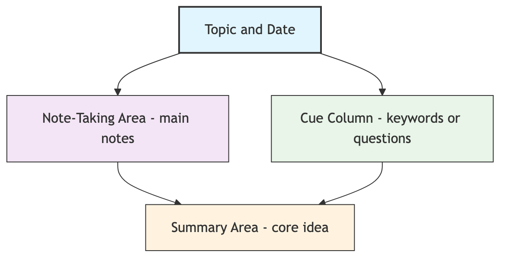

# Cornell Note-Taking Method

When attending lectures, meetings, or reading, we often find ourselves in a dilemma: if we furiously write down everything, trying to capture all content, we often lose track of the main ideas and "miss the forest for the trees"; if we only listen without taking notes, we might forget most of the important information within hours or days. The **Cornell Note-Taking System**, designed by Professor Walter Pauk of Cornell University in the 1950s, is a globally renowned **highly efficient note-taking system** aimed at solving this problem.

The essence of the Cornell Note-Taking Method is not "how to take notes," but to systematically integrate **recording, simplifying, reviewing, and reflecting** on key learning stages through a **unique page layout**. It clearly divides a page of notes into three (or four) different areas, each with its unique function. This structured approach forces us to actively think and process information while taking notes, thereby greatly improving learning efficiency, depth, and long-term knowledge retention.

## Cornell Note Page Layout

The essence of the Cornell Note-Taking Method lies in its unique "**three-part page**" structure.

1.  **Note-Taking Area**: Located on the **right side** of the page, it is the largest area. This is where you take **real-time notes** during lectures or reading.
2.  **Cue Column**: A narrower column located on the **left side** of the page. This is where you **extract and simplify** content from the main note-taking area after class.
3.  **Summary Area**: Located at the **bottom** of the page. This is where you **summarize** the core ideas of the entire page of notes after class.

### Cornell Note-Taking Method Template



<!--
```mermaid
graph TD
    subgraph Cornell Note-Taking Method Page Layout
        direction TB
        A(<b>Topic/Date</b>) --> B(<b>Note-Taking Area</b><br/><i>(Right side, approx. 70% of page)</i><br/>- Take notes here during lectures/reading<br/>- Be concise, use abbreviations, symbols<br/>- Record core concepts, examples, formulas);
        A --> C(<b>Cue Column</b><br/><i>(Left side, approx. 30% of page)</i><br/>- After class, based on content in Note-Taking Area<br/>- Extract <b>keywords, questions, or cues</b> here);
        B & C --> D(<b>Summary Area</b><br/><i>(Bottom)</i><br/>- After class, in one or two sentences<br/>- Briefly summarize the <b>core idea</b> of the entire page of notes);
    end
```
-->

## How to Use the Cornell Note-Taking Method (5R Principles)

The founder of the Cornell Note-Taking Method summarized its usage into five logically clear steps, known as the "5R Principles."

1.  **Record**
    *   **When**: **During** lectures or reading.
    *   **Action**: In the **Note-Taking Area (right side)**, record important information as efficiently as possible. Don't aim for complete sentences; use your own words, abbreviations, symbols, and lists to capture core arguments, concepts, examples, and formulas.

2.  **Reduce/Question**
    *   **When**: **After** lectures or reading, as soon as possible (preferably on the same day).
    *   **Action**: Carefully review the content in the Note-Taking Area. Then, in the **Cue Column (left side)**, for each note on the right, extract a **keyword** or a **short question**. These cues will serve as "triggers" for your future review. For example, if the right side records the detailed process of "photosynthesis," the cue on the left could be "Photosynthesis process?" or "Elements of photosynthesis?"

3.  **Recite**
    *   **When**: After reducing/questioning.
    *   **Action**: **Cover the Note-Taking Area on the right side**, and only look at the keywords or questions in the Cue Column on the left. Then, try to **recite** the content from the right side completely and clearly in your own words. This process is key to testing whether you truly understand and remember the knowledge; it is an active recall exercise.

4.  **Reflect**
    *   **When**: After reciting.
    *   **Action**: Spend a few minutes engaging in deeper thinking. Ask yourself: "What is the significance of this knowledge?" "How does it connect with other knowledge I already have?" "How can I apply this knowledge?" You can mark these thoughts and insights in the margins of your notes or with a different colored pen.

5.  **Review**
    *   **When**: Regularly and quickly.
    *   **Action**: Spend 10 minutes each day quickly browsing the **Cue Column and Summary Area** of all your notes. This high-frequency, low-burden repetition is the most effective way to combat the "Ebbinghaus Forgetting Curve" and achieve long-term memory retention.

## Application Cases

**Case 1: Student Attending a History Lecture**

*   **Topic**: Causes of the French Revolution.
*   **Note-Taking Area (right side)**: Records details of key events and concepts mentioned by the teacher, such as "Estates-General," "financial crisis," "Enlightenment ideas," "Storming of the Bastille."
*   **Cue Column (left side)**: After class, extracts questions like "Social structure before the revolution?" "Core of Enlightenment ideas?" "Trigger of the revolution?"
*   **Summary Area (bottom)**: Summarizes in one sentence: "In the late 18th century, France, under the combined influence of profound social inequality, financial crisis, and Enlightenment ideas, finally ignited the bourgeois revolution by storming the Bastille."
*   **Review**: Before the final exam, he doesn't need to reread the entire textbook; he just needs to quickly browse the Cue Column on the left and the Summary Area at the bottom of all his notes to efficiently connect the entire semester's knowledge framework.

**Case 2: Attending a Project Kick-off Meeting**

*   **Topic**: Q4 "Flying Bird Project" Kick-off Meeting.
*   **Note-Taking Area (right side)**: Records clear project goals, key deliverables, timelines, and responsible persons for each department mentioned in the meeting.
*   **Cue Column (left side)**: After the meeting, organizes cues like "Project core goals?" "My specific responsibilities?" "Key risks?" "People to follow up with?"
*   **Summary Area (bottom)**: "This meeting clarified that the goal of the 'Flying Bird Project' is to launch V1 by year-end. My core task is to be responsible for the user research module, and I need to align specific requirements with Product Manager Xiao Wang by this Friday."
*   **Application**: This structured note becomes a clear basis for his subsequent follow-up work and meeting minutes.

**Case 3: Reading a Non-Fiction Book**

*   **Topic**: Reading Chapter 5 of "Thinking, Fast and Slow."
*   **Note-Taking Area (right side)**: Records core characteristics of "System 1" and "System 2," classic experimental cases (e.g., "Linda Problem"), and the author's core argumentation process.
*   **Cue Column (left side)**: Extracts questions like "System 1 vs. System 2?" "What are heuristics?" "Example of anchoring effect?"
*   **Summary Area (bottom)**: "Our brain has two thinking systems, fast and slow. Intuitive System 1, though efficient, often leads to irrational decisions due to various cognitive biases."
*   **Reflection**: In the "Reflection" stage, he might write: "This explains why I always buy a bunch of unnecessary things when there's a supermarket sale. I should consciously activate System 2 for slow thinking when making important decisions."

## Advantages and Challenges of the Cornell Note-Taking Method

**Core Advantages**

*   **Promotes Active Learning**: It forces you not just to mechanically transcribe, but to simplify, question, and summarize after class, which is an active process of deep information processing.
*   **Highly Efficient for Learning and Review**: Structured notes make reviewing clear and easy to grasp, greatly improving efficiency.
*   **Enhances Knowledge Retention**: The "recite" and "regular review" stages perfectly align with cognitive science principles of "active recall" and "spaced repetition" for memory retention.
*   **Cultivates Systematic Thinking**: By continuously extracting key points and summarizing, it effectively trains our inductive and systematic thinking abilities.

**Potential Challenges**

*   **Requires Additional Time Investment**: Compared to simple linear notes, the Cornell Note-Taking Method requires you to invest extra time after class for organization and summarization.
*   **Not Applicable to All Scenarios**: For highly divergent, unstructured discussions (like brainstorming), or subjects requiring extensive drawing (like architecture, art), the traditional Cornell Note-Taking Method might not be the best choice.
*   **Requires Persistence and Self-Discipline**: Its greatest power is realized when the "5R" principles are fully and consistently executed. If only the first step "Record" is done, and subsequent organization and review are neglected, its effectiveness will be greatly reduced.

## Extensions and Connections

*   **Mind Mapping**: For highly interconnected, non-linear topics, you can first use mind mapping to brainstorm and organize ideas, and then organize the core content into structured Cornell notes for easier memorization and review.
*   **Feynman Technique**: The "recite" stage in the Cornell Note-Taking Method aligns perfectly with the core idea of "teaching a child" in the Feynman Technique, both using "output" to test and consolidate "input."

---
*Reference: Dr. Walter Pauk first introduced the Cornell Note-Taking Method to the world in his 1962 bestseller "How to Study in College." This method is still recommended by universities and educational institutions worldwide as one of the most effective and scientific note-taking methods.*