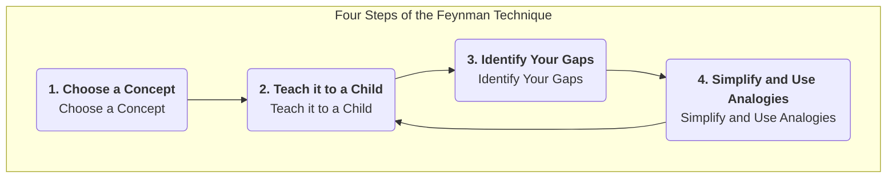

# The Feynman Technique

We often fall into the illusion of "knowing": we can recognize a concept, talk about it vaguely, and even highlight it in a book, mistakenly believing that we have truly mastered it. However, when we need to explain this concept clearly, in our own words, to others, we realize how fragmented and flawed our understanding is. The **Feynman Technique** is a powerful mental model and learning strategy designed to break this learning illusion and pursue **truly deep understanding**.

This method is named after Nobel Prize-winning physicist Richard Feynman, who was renowned for his ability to explain extremely complex physics concepts in incredibly simple, intuitive language. The core idea of the Feynman Technique is that **the only criterion for truly understanding a piece of knowledge is whether you can successfully teach it to someone completely unfamiliar with the field, using the simplest, clearest language possible**. It is not a passive learning method, but an active, "learning by teaching" deep processing that forces us to confront all the ambiguities and logical gaps in our knowledge system.

## Four Core Steps of the Feynman Technique

The Feynman Technique is extremely simple in its process, but each step contains profound principles of cognitive science.

1.  **Step One: Choose a Concept You Want to Learn (Choose a Concept)**
    *   Take a blank piece of paper or open a blank document, and at the top, write the name of the concept you want to understand deeply in large font. For example, "Blockchain," "Marginal Utility," or "Bayes' Theorem."

2.  **Step Two: Imagine You're Teaching a Child (Teach it to a Child)**
    *   This is the soul of the Feynman Technique. On the paper, pretend you are explaining this concept to a smart 12-year-old child with no prior knowledge of the subject. **Use your own, simplest, clearest language** to write down your understanding of the concept.
    *   **Key**: During this process, **absolutely forbid** the use of any complex terms or jargon copied from the original material. If you find yourself having to use a technical term, it means your understanding of that term itself is not deep enough, and you need to explain it clearly first.

3.  **Step Three: Review and Identify Your Gaps (Identify Your Gaps)**
    *   Once you have finished your explanation, carefully and honestly review what you have written. In this process, you will inevitably find some areas where:
        *   You stammered and were not fluent.
        *   You found yourself just repeating definitions without being able to provide a concrete example.
        *   You found yourself unable to clearly explain the logical connections between concepts.
        *   You found yourself unconsciously using a lot of technical jargon.
    *   All these places where you "got stuck" are the **true weak links and gaps in your knowledge system and understanding**. Mark them all.

4.  **Step Four: Go Back to the Original Material, Simplify and Use Analogies (Go Back, Simplify and Use Analogies)**
    *   For all the understanding gaps you identified in the previous step, **go back to** your learning materials (e.g., books, articles, courses) and study more targeted and in-depth until you fully understand those sticking points.
    *   Then, try again to reorganize and simplify your explanation using simpler language, more vivid **analogies** or metaphors. A good analogy is a bridge connecting abstract concepts to the known world.
    *   **Repeat this process** until you can finally explain the concept perfectly on a single piece of paper, using simple, fluent, and logically consistent language.

## Application Cases

**Case One: Learning "What is an API (Application Programming Interface)?"**

1. **Step One**: Write "API" on the paper.
2. **Step Two (First attempt at explanation)**: "An API is a software intermediary that allows two applications to communicate with each other. It is a set of routines, protocols, and tools used to build application software..." (Realized I was just reciting a Wikipedia definition, very stiff).
3. **Step Three (Identify gaps)**: I couldn't explain what "intermediary" and "routines" actually meant, and this explanation was too abstract for a child.
4. **Step Four (Simplify and use analogies)**: I need a good analogy. **The restaurant ordering process!**
    *   **(Second attempt at explanation)**: "Imagine you go to a restaurant. You (an application) cannot directly go to the kitchen (another application's backend system) to tell the chef what you want to eat. You need a **waiter (API)**. You look at the **menu (API documentation)**, which lists all the dishes you can order (functions provided by the API). You tell the waiter you want Kung Pao Chicken (you make an API request). The waiter conveys your request to the chef in a language the kitchen understands. Finally, the waiter brings you the prepared dish (data returned by the system). In this process, you don't need to know how the kitchen works internally; the waiter is the standardized communication interface that connects you and the kitchen."
    *   This explanation is clear, simple, and easy to understand.

**Case Two: Understanding a Complex Historical Event, such as the "An Lushan Rebellion"**

1. **Step One**: Write "An Lushan Rebellion."
2. **Step Two**: Try to explain this event to a primary school student who only knows that the Tang Dynasty was very powerful.
3. **Step Three (Identify gaps)**: You might find that you only know that An Lushan and Shi Siming rebelled, but you can't explain "why" they rebelled? What exactly does "fanzhen separatism" mean? Why couldn't the Tang army defeat them at first?
4. **Step Four**: With these questions, you go back to the materials and clarify the deeper reasons, such as the "collapse of the Fubing system," the "rise of the recruiting system," and the "excessive power of jiedushi" in the mid-to-late Tang Dynasty. Then, you can use a more vivid analogy, for example, "This is like the CEO of a large company (emperor) giving too much power (military power, financial power, personnel power) to several branch companies (fanzhen), and as a result, the general managers of these branch companies (jiedushi) became their own bosses and no longer listened to the headquarters."

**Case Three: Preparing for an Important Product Demonstration**

1. **Step One**: Choose your core product features.
2. **Step Two**: Pretend to explain to your grandmother what your product does and what problem it solves in her life.
3. **Step Three (Identify gaps)**: You will immediately realize how empty and difficult to understand those industry buzzwords you usually use, such as "empowerment," "closed-loop," and "breaking through," are.
4. **Step Four**: This process will force you to refine your product introduction using the most unpretentious language, focusing on user value. Ultimately, your demonstration will become exceptionally clear and persuasive.

## Advantages and Challenges of the Feynman Technique

**Core Advantages**

1. **Builds deep, lasting understanding**: Through active, output-based learning, shallow "recognition" is transformed into deep "understanding."
2. **Precisely identifies knowledge blind spots**: The process of "teaching a child" acts like an "X-ray machine" for knowledge, exposing all your half-understood areas.
3. **Improves clear expression and communication skills**: It is the ultimate training for one's ability to simplify, analogize, and communicate clearly.

**Potential Challenges**

1. **Time-consuming and laborious**: Compared to passively highlighting and taking notes, the Feynman Technique requires more time and mental effort.
2. **Requires high honesty**: You must be honest enough with yourself to bravely admit and face the gaps in your knowledge system, rather than deceiving yourself.

## Extension and Connection

1. **Learning by Doing/Teaching**: The Feynman Technique is one of the most classic and effective practical methods of the "learning by doing/teaching" concept.
2. **First Principles Thinking**: The Feynman Technique, to some extent, also embodies first principles thinking. It requires you not to be satisfied with superficial, complex terms, but to return to the most fundamental, simplest logic and facts of a concept.

---
*Source Reference: Although this learning method is named after Richard Feynman and profoundly embodies his way of thinking, it was not systematically proposed by him personally. It was distilled by later learners and educators, summarizing Feynman's unique teaching and thinking style. Bloggers in the learning field, such as Scott H. Young, played an important role in promoting this method.*