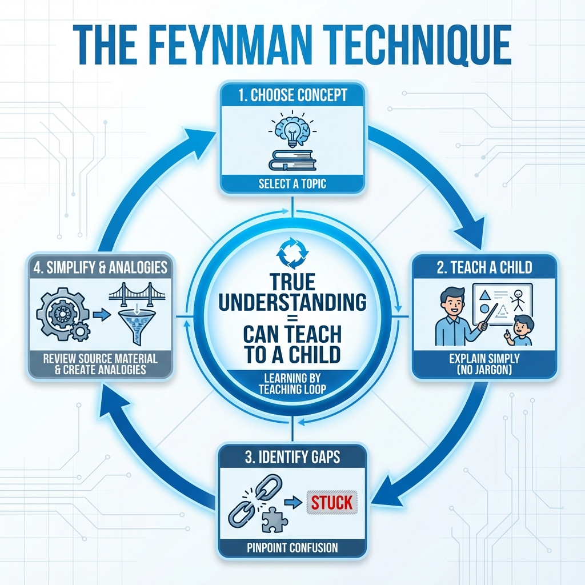

# The Feynman Technique

We often fall into the illusion of "knowing": we can recognize a concept, talk about it vaguely, and even highlight it in a book, mistakenly believing that we have truly mastered it. However, when we need to explain this concept clearly, in our own words, to others, we realize how fragmented and flawed our understanding is. The **Feynman Technique** is a powerful mental model and learning strategy designed to break this learning illusion and pursue **truly deep understanding**.

This method is named after Nobel Prize-winning physicist Richard Feynman, who was renowned for his ability to explain extremely complex physics concepts in incredibly simple, intuitive language. The core idea of the Feynman Technique is that **the only criterion for truly understanding a piece of knowledge is whether you can successfully teach it to someone completely unfamiliar with the field, using the simplest, clearest language possible**. It is not a passive learning method, but an active, "learning by teaching" deep processing that forces us to confront all the ambiguities and logical gaps in our knowledge system.

!!! abstract "Key takeaways"

    - **Four steps**: pick a concept → explain it in plain words to a beginner (in writing) → find where you get stuck → go back to the source, then simplify and add an analogy.
    - **The test**: no unexplained jargon, at least one concrete example, and you can say *why*, not just *what*. A smart 12-year-old should follow it.
    - **Best for** concepts and principles: economic ideas, technical mechanisms, cause and effect in history.
    - **Less useful for** pure memorization (vocabulary, formulas, dates); pair it with spaced repetition instead.
    - **Write it down or say it out loud.** Running through it silently in your head hides the gaps.

## Four Core Steps of the Feynman Technique

The Feynman Technique is extremely simple in its process, but each step contains profound principles of cognitive science.

1.  **Step One: Choose a Concept You Want to Learn (Choose a Concept)**
    *   Take a blank piece of paper or open a blank document, and at the top, write the name of the concept you want to understand deeply in large font. For example, "Blockchain," "Marginal Utility," or "Bayes' Theorem."
    *   Keep the scope small. "Economics" is too big; "opportunity cost" is just right.

2.  **Step Two: Imagine You're Teaching a Child (Teach it to a Child)**
    *   This is the soul of the Feynman Technique. On the paper, pretend you are explaining this concept to a smart 12-year-old child with no prior knowledge of the subject. **Use your own, simplest, clearest language** to write down your understanding of the concept.
    *   **Key**: During this process, **absolutely forbid** the use of any complex terms or jargon copied from the original material. If you find yourself having to use a technical term, it means your understanding of that term itself is not deep enough, and you need to explain it clearly first.

3.  **Step Three: Review and Identify Your Gaps (Identify Your Gaps)**
    *   Once you have finished your explanation, carefully and honestly review what you have written. In this process, you will inevitably find some areas where:
        *   You stammered and were not fluent.
        *   You found yourself just repeating definitions without being able to provide a concrete example.
        *   You found yourself unable to clearly explain the logical connections between concepts.
        *   You found yourself unconsciously using a lot of technical jargon.
    *   All these places where you "got stuck" are the **true weak links and gaps in your knowledge system and understanding**. Mark them all.

4.  **Step Four: Go Back to the Original Material, Simplify and Use Analogies (Go Back, Simplify and Use Analogies)**
    *   For all the understanding gaps you identified in the previous step, **go back to** your learning materials (e.g., books, articles, courses) and study more targeted and in-depth until you fully understand those sticking points.
    *   Then, try again to reorganize and simplify your explanation using simpler language, more vivid **analogies** or metaphors. A good analogy is a bridge connecting abstract concepts to the known world.
    *   **Repeat this process** until you can finally explain the concept perfectly on a single piece of paper, using simple, fluent, and logically consistent language.

## Application Cases

**Case One: Learning "What is an API (Application Programming Interface)?"**

1. **Step One**: Write "API" on the paper.
2. **Step Two (First attempt at explanation)**: "An API is a software intermediary that allows two applications to communicate with each other. It is a set of routines, protocols, and tools used to build application software..." (Realized I was just reciting a Wikipedia definition, very stiff).
3. **Step Three (Identify gaps)**: I couldn't explain what "intermediary" and "routines" actually meant, and this explanation was too abstract for a child.
4. **Step Four (Simplify and use analogies)**: I need a good analogy. **The restaurant ordering process!**
    *   **(Second attempt at explanation)**: "Imagine you go to a restaurant. You (an application) cannot directly go to the kitchen (another application's backend system) to tell the chef what you want to eat. You need a **waiter (API)**. You look at the **menu (API documentation)**, which lists all the dishes you can order (functions provided by the API). You tell the waiter you want Kung Pao Chicken (you make an API request). The waiter conveys your request to the chef in a language the kitchen understands. Finally, the waiter brings you the prepared dish (data returned by the system). In this process, you don't need to know how the kitchen works internally; the waiter is the standardized communication interface that connects you and the kitchen."
    *   This explanation is clear, simple, and easy to understand.

**Case Two: Understanding a Complex Historical Event, such as the "An Lushan Rebellion"**

1. **Step One**: Write "An Lushan Rebellion."
2. **Step Two**: Try to explain this event to a primary school student who only knows that the Tang Dynasty was very powerful.
3. **Step Three (Identify gaps)**: You might find that you only know that An Lushan and Shi Siming rebelled, but you can't explain "why" they rebelled? What exactly does "fanzhen separatism" mean? Why couldn't the Tang army defeat them at first?
4. **Step Four**: With these questions, you go back to the materials and clarify the deeper reasons, such as the "collapse of the Fubing system," the "rise of the recruiting system," and the "excessive power of jiedushi" in the mid-to-late Tang Dynasty. Then, you can use a more vivid analogy, for example, "This is like the CEO of a large company (emperor) giving too much power (military power, financial power, personnel power) to several branch companies (fanzhen), and as a result, the general managers of these branch companies (jiedushi) became their own bosses and no longer listened to the headquarters."

**Case Three: Preparing for an Important Product Demonstration**

1. **Step One**: Choose your core product features.
2. **Step Two**: Pretend to explain to your grandmother what your product does and what problem it solves in her life.
3. **Step Three (Identify gaps)**: You will immediately realize how empty and difficult to understand those industry buzzwords you usually use, such as "empowerment," "closed-loop," and "breaking through," are.
4. **Step Four**: This process will force you to refine your product introduction using the most unpretentious language, focusing on user value. Ultimately, your demonstration will become exceptionally clear and persuasive.

## Advantages and Challenges of the Feynman Technique

**Core Advantages**

1. **Builds deep, lasting understanding**: Through active, output-based learning, shallow "recognition" is transformed into deep "understanding."
2. **Precisely identifies knowledge blind spots**: The process of "teaching a child" acts like an "X-ray machine" for knowledge, exposing all your half-understood areas.
3. **Improves clear expression and communication skills**: It is the ultimate training for one's ability to simplify, analogize, and communicate clearly.

**Potential Challenges**

1. **Time-consuming and laborious**: Compared to passively highlighting and taking notes, the Feynman Technique requires more time and mental effort.
2. **Requires high honesty**: You must be honest enough with yourself to bravely admit and face the gaps in your knowledge system, rather than deceiving yourself.

## Feynman Learning Card Template

Run every concept through one card (or one page of notes) using the format below. Over time you build a personal knowledge base written in your own words.

| Field | What to write |
| --- | --- |
| Concept | One small concept, e.g. "opportunity cost" |
| First explanation | Without looking at sources, explain it in 3–5 plain sentences |
| A concrete example | One example from everyday life |
| Where I got stuck | Every point where you could only recite a definition or had to use jargon |
| Study notes | What you found when you went back to the source for each sticking point |
| An analogy | "It's like..." |
| Final explanation | No jargon, with an example and an analogy, understandable to a beginner |
| Self-test question | One question that checks real understanding, saved for later review |

**Self-check**

- [ ] The final explanation uses no unexplained technical terms
- [ ] It contains at least one concrete example and one analogy
- [ ] It explains *why* something happens, not only *what* it is
- [ ] A real beginner has heard it and could summarize the main idea back to you

## Common Mistakes

1.  **Explaining only in your head.** When you rehearse silently, your brain skips over the gaps and you think you've got it. Write it down or say it out loud.
2.  **Making it simple by making it wrong.** Simplifying is not the same as distorting. An analogy is a bridge to understanding; afterwards, say where the analogy breaks down.
3.  **Skipping steps three and four.** Writing one explanation and stopping misses the point. The real learning happens in the loop of finding gaps, going back to the source and trying again.
4.  **Choosing a concept that is too big.** "Learn quantum mechanics" cannot fit on one page. Break big subjects into small concepts and handle one at a time.
5.  **Only explaining to yourself.** It is easy to convince yourself. When you can, explain it to a real beginner, or to an expert who can spot errors, and notice where they get confused.
6.  **Using it for the wrong material.** For content that is mostly memorization (vocabulary, legal clauses, chemical equations) the technique is slow; spaced repetition and flashcards work better.

## The Feynman Technique vs. Other Learning Methods

| | Feynman Technique | [Cornell Note-Taking](Cornell-Note-Taking-Tutorial-en.md) | [Mind Mapping](../../Problem Solving & Decision Making/ideation/Mind-Mapping-Tutorial-en.md) | Spaced Repetition |
| --- | --- | --- | --- | --- |
| Problem it solves | Do I really understand this? | How do I record and review? | How is this knowledge structured? | How do I remember it long term? |
| How you learn | Output: explain it in your own words | Recording plus self-questioning | Visual organization | Recalling at increasing intervals |
| Best content | Principles, concepts, causal relationships | Lectures and classes | Hierarchical bodies of knowledge | Facts to be memorized |
| Time cost | High | Medium | Medium | Little per session, but sustained over time |

These methods combine well: take Cornell notes in class, attack the hard parts with the Feynman Technique afterwards, tie each chapter together with a mind map, and use spaced repetition for what you must remember.

## Frequently Asked Questions

??? question "Do I have to explain it to another person?"

    No. Writing works too; the point is to externalize your understanding so gaps have nowhere to hide. Explaining to someone else is even better, because their questions reveal problems you cannot see yourself.

??? question "What subjects is the Feynman Technique good for?"

    Anything that requires understanding: concepts, principles, models and causal relationships, such as economics, programming concepts, physics laws or the causes of historical events. It helps less with pure memorization.

??? question "Did Richard Feynman invent the Feynman Technique?"

    No. Feynman never described this four-step method himself. Later learners distilled it from his teaching and thinking style, and it spread online as the "Feynman Technique".

??? question "How long does one concept take?"

    Usually 20–40 minutes for a small concept, faster once you are used to it. What matters is completing the loop of finding a gap, going back to the source and explaining again.

??? question "How do I use it to study for exams?"

    List the core concepts of each chapter and run each one through a learning card. Whatever you cannot explain clearly is what to review. Then check yourself with practice problems: understanding plus correct answers means you have really learned it.

## Extension and Connection

1. **Learning by Doing/Teaching**: The Feynman Technique is one of the most classic and effective practical methods of the "learning by doing/teaching" concept.
2. **[First Principles Thinking](../logical_thinking/First-Principles-Thinking-Tutorial-en.md)**: The Feynman Technique, to some extent, also embodies first principles thinking. It requires you not to be satisfied with superficial, complex terms, but to return to the most fundamental, simplest logic and facts of a concept.
3. **[Cornell Note-Taking](Cornell-Note-Taking-Tutorial-en.md)**: The cue column and summary area of Cornell notes push you to restate material in your own words, the same idea behind the Feynman Technique.
4. **[Mind Mapping](../../Problem Solving & Decision Making/ideation/Mind-Mapping-Tutorial-en.md)**: Once you have mastered individual concepts with the Feynman Technique, a mind map connects them into a complete knowledge structure.
5. **[Pyramid Principle](../logical_thinking/Pyramid-Principle-Tutorial-en.md)**: When you explain what you have learned to others, the Pyramid Principle helps you lead with the conclusion and organize the supporting points.

---
*Source Reference: Although this learning method is named after Richard Feynman and profoundly embodies his way of thinking, it was not systematically proposed by him personally. It was distilled by later learners and educators, summarizing Feynman's unique teaching and thinking style. Bloggers in the learning field, such as Scott H. Young, played an important role in promoting this method.*