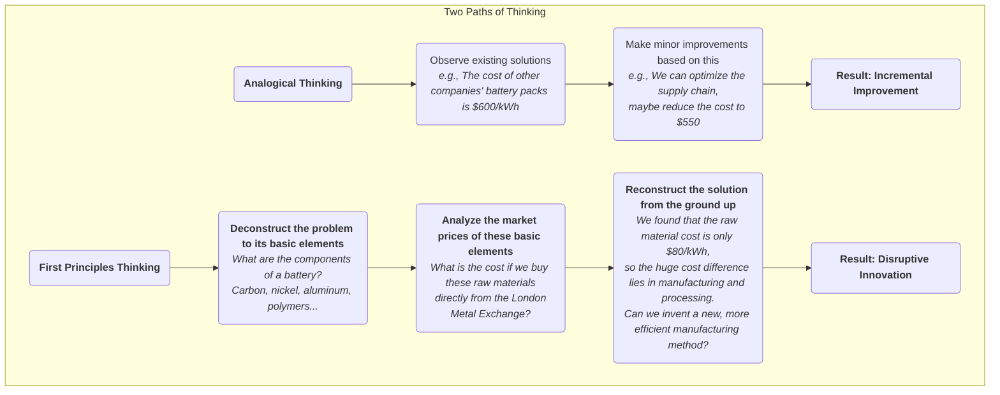

# First Principles Thinking

When facing complex problems or seeking breakthrough innovations, most of us tend to think using **Thinking by Analogy**. We observe what others are doing, or how we've done things in the past, and then make small, incremental improvements based on that. While this approach is often efficient, it can also act as an invisible cage, confining our thinking within existing, proven frameworks, making true disruptive innovation difficult. **First Principles Thinking** offers a contrasting, more penetrating path to thinking.

First principles, a concept originating from physics and philosophy, centers on **returning to the most basic, self-evident axioms or facts of a matter, and from there, logically deducing upwards, layer by layer, until a new, fundamental solution is found**. It's not about adjusting seasonings on an existing "recipe," but rather, like a chef, deconstructing a dish into its most basic molecules and elements (such as protein, fat, acid, sweetness), and then, starting from these foundational elements, creating an unprecedented dish. Elon Musk is the most famous advocate and practitioner of first principles in modern business, having used this thinking to completely disrupt traditional industries like aerospace and automotive.

## First Principles vs. Analogical Thinking

The best way to understand first principles is to compare it with analogical thinking, which we are more accustomed to.

*   **Analogical Thinking**:
    *   **Logic**: "Because everyone else does it this way, or we've always done it this way, we should also do it this way, with some minor improvements." 
    *   **Characteristics**: Fast, simple, low-risk, but prone to mental rigidity, leading to "path dependence," and making fundamental breakthroughs difficult.
    *   **Example**: Before the advent of smartphones, mobile phone manufacturers generally innovated by adding camera pixels, changing case colors, or adding some software features to existing keypad phones.

*   **First Principles Thinking**:
    *   **Logic**: "Let's temporarily ignore how others do it. What are the most basic facts we can be certain of regarding this problem? What can we deduce from these facts? What would an ideal solution look like, unconstrained by existing conditions?"
    *   **Characteristics**: Time-consuming, laborious, requires deep insight and strong logical reasoning, but can penetrate superficial complexity to reach the essence of the problem, leading to disruptive innovation.
    *   **Example**: When Apple designed the first iPhone, they didn't try to improve the keypad. Instead, they returned to the first principle of "human-computer interaction"—the most direct and intuitive interaction method is the finger. Based on this, they created a new interaction paradigm based on a large, multi-touch screen.

### Differences in Thinking Styles

## How to Practice First Principles Thinking

Practicing first principles can generally follow a three-step "Socratic" questioning process:

1.  **Step One: Identify and Deconstruct Your Current Beliefs or Problems**
    *   **Question**: "For this belief we take for granted (e.g., 'batteries are expensive'), what are its underlying assumptions? Why do we think this way?"
    *   **Action**: Like peeling an onion, peel back the layers of the problem, continuously breaking down a complex problem until you reach the most basic elements or facts that can no longer be decomposed. This process requires you to constantly ask "why," like a curious but persistent child.

2.  **Step Two: Challenge Basic Assumptions, Seek the Truth**
    *   **Question**: "Are these basic elements, which we consider 'facts,' truly facts? Are they truths based on physical laws, or merely long-standing industry practices or others' opinions?"
    *   **Action**: Independently and critically examine and verify each basic element you've decomposed. Seek first-hand data and evidence from different fields, and completely separate facts from opinions.

3.  **Step Three: Reconstruct from a Solid Foundation**
    *   **Question**: "Now that we have a set of verified, solid basic facts, if we forget all past methods and start only from these basic facts, what kind of new, better solution can we build?"
    *   **Action**: This is a creative, logically consistent reconstruction process. You will design your product, process, or strategy from a new, simpler, and more essential starting point.

## Application Cases

**Case One: Elon Musk's SpaceX**

*   **Traditional Belief (Analogical Thinking)**: The cost of manufacturing rockets is extremely high, because historically, rockets from all countries and companies have been so.
*   **First Principles Analysis**:
    1.  **Deconstruction**: Musk asked: "What materials are rockets made of?" The answer: aerospace-grade aluminum alloy, titanium, copper, carbon fiber, etc.
    2.  **Challenge and Truth**: He then analyzed the market prices of these raw materials and found that the raw material cost of a rocket accounted for only about 2% of its total cost.
    3.  **Reconstruction**: He came to a surprising conclusion: the vast majority of a rocket's cost comes from the manufacturing, processing, and cumbersome supply chain links, as well as the "single-use" model. Therefore, SpaceX's core innovation focused on **independently researching and manufacturing most of the rocket's components** and ultimately achieved **rocket recovery and reuse**, reducing launch costs by an order of magnitude.

**Case Two: Charlie Munger's Investment Thinking**

*   **Scenario**: As Warren Buffett's long-time partner, Charlie Munger is a loyal practitioner of first principles.
*   **Application**: When analyzing a company, he doesn't listen to analyst ratings or market hot spots. He returns to the most basic questions: "What is the essence of this company's business model? Is the value it creates for customers sustainable? How deep is its moat?" He builds a "multidisciplinary mental model" composed of basic principles from different disciplines (psychology, economics, history, etc.) to make fundamental, interdisciplinary judgments on an investment target.

**Case Three: Rethinking "Education"**

*   **Traditional Belief (Analogical Thinking)**: Education is simply "teachers lecturing at the front, students listening below," and then testing learning outcomes through exams.
*   **First Principles Analysis**:
    1.  **Deconstruction**: What is the essential purpose of education? It is to enable learners to acquire knowledge, develop skills, and cultivate critical thinking.
    2.  **Challenge and Truth**: Is one-way indoctrination the most efficient way to learn? Not necessarily. Neuroscience tells us that active, problem-based learning integrated with practice is more efficient. Can standardized tests truly measure real ability? Not necessarily.
    3.  **Reconstruction**: Based on these first principles, we can conceive new educational models, such as: Project-Based Learning (PBL), flipped classrooms, and evaluation systems that focus more on process assessment and competency certification.

## Advantages and Challenges of First Principles Thinking

**Core Advantages**

*   **Generates Disruptive Innovation**: It is the most powerful thinking tool for breaking away from incremental improvements and achieving fundamental breakthroughs.
*   **Reaches the Essence of the Problem**: It can help you penetrate the superficiality and traditional fog of things, seeing the essence of the problem and its core driving factors.
*   **Builds True Understanding**: Through personal deduction, you will build a much deeper and truly your own understanding of a field than simply "memorizing conclusions."

**Potential Challenges**

*   **Extremely High Cognitive Cost**: Requires a significant investment of time and intellect for in-depth research and logical reasoning, which is very "counter-intuitive."
*   **Requires Broad Knowledge**: Decomposing a problem into its most basic elements often requires interdisciplinary knowledge.
*   **Resistance to Challenging Tradition**: Conclusions derived from first principles often challenge existing industry practices and authoritative views, which may face significant real-world resistance.

## Extension and Connection

*   **5 Whys**: A simple but effective tool for practicing first principles. By continuously asking "why," it can help us delve deeper and approach the root cause of a problem.
*   **Systems Thinking**: First principles focus on "deconstructing" a system into its most basic elements; systems thinking, on the other hand, focuses more on how these elements "interconnect and interact." Combining the two can lead to a more comprehensive understanding.

---
*Source Reference: The concept of first principles originated with the ancient Greek philosopher Aristotle, who defined it as "the first basis from which a thing is known." In modern times, physicist Richard Feynman also strongly advocated this way of thinking, which "appeals to basic principles rather than empirical formulas." And Elon Musk's brilliant explanations in numerous interviews have greatly promoted the spread of this thinking in the fields of technology and business.*