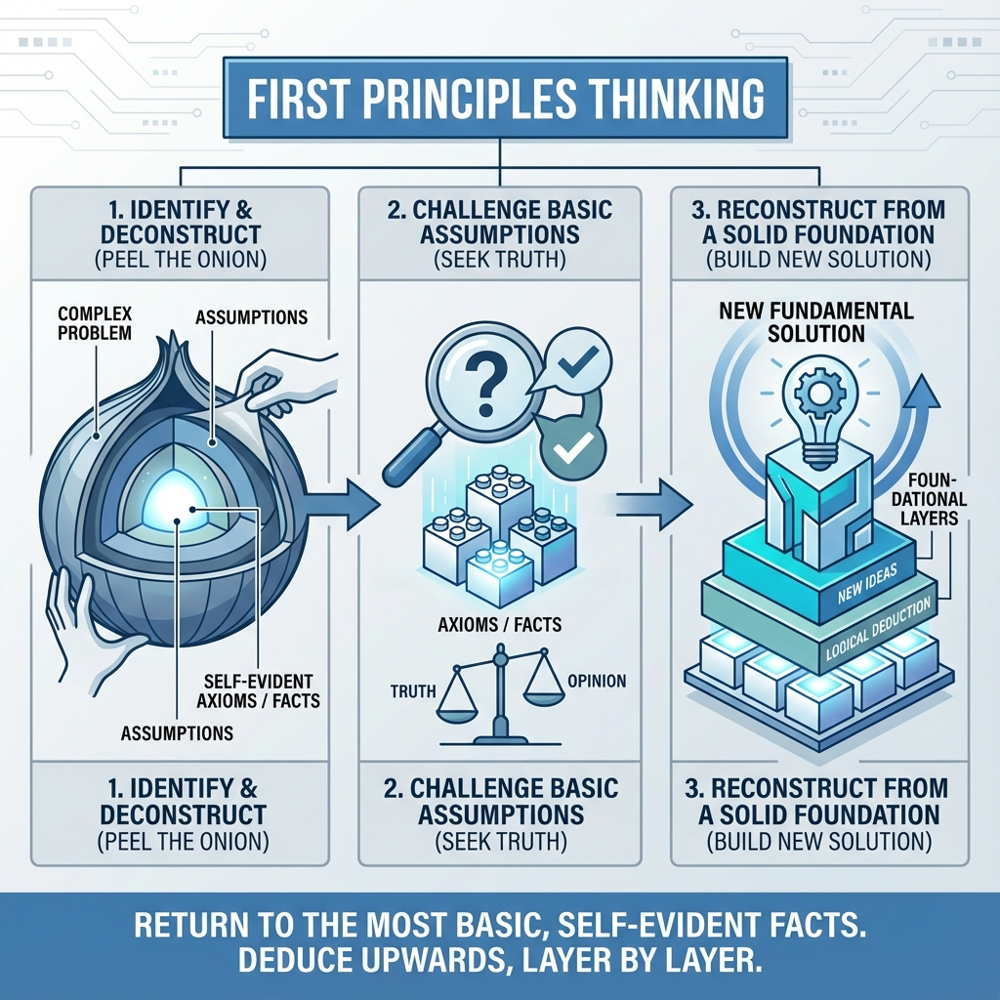
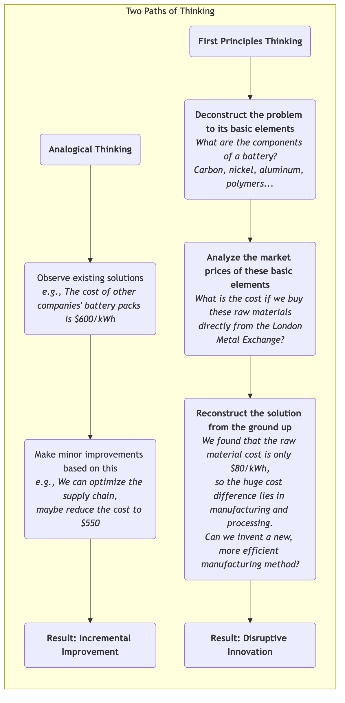

# First Principles Thinking

When facing complex problems or seeking breakthrough innovations, most of us tend to think using **Thinking by Analogy**. We observe what others are doing, or how we've done things in the past, and then make small, incremental improvements based on that. While this approach is often efficient, it can also act as an invisible cage, confining our thinking within existing, proven frameworks, making true disruptive innovation difficult. **First Principles Thinking** offers a contrasting, more penetrating path to thinking.

First principles, a concept originating from physics and philosophy, centers on **returning to the most basic, self-evident axioms or facts of a matter, and from there, logically deducing upwards, layer by layer, until a new, fundamental solution is found**. It's not about adjusting seasonings on an existing "recipe," but rather, like a chef, deconstructing a dish into its most basic molecules and elements (such as protein, fat, acid, sweetness), and then, starting from these foundational elements, creating an unprecedented dish. Elon Musk is the most famous advocate and practitioner of first principles in modern business, having used this thinking to completely disrupt traditional industries like aerospace and automotive.

!!! abstract "Key takeaways"

    - **In one line**: don't ask "how do others do it?"; ask "starting from the basic facts, how should this be done?"
    - **Three steps**: deconstruct the current belief → separate facts from conventions → rebuild using only the facts.
    - **The key distinction**: physical laws, math and verifiable data are facts; "the industry has always done it this way" is convention.
    - **It is expensive**: most everyday decisions are fine with analogy. Save first principles for the few problems worth reinventing.
    - **Common misunderstanding**: it is not just "asking why repeatedly"; after breaking things down you must **rebuild**.

## First Principles vs. Analogical Thinking

The best way to understand first principles is to compare it with analogical thinking, which we are more accustomed to.

*   **Analogical Thinking**:
    *   **Logic**: "Because everyone else does it this way, or we've always done it this way, we should also do it this way, with some minor improvements." 
    *   **Characteristics**: Fast, simple, low-risk, but prone to mental rigidity, leading to "path dependence," and making fundamental breakthroughs difficult.
    *   **Example**: Before the advent of smartphones, mobile phone manufacturers generally innovated by adding camera pixels, changing case colors, or adding some software features to existing keypad phones.

*   **First Principles Thinking**:
    *   **Logic**: "Let's temporarily ignore how others do it. What are the most basic facts we can be certain of regarding this problem? What can we deduce from these facts? What would an ideal solution look like, unconstrained by existing conditions?"
    *   **Characteristics**: Time-consuming, laborious, requires deep insight and strong logical reasoning, but can penetrate superficial complexity to reach the essence of the problem, leading to disruptive innovation.
    *   **Example**: When Apple designed the first iPhone, they didn't try to improve the keypad. Instead, they returned to the first principle of "human-computer interaction"—the most direct and intuitive interaction method is the finger. Based on this, they created a new interaction paradigm based on a large, multi-touch screen.

### Differences in Thinking Styles

<!-- mermaid 源文件：First-Principles-Thinking-Tutorial-en-mermaid-live-1.mmd -->

## How to Practice First Principles Thinking

Practicing first principles can generally follow a three-step "Socratic" questioning process:

1.  **Step One: Identify and Deconstruct Your Current Beliefs or Problems**
    *   **Question**: "For this belief we take for granted (e.g., 'batteries are expensive'), what are its underlying assumptions? Why do we think this way?"
    *   **Action**: Like peeling an onion, peel back the layers of the problem, continuously breaking down a complex problem until you reach the most basic elements or facts that can no longer be decomposed. This process requires you to constantly ask "why," like a curious but persistent child.

2.  **Step Two: Challenge Basic Assumptions, Seek the Truth**
    *   **Question**: "Are these basic elements, which we consider 'facts,' truly facts? Are they truths based on physical laws, or merely long-standing industry practices or others' opinions?"
    *   **Action**: Independently and critically examine and verify each basic element you've decomposed. Seek first-hand data and evidence from different fields, and completely separate facts from opinions.

3.  **Step Three: Reconstruct from a Solid Foundation**
    *   **Question**: "Now that we have a set of verified, solid basic facts, if we forget all past methods and start only from these basic facts, what kind of new, better solution can we build?"
    *   **Action**: This is a creative, logically consistent reconstruction process. You will design your product, process, or strategy from a new, simpler, and more essential starting point.

## Application Cases

**Case One: Elon Musk's SpaceX**

*   **Traditional Belief (Analogical Thinking)**: The cost of manufacturing rockets is extremely high, because historically, rockets from all countries and companies have been so.
*   **First Principles Analysis**:
    1.  **Deconstruction**: Musk asked: "What materials are rockets made of?" The answer: aerospace-grade aluminum alloy, titanium, copper, carbon fiber, etc.
    2.  **Challenge and Truth**: He then analyzed the market prices of these raw materials and found that the raw material cost of a rocket accounted for only about 2% of its total cost.
    3.  **Reconstruction**: He came to a surprising conclusion: the vast majority of a rocket's cost comes from the manufacturing, processing, and cumbersome supply chain links, as well as the "single-use" model. Therefore, SpaceX's core innovation focused on **independently researching and manufacturing most of the rocket's components** and ultimately achieved **rocket recovery and reuse**, reducing launch costs by an order of magnitude.

**Case Two: Charlie Munger's Investment Thinking**

*   **Scenario**: As Warren Buffett's long-time partner, Charlie Munger is a loyal practitioner of first principles.
*   **Application**: When analyzing a company, he doesn't listen to analyst ratings or market hot spots. He returns to the most basic questions: "What is the essence of this company's business model? Is the value it creates for customers sustainable? How deep is its moat?" He builds a "multidisciplinary mental model" composed of basic principles from different disciplines (psychology, economics, history, etc.) to make fundamental, interdisciplinary judgments on an investment target.

**Case Three: Rethinking "Education"**

*   **Traditional Belief (Analogical Thinking)**: Education is simply "teachers lecturing at the front, students listening below," and then testing learning outcomes through exams.
*   **First Principles Analysis**:
    1.  **Deconstruction**: What is the essential purpose of education? It is to enable learners to acquire knowledge, develop skills, and cultivate critical thinking.
    2.  **Challenge and Truth**: Is one-way indoctrination the most efficient way to learn? Not necessarily. Neuroscience tells us that active, problem-based learning integrated with practice is more efficient. Can standardized tests truly measure real ability? Not necessarily.
    3.  **Reconstruction**: Based on these first principles, we can conceive new educational models, such as: Project-Based Learning (PBL), flipped classrooms, and evaluation systems that focus more on process assessment and competency certification.

**Case Four: The Cost of Battery Packs**

*   **Traditional Belief**: In the early days of electric vehicles, the common view was that battery packs were expensive and would stay expensive, so EVs were destined to be a niche luxury.
*   **First Principles Analysis**: Musk has used this example in several interviews. His question: what is a battery made of? Cobalt, nickel, aluminum, carbon, some polymers and a steel can. If you bought those raw materials on commodity markets, what would they cost? The answer was far below what battery packs sold for at the time.
*   **Conclusion**: The high price came mostly from how batteries were made and the scale of production, not from physics. Smarter material choices, cell design and large-scale manufacturing could bring costs down dramatically, and the steep decline in battery prices over the following decade bore this out.

## Advantages and Challenges of First Principles Thinking

**Core Advantages**

*   **Generates Disruptive Innovation**: It is the most powerful thinking tool for breaking away from incremental improvements and achieving fundamental breakthroughs.
*   **Reaches the Essence of the Problem**: It can help you penetrate the superficiality and traditional fog of things, seeing the essence of the problem and its core driving factors.
*   **Builds True Understanding**: Through personal deduction, you will build a much deeper and truly your own understanding of a field than simply "memorizing conclusions."

**Potential Challenges**

*   **Extremely High Cognitive Cost**: Requires a significant investment of time and intellect for in-depth research and logical reasoning, which is very "counter-intuitive."
*   **Requires Broad Knowledge**: Decomposing a problem into its most basic elements often requires interdisciplinary knowledge.
*   **Resistance to Challenging Tradition**: Conclusions derived from first principles often challenge existing industry practices and authoritative views, which may face significant real-world resistance.

## Questions to Ask at Every Step

*   What is this claim based on: data, a physical law, or "everyone thinks so"?
*   What would happen if this assumption were false?
*   How low could this cost / time / limit go? What sets that floor?
*   If we were starting from scratch today, would we still design it this way?
*   Which constraints truly cannot change (physics, law, safety), and which are just history?

## First Principles Breakdown Template

| Level | What to fill in | Example: battery packs are too expensive |
| --- | --- | --- |
| Current belief / practice | What we (or the industry) take for granted | "Battery packs are expensive and won't get much cheaper" |
| Underlying assumptions | The reasons behind the belief, one by one | Prices have always been high; manufacturing is complex |
| Basic components | What the thing is made of at the most basic level | Cobalt, nickel, aluminum, carbon, polymers, steel can |
| Fact or convention | Mark each assumption "fact (verifiable)" or "convention (just how it's been)" | Raw material prices are facts; "always expensive" is convention |
| Value of the basic facts | Use data to find the true value or lower bound | Raw materials cost far less than the pack's selling price |
| Rebuilt solution | Starting only from facts, what is the new approach? | Better material mix and manufacturing process, larger scale |
| Risks to verify | What constraints might the new approach ignore? | Safety, yield, ramp-up of production capacity |

## Common Mistakes

1.  **Breaking down without building up.** Repeatedly asking "why" is only half the job; the value comes from **rebuilding** afterwards. Stopping at "so that's where the problem is" is closer to the [5 Whys](../../Problem Solving & Decision Making/root_cause_analysis/5-Whys-Tutorial-en.md).
2.  **Treating conventions as facts.** "Margins in this industry are 10%" or "users won't pay for this" are often past experience, not laws of nature. Ask of every assumption: fact or convention?
3.  **Not going deep enough.** Breaking a car into "engine, chassis, body" still sits inside the existing design. Keep going until you reach physical, economic or human-need facts.
4.  **Reasoning everything from zero.** First principles thinking is expensive. Analogy is perfectly adequate for most daily decisions; reserve this for the few problems worth reinventing.
5.  **Ignoring real constraints.** Laws, safety requirements and human habits are also basic facts. A solution derived purely from physics that violates them won't work in practice.
6.  **Using it to dismiss all experience.** Experience contains lessons someone already paid for. Use first principles to test whether experience still holds, not to throw it all away.

## Frequently Asked Questions

??? question "Who came up with first principles thinking?"

    The idea goes back to Aristotle, who described first principles as "the first basis from which a thing is known": propositions that cannot be deduced from anything else. Its popularity in modern business owes a lot to Elon Musk's interviews.

??? question "How is first principles thinking different from the 5 Whys?"

    The 5 Whys start from a problem that has already happened and trace the causal chain to find and fix a root cause. First principles thinking starts from a belief or practice, breaks it down to basic facts, and aims to design something better. One finds causes; the other rebuilds.

??? question "How can I use first principles in everyday work?"

    Pick something you think "just is that way", such as "this project needs at least three months" or "this role requires five years of experience". List the assumptions behind it, mark which are facts and which are conventions, then ask: starting only from the facts, what is the best approach?

??? question "Does first principles thinking conflict with systems thinking?"

    No, they complement each other. First principles break a system into its basic parts; systems thinking looks at how those parts interact. When you rebuild a solution, use systems thinking to check its knock-on effects.

??? question "What are famous examples of first principles thinking?"

    Commonly cited examples include SpaceX lowering launch costs by analyzing raw material costs, building most parts in-house and reusing rockets; the EV industry re-examining battery costs; and the first iPhone dropping the physical keyboard because fingers are the most natural input.

## Extension and Connection

*   **[5 Whys](../../Problem Solving & Decision Making/root_cause_analysis/5-Whys-Tutorial-en.md)**: A simple but effective tool for practicing first principles. By continuously asking "why," it can help us delve deeper and approach the root cause of a problem.
*   **[Logic Tree](../../Problem Solving & Decision Making/problem_solving/Logic-Tree-Tutorial-en.md)**: Breaking a big problem down layer by layer using the MECE principle is a practical tool for the "deconstruct" step.
*   **[Feynman Technique](../learning_methods/Feynman-Technique-Tutorial-en.md)**: Explaining a concept in the simplest possible language forces you back to its most basic facts.
*   **Systems Thinking ([Iceberg Model](../systems_thinking/Iceberg-Model-Tutorial-en.md), [System Dynamics](../systems_thinking/System-Dynamics-Tutorial-en.md))**: First principles focus on "deconstructing" a system into its most basic elements; systems thinking, on the other hand, focuses more on how these elements "interconnect and interact." Combining the two can lead to a more comprehensive understanding.

---
*Source Reference: The concept of first principles originated with the ancient Greek philosopher Aristotle, who defined it as "the first basis from which a thing is known." In modern times, physicist Richard Feynman also strongly advocated this way of thinking, which "appeals to basic principles rather than empirical formulas." And Elon Musk's brilliant explanations in numerous interviews have greatly promoted the spread of this thinking in the fields of technology and business.*