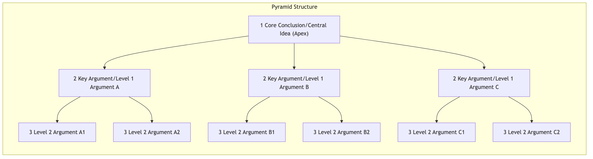
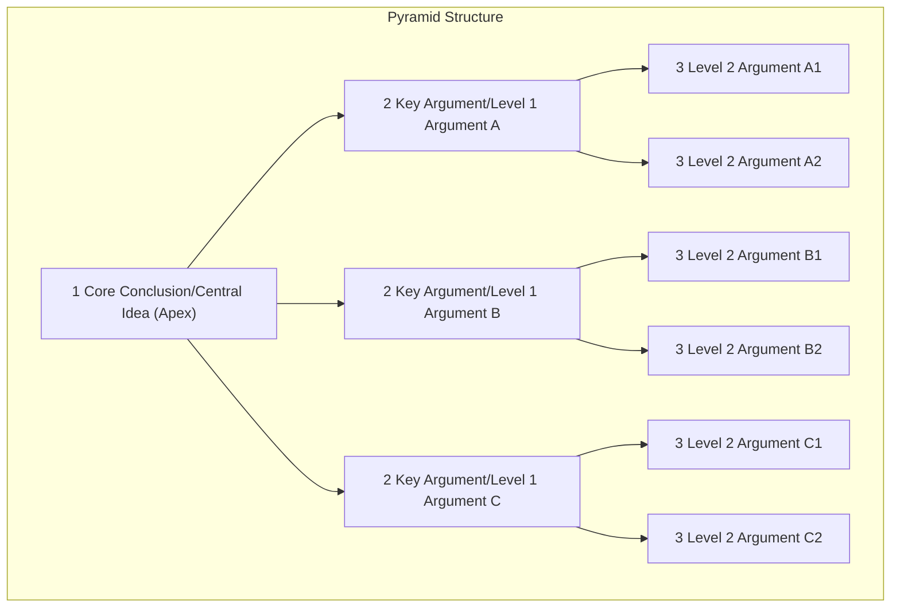

# The Pyramid Principle

In business communication, writing, and presentations, we often encounter a dilemma: we feel we have a lot to say, but the audience is confused and misses the main points. The **Pyramid Principle**, proposed by former McKinsey consultant Barbara Minto, is an extremely powerful set of **structured thinking and expression methods** designed to improve communication efficiency and logical clarity. Its core idea is that any complex argument can be organized into a pyramid structure that is **conclusion-first, top-down, grouped, and logically progressive**, ensuring that your audience can easily, quickly, and accurately understand the core message you want to convey.

The essence of the Pyramid Principle lies in its profound insight into how the human brain processes information: our brains automatically seek logic and structure in the fragmented information they receive. Instead of making your audience struggle to summarize your disorganized arguments, you proactively present your core conclusions and their supporting logical structure clearly from the outset. It is a powerful methodology that transforms your thinking and expression from "making others guess" to "making others understand."

## Four Basic Principles of the Pyramid

Building a clear and solid pyramid structure requires adherence to the following four basic principles:

1.  **Conclusion First**: At the beginning of an article or speech, directly state your most core and overarching central idea (the apex of the pyramid). This immediately captures the audience's attention and provides them with a "master outline" for understanding all subsequent information.

2.  **Main Idea Governs Sub-points**: Any upper-level argument in the pyramid must be the **summary of ideas** for all its lower-level arguments. The lower-level arguments are detailed explanations and support for the upper-level arguments.

3.  **Group and Summarize**: All arguments within the same group (same level) must belong to the same logical category and can be summarized by a single noun that captures their commonality. For example, "Our Three Advantages," "Four Challenges We Face."

4.  **Logical Order**: All arguments within the same group must be arranged in a clear, logical order (e.g., chronological order, structural order, order of importance), not arbitrarily stacked.

### Vertical and Horizontal Structure of the Pyramid

<!--

-->

*   **Vertical Structure**: Represents a "**question-answer**" type of dialogue. The central idea at the apex naturally raises questions from the reader (e.g., "Why is this so?" or "How exactly should this be done?"), and the key arguments in the next level are the answers to these questions.
*   **Horizontal Structure**: Represents the logical relationship between arguments within the same group. This relationship can be **deductive reasoning** (e.g., major premise, minor premise, conclusion) or **inductive reasoning** (e.g., summarizing a common pattern based on multiple cases).

## How to Build a Pyramid

There are two main methods for building a pyramid structure: top-down and bottom-up.

1.  **Top-Down Approach**: This method is suitable when you already have a relatively clear idea and core conclusion about the problem.
    *   **Step One**: Write down the **central idea (apex)** you most want to convey to the other party.
    *   **Step Two**: Imagine what core questions your reader will ask after seeing this central idea.
    *   **Step Three**: Write down direct answers to these core questions. These answers form the second level of your pyramid (key arguments). Ensure these arguments adhere to the MECE principle (Mutually Exclusive, Collectively Exhaustive).
    *   **Step Four**: For each argument in the second level, repeat the "question-answer" process to build the next lower level of arguments, until all arguments are fully supported by sufficient data and facts.

2.  **Bottom-Up Approach**: This method is suitable when you have many scattered ideas, information, and data in your mind, but have not yet formed a clear core conclusion.
    *   **Step One**: **List all points**. Write down all relevant ideas, information, and data in your mind.
    *   **Step Two**: **Find logical relationships and group them**. Examine these scattered points, find their internal logic, and group points belonging to the same category.
    *   **Step Three**: **Summarize and generalize the upper-level arguments**. For each group, summarize a higher-level conclusion that encompasses all points in that group.
    *   **Step Four**: **Repeat the above process until a pyramid is formed**. Continuously regroup and re-summarize the formed arguments, and eventually, you will deduce an overarching central idea at the apex of the pyramid.

## Application Cases

**Case One: A Project Progress Report**

*   **Unclear Expression (No Pyramid Structure)**: "Hello everyone, I'm here to report on the progress of 'Project Alpha.' We completed user interviews last week, and the interview minutes have been sent out. Then, designer Xiao Wang's design draft encountered some review comments and is being revised. Oh, by the way, the backend database interface was also jointly debugged last week. However, we found that the original third-party payment interface has compatibility issues, and we may need to change the solution, which might cause project delays..."
*   **Clear Expression (Pyramid Structure)**:
    *   **(Conclusion First)**: "Hello everyone, regarding 'Project Alpha,' my core conclusion is: **The project is progressing smoothly overall, but the payment module has a risk of delay, and a backup plan needs to be activated immediately.**"
    *   **(Supporting Argument 1: Smooth Progress)**: "First, the core part of the project is progressing smoothly, mainly in three aspects: First, we have completed all user interviews as planned and clarified the requirements; second, the backend database interface has been jointly debugged; third, the design draft of the core functions is nearing finalization."
    *   **(Supporting Argument 2: Risk Identified)**: "Second, we have identified a key risk that may cause delays: the original third-party payment interface was found to have serious compatibility issues during testing."
    *   **(Supporting Argument 3: Proposed Solution)**: "Therefore, I recommend immediate action: on one hand, the technical lead should complete the research on payment interface B within this week; on the other hand, the project manager should re-evaluate the scheduling impact that this may bring."

**Case Two: Writing a Market Analysis Report**

*   **Central Idea (Apex)**: Recommend the company to enter the online education market in Southeast Asia.
*   **Key Arguments (Second Level)**:
    1.  Huge market potential: The region has a large young population and growing educational demand.
    2.  Manageable competitive landscape: There are currently no absolute monopolists, presenting market opportunities.
    3.  Aligns with company strategy: Highly consistent with the company's long-term strategy of "globalization" and "digitalization."
*   **Supporting Arguments (Third Level)**: Under each key argument, use specific data (e.g., population growth rate, market size forecast, market share of major competitors, etc.) for detailed support.

**Case Three: Preparing for a "Self-Introduction" in a Job Interview**

*   **Central Idea (Apex)**: "I believe I am the ideal candidate for this 'Product Manager' position because my abilities and experience highly match the job requirements."
*   **Key Arguments (Second Level)**:
    1.  **Understands Users**: I have independently led user research projects and can deeply understand user needs.
    2.  **Collaborates Well**: I have successfully coordinated design, R&D, and marketing teams as a core member of a project to launch an app.
    3.  **Delivers Results**: The product features I was responsible for increased core user retention by 20% within three months of launch.

## Advantages and Challenges of the Pyramid Principle

**Core Advantages**

*   **Greatly improves communication efficiency**: "Conclusion first" allows the audience to grasp your core idea immediately, significantly reducing their comprehension cost.
*   **Forces thinking, deepens logic**: The process of building a pyramid itself is a powerful process that forces you to structure and logically deepen vague, fragmented thoughts.
*   **Easy to remember and disseminate**: Structured information is much easier for the brain to remember and understand than a pile of disorganized information.

**Potential Challenges**

*   **"Think before you write" mindset shift**: For those accustomed to "writing as they think," transitioning to a "structure first, then write" mode requires deliberate practice and adaptation.
*   **High demands on summarization ability**: Accurately summarizing the core idea of a group of arguments requires strong abstraction and inductive reasoning skills.
*   **Not applicable to all scenarios**: In situations requiring suspense or exploratory, divergent discussions, strict "conclusion first" may not be entirely suitable.

## Extension and Connection

*   **MECE Principle**: The guiding core of "grouping and summarizing" in the Pyramid Principle. Ensuring that elements at the same level are "mutually exclusive and collectively exhaustive" is fundamental to building a solid pyramid.
*   **Mind Mapping**: Can be an excellent tool for practicing the "bottom-up approach" of the Pyramid Principle. You can first brainstorm freely with a mind map, and then organize it into an ordered pyramid structure.

---
*Source Reference: Barbara Minto's book "The Pyramid Principle: Logic in Writing and Thinking" is the sole and most authoritative source for this method. This book is a must-read classic for new employees at top consulting firms like McKinsey and Boston Consulting, and is hailed as the "bible" of business communication and writing.*