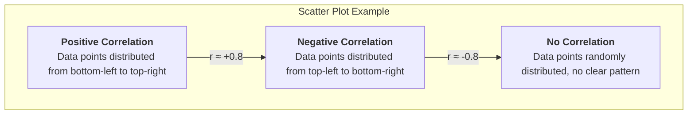

# Correlational Research

In the journey of scientific exploration, we not only want to know "what things are like" (descriptive research) but also eagerly desire to understand how things are interconnected. **Correlational Research** is precisely such a research paradigm that aims to explore whether there is a **relationship** between two or more variables, as well as its **strength** and **direction**. The core question it answers is: "When A changes, does B also systematically change?"

Correlational research is a non-experimental quantitative research method. Researchers do not manipulate any variables as they would in an experiment, but merely measure existing variables and then use statistical techniques to analyze the relationships between them. For example, a researcher might measure a group of students' "daily study hours" and their "exam scores," to explore whether there is a relationship between the two. This type of research in psychology, sociology, education, and market research and many other fields play a crucial role.

## Understanding the Core Concepts of Correlation

To understand correlational research, several core concepts must be grasped:

*   **Correlation**: Refers to the tendency of two or more variables to change together. When the value of one variable changes, the value of another variable also tends to change in a predictable way.
*   **Correlation Coefficient**: This is a statistical value between -1.0 and +1.0 (usually denoted by *r*) used to quantify the strength and direction of the correlation.
    *   **Direction**:
        *   **Positive Correlation**: *r* > 0. Two variables change in the same direction. One increases, and the other also tends to increase. For example, height and weight.
        *   **Negative Correlation**: *r* < 0. Two variables change in opposite directions. One increases, and the other tends to decrease. For example, the price of a commodity and its demand.
    *   **Strength**:
        *   The closer the absolute value of the correlation coefficient is to 1, the stronger the relationship. *r* = +1.0 or -1.0 indicates a perfect linear correlation.
        *   The closer the correlation coefficient is to 0, the weaker the relationship. *r* = 0 indicates no linear relationship between the two variables.

### Visualizing Correlation: Scatter Plot

A scatter plot is the best tool for visualizing the relationship between two variables. By observing the distribution pattern of data points on the graph, we can intuitively determine the direction and strength of the correlation.

<!--

<!--

<!--

-->

## "Correlation Does Not Imply Causation": The Most Crucial Warning

This is the golden rule that must be kept in mind when understanding correlational research. Even if we find a strong correlation between two variables, we **absolutely cannot** conclude from this alone that one variable "causes" the other to change. There are two main reasons behind this:

1.  **Third-Variable Problem**: There may be an unmeasured, hidden third variable that simultaneously influences the two variables we observe, thereby creating a spurious association. A classic example: studies find a strong positive correlation between ice cream sales and drowning deaths. But we cannot say that eating ice cream causes drowning. The true third variable is "hot weather," which makes people want to eat ice cream and go swimming, thus simultaneously increasing both.

2.  **Directionality Problem**: Even if there is indeed a causal relationship between two variables, correlational research cannot tell us which is the cause and which is the effect. For example, studies find a positive correlation between self-esteem and academic achievement. But does high self-esteem lead to high academic achievement, or does excellent academic achievement boost students' self-esteem? Correlational research cannot answer this question.

## How to Conduct a Correlational Study

1.  **Define Research Questions and Variables**
    Clearly define which two (or more) variables you want to explore the relationship between. For example: "Is there a relationship between employee job satisfaction and their job performance?"

2.  **Operationalize and Measure Variables**
    Design specific measurement methods for each variable. For example, use a well-established "job satisfaction scale" to measure satisfaction, and "annual performance appraisal scores" to measure performance.

3.  **Sampling and Data Collection**
    Select a representative sample from the target population and measure all relevant variables for each individual in the sample simultaneously.

4.  **Data Analysis and Interpretation**
    Use statistical software to calculate the correlation coefficient between variables (e.g., Pearson correlation coefficient) and draw scatter plots. Based on the value of the correlation coefficient and the significance level, determine whether there is a statistically significant correlation between the variables, and describe its direction and strength.

5.  **Draw Conclusions Cautiously**
    When reporting results, the wording must be extremely cautious, stating only that "A is associated with B," and never that "A causes B." At the same time, actively explore possible third variables and different directional explanations.

## Application Cases

**Case 1: Educational Psychology Research**

*   **Scenario**: An educational researcher wants to know if students' homework completion rates are related to their final exam scores.
*   **Application**: He collected the homework completion rates (percentage) for all students in a class throughout the semester and their final exam scores. By calculating the correlation coefficient, he found a moderate positive correlation (*r* = +0.55) between the two. He can conclude that students with higher homework completion rates **tend to** have higher final exam scores. But he cannot say that completing homework itself "causes" high scores (perhaps "learning motivation" is a third variable that influences both).

**Case 2: Public Health Research**

*   **Scenario**: Epidemiologists want to study the relationship between smoking and lung cancer.
*   **Application**: Since it is impossible to study this problem through experiments (i.e., forcing a group of people to smoke), they used large-scale correlational research. By investigating the smoking habits (number of cigarettes smoked per day) and their health status over the next few decades, researchers found an extremely strong positive correlation between the two. Although this alone cannot 100% establish causality, combined with other evidence such as biology, it provides extremely strong support for the causal chain between the two.

**Case 3: Marketing Analysis**

*   **Scenario**: A company wants to know if there is a relationship between its social media advertising expenditure and product sales.
*   **Application**: The company analyzed data from the past 24 months, with one variable being monthly advertising expenditure and the other being online sales for that month. They found a strong positive correlation between the two. This indicates that months with higher advertising expenditure also had higher sales. This finding can provide a reference for future budget allocation, but it is also necessary to be wary of third variables (e.g., seasonal promotions might simultaneously boost both advertising expenditure and sales).

## Advantages and Limitations of Correlational Research

**Core Advantages**

*   **Predictive Value**: When two variables are strongly correlated, we can use the value of one variable to predict the value of the other.
*   **Studies Variables That Cannot Be Manipulated**: For variables that cannot be manipulated through experiments due to ethical or practical reasons (e.g., personality traits, family background, diseases), correlational research is the only feasible method of inquiry.
*   **Exploratory**: Can serve as preliminary exploration for experimental research, helping researchers identify potential causal relationships worthy of further in-depth study.

**Potential Limitations**

*   **Cannot Establish Causality**: This is its most fundamental and core limitation.
*   **Easily Misinterpreted**: Media and the public often mistakenly interpret correlation as causation, leading to misinformation.
*   **Only Reveals Linear Relationships**: Standard correlation coefficients can only measure linear relationships. If there is a nonlinear relationship between two variables (e.g., a U-shaped curve), the correlation coefficient may be very low, thereby masking the true strong association between them.

## Extensions and Connections

*   **Descriptive Research**: The basis of correlational research; we must first be able to describe variables before we can study the relationships between them.
*   **Experimental Research**: Once correlational research finds an interesting association, rigorous experimental research can be used to test whether there is a causal mechanism behind it.
*   **Regression Analysis**: An extension and upgrade of correlational research. When there are multiple independent variables, regression analysis can not only reveal their relationship with the dependent variable but also analyze the relative importance or unique predictive power of each independent variable.

---
*Source Reference: The statistical foundation of correlational research was laid by Francis Galton and Karl Pearson, and the Pearson correlation coefficient remains one of the most widely used statistical indicators today. Any basic textbook on psychological or social science research methods will have a detailed discussion of correlational research and its distinction from causality.*