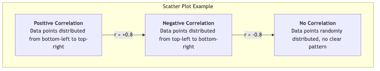

# Descriptive Research

In the landscape of scientific inquiry, if experimental research aims to answer "why," then **descriptive research** focuses on answering a more fundamental but equally important question: "**What is it?**" It is a non-invasive research paradigm whose core objective is to systematically and accurately observe and portray the characteristics of a specific group, phenomenon, or situation, without any intervention or manipulation. It provides us with a "snapshot" or "portrait" of a certain aspect of the world.

Descriptive research is the starting point for many scientific explorations. Before we can explain a phenomenon, we first need to clearly understand what it looks like. From describing the demographic structure of a country in a census, to understanding the consumption habits of target customers in market research, to recording the social behavior of a species in animal ethology, descriptive research provides us with fundamental facts and data to build our understanding of the world.

## Core Purposes and Methods of Descriptive Research

The main purpose of descriptive research is not to test causal relationships, but to focus on the following points:

*   **Characterization**: Portraying various characteristics of the research subject. For example, the average age, gender ratio, and average GPA of students in a class.
*   **Frequency Statistics**: Calculating the frequency of a certain behavior or event. For example, the crime rate in an area, or the approval rating of a candidate among voters.
*   **Classification**: Classifying research subjects according to specific criteria. For example, classifying users into "novice users," "regular users," and "expert users."
*   **Trend Identification**: By conducting descriptive research at different points in time, changing trends can be identified. For example, tracking changes in smartphone usage over the past decade.

To achieve these purposes, descriptive research primarily employs the following three data collection methods:



<!--
```mermaid
graph TD
    A(Descriptive Research) --> B(Core Objective: Answer "What is it?");
    B --> B1(Portray Characteristics);
    B --> B2(Statistical Frequency);
    B --> B3(Perform Classification);

    A --> C(Main Data Collection Methods);
    C --> C1(<b>Observation Method</b><br/>Systematically observe and record behavior<br/>in natural or laboratory settings);
    C --> C2(<b>Survey Method</b><br/>Collect information from a sample group<br/>through questionnaires or interviews);
    C --> C3(<b>Case Study</b><br/>In-depth, comprehensive description<br/>of a single or a few instances);
```
-->

## How to Conduct a Descriptive Study

1.  **Clearly Define the Research Question**
    First, clarify "what" you want to describe. The question must be clear and specific. For example, from "I want to study college students' social media usage" refine to "What is the average daily social media usage time, most frequently used platforms, and main motivations for using social media among undergraduate students at a certain university?"

2.  **Determine Research Subjects and Sampling**
    Define your research population (e.g., "all enrolled undergraduate students at a certain university"). Since studying the entire population often is not realistic, you need to use appropriate sampling methods (e.g., stratified random sampling to ensure representation across grades and majors) to select a sample.

3.  **Select and Design Data Collection Tools**
    Based on your research question, choose the most appropriate method.
    *   If choosing the **survey method**, you need to design a questionnaire with a clear structure and unambiguous questions.
    *   If choosing the **observation method**, you need to develop a detailed observation checklist, clearly stating what behaviors to record and how to record them.
    *   If choosing a **case study**, you need to determine the interview outline, documents to collect, etc.

4.  **Collect Data**
    Systematically collect data according to the established plan. Ensure consistency and accuracy during the process, minimizing errors.

5.  **Analyze Data and Present Results**
    Organize and analyze the collected data. This usually involves calculating descriptive statistics, such as:
    *   **Measures of Central Tendency**: Mean, median, mode.
    *   **Measures of Dispersion**: Standard deviation, variance, range.
    *   **Frequency Distribution**: Percentages, frequency tables.
    Finally, present the research findings clearly and intuitively using charts (e.g., bar charts, pie charts, line charts) and text.

## Application Cases

**Case 1: National Population Census**

*   **Scenario**: A country needs to comprehensively understand the basic situation of its population for social and economic planning.
*   **Application**: By distributing questionnaires to every household nationwide, a large amount of data on household members' age, gender, education level, occupation, income, etc., is collected. The final census bulletin is a descriptive research report on the country's population status. It tells us "what the country is like," such as the degree of aging, urban-rural population ratio, etc.

**Case 2: User Persona Construction in Market Research**

*   **Scenario**: A sports brand wants to gain a deeper understanding of its core consumer group.
*   **Application**: The company sent a detailed online questionnaire to ten thousand users in its membership database, covering their exercise habits, lifestyles, consumption preferences, media consumption habits, etc. By analyzing the collected data, they portrayed several core user personas, such as "a 25-year-old urban fitness enthusiast who goes to the gym 3 times a week and values the professionalism and appearance of equipment." This descriptive report provided clear targets for subsequent product design and marketing strategies.

**Case 3: Jane Goodall's Research on Chimpanzees**

*   **Scenario**: Famous primatologist Jane Goodall wanted to understand the social behavior of wild chimpanzees.
*   **Application**: She spent decades conducting continuous, systematic **natural observation** in Gombe Stream National Park, Tanzania. She meticulously recorded chimpanzee behaviors such as diet, social interactions, and tool use. Her research is a classic descriptive study; it did not manipulate any variables but painted an unprecedented picture of the real lives of chimpanzees, fundamentally changing our understanding of this species.

## Advantages and Limitations of Descriptive Research

**Core Advantages**

*   **Provides Basic Understanding**: Provides necessary foundation and background information for further research (e.g., correlational or experimental research).
*   **Natural and Authentic**: Usually conducted in natural settings, it can capture real, undisturbed phenomena.
*   **Wide Applicability**: Widely used in many fields such as social sciences, market research, and public health, and the methods are relatively easy to implement.

**Potential Limitations**

*   **Cannot Infer Causality**: This is its most fundamental limitation. It can only tell you "what is," but not "why it is." For example, you can describe that lung cancer incidence is higher among smokers, but you cannot conclude from this alone that smoking "causes" lung cancer.
*   **Observer Bias**: In observational methods, the researcher's presence or subjective expectations may influence the behavior of the observed.
*   **Sample Representativeness Issues**: If sampling is improper, the research results will not accurately reflect the true situation of the population.

## Extensions and Connections

*   **Correlational Research**: Descriptive research is the basis of correlational research. After describing the two variables (e.g., "study time" and "exam scores") respectively, correlational research will further explore whether there is a relationship between them.
*   **Case Study in Qualitative Research**: Case study is both a descriptive research method and an important qualitative research method, emphasizing an in-depth, holistic description of a single case.

---
*Source Reference: Descriptive research, as a basic research paradigm, its methodology is found in various textbooks on research methods in social and behavioral sciences. Kenneth D. Bailey's "Methods of Social Research" provides a classic discussion on this.*