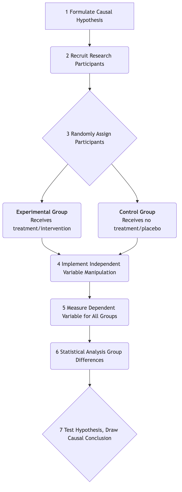
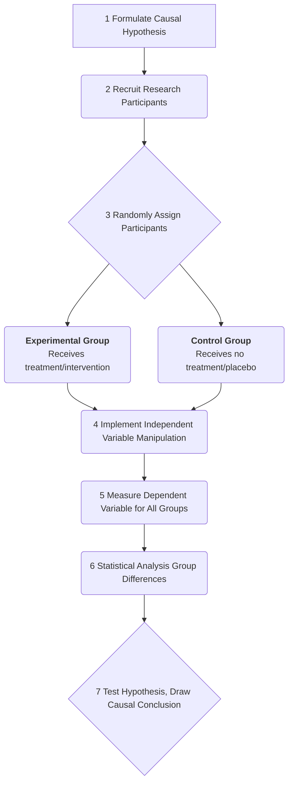

# Experimental Research

Among all scientific inquiry methods, **Experimental Research** is the gold standard closest to revealing the **Causality** of things. It does not simply observe the world, but actively and systematically intervenes in the world to verify whether a change in one factor "causes" a change in another. When you want to definitively answer questions like "Is it because of A that B occurred?", experimental research provides the most rigorous and powerful logical framework.

Its core idea lies in **control**. Researchers precisely manipulate one or more **Independent Variables** in a highly controlled environment and observe the measurable effects of this manipulation on **Dependent Variables**, while strictly controlling or randomizing all other irrelevant variables that might have an influence. It is this precise control and manipulation of variables that enables experimental research to go beyond "correlation" and draw "causal" conclusions.

## Core Elements of Experimental Research

A standardized experimental study must include the following core components, which together form its rigorous logical chain.

*   **Hypothesis**: A testable statement about the causal relationship between independent and dependent variables. For example, "Caffeine intake (independent variable) can improve participants' scores (dependent variable) in a memory test."
*   **Manipulation**: Researchers must actively change the level of the independent variable. For example, giving one group of participants caffeine pills, and another group a placebo without caffeine.
*   **Control**: This is the essence of the experiment. Researchers must eliminate or keep consistent all other factors that might affect the dependent variable (i.e., **confounding variables**) as much as possible. The most crucial control method is **random assignment** of participants to different experimental groups.
*   **Experimental Group vs. Control Group**:
    *   **Experimental Group**: The group that receives the manipulation of the independent variable (i.e., "treatment" or "intervention").
    *   **Control Group**: The group that does not receive the treatment, or receives a "zero treatment" (e.g., a placebo). The presence of a control group provides a baseline for comparison; without it, we cannot determine whether the observed changes are truly caused by the independent variable.

### True Experimental Design Flowchart

<!--

--> 

## How to Design and Conduct an Experiment

1.  **Formulate Causal Hypothesis**
    Based on theory or observation, clearly define the causal relationship you want to test. For example, "Can learning with a new teaching app (independent variable) more effectively improve students' test scores (dependent variable) than traditional teaching methods?"

2.  **Operationalize Variables**
    Translate abstract variables into concrete, measurable operations. For example, "using the new teaching app" is specifically defined as "daily use of the app for 30 minutes of interactive learning"; "test scores" are defined as "scores on a standardized final exam."

3.  **Recruit and Randomly Assign Participants**
    Recruit a group of eligible participants (e.g., "students of a certain grade"), then randomly assign them to the experimental group and control group using methods like coin flips or random number tables.

4.  **Implement Intervention**
    Students in the experimental group learn using the new teaching app as prescribed. Students in the control group continue to use traditional learning methods (e.g., reading textbooks). Ensure that the two groups are as consistent as possible in other conditions (e.g., total study time, teachers, etc.).

5.  **Measure Results**
    After the experimental period (e.g., one semester), administer a standardized test to all participants and record their scores.

6.  **Analyze Data**
    Use statistical tools (e.g., t-test or ANOVA) to compare whether there is a statistically significant difference in the average scores between the experimental and control groups. If the experimental group's average score is significantly higher than the control group's, you can conclude with a certain confidence level that the new teaching app "caused" the improvement in scores.

## Application Cases

**Case 1: Testing User Experience of Web Design**

*   **Scenario**: A web designer believes that moving the registration button from the top to the bottom of the page can reduce user distraction, thereby increasing article reading completion rates.
*   **Experiment**: Randomly divide 10,000 new visitors into two groups. Group A sees the old web page with the button at the top, and Group B sees the new web page with the button at the bottom. By analyzing backend data, the designer found that Group B users had significantly higher average page scroll depth and reading completion rates than Group A. This confirmed his causal hypothesis.

**Case 2: Testing Fertilizer Effectiveness in Agriculture**

*   **Scenario**: An agronomist developed a new environmentally friendly fertilizer, claiming it can increase wheat yield.
*   **Experiment**: He selected a homogeneous experimental field and divided it into 20 small plots. Randomly selected 10 plots to apply the new fertilizer (experimental group), and the other 10 plots to apply an equal amount of traditional fertilizer (control group). At harvest time, he measured the wheat yield of each plot. By comparing the average yields of the two groups, he could scientifically determine the effect of the new fertilizer.

**Case 3: The "Marshmallow Experiment" in Psychology**

*   **Scenario**: Psychologist Walter Mischel wanted to study the effect of children's ability to delay gratification (independent variable) on their future success (dependent variable).
*   **Experiment**: He offered children a choice: eat one marshmallow immediately, or wait 15 minutes and get two. This is a classic quasi-experimental design. He tracked these children for decades, and found that children who could wait longer generally performed better in future academic achievement, career development, and other aspects. This experiment revealed a profound causal link between self-control and long-term success.

## Advantages and Limitations of Experimental Research

**Core Advantages**

*   **Strong Causal Inference Capability**: Among all research methods, it is the most effective in establishing causal relationships between variables.
*   **High Reproducibility**: Standardized procedures and precise control over variables make experiments easy to be replicated and verified by other researchers.
*   **Precision**: Can precisely measure the magnitude of the independent variable's effect on the dependent variable.

**Potential Limitations**

*   **External Validity Issues**: The highly controlled environment in the laboratory may be far removed from the complex, dynamic real world, making it difficult to generalize experimental conclusions to real-world scenarios (i.e., low "ecological validity").
*   **Ethical Constraints**: Many research questions (e.g., studying the impact of abuse on child development) are absolutely prohibited from using experimental methods due to ethical considerations.
*   **Difficult to Implement and High Cost**: Designing and executing rigorous experimental research usually requires significant resources, time, and expertise.
*   **Hawthorne Effect**: Participants may change their natural behavior patterns because they are aware of being studied, thereby affecting the experimental results.

## Extensions and Connections

*   **Quasi-Experimental Research**: When complete random assignment is not possible (e.g., studying differences between students in two different classes), researchers use quasi-experimental designs. It still involves manipulation and control, but the strength of causal inference is weaker than true experiments.
*   **Correlational Research**: When experiments cannot be conducted, correlational research can be an alternative to find associations between variables, but it cannot draw causal conclusions.

---
*Source Reference: The philosophical foundations of experimental methods were laid by philosophers such as David Hume and John Stuart Mill. Donald T. Campbell and Julian C. Stanley's "Experimental and Quasi-Experimental Designs for Research" is a landmark work in this field.*