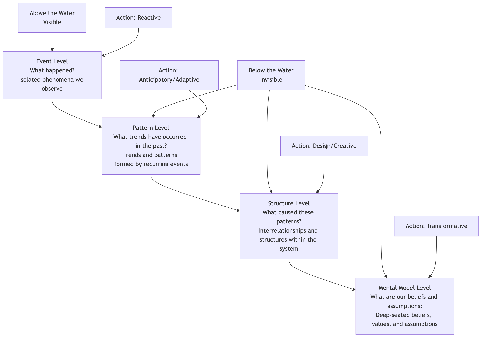

# The Iceberg Model

In daily work and life, our focus is often on the obvious, sudden "**events**": a server crash, a sudden loss of a customer, a sudden drop in sales. We are accustomed to dealing with these events quickly and reactively. However, systems thinking tells us that any isolated event is rarely truly isolated. It is merely the smallest tip of a huge iceberg floating above the water. The **Iceberg Model** is such a powerful and intuitive **systems thinking framework** that aims to guide us to penetrate the surface of events and explore deeper levels of **patterns, structures, and mental models** beneath the surface.

The core idea of the Iceberg Model is that to fundamentally solve problems and achieve lasting change, we must gradually deepen our thinking from the "**reactive**" event level to the "**adaptive**" pattern level, the "**creative**" structure level, and finally the "**transformative**" mental model level. It provides a layered thinking path from "treating the symptoms" to "treating the root cause," helping us understand why problems recur and find intervention points that can produce higher leverage.

## The Four Levels of the Iceberg Model

The Iceberg Model divides our understanding of reality into four levels, from shallow to deep.



<!--
```mermaid
graph TD
    subgraph The Iceberg Model
        direction TB
        A(<b>Event Level</b><br/><i>What happened?</i><br/>Isolated phenomena we observe) -- Deepen Thinking --> B(<b>Pattern Level</b><br/><i>What trends have occurred in the past?</i><br/>Trends and patterns formed by recurring events);
        B -- Deepen Thinking --> C(<b>Structure Level</b><br/><i>What caused these patterns?</i><br/>Interrelationships and structures within the system that cause patterns to appear);
        C -- Deepen Thinking --> D(<b>Mental Model Level</b><br/><i>What are our beliefs and assumptions about this?</i><br/>Deep-seated beliefs, values, and assumptions that support the operation of the entire system structure);

        subgraph Above the Water (Visible)
            A
        end
        subgraph Below the Water (Invisible)
            B
            C
            D
        end

        note right of A: <b>Action: Reactive</b>
        note right of B: <b>Action: Anticipatory/Adaptive</b>
        note right of C: <b>Action: Design/Creative</b>
        note right of D: <b>Action: Transformative</b>
    end
```
-->

1.  **The Event Level**
    *   **Description**: This is the most visible part above the water. It refers to the isolated, specific occurrences we encounter every day.
    *   **Question**: "What happened?"
    *   **Response**: **Reactive**. For example, when a customer complains, we apologize and compensate. This response only solves the immediate problem, but the problem will soon reappear.

2.  **The Pattern Level**
    *   **Description**: Extending the time dimension, we find that many events are not accidental but recur, forming a trend or pattern.
    *   **Question**: "Has this happened before?" "What has been the trend of this change over a period of time?"
    *   **Response**: **Adaptive or Anticipatory**. For example, we find that "customer complaints peak at the end of each quarter" (pattern), so we can increase customer service staff in advance to cope (adaptive). This is more sophisticated than simply reacting to events, but it still does not touch the root.

3.  **The Structure Level**
    *   **Description**: What causes this pattern to recur? This level focuses on the **physical, organizational, and regulatory interrelationships** between the various components within the system.
    *   **Question**: "What kind of system structure causes this pattern to emerge?" "How do variables interact? What feedback loops exist?"
    *   **Response**: **Design or Creative**. For example, we further analyze and find that the structural reason for the quarterly complaint peak is that "the company's sales appraisal system leads sales personnel to focus on performance at the end of the quarter, resulting in over-promising and subsequent customer complaints." To solve this problem, it is necessary to **redesign** the sales appraisal and incentive system (changing the system structure). This is a high-leverage solution.

4.  **The Mental Model Level**
    *   **Description**: This is the deepest and most difficult to perceive part of the iceberg. It refers to the **deep-seated beliefs, values, and assumptions** that support the existence of the entire system structure.
    *   **Question**: "What deep-seated beliefs do we have about 'how the world should work' that led us to design such a system structure?"
    *   **Response**: **Transformative**. For example, in the above case, the "performance-driven" appraisal system might be supported by a deeper mental model, namely that "the company believes that short-term, quantifiable financial indicators are the sole measure of success." To achieve the most fundamental change, it is necessary to challenge and transform this mental model and establish a more long-term, customer-centric value. Although this is the most difficult, once successful, its impact is also the most profound.

## How to Apply the Iceberg Model for Thinking

Applying the Iceberg Model is a process of continuously asking deeper questions and deepening thinking.

1.  **Start with a specific "event"**: Choose a recurring, thorny problem you are currently facing.
2.  **Ask about "patterns"**: Ask yourself, "Is this event happening for the first time? In the past, has it shown any trend or regularity?" Try to use charts to depict this pattern.
3.  **Explore "structures"**: Ask yourself, "What kind of system structure inevitably leads to this pattern?" Try to draw a causal loop diagram of the key elements in the system and their interrelationships, identifying reinforcing and balancing loops.
4.  **Reflect on "mental models"**: Ask yourself, "What deep-seated, perhaps never-discussed assumptions or beliefs do our team/organization/individuals have that make us think the current system structure is 'taken for granted'?"
5.  **Find high-leverage intervention points**: After gaining a deep understanding of the four levels, consider at which level we should intervene to produce the most lasting and fundamental effect. Generally, the deeper the level of intervention, the greater its leverage.

## Application Cases

**Case 1: Personal Recurring "Procrastination"**

*   **Event**: Today, I again finished my work report at the last minute.
*   **Pattern**: I find that I habitually procrastinate on almost every important, challenging task.
*   **Structure**: What structure causes procrastination? It could be: 1. My "perfectionism" demands for tasks, leading to a delay in starting (reinforcing loop: the more I pursue perfection, the more I fear starting, the more I procrastinate, the less time I have, the more anxious I become, the more I pursue one-time perfection). 2. Lack of a mechanism to break down large tasks into small steps.
*   **Mental Model**: I might have a deep-seated belief: "My self-worth is entirely equivalent to whether my work results are perfect." Or "If I fail, it proves I'm incompetent."
*   **High-Leverage Solution**: The real solution may not be to learn a new time management "skill" (event level), but to challenge and transform the unhealthy **mental model** about "perfectionism" and "failure" (transformative level).

**Case 2: Recurrence of Poverty in a Country**

*   **Event**: A batch of relief supplies was distributed to a poverty-stricken area.
*   **Pattern**: We found that long-term, purely material aid did not seem to change the poverty situation in the area; instead, it might have exacerbated the local community's dependence.
*   **Structure**: What is the system structure that causes poverty? It may include: lack of educational resources, backward transportation infrastructure, lack of local employment opportunities, unfair trade policies, etc.
*   **Mental Model**: External aid providers might hold a mental model of "we are saviors, they are helpless recipients," while the local community might have developed a dependent mental model of "waiting for external aid."
*   **High-Leverage Solution**: The highest leverage solution is to change this system **structure** (e.g., investing in local education and infrastructure, creating sustainable industries) and transform both parties' **mental models** (e.g., through "participatory development" projects, transforming the local community from "recipients" to "development partners").

**Case 3: Inefficient Company Meetings**

*   **Event**: Today's weekly meeting lasted 3 hours again, and no conclusions were reached.
*   **Pattern**: Almost all our meetings are overdue, off-topic, and indecisive.
*   **Structure**: What structure causes this pattern? It could be: 1. No clear agenda and objectives before the meeting. 2. The meeting lacks a strong facilitator to control the process. 3. The "top leader" always expresses decisive opinions only at the end of the meeting, making previous discussions largely meaningless.
*   **Mental Model**: There might be an underlying belief that "meetings are just for the boss to see everyone is busy," or an organizational culture where "it's unsafe to express dissenting opinions in meetings."
*   **High-Leverage Solution**: At the structural level, meeting rules such as "distribute agenda before meeting, follow time during meeting, and have minutes after meeting" can be introduced and strictly enforced. At the mental model level, leaders need to take the lead in creating a meeting culture that encourages frankness and efficient decision-making.

## Value of the Iceberg Model

*   **Deepen Thinking, Beyond the Surface**: Provides a simple yet powerful framework to help us shift from event-based thinking ("seeing only trees") to systemic thinking ("seeing the forest").
*   **Identify Root Causes**: Guides us to find deeper structural and conceptual reasons that cause problems to recur.
*   **Discover High-Leverage Solutions**: Helps us identify those intervention points that can "move a thousand pounds with four ounces," truly bringing lasting change, and avoiding wasting energy on repetitive work that treats symptoms but not the root cause.

## Extensions and Connections

*   **System Dynamics**: The Iceberg Model is a prelude and simplified version of learning and applying system dynamics. After identifying key feedback loops at the "structure level," system dynamics modeling tools can be used for more refined, quantitative simulation and analysis.
*   **5 Whys**: A simple tool that can be used for "drilling down" in the Iceberg Model. By continuously asking "Why?", it can help us gradually explore from the event level to the structure level.

---
*Source Reference: The Iceberg Model is a widely used teaching and thinking tool in the field of systems thinking. Its ideas are rooted in system dynamics and have been promoted and popularized by thinkers such as Peter Senge and Dennis Sherwood. It has become a basic introductory framework for learning organizations and systems thinking practitioners.*