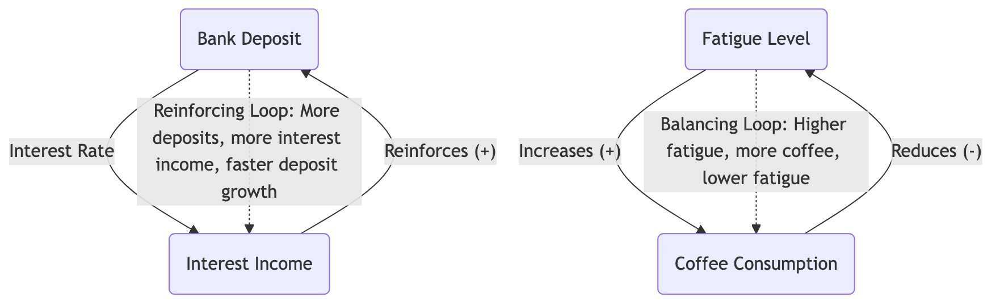

# System Dynamics

When faced with complex problems, we tend to analyze them with linear, cause-and-effect chain thinking: A leads to B, and B leads to C. However, in real business, social, and ecological systems, the interactions between things are far more complex. A small change can, after a series of delays and amplifications, trigger an unexpected "butterfly effect" at the other end of the system. **System Dynamics** is an interdisciplinary field and modeling method designed to understand and analyze such **complex system dynamic behaviors**.

It was founded by Professor Jay W. Forrester of MIT in the 1950s. Its core idea is that a system's behavior patterns are primarily determined by its internal **feedback loops**, **time delays**, and **nonlinear relationships**, rather than external events. System Dynamics builds computer simulation models to simulate and experiment with these complex interactions, helping us understand why systems exhibit certain specific behaviors (such as exponential growth, oscillation, collapse) and find "high-leverage points" that can effectively intervene in the system to achieve desired outcomes.

## Core Concepts of System Dynamics

To understand System Dynamics, one must grasp its unique "language"—a set of core concepts used to describe system structures.

*   **Stocks and Flows**:
    *   **Stock**: Represents a cumulative variable in the system that can be measured at any point in time. It's like the "water" in a bathtub. For example, a company's population, money in a bank account, or carbon dioxide concentration in the atmosphere.
    *   **Flow**: Represents the "rate" at which the stock level changes over a period of time. It's like the "water flow" into or out of a bathtub. For example, monthly hiring and turnover rates, annual interest income, or annual carbon emissions.

*   **Feedback Loops**: This is the soul of System Dynamics, the core engine that causes systems to exhibit dynamic behavior. Feedback loops are divided into two types:
    *   **Reinforcing Loop**: Also known as a "positive feedback loop." It will continuously self-reinforce, leading to exponential growth or decline in the system. It's like a "snowball effect." For example, population growth (more people, more births, faster population growth), or viral marketing.
    *   **Balancing Loop**: Also known as a "negative feedback loop." It tries to maintain the system state around a target level, playing a stabilizing and regulating role. It's like an "automatic thermostat." For example, human body temperature regulation, market supply and demand balance, or progress correction in project management.

*   **Time Delays**: The transmission of effects in causal relationships within a system is often not instantaneous, but involves delays. For example, a company's decision today to increase R&D investment may take several years to see new products launched and generate returns. Time delays are an important reason why systems oscillate and are difficult to understand intuitively.

### Basic Diagram of System Dynamics Model (Causal Loop Diagram)



<!--
```mermaid
graph TD
    subgraph Reinforcing Loop: Bank Deposit
        A(Bank Deposit) -- Interest Rate --> B(Interest Income);
        B -- + --> A;
        note right of B: More deposits, more interest income;<br/>More interest income, faster deposit growth.<br/>This is an exponential growth like a "snowball."
    end

    subgraph Balancing Loop: Coffee for Alertness
        C(Fatigue Level) -- + --> D(Coffee Consumption);
        D -- - --> C;
        note right of D: Higher fatigue, more coffee consumed;<br/>More coffee consumed, lower fatigue level.<br/>This is a regulating process that tries to<br/>reduce fatigue level to a target level. 
    end
```
-->

## How to Conduct a System Dynamics Analysis

1.  **Step 1: Define the Problem and System Boundaries**
    Clearly define the dynamic problem you want to understand and solve (e.g., "Why has our company's employee turnover rate oscillated repeatedly in the past three years?"), and determine the system boundaries relevant to the problem, i.e., which are the core elements within the system and which are external environments.

2.  **Step 2: Build Dynamic Hypotheses (Draw Causal Loop Diagrams)**
    Together with stakeholders, brainstorm to identify key variables affecting the problem, and use a **Causal Loop Diagram (CLD)** to depict the causal relationships and feedback loops between them. This is a qualitative modeling process aimed at capturing the system's core structure and dynamic hypotheses.

3.  **Step 3: Build a Quantitative Simulation Model**
    Translate the qualitative causal loop diagram into a quantitative **Stock and Flow Diagram** model that can be run on computer software (such as Vensim, Stella). You need to set specific mathematical formulas and parameters for each variable and relationship in the model.

4.  **Step 4: Model Testing and Validation**
    By comparing with real historical data, test whether your model can accurately "reproduce" the system's past behavior patterns. If not, you need to go back and revise your model structure and assumptions. Only a validated model can be used for subsequent policy analysis.

5.  **Step 5: Conduct "What-If" Policy Experiments and Scenario Analysis**
    This is the most fascinating step in System Dynamics. You can use the validated model to conduct various "computer experiments." For example, "If our company's salary level increases by 10%, what will be the long-term impact on employee turnover?" "If market demand suddenly drops by 50%, can our supply chain system cope?" Through these experiments, you can test the effectiveness of different policies and find "high-leverage points" that can fundamentally improve system behavior.

## Application Cases

**Case 1: "The Limits to Growth"**

*   **Scenario**: This is one of the most famous applications of System Dynamics. In the 1970s, the Club of Rome commissioned Jay Forrester's team to build a "World3 model" about the interactions between global population, industrial output, resource consumption, pollution, and food production.
*   **Application**: The model revealed that, on a finite Earth, the internal feedback loop structure of pursuing unlimited exponential growth would inevitably lead to a "growth overshoot and collapse" of the global system at some point in the 21st century. This research had a profound impact on global environmental protection and sustainable development thinking.

**Case 2: "Bullwhip Effect" in Supply Chain Management**

*   **Problem**: In a supply chain from retailers to manufacturers, why do small fluctuations in customer demand often get amplified upstream, eventually leading to drastic fluctuations in the manufacturer's production plan?
*   **System Dynamics Analysis**: By building a System Dynamics model of the supply chain, researchers found that the root cause of this "bullwhip effect" lies in **time delays** (order processing delays, transportation delays) and **feedback structures** (each link places orders upstream based on downstream demand forecasts and amplifies order quantities for safety) in the system. The model clearly showed that the solution is not to make each link try harder to forecast, but to **shorten information delays** (e.g., information sharing across the entire chain) and **change feedback structures**.

**Case 3: Urban Development Planning**

*   **Problem**: A city decides to build more roads to solve traffic congestion.
*   **System Dynamics Analysis**: A simple linear thinking would assume that "more roads mean less congestion." But a System Dynamics model might reveal a "treating the symptoms, not the root cause" balancing loop: more roads make living in the suburbs more attractive, thus attracting more people to move in and buy more cars. After a brief relief, the increased number of cars will eventually completely fill the increased road capacity, bringing the congestion problem back to or even exceeding its original level in a few years. This insight might lead urban planners to shift their policy focus from "building roads" to higher-leverage solutions like "developing public transportation."

## Advantages and Challenges of System Dynamics

**Core Advantages**

*   **Insight into Dynamic Complexity**: Can profoundly reveal counter-intuitive system behaviors driven by feedback, delays, and nonlinear relationships.
*   **Powerful "Flight Simulator"**: Provides a safe, low-cost virtual laboratory where decision-makers can repeatedly experiment and learn about the long-term, systemic consequences of different policies before taking real action.
*   **Promotes Systemic Thinking**: The modeling process itself is a powerful tool that forces teams to break down departmental silos, build a holistic view, and collectively understand the system structure.

**Potential Challenges**

*   **High Technical Threshold, Time-Consuming and Labor-Intensive**: Building a rigorous, credible quantitative simulation model requires specialized modeling knowledge, a large amount of data, and a long time frame.
*   **Risk of "Precise Error"**: The model's results are highly dependent on its underlying structural assumptions and parameter settings. If the model's basic assumptions are wrong, it will only produce a "seemingly precise" wrong conclusion.
*   **Difficulty in Data Acquisition**: Finding accurate quantitative data for all variables in the model can be very difficult in practice.

## Extensions and Connections

*   **Systems Thinking**: System Dynamics is the most core and quantitative methodology for practicing and applying systems thinking. Tools like causal loop diagrams are excellent starting points for developing systems thinking skills.
*   **Iceberg Model**: A basic framework for systems thinking. System Dynamics, through its models, aims to reveal how the "structure" at the lower level of the iceberg produces the "patterns" and "events" at the upper level.
*   **Scenario Planning**: System Dynamics models can provide strong support for scenario planning by simulating different external environmental changes (e.g., energy prices, policy changes) to help organizations develop more robust strategies.

---
*Source Reference: Jay W. Forrester's "Industrial Dynamics" (1961) and "Urban Dynamics" (1969) are pioneering works in this field. His student Peter Senge, in his popular book "The Fifth Discipline: The Art and Practice of the Learning Organization," introduced the core ideas of System Dynamics to a wide range of managers in a more accessible way, with profound influence.*