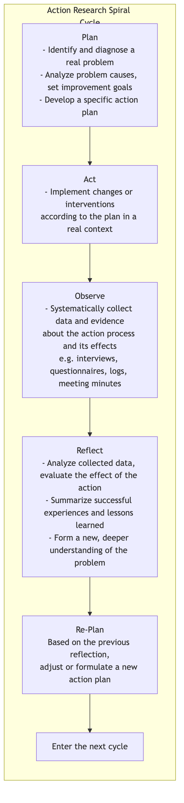

# Action Research

In traditional research, researchers typically play the role of objective, detached "observers," while research subjects are passively "studied." **Action Research** completely breaks down this barrier. It is a cyclical inquiry process that tightly integrates **"research"** with **"practice,"** aiming to solve practical problems and drive change. Its core idea is that knowledge should not merely be "discovered" and left on the shelf, but should be "created" and "applied" in the action of solving real-world problems.

Action research is not a "prescription" given by external experts to practitioners, but a systematic process of diagnosis, reflection, action, and evaluation of one's own work context (such as a classroom, a community, an organization), carried out by **practitioners themselves** (often in collaboration with researchers). The core question it answers is: "How can we improve our current work/situation?" Therefore, action research is characterized by its strong **contextuality, participation, collaboration, and cyclical nature**. It is both a process of understanding the world and, more importantly, a process of transforming the world.

## The "Action-Reflection" Spiral Cycle of Action Research

The soul of action research lies in its continuously iterative spiral process. Each cycle consists of four closely linked stages, and this cycle repeats constantly, with each iteration deepening the practitioner's understanding of the problem and making improvement actions more effective.

The most classic action research spiral model was proposed by Kurt Lewin and has been continuously developed by later generations:



<!--
```mermaid
graph TD
    subgraph Action Research Spiral Cycle
        A(<b>Plan</b><br/>- Identify and diagnose a real problem<br/>- Analyze problem causes, set improvement goals<br/>- Develop a specific action plan) --> B(<b>Act</b><br/>- Implement changes or interventions<br/>according to the plan in a real context);
        B --> C(<b>Observe</b><br/>- Systematically collect data and evidence<br/>about the action process and its effects<br/>(e.g., interviews, questionnaires, logs, meeting minutes));
        C --> D(<b>Reflect</b><br/>- Analyze collected data, evaluate the effect of the action<br/>- Summarize successful experiences and lessons learned<br/>- Form a new, deeper understanding of the problem);
        D --> A1(<b>Re-Plan</b><br/>Based on the previous reflection,<br/>adjust or formulate a new action plan);
        A1 --> B1(...Enter the next cycle);
    end
```
-->

## How to Organize an Action Research Study

1.  **Identify a "Practical Problem" Worth Addressing**
    Action research begins with practitioners' confusion, dissatisfaction, or desire for improvement in their work. This problem must be specific, real, and one that the practitioner is motivated to solve. For example, a teacher finds that "students' participation in class discussions is low."

2.  **Form a Collaborative Team and Conduct Preliminary Diagnosis**
    Invite all stakeholders related to the problem (e.g., other teachers, student representatives, researchers) to form a collaborative group. The team jointly conducts an in-depth diagnosis of the problem and analyzes its possible causes.

3.  **First Round of Cycle: Plan, Act, Observe, Reflect**
    *   **Plan**: The team decides to try a new teaching method – "group debate competition" – and develops a detailed implementation plan.
    *   **Act**: Over the next month, the teacher implements four "group debate competitions" in her class.
    *   **Observe**: During this period, she collects data on student participation, quality of发言, and feelings through classroom recordings, student interviews, and her own teaching log.
    *   **Reflect**: The team jointly analyzes the data and finds that although overall participation significantly increased, some introverted students still spoke little. At the same time, the debate competition took up too much teaching time.

4.  **Enter the Next Round of Cycle**
    *   **Re-Plan**: Based on the previous reflection, the team revises the plan. The new plan is adjusted to "online group discussions before class + representative summaries in class," and different roles such as "online scribe" are set up for introverted students.
    *   **Act, Observe, Reflect again**... This spiral process will continue until the problem is satisfactorily resolved, or the team has formed a deep understanding of the problem.

## Application Cases

**Case 1: Teacher Professional Development**

*   **Scenario**: A high school math teacher wants to improve students' understanding of the abstract concept of "functions."
*   **Application**: She collaborates with a math education researcher from a university to initiate an action research project. They jointly design a teaching plan based on real-life situations (e.g., mobile phone bill packages) (Plan) and implement it in the classroom (Act). By analyzing students' homework, test scores, and class discussions (Observe), they find that students' understanding of functions has indeed deepened, but their ability to perform symbolic operations has not improved much (Reflect). In the next cycle, they adjust the plan, adding targeted exercises for symbolic operations.

**Case 2: Community Development and Empowerment**

*   **Scenario**: Residents of an old community generally complain about the lack of vitality in public spaces and indifferent neighborly relations.
*   **Application**: Several community workers and resident representatives launch a "community garden" action research project. They jointly plan a wasteland (Plan) and organize residents to transform and plant it together (Act). During the process, they observe a significant increase in residents' participation and neighborly interaction through interviews and activity records (Observe). At the project summary meeting, everyone reflects on the successful experiences and decides to promote this model to other public space renovations in the community (Re-plan).

**Case 3: Organizational Process Improvement**

*   **Scenario**: A software company's development team finds that their product release process is too lengthy, often leading to delays.
*   **Application**: The team decides to use action research to optimize the process. They first draw the existing process flow chart and identify bottlenecks (Plan). Then, they decide to pilot "continuous integration" in the next release cycle (Act). By tracking data such as code submission frequency, bug count, and release time (Observe), they find that the new method significantly shortens the release cycle (Reflect). Thus, the team decides to promote this successful practice throughout the company.

## Advantages and Challenges of Action Research

**Core Advantages**

*   **Directly Addresses Real Problems**: Research directly stems from practice, aiming to solve real, specific problems encountered in practice.
*   **Empowers Practitioners**: Transforms practitioners from passive "research subjects" into active "researchers," greatly enhancing their professional reflection abilities and autonomous problem-solving skills.
*   **Bridge Between Theory and Practice**: Tests theories in action and develops theories in reflection, effectively connecting theoretical knowledge with practical wisdom.
*   **Promotes Sustainable Change**: Since changes are driven from within by internal personnel, they are more easily accepted and more sustainable.

**Potential Challenges**

*   **Rigor and Objectivity**: Since the researcher is also a participant, maintaining the systematic nature of the research process and the objectivity of the analysis is an ongoing challenge. Detailed process recording and team collaboration are key to ensuring rigor.
*   **Time and Effort Investment**: Action research requires practitioners to invest extra time and effort in learning, reflection, and discussion outside of their busy daily work.
*   **Generalizability of Conclusions**: The conclusions of action research are usually highly contextualized, and their purpose is not to generate universal theories but to improve specific practices. Therefore, its research results are difficult to directly generalize to other contexts.

## Extensions and Connections

*   **Qualitative Research**: Action research extensively uses qualitative methods such as interviews and observations in data collection.
*   **Critical Theory**: Some schools of action research (e.g., critical action research) have a strong social critique, aiming to reveal and challenge unequal power structures and promote social liberation.
*   **Lean and Agile**: In enterprise management, the PDCA (Plan-Do-Check-Act) cycle in Lean thinking and the iterative thinking in Agile development are highly consistent with the spiral cycle concept of action research.

---
*Reference: Kurt Lewin, a Gestalt psychologist, is widely considered the "father of action research." The works of Stephen Kemmis and Robin McTaggart have significantly developed the theoretical and practical models of action research. In the field of education, John Elliott and Lawrence Stenhouse are key figures in promoting the "teacher as researcher" movement.*