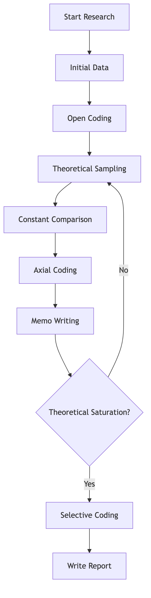

# Grounded Theory

In the vast landscape of social science research, there are times when existing theories fall short in explaining complex social phenomena, or when we are exploring entirely new areas where no established theoretical framework exists. In such situations, simply verifying existing theories is insufficient; we need a method that allows us to **construct new theories directly from data**. **Grounded Theory** is precisely such a powerful qualitative research methodology. It is a systematic approach that emphasizes the **inductive generation of theory** from systematically collected and analyzed data, rather than starting with a pre-conceived hypothesis.

Developed by sociologists Barney Glaser and Anselm Strauss in the 1960s, Grounded Theory's core philosophy is **"all is data."** It advocates for a continuous, iterative process of data collection, coding, and analysis, where theoretical concepts and relationships emerge directly from the data itself. This contrasts sharply with traditional deductive research, which begins with a theory and then tests it with data. Grounded Theory aims to produce a theory that is "grounded" in the empirical world, reflecting the realities and complexities of the phenomenon being studied. It is particularly suitable for exploring processes, interactions, and social structures in depth, providing rich, nuanced, and context-sensitive theoretical explanations.

## Core Principles and Process of Grounded Theory

Grounded Theory is characterized by its iterative and systematic nature, with several key principles guiding the research process:

1.  **Theoretical Sensitivity**: The researcher's ability to recognize what is important in the data and to give it meaning. This is developed through literature review, professional experience, and the analytical process itself.
2.  **Constant Comparative Method**: The core analytical strategy. It involves continuously comparing data with data, data with categories, and categories with categories. This comparison helps to refine categories, identify properties, and discover relationships.
3.  **Theoretical Sampling**: Data collection is guided by the emerging theory. As concepts and categories emerge, the researcher deliberately seeks out new data that can further develop, refine, or challenge these emerging theoretical constructs.
4.  **Coding**: The process of breaking down, examining, comparing, conceptualizing, and categorizing data. It typically involves three main types:
    *   **Open Coding**: Breaking data into discrete parts, examining them closely, and comparing them for similarities and differences. Labels (codes) are given to phenomena, and these codes are then grouped into categories.
    *   **Axial Coding**: Relating categories to their subcategories, linking them at the level of properties and dimensions. This involves identifying causal conditions, phenomena, context, intervening conditions, action/interaction strategies, and consequences.
    *   **Selective Coding**: The process of selecting the core category, systematically relating it to other categories, validating those relationships, and filling in categories that need further refinement and development.
5.  **Memo-Writing**: The process of writing down the researcher's analytical thoughts, insights, and emerging theoretical ideas throughout the research process. Memos are crucial for developing theoretical concepts and linking them.
6.  **Theoretical Saturation**: The point at which no new or relevant data emerge regarding a category, and the category is well-developed. This indicates that further data collection is unlikely to yield new insights.

### Grounded Theory Process Flowchart



<!--
```mermaid
graph TD
    A[1 Start Research<br/>(Broad Research Question)] --> B(2 初始数据收集<br/>(访谈、观察、文档));
    B --> C(3 开放编码<br/>(概念化、分类));
    C --> D(4 理论抽样<br/>(根据新兴概念选择新数据源));
    D --> E(5 持续比较<br/>(数据与数据、数据与概念、概念与概念));
    E --> F(6 轴心编码<br/>(建立范畴间关系));
    F --> G(7 备忘录写作<br/>(记录分析思路和理论洞察));
    G --> H{8 理论饱和了吗?};
    H -- 否 --> D;
    H -- 是 --> I(9 选择性编码<br/>(确定核心范畴，构建理论));
    I --> J(10 撰写理论报告);
```
-->

## How to Conduct Grounded Theory Research

1.  **Define a Broad Research Question**: Unlike deductive research, Grounded Theory starts with a broad question, allowing the theory to emerge from the data rather than being imposed on it. For example, "How do startup founders manage work-life balance?"

2.  **Initial Data Collection**: Begin with a small, purposeful sample. Data can come from interviews, observations, documents, or other sources relevant to the research question.

3.  **Open Coding**: As soon as data is collected, begin coding. Read through the data line by line, word by word, and assign initial codes (labels) that capture the essence of what is being said or observed. Group similar codes into preliminary categories.

4.  **Theoretical Sampling**: Based on the emerging categories and concepts, decide what data to collect next and from whom. This is an iterative process: collect data, analyze, identify gaps in the emerging theory, and then collect more data to fill those gaps.

5.  **Constant Comparison**: Continuously compare new data with existing data, and new codes/categories with existing ones. This helps to refine definitions, identify properties and dimensions of categories, and discover relationships between them.

6.  **Axial Coding**: Begin to relate categories to each other. This involves identifying causal conditions, phenomena, context, intervening conditions, action/interaction strategies, and consequences. This step helps to build a more structured theoretical framework.

7.  **Memo-Writing**: Throughout the entire process, write memos. Memos are not just summaries of data; they are analytical notes where you explore ideas, make connections, and develop your theoretical thinking. They are the bridge between raw data and the final theory.

8.  **Selective Coding and Theoretical Saturation**: As the theory develops, identify a core category that is central to the emerging theory. Then, systematically relate all other categories to this core category. Continue data collection and analysis until theoretical saturation is reached – when no new insights emerge from further data.

9.  **Write the Theory**: Present the developed theory in a clear, coherent, and well-supported manner, explaining the relationships between categories and how they explain the phenomenon under study.

## Classic Application Cases

**Case 1: "Awareness of Dying" (Glaser & Strauss, 1965)**

*   **Scenario**: This seminal work explored how medical staff and dying patients interact and manage the awareness of impending death in hospitals.
*   **Application**: Through extensive observations and interviews in hospitals, Glaser and Strauss developed a theory of "awareness contexts" (e.g., closed awareness, suspected awareness, mutual pretense, open awareness), explaining how different levels of awareness among patients and staff influenced their interactions and the dying process. This theory was directly generated from the empirical data, providing new insights into a previously underexplored social phenomenon.

**Case 2: Understanding Online Community Engagement**

*   **Scenario**: A researcher wants to understand the factors that drive sustained engagement in online hobby communities.
*   **Application**: Through interviews with active members, observations of online interactions, and analysis of forum posts, the researcher might identify categories such as "shared passion," "mutual support," "sense of belonging," "contribution opportunities," and "moderation quality." Through constant comparison and memo-writing, a theory could emerge explaining how these factors interact to foster a vibrant and engaged online community.

**Case 3: Career Transitions in Mid-Life**

*   **Scenario**: A study aims to understand the process and challenges faced by individuals undergoing significant career changes in their 40s and 50s.
*   **Application**: In-depth interviews with individuals who have made such transitions could reveal categories like "triggering events" (e.g., burnout, layoff), "identity renegotiation," "skill acquisition," "networking strategies," and "emotional resilience." The emerging theory might explain the stages of mid-life career transition and the coping mechanisms individuals employ.

## Advantages and Challenges of Grounded Theory

**Core Advantages**

*   **Generates Context-Rich Theory**: Produces theories that are deeply rooted in empirical data and highly relevant to the studied phenomenon, offering rich, nuanced explanations.
*   **Flexible and Adaptive**: The iterative nature allows researchers to adjust their data collection and analysis strategies as new insights emerge.
*   **Suitable for Underexplored Areas**: Ideal for research questions where little or no existing theory is available.
*   **Promotes Researcher Creativity**: Encourages researchers to think critically and creatively about their data, fostering deeper insights.

**Potential Challenges**

*   **Time and Labor Intensive**: The iterative process of data collection and analysis, coupled with constant comparison, can be very time-consuming and demanding.
*   **Requires High Theoretical Sensitivity**: The quality of the emerging theory heavily depends on the researcher's ability to conceptualize and make connections in the data, which requires significant skill and experience.
*   **Subjectivity and Rigor**: Critics sometimes question the objectivity and rigor of Grounded Theory due to its inductive nature and the researcher's central role in theory construction. However, proponents emphasize systematic procedures (like coding and memo-writing) to ensure rigor.
*   **Difficulty in Replication**: Due to its emergent nature, replicating a Grounded Theory study exactly can be challenging.

## Extensions and Connections

*   **Qualitative Research**: Grounded Theory is a prominent methodology within qualitative research, often used alongside or in conjunction with other qualitative methods like phenomenology or ethnography.
*   **Case Study**: Grounded Theory can be applied within a case study design to develop a theory specific to that case, or to generate a more general theory from multiple cases.

---
*Reference: The foundational texts for Grounded Theory are "The Discovery of Grounded Theory" (1967) by Glaser and Strauss, and subsequent works by both authors, particularly "Basics of Qualitative Research: Techniques and Procedures for Developing Grounded Theory" (1990) by Strauss and Corbin, which provided more explicit procedural guidelines.*