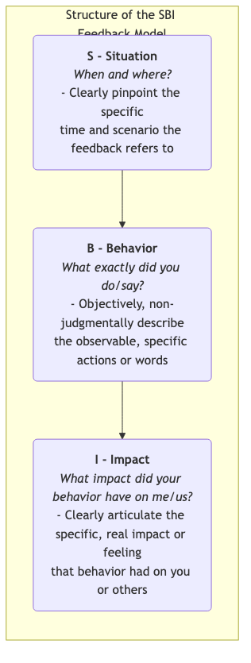
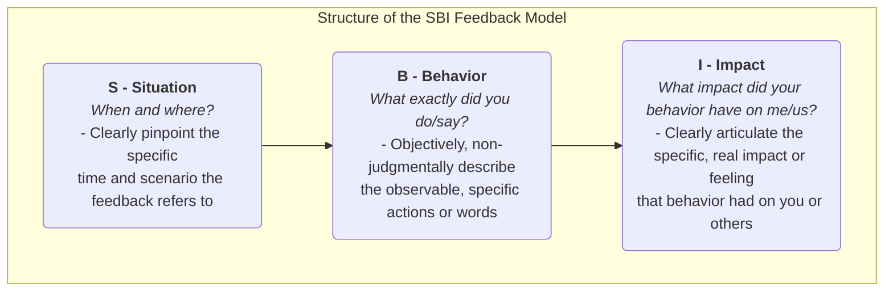

# SBI Feedback Model

In team collaboration and personal growth, **feedback** is indispensable fuel. However, inappropriate feedback methods often backfire. Vague feedback (e.g., "You did well") fails to provide specific guidance, while overly subjective or judgmental feedback (e.g., "You're too careless") easily triggers defensiveness and resistance in the recipient, turning what should be a constructive conversation into an unproductive argument. The **SBI Feedback Model (Situation-Behavior-Impact Model)** is a simple, clear, non-judgmental **structured feedback communication tool** designed to solve this problem.

The SBI model, developed by the **Center for Creative Leadership (CCL)**, a leading global leadership development institution, focuses on clearly breaking down feedback into three logically sequential parts to ensure your feedback is **specific, objective, and focused on behavior and its impact**, rather than abstract judgments about personal character.

*   **S - Situation**: The specific time and place the feedback refers to.
*   **B - Behavior**: The observable, specific actions or words demonstrated by the person in that situation.
*   **I - Impact**: The specific consequences and effects of that behavior on you, the team, or the project.

By following this "S-B-I" structure, you can transform feedback from vague judgments "about the person" to clear descriptions "about the action," thereby greatly increasing the likelihood of the feedback being understood and accepted by the recipient, and laying an objective, respectful foundation for subsequent discussion and improvement.

## The Three Components of the SBI Model

The three parts of SBI together form a complete, persuasive feedback statement.

<!--

<!--

<!--

-->
-->
-->

1.  **S - Situation**
    *   **Purpose**: To provide a clear context for the feedback, helping the recipient quickly recall the specific event you are referring to. This avoids vague generalizations and "bringing up old issues."
    *   **Key**: Be specific, not vague. Don't say "You always..." but rather "In our project weekly meeting yesterday morning...".

2.  **B - Behavior**
    *   **Purpose**: To firmly focus the feedback on the recipient's **specific, objective, observable** actions and words.
    *   **Key**: Only describe what you saw or heard firsthand. **Absolutely avoid any words that imply subjective assumptions, motive speculation, or character judgment**. Don't say "You seemed unprepared then," but rather "When you presented the plan, you paused three times to look for data." Don't say "You interrupted me," but rather "You started speaking while I was in the middle of my sentence."

3.  **I - Impact**
    *   **Purpose**: This is the core of the feedback. It aims to help the recipient understand why their behavior is important and what specific consequences it had on others or the work. This is key to motivating the recipient to change.
    *   **Key**: Clearly articulate the real impact or feeling this behavior had on "**me**" or "**us**." Starting with "I" statements can effectively reduce the recipient's defensiveness. For example, "This made me feel that my opinion was not fully respected," or "This made our client question our professionalism."

## How to Use the SBI Model for Feedback

Using the SBI model is not just about applying a formula; it's about adopting a respectful, open communication stance.

1.  **Step One: Prepare the Feedback (S-B-I)**
    Before engaging in a feedback conversation, clearly organize your SBI content in your mind or on paper. Ensure your description is specific, objective, and non-judgmental.

2.  **Step Two: Initiate the Conversation**
    Choose an appropriate, private time and place. At the beginning of the conversation, clearly state your positive intention, for example, "I'd like to share some observations with you, hoping it can help us collaborate more smoothly in the future."

3.  **Step Three: Clearly State the SBI**
    Strictly follow the "S-B-I" order, and state your feedback clearly and calmly.
    *   "**(S)** In our team's weekly meeting with the client on Monday morning, **(B)** when the client raised a sharp question about the budget, you immediately listed three of our past successful cases in detail to support our value. **(I)** This made me feel very reassured and confident, and I saw the client's expression visibly relax, which greatly enhanced their trust in us." (This is an example of positive feedback)

4.  **Step Four: Pause and Listen to the Other Person's Perspective**
    After you've finished stating the SBI, the most important step is to **pause** and hand over the floor to the other person. Use an open-ended question to invite them to share their perspective, for example, "What are your thoughts on what I just said?" or "I'd like to hear what you were thinking at the time?"

5.  **Step Five: Jointly Discuss and Look to the Future**
    After both parties have fully exchanged perspectives, shift the focus of the conversation to the future. Jointly discuss, "What can we do in the future to maintain the good aspects / improve the areas of weakness?"

## Application Cases

**Case 1: Giving Feedback to a Colleague Who Talks Too Much in Meetings**

*   **Inappropriate Feedback**: "You talk too much in meetings; you always miss the point." (Judgmental, vague)
*   **SBI Feedback**:
    *   **S**: "In today's team weekly meeting, when we were discussing the third agenda item, 'Next Quarter's Marketing Plan,'"
    *   **B**: "I noticed that when you presented your plan, you explained the background information of all similar past activities in detail, which took about 15 minutes."
    *   **I**: "This made me feel a bit anxious because I was worried we wouldn't have enough time to discuss the plans of the other two colleagues. Also, I found it a bit difficult to grasp the core points of your plan."
    *   ** (Initiate Dialogue)**: "I'd like to understand, were you trying to ensure we all fully understood the background at that time?"

**Case 2: Praising a New Employee Who Proactively Helps Others**

*   **Inappropriate Feedback**: "Xiao Wang, you're great, keep up the good work!" (Vague, lacks specific guidance)
*   **SBI Feedback**:
    *   **S**: "Xiao Wang, I noticed yesterday afternoon, when the customer support team was busy answering calls,"
    *   **B**: "You proactively went over and helped them process 5 backlog online tickets."
    *   **I**: "Your action not only greatly relieved the pressure on the customer service team but also showed me your strong team spirit and sense of ownership, which made our whole team's atmosphere better. Thank you very much!"

**Case 3: Giving Feedback to Your Superior (Upward Feedback)**

*   **Scenario**: Your superior often assigns urgent tasks to you on the fly during team meetings.
*   **SBI Feedback**:
    *   **S**: "Boss, during our project planning meeting on Wednesday,"
    *   **B**: "At the end of the meeting, you assigned me two new urgent tasks that needed to be completed by this Friday."
    *   **I**: "This made me feel a bit caught off guard because it meant I had to put aside my originally planned high-priority core tasks to complete them. I'm concerned this might affect the critical path of our entire project."
    *   ** (Initiate Dialogue)**: "I'd like to confirm with you whether the priority of these two new tasks is indeed higher than the core tasks I'm currently working on? Or how can we adjust the schedule?"

## Advantages and Challenges of the SBI Model

**Core Advantages**

*   **Specific, Objective, Evidence-Based**: Bases feedback on observable facts, avoiding vague praise and unfounded accusations.
*   **Reduces Defensiveness**: By focusing on "behavior" and its "impact," rather than judging "the person," it greatly reduces the recipient's resistance, making the conversation easier.
*   **Clearly Points Direction**: The "impact" section clearly tells the recipient why their behavior needs to be maintained or changed, making it easier for them to understand and take action.
*   **Simple and Easy to Learn**: The model structure is simple, easy to remember, and can be deliberately practiced in daily work.

**Potential Challenges**

*   **Requires Deliberate Practice**: To skillfully and naturally use SBI, especially when facing conflict or giving negative feedback, requires a lot of deliberate practice to overcome our habitual, judgmental communication patterns.
*   **High Demands on "Behavioral" Observation**: Requires us to be mindful observers in our daily lives, capable of capturing and accurately describing specific behavioral details.

## Extensions and Connections

*   **Nonviolent Communication (NVC)**: The SBI model aligns highly with the philosophy of Nonviolent Communication. The four components of NVC are "Observation, Feeling, Need, Request." The "Situation-Behavior" in SBI corresponds to "Observation," and "Impact" is deeply related to our "Feelings" and "Needs."
*   **BI-C Variation of Feedback**: In some scenarios where a stronger expression of expectations is needed (especially after giving negative feedback), an additional **C - Consequence/Choice** component can be added to SBI, clearly informing the recipient of the potential consequences if the behavior doesn't change, or what choices they can make.

---
*Reference: The SBI feedback model was developed and popularized by the Center for Creative Leadership (CCL) and is one of the core communication tools in their leadership training programs, widely applied in developing communication skills for managers and teams globally.*