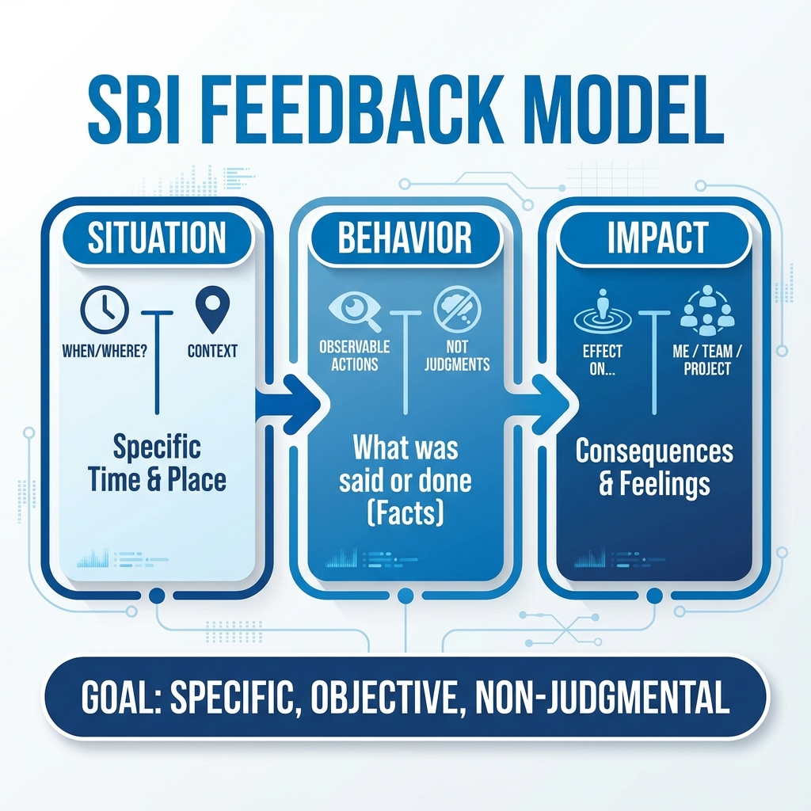
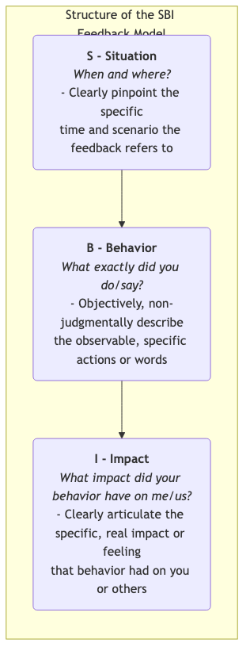

# SBI Feedback Model

In team collaboration and personal growth, **feedback** is indispensable fuel. However, inappropriate feedback methods often backfire. Vague feedback (e.g., "You did well") fails to provide specific guidance, while overly subjective or judgmental feedback (e.g., "You're too careless") easily triggers defensiveness and resistance in the recipient, turning what should be a constructive conversation into an unproductive argument. The **SBI Feedback Model (Situation-Behavior-Impact Model)** is a simple, clear, non-judgmental **structured feedback communication tool** designed to solve this problem.

The SBI model, developed by the **Center for Creative Leadership (CCL)**, a leading global leadership development institution, focuses on clearly breaking down feedback into three logically sequential parts to ensure your feedback is **specific, objective, and focused on behavior and its impact**, rather than abstract judgments about personal character.

*   **S - Situation**: The specific time and place the feedback refers to.
*   **B - Behavior**: The observable, specific actions or words demonstrated by the person in that situation.
*   **I - Impact**: The specific consequences and effects of that behavior on you, the team, or the project.

By following this "S-B-I" structure, you can transform feedback from vague judgments "about the person" to clear descriptions "about the action," thereby greatly increasing the likelihood of the feedback being understood and accepted by the recipient, and laying an objective, respectful foundation for subsequent discussion and improvement.

!!! abstract "Key takeaways"

    - **One-line formula**: "In (situation), you (did/said something specific). The impact was (effect on me, the team or the work)."
    - **Behavior must be observable**: describe what a camera would record, not your guess about motives or character.
    - **Impact must be real and concrete**: time, quality, customers, team dynamics. Start with "I".
    - **Stop and listen afterwards**: CCL's extended version, SBII, adds a final step that asks about the other person's intent.
    - **Works for praise too**: specific positive feedback reinforces good behavior far better than "great job".

## The Three Components of the SBI Model

The three parts of SBI together form a complete, persuasive feedback statement.

<!-- mermaid 源文件：SBI-Feedback-Model-Tutorial-en-mermaid-src-1.mmd -->

1.  **S - Situation**
    *   **Purpose**: To provide a clear context for the feedback, helping the recipient quickly recall the specific event you are referring to. This avoids vague generalizations and "bringing up old issues."
    *   **Key**: Be specific, not vague. Don't say "You always..." but rather "In our project weekly meeting yesterday morning...".

2.  **B - Behavior**
    *   **Purpose**: To firmly focus the feedback on the recipient's **specific, objective, observable** actions and words.
    *   **Key**: Only describe what you saw or heard firsthand. **Absolutely avoid any words that imply subjective assumptions, motive speculation, or character judgment**. Don't say "You seemed unprepared then," but rather "When you presented the plan, you paused three times to look for data." Don't say "You interrupted me," but rather "You started speaking while I was in the middle of my sentence."

3.  **I - Impact**
    *   **Purpose**: This is the core of the feedback. It aims to help the recipient understand why their behavior is important and what specific consequences it had on others or the work. This is key to motivating the recipient to change.
    *   **Key**: Clearly articulate the real impact or feeling this behavior had on "**me**" or "**us**." Starting with "I" statements can effectively reduce the recipient's defensiveness. For example, "This made me feel that my opinion was not fully respected," or "This made our client question our professionalism."

## How to Use the SBI Model for Feedback

Using the SBI model is not just about applying a formula; it's about adopting a respectful, open communication stance.

1.  **Step One: Prepare the Feedback (S-B-I)**
    Before engaging in a feedback conversation, clearly organize your SBI content in your mind or on paper. Ensure your description is specific, objective, and non-judgmental.

2.  **Step Two: Initiate the Conversation**
    Choose an appropriate, private time and place. At the beginning of the conversation, clearly state your positive intention, for example, "I'd like to share some observations with you, hoping it can help us collaborate more smoothly in the future."

3.  **Step Three: Clearly State the SBI**
    Strictly follow the "S-B-I" order, and state your feedback clearly and calmly.
    *   "**(S)** In our team's weekly meeting with the client on Monday morning, **(B)** when the client raised a sharp question about the budget, you immediately listed three of our past successful cases in detail to support our value. **(I)** This made me feel very reassured and confident, and I saw the client's expression visibly relax, which greatly enhanced their trust in us." (This is an example of positive feedback)

4.  **Step Four: Pause and Listen to the Other Person's Perspective**
    After you've finished stating the SBI, the most important step is to **pause** and hand over the floor to the other person. Use an open-ended question to invite them to share their perspective, for example, "What are your thoughts on what I just said?" or "I'd like to hear what you were thinking at the time?"

5.  **Step Five: Jointly Discuss and Look to the Future**
    After both parties have fully exchanged perspectives, shift the focus of the conversation to the future. Jointly discuss, "What can we do in the future to maintain the good aspects / improve the areas of weakness?"

## Application Cases

**Case 1: Giving Feedback to a Colleague Who Talks Too Much in Meetings**

*   **Inappropriate Feedback**: "You talk too much in meetings; you always miss the point." (Judgmental, vague)
*   **SBI Feedback**:
    *   **S**: "In today's team weekly meeting, when we were discussing the third agenda item, 'Next Quarter's Marketing Plan,'"
    *   **B**: "I noticed that when you presented your plan, you explained the background information of all similar past activities in detail, which took about 15 minutes."
    *   **I**: "This made me feel a bit anxious because I was worried we wouldn't have enough time to discuss the plans of the other two colleagues. Also, I found it a bit difficult to grasp the core points of your plan."
    *   **Ask about intent**: "I'd like to understand, were you trying to ensure we all fully understood the background at that time?"

**Case 2: Praising a New Employee Who Proactively Helps Others**

*   **Inappropriate Feedback**: "Xiao Wang, you're great, keep up the good work!" (Vague, lacks specific guidance)
*   **SBI Feedback**:
    *   **S**: "Xiao Wang, I noticed yesterday afternoon, when the customer support team was busy answering calls,"
    *   **B**: "You proactively went over and helped them process 5 backlog online tickets."
    *   **I**: "Your action not only greatly relieved the pressure on the customer service team but also showed me your strong team spirit and sense of ownership, which made our whole team's atmosphere better. Thank you very much!"

**Case 3: Giving Feedback to Your Superior (Upward Feedback)**

*   **Scenario**: Your superior often assigns urgent tasks to you on the fly during team meetings.
*   **SBI Feedback**:
    *   **S**: "Boss, during our project planning meeting on Wednesday,"
    *   **B**: "At the end of the meeting, you assigned me two new urgent tasks that needed to be completed by this Friday."
    *   **I**: "This made me feel a bit caught off guard because it meant I had to put aside my originally planned high-priority core tasks to complete them. I'm concerned this might affect the critical path of our entire project."
    *   **Open the dialogue**: "I'd like to confirm with you whether the priority of these two new tasks is indeed higher than the core tasks I'm currently working on? Or how can we adjust the schedule?"

**Case 4: Feedback in Remote Collaboration**

*   **Scenario**: A colleague edited a section you own in a shared document without leaving any note.
*   **SBI Feedback**:
    *   **S**: "When I opened the project proposal doc on Tuesday afternoon,"
    *   **B**: "I saw that the budget table in section two had been changed: two rows were deleted, with no comment or note explaining why."
    *   **I**: "It took me half an hour to work out what had changed, and I couldn't answer finance's question about whether those two items were still needed."
    *   **Ask about intent**: "Did you spot a problem there? For changes like this, could you leave a comment so we can stay in sync?"

## Advantages and Challenges of the SBI Model

**Core Advantages**

*   **Specific, Objective, Evidence-Based**: Bases feedback on observable facts, avoiding vague praise and unfounded accusations.
*   **Reduces Defensiveness**: By focusing on "behavior" and its "impact," rather than judging "the person," it greatly reduces the recipient's resistance, making the conversation easier.
*   **Clearly Points Direction**: The "impact" section clearly tells the recipient why their behavior needs to be maintained or changed, making it easier for them to understand and take action.
*   **Simple and Easy to Learn**: The model structure is simple, easy to remember, and can be deliberately practiced in daily work.

**Potential Challenges**

*   **Requires Deliberate Practice**: To skillfully and naturally use SBI, especially when facing conflict or giving negative feedback, requires a lot of deliberate practice to overcome our habitual, judgmental communication patterns.
*   **High Demands on "Behavioral" Observation**: Requires us to be mindful observers in our daily lives, capable of capturing and accurately describing specific behavioral details.

## Turning Judgments into Observable Behavior

The "Behavior" step is where most feedback goes wrong. A simple test: **if a camera had recorded the moment, would it show what you are describing?** If not, you are describing a judgment or an assumption.

| Judgment or assumption (avoid) | Observable behavior (use) |
| --- | --- |
| You have a bad attitude | When the client asked a question, you said "that's not my job" twice |
| You don't care about this project | You joined all three stand-ups this week more than ten minutes late |
| You're careless | The sales figures on page 3 and page 7 of the report don't match |
| You were very professional | When the client challenged the price, you walked them through the cost breakdown of three similar projects |
| You always interrupt people | In today's meeting you started presenting your idea twice before Li had finished speaking |

## Going Further: SBII (Adding Intent)

CCL later extended SBI into **SBII (Situation-Behavior-Impact-Intent)**, adding one final step: **ask about the other person's intent**.

Many conflicts come from the gap between intent and impact. A colleague who spent 15 minutes on background may have wanted everyone to understand the problem fully, yet the impact was that other agenda items were squeezed out. Describing the impact first and then asking about intent lets the person see the consequence of their behavior while giving them room to explain, which moves the conversation toward solving the problem.

## SBI Feedback Scripts

**Developmental feedback**

> "I'd like to talk about (topic) so we can work together even better.
> In (specific time and place), I noticed you (specific behavior).
> The impact was (specific effect on me / the team / the work).
> Can you help me understand what you were thinking at the time?"
>
> (After listening) "Next time something like this comes up, what could we do differently?"

**Positive feedback**

> "In (specific time and place), you (specific behavior).
> It (specific good outcome / how it helped me and the team).
> Thank you, and I hope you'll keep doing this."

**Upward feedback**

> "I'd like to check something with you and share where things stand on my side.
> In (specific time and place), you (specific decision or request).
> It affected (specific piece of work) in this way: (specific impact).
> How would you like me to prioritize this? Or how could we adjust?"

## Common Mistakes

1.  **Disguising a judgment as behavior.** "In yesterday's meeting you were negative" sounds situational, but "negative" is still a judgment. Describe only what could be seen or heard.
2.  **Turning impact into a character verdict.** "This shows you're not responsible" is not an impact; it is a new judgment. Keep impact on concrete consequences: time, quality, customers, collaboration.
3.  **Packing in too many issues.** One feedback conversation, one topic. Unloading months of accumulated grievances at once only makes the other person feel ambushed.
4.  **Using SBI only for criticism.** If SBI only appears when something has gone wrong, people will brace themselves as soon as they hear "In Monday's meeting...". Use it for specific praise regularly and developmental feedback becomes much easier to receive.
5.  **Talking without listening.** The last step of SBI is listening. Skip it and the feedback becomes a one-way instruction.
6.  **Waiting too long.** Feedback about "a meeting last month" is hard to recall in detail and makes it look like you have been keeping score. Give feedback within a day or two.

## SBI vs. Sandwich Feedback vs. Nonviolent Communication

| | SBI Feedback Model | Sandwich (Praise-Criticism-Praise) | Nonviolent Communication (NVC) |
| --- | --- | --- | --- |
| Structure | Situation → Behavior → Impact (→ Intent) | Positive → Criticism → Positive | Observation → Feeling → Need → Request |
| Best for | Everyday positive and developmental feedback at work | Softening criticism | Conflict, repairing relationships, emotionally charged conversations |
| Strength | Simple, objective, focused on behavior | Easy to hear | Addresses feelings and needs; relationship-oriented |
| Main risk | Can sound scripted if used mechanically | People remember only the praise or only the criticism, and grow wary of praise over time | Steeper learning curve; can feel heavy for routine work feedback |

## Frequently Asked Questions

??? question "Who created the SBI feedback model?"

    The Center for Creative Leadership (CCL) developed SBI as a core communication tool in its leadership programs. CCL later introduced SBII, which adds Intent as a fourth step.

??? question "Can I use SBI for positive feedback?"

    Yes, and you should. Specific praise tells people exactly which behavior to repeat and why it mattered. "Great job" only creates a brief good feeling.

??? question "What's the difference between SBI and nonviolent communication?"

    They share the same spirit. SBI is lighter and suits frequent workplace feedback; NVC goes deeper into feelings and needs and suits emotionally charged situations. SBI's Situation and Behavior correspond to NVC's Observation.

??? question "What if the person rejects my feedback?"

    First check that your behavior description contains no judgment. Then genuinely listen: they may know something you don't. If you still disagree, move to the future: "Whatever the reason, how should we handle a situation like this next time?"

??? question "Does SBI work for feedback to my manager?"

    Yes. With upward feedback, tie the impact to work outcomes (deadlines, quality, priorities) and close with a question rather than a demand, such as "How would you like me to prioritize this?"

## Extensions and Connections

*   **Nonviolent Communication (NVC)**: The SBI model aligns highly with the philosophy of Nonviolent Communication. The four components of NVC are "Observation, Feeling, Need, Request." The "Situation-Behavior" in SBI corresponds to "Observation," and "Impact" is deeply related to our "Feelings" and "Needs."
*   **[ORID Focused Conversation](../meeting_effectiveness/ORID-Focused-Conversation-Tutorial-en.md)**: Also starts from objective facts and moves through Objective, Reflective, Interpretive and Decisional levels. Useful for collective feedback in team retrospectives.
*   **[Pyramid Principle](../../Foundations/logical_thinking/Pyramid-Principle-Tutorial-en.md)**: For written or longer feedback, put the conclusion first so the recipient grasps the key point immediately.
*   **[RACI Matrix](../team_collaboration/RACI-Matrix-Tutorial-en.md)**: If the same feedback keeps coming up, unclear responsibilities may be the root cause. A RACI matrix makes ownership explicit.
*   **[Six Thinking Hats](../../Problem Solving & Decision Making/ideation/Six-Thinking-Hats-Tutorial-en.md)**: Concerns raised during the "black hat" stage can be phrased with SBI so they are specific and less personal.

---
*Reference: The SBI feedback model was developed and popularized by the Center for Creative Leadership (CCL) and is one of the core communication tools in their leadership training programs, widely applied in developing communication skills for managers and teams globally.*