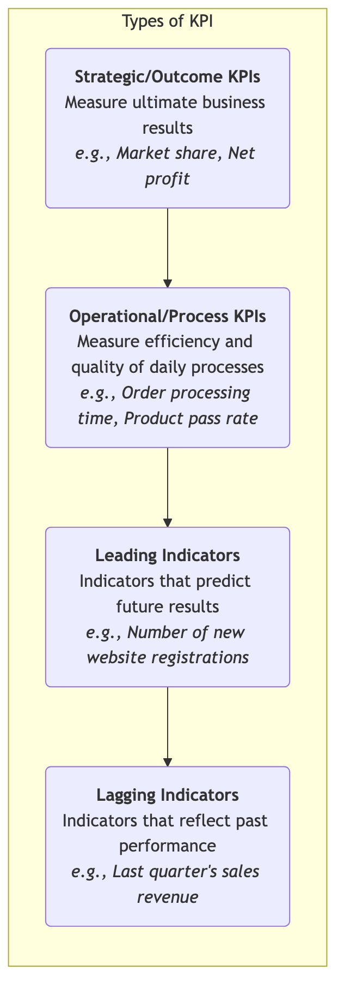
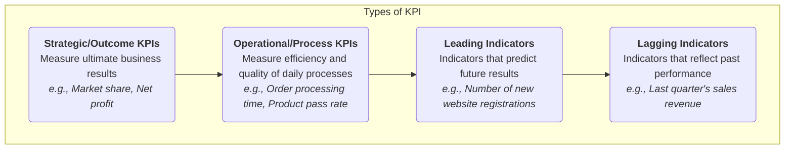

# KPI (Key Performance Indicator)

In complex organizational operations, how can managers quickly and accurately assess the health of the business, the efficiency of processes, and the effectiveness of strategy execution? **KPI (Key Performance Indicator)** is a core management tool designed for this purpose. It is not an abstract concept, but a specific, quantifiable **measurement standard** used to continuously monitor and evaluate the performance of an organization, a team, or an employee in achieving their key business objectives. A KPI is like an airplane's cockpit dashboard; it translates complex operations into a few key, clear readings, allowing the pilot to understand the flight status in real-time and make timely adjustments.

The essence of KPI lies in "**Key**." There can be thousands of measurable data points in an organization, but only those indicators that are closely linked to strategic goals and can truly reflect the core of performance can be called KPIs. It aims to direct the organization's attention to the most important things and provide an objective, unified data basis for performance management, goal setting, and continuous improvement. From measuring website visitor conversion rates to evaluating production line yield rates, and tracking customer service response times, KPIs are ubiquitous and an indispensable cornerstone of modern data-driven management.

## Characteristics and Types of KPI

An effective KPI typically possesses the following characteristics:
*   **Quantifiable**: Must be measurable with numbers.
*   **Strategic**: Must be directly linked to the organization's strategic goals.
*   **Actionable**: Changes in the indicator should clearly point to specific actions that need to be improved.
*   **Timely**: Can be tracked and reported regularly and promptly.

Based on their content, KPIs can be divided into various types:

<!--

<!--

<!--

-->
-->
-->

## How to Set and Use KPIs

1.  **Step One: Clarify Your Strategic Goals**
    KPI setting must begin with a deep understanding of strategy. You must clearly know, "For our organization/team, what does success mean?" For example, an e-commerce company's strategic goal might be "increase customer loyalty."

2.  **Step Two: Ask Key Business Questions**
    Translate strategic goals into a series of specific business questions. For the goal of "increase customer loyalty," key questions might be: "How often do our customers make repeat purchases?" "Are our customers willing to recommend us to others?"

3.  **Step Three: Select and Define Key Performance Indicators**
    For each key question, find one or more quantifiable indicators that best answer it. At this step, strive for conciseness and avoid "metric bombardment."
    *   To answer "customer repeat purchase frequency," you can choose **"customer annual purchase frequency"** or **"customer repurchase rate"** as KPIs.
    *   To answer "customer willingness to recommend," you can choose **"Net Promoter Score (NPS)"** as a KPI.

4.  **Step Four: Set Targets and Thresholds**
    Set a specific target value for each KPI, and optionally set different performance thresholds (e.g., red alert zone, yellow warning zone, green healthy zone) for quick visual management.

5.  **Step Five: Determine Data Sources and Reporting Frequency**
    Clearly define where the data for each KPI comes from, who is responsible for collecting it, and what the reporting frequency is (daily, weekly, or monthly reports).

6.  **Step Six: Regular Review and Take Action**
    Regularly (e.g., at weekly meetings or monthly business analysis meetings) review KPI performance. The focus of the review is not to judge, but to **analyze and act**. When a KPI performs poorly, it is necessary to deeply analyze the reasons behind it and formulate specific improvement measures.

## Application Cases

**Case 1: E-commerce Website Operations**

*   **Strategic Goal**: Improve website profitability.
*   **Key KPIs**:
    *   **Conversion Rate**: Measures the efficiency of website traffic converting into actual purchases.
    *   **Average Order Value (AOV)**: Measures the average amount of each order.
    *   **Customer Lifetime Value (CLV)**: Predicts the total profit each customer can bring in the future.

**Case 2: Call Center Customer Service**

*   **Strategic Goal**: Provide efficient and high-quality customer support.
*   **Key KPIs**:
    *   **First Call Resolution (FCR)**: Measures the ability to resolve customer issues in a single call.
    *   **Average Handle Time (AHT)**: Measures the average efficiency of handling a customer request.
    *   **Customer Satisfaction (CSAT)**: Directly measures customer satisfaction with the service through post-service surveys.

**Case 3: Human Resource Management**

*   **Strategic Goal**: Attract and retain top talent.
*   **Key KPIs**:
    *   **Employee Turnover Rate**: Measures talent retention, especially "key position employee turnover rate."
    *   **Employee Engagement Index**: Measures employee involvement and satisfaction through annual engagement surveys.
    *   **Cost Per Hire**: Measures the efficiency of recruitment activities.

## Advantages and Challenges of KPI

**Core Advantages**

*   **Provides Objective Basis**: Transforms vague "good or bad performance" into objective, unified data, providing a basis for performance evaluation and decision-making.
*   **Focuses on Key Areas**: Guides the organization to focus its attention on activities most critical to strategic success.
*   **Promotes Communication and Transparency**: Clear KPIs allow every employee to understand how their performance is measured and how they contribute to team goals.

**Potential Challenges**

*   **One-Sidedness of Metrics**: If KPIs are set improperly, it may lead to "metricism" or short-sighted behavior. For example, if only "number of calls answered by the call center" is assessed, customer service representatives might sacrifice call quality to pursue quantity.
*   **"What can be quantified is not necessarily important, and what is important is not necessarily quantifiable"**: Over-reliance on KPIs may overlook factors that are difficult to quantify but equally important, such as organizational culture, innovation spirit, etc.
*   **Requires Dynamic Adjustment**: As strategies and market environments change, KPIs must be regularly reviewed and adjusted, otherwise they may become rigid and outdated.

## Extensions and Connections

*   **OKR (Objectives and Key Results)**: KPI and OKR are two complementary tools in modern goal management.
    *   **KPI** is more like a car's "dashboard," used to monitor routine metrics that need to be kept at a healthy level long-term (e.g., profit margin, customer satisfaction). Its goal is usually to "maintain" or "slightly optimize."
    *   **OKR** is more like a car's "navigation system," used to guide challenging, directional goals that require breakthroughs and innovation (e.g., "successfully enter a new market"). Its goal is to "achieve" a completely new state.
    *   In practice, a team's dashboard KPIs (e.g., "website crash rate must be below 0.1%") are the foundation for its normal operation, while their OKRs are the mountains they need to focus on conquering this quarter.

*   **Balanced Scorecard**: KPIs are the basic elements for building a Balanced Scorecard. The Balanced Scorecard provides a comprehensive framework to ensure that the KPIs you choose are balanced across the four perspectives: financial, customer, internal processes, and learning & growth.

---
*Reference: The concept of KPI is rooted in modern management accounting and performance management theory. Robert S. Kaplan and David P. Norton, in developing the Balanced Scorecard, greatly promoted the application of KPIs in strategic management. In the digital age, KPIs have become a core component of data-driven decision-making culture.*