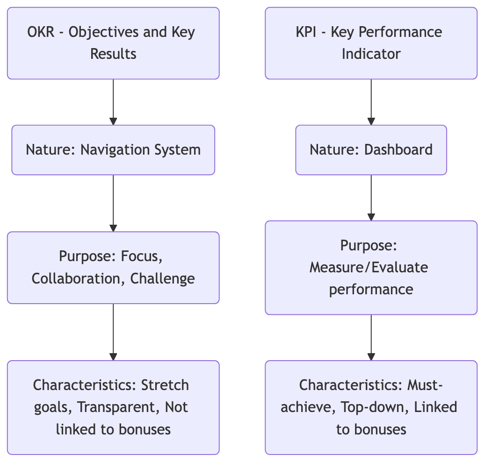

# OKR (Objectives and Key Results)

In rapidly changing, uncertain modern organizations, how can we ensure that everyone in the team moves in the same direction and works together? Traditional, top-down performance appraisals (KPIs) are often too rigid, easily leading employees to focus only on their metrics and neglect the ultimate goal. **OKR (Objectives and Key Results)** is a powerful, agile goal management framework born to address this challenge. It is not a performance appraisal tool, but a continuous communication and alignment tool designed to **unify thinking, focus priorities, promote collaboration, and unleash potential**.

The core idea of OKR is to focus the organization's energy on the most important things. It clearly defines "where we want to go" and "how we know we are on the right track" by setting an inspiring, qualitative **Objective**, supplemented by 2-5 quantifiable **Key Results** used to measure the achievement of the Objective. It encourages transparency, collaboration, and bottom-up participation, allowing every team and individual to clearly see how their work contributes to the organization's grand vision, thereby stimulating intrinsic motivation.

## The Two Components of OKR

A complete OKR consists of two parts, which together answer two core questions.

*   **Objective**: Answers "**What do we want to achieve?**"
    *   It should be **qualitative, inspiring, challenging**, and **time-bound** (usually quarterly).
    *   A good Objective should ignite the team's passion and point to a clear direction, rather than being a cold number.
    *   **Example**: "Launch a stunning, disruptive new version of the product that delights users."

*   **Key Results**: Answers "**How do we measure whether we have achieved the Objective?**"
    *   They must be **quantitative, measurable, challenging**, and specific **results**, not tasks (Activities).
    *   Each Objective typically has 2-5 KRs. If all KRs are easily achieved, it means the objective was not ambitious enough; if 70%-80% is achieved, it is considered a successful challenge.
    *   **Example**: For the above objective, the KRs might be:
        *   KR1: Increase Net Promoter Score (NPS) for the new version from 40 to 60.
        *   KR2: Increase daily active users (DAU) of core features by 30%.
        *   KR3: Increase app store user rating from 4.2 stars to 4.8 stars.

### Core Differences Between OKR and KPI



<!--
```mermaid
graph TD
    subgraph OKR vs. KPI
        A(<b>OKR - Objectives and Key Results</b>) --> A1(<b>Nature:</b> Navigation System (guides direction));
        A1 --> A2(<b>Purpose:</b> Focus priorities, promote collaboration, push limits);
        A2 --> A3(<b>Characteristics:</b><br/>- Often challenging, "stretch" goals<br/>- Transparent, public, bottom-up participation<br/>- <b>NOT directly linked to compensation/bonuses</b>);

        B(<b>KPI - Key Performance Indicator</b>) --> B1(<b>Nature:</b> Dashboard (monitors health));
        B1 --> B2(<b>Purpose:</b> Measure and evaluate performance of existing, mature businesses or roles);
        B2 --> B3(<b>Characteristics:</b><br/>- Often committed, "must-achieve" metrics<br/>- Usually top-down decomposition<br/>- <b>Often linked to performance appraisal and bonuses</b>);
    end
```
-->

## How to Implement OKR

OKR implementation is a continuous, rhythmic cyclical process, typically quarterly.

1.  **Step One: Set Company-Level OKRs**
    Before the start of each cycle, senior management must jointly discuss and set 1-3 most important and prioritized company-level OKRs based on the annual strategy. These OKRs define the focus for the entire organization for the current quarter.

2.  **Step Two: Set Team-Level and Individual-Level OKRs**
    *   **Alignment and Collaboration**: Department and team leaders need to understand the company-level OKRs and consider how their team can contribute most. Then, organize team members to jointly set the team's OKRs. This is usually not a simple "metric breakdown" but "goal alignment."
    *   **Bottom-Up**: Encourage employees to set their individual OKRs based on their understanding of the team's OKRs. Approximately 50%-60% of OKRs should come from the grassroots, which greatly stimulates employees' sense of ownership.

3.  **Step Three: Continuous Tracking and Regular Review**
    *   **Weekly Check-ins**: Teams spend a small amount of time each week to quickly synchronize the progress of each KR, obstacles encountered, and confidence levels. This is not a reporting session but an agile adjustment and help-seeking meeting.
    *   **Mid-term Review**: At the midpoint of the quarter, conduct a formal review to assess whether progress is smooth and whether OKRs need adjustment or trade-offs.

4.  **Step Four: Quarterly Review and Scoring**
    *   At the end of the cycle, the team scores the completion of each KR (usually on a 0-1.0 scale). The focus of scoring is not on the score itself but on the **review discussion**: What did we learn? What went well? What can be improved? Why was a certain KR not completed?
    *   Completed OKRs do not mean the end; the results and experience gained will become important input for setting new OKRs in the next quarter.

## Application Cases

**Case 1: Marketing Team of a Startup**

*   **Objective**: Successfully enter the East China market and establish initial brand influence.
*   **Key Results**:
    *   KR1: Acquire 10 seed customers in Shanghai and Hangzhou.
    *   KR2: Establish deep reporting partnerships with 3 regional industry media outlets.
    *   KR3: Host an online product launch event with over 200 attendees.

**Case 2: A Product Development Team**

*   **Objective**: Significantly improve our App's user retention rate and make users love our product.
*   **Key Results**:
    *   KR1: Increase new user's second-week retention rate from 20% to 35%.
    *   KR2: Complete and launch the top three most requested new features by users.
    *   KR3: Reduce the number of severe bugs reported by users by 50%.

**Case 3: Human Resources Department**

*   **Objective**: Build top-tier talent attraction in the industry and become a company candidates aspire to join.
*   **Key Results**:
    *   KR1: Reduce the average recruitment cycle for core technical positions from 45 days to 30 days.
    *   KR2: Increase employer rating on mainstream recruitment websites from 3.8 to 4.5 stars.
    *   KR3: Successfully implement an internal employee referral program, with referral hires accounting for 40% of total hires.

## Advantages and Challenges of OKR

**Core Advantages**

*   **Focus and Alignment**: Focuses the entire organization's energy on a few most important goals, ensuring everyone moves in the same direction.
*   **Increased Transparency and Collaboration**: All team OKRs are public and transparent, greatly promoting cross-departmental understanding and collaboration.
*   **Inspires Ambition and Potential**: Encourages setting challenging "stretch" goals and views failure as a learning opportunity, thereby stimulating team creativity and potential.
*   **Agile and Adaptive**: The rapid quarterly iteration cycle allows the organization to respond more flexibly to market changes.

**Potential Challenges**

*   **Easy to Confuse with KPI**: If OKRs are directly used as a tool for performance appraisal and linked to bonuses, all their advantages will be lost, and employees will be afraid to set challenging goals.
*   **Requires Cultural Support**: The success of OKR highly depends on an open, trusting management culture that encourages experimentation.
*   **Difficulty in Setting High-Quality OKRs**: Writing an OKR that is both inspiring and measurable requires repeated thought and practice. Especially important is distinguishing between "Key Results" and "Activities."

## Extensions and Connections

*   **SMART Principle**: Is the golden standard that must be followed when setting a good "Key Result." A KR must be Specific, Measurable, Achievable, Relevant, and Time-bound.
*   **KPI (Key Performance Indicator)**: OKR and KPI are not mutually exclusive but can complement each other. KPIs can be used to monitor regular "business dashboard" metrics that need to be maintained at a healthy level (e.g., website uptime, customer service response time), while OKRs guide directions that require breakthroughs and innovation.

---
*Reference: OKR was first proposed by Andy Grove, the legendary CEO of Intel, and later introduced and popularized at Google by John Doerr, an early investor in Google. John Doerr's book "Measure What Matters" is the most core and authoritative literature promoting and popularizing OKR.*