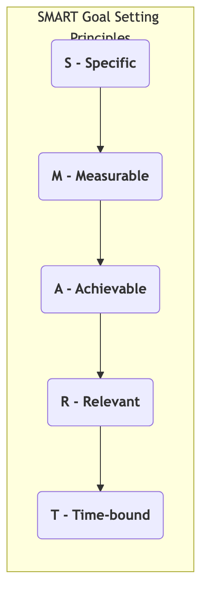

# SMART Goals

In the field of goal management, a common problem is that the goals we set are often too vague and unrealistic, ultimately leading them to be shelved, unable to be effectively executed and measured. For example, "I want to be healthier" or "Our company wants to enhance brand influence"—while these aspirations are good, they often fall by the wayside due to a lack of clear definition and feasible paths. The **SMART principle** is a widely applied and highly effective set of **goal-setting standards** designed to solve this problem. It provides a clear, five-dimensional checklist to guide us in setting high-quality, executable, and trackable goals.

SMART is an acronym for five English words, requiring an effective goal to be:

*   **S - Specific**
*   **M - Measurable**
*   **A - Achievable**
*   **R - Relevant**
*   **T - Time-bound**

Following the SMART principle is like installing a precise navigation system for our goals. It transforms a vague "wish" into a clear "destination" and a definite "roadmap," thereby greatly increasing the likelihood of achieving the goal.

## Detailed Explanation of the Five Dimensions of SMART

Let's break down these five dimensions one by one to understand how they work together to shape a high-quality goal.

<!--

<!--

<!--

-->

1.  **S - Specific**
    *   **Core Requirement**: The goal must be clear, explicit, and unambiguous. It should clearly answer "What" (what to do), "Why" (why do it), "Who" (who will do it), "Where" (where to do it), etc.
    *   **Counter-example**: "I want to improve my English proficiency."
    *   **Positive Example**: "I (Who) want to improve my business English communication skills (What) to get a promotion opportunity (Why). I will study at a local training institution (Where)."

2.  **M - Measurable**
    *   **Core Requirement**: The goal must be quantifiable and trackable. You need clear metrics to determine whether the goal has been achieved and what the current progress is.
    *   **Counter-example**: "I want to read more books."
    *   **Positive Example**: "I will read **12** non-fiction books **this year**, averaging **one per month**."

3.  **A - Achievable**
    *   **Core Requirement**: The goal should be challenging but also achievable within your capabilities and resources. An unattainable goal will only lead to frustration and abandonment.
    *   **Counter-example**: Someone who has never run before setting a goal to complete a full marathon next month.
    *   **Positive Example**: Someone who has never run before setting a goal to "be able to **continuously run 5 kilometers** within **three months**."

4.  **R - Relevant**
    *   **Core Requirement**: The sub-goals set must be highly relevant to your broader, longer-term overall goals or vision. This ensures that your efforts are focused on what truly matters and serve a larger direction.
    *   **Counter-example**: A software engineer whose long-term goal is to become a technical architect, but sets "learning to play the guitar" as their top annual goal.
    *   **Positive Example**: The software engineer sets the goal to "lead the completion of a **core module refactoring** and conduct a **technical sharing session** for the team **this quarter**," which is highly relevant to their long-term goal of becoming an architect.

5.  **T - Time-bound**
    *   **Core Requirement**: The goal must have a clear deadline or timeframe. A goal without a time limit is like a race without a finish line, easily leading to indefinite procrastination.
    *   **Counter-example**: "I'll learn Python programming someday."
    *   **Positive Example**: "I plan to complete the designated Python online course and independently complete **three** small projects within the **next six months**."

## How to Apply the SMART Principle

Applying the SMART principle is a process of continuously clarifying and concretizing vague ideas. Let's look at a complete transformation case:

*   **Initial Idea (Vague Wish)**:
    > "I hope my personal blog can be more successful."

*   **Applying SMART Principle for Transformation**:
    1.  **S (Specific)**: I hope to **increase my blog's traffic and reader interaction** by **publishing more high-quality content**.
    2.  **M (Measurable)**: I want my blog's **monthly unique visitors (UV) to reach 10,000**, and the **average number of comments per article to exceed 20**.
    3.  **A (Achievable)**: Based on my current traffic (2000 monthly UV), reaching 10,000 in three months might be difficult. I'll adjust it to **5,000**, which is a more challenging but potentially achievable goal.
    4.  **R (Relevant)**: Increasing blog influence is highly relevant to my long-term goal of building a personal brand and becoming a freelancer in the future.
    5.  **T (Time-bound)**: I hope to achieve this goal within the **next three months** (from today to X month X day).

*   **Final SMART Goal**:
    > "To build my personal brand, I will, within the next three months, increase my personal blog's monthly unique visitors from 2000 to 5000 and increase the average number of comments per article to over 20, by publishing two high-quality original articles per week."

## Application Cases

**Case 1: Sales Team Goal Setting**

*   **Non-SMART Goal**: "We need to work hard to increase sales."
*   **SMART Goal**: "Our sales team will, in the third quarter (T), increase renewal revenue from existing customers (M) by 15% (A) through upselling and cross-selling (S), to support the company's annual profit target (R)."

**Case 2: Fitness and Weight Loss Plan**

*   **Non-SMART Goal**: "I want to lose weight."
*   **SMART Goal**: "I will, within the next 12 weeks (T), reduce my body fat percentage (M) from 25% to 20% (A) by performing 3 strength training sessions and 2 cardio sessions per week and following a nutritionist's meal plan (S), to improve my physical health (R)."

**Case 3: Improving Customer Service Quality**

*   **Non-SMART Goal**: "We want to make customers more satisfied."
*   **SMART Goal**: "Our customer service team will, this quarter (T), reduce the customer first response time (M) to within 2 hours and increase the customer satisfaction score (M) from 85 to 90 (A) by optimizing the ticket handling process and strengthening employee training (S), to improve customer loyalty (R)."

## Advantages and Challenges of the SMART Principle

**Core Advantages**

*   **Clarity and Focus**: Provides extremely clear direction and focus for action.
*   **Easy to Track and Evaluate**: Quantifiable nature makes progress easy to track and results easy to evaluate.
*   **Boosts Motivation and Commitment**: A clear, achievable goal can greatly enhance individual motivation and self-commitment.

**Potential Challenges**

*   **May Inhibit Creativity and Flexibility**: For exploratory, hard-to-quantify innovation projects, over-emphasizing SMART might limit flexibility and imagination. In such cases, goals might need to be set with more direction than specificity.
*   **Ignores Process, Focuses Only on Results**: Sometimes, excessive focus on final quantitative metrics can lead to short-sighted behaviors to achieve numbers, neglecting the quality and sustainability of the process.
*   **Difficulty in Setting**: Breaking down a grand vision into a series of appropriate, interconnected SMART goals itself requires skill and experience.

## Extensions and Connections

*   **OKR (Objectives and Key Results)**: The SMART principle is the golden standard for setting a high-quality **Key Result**. Every KR should be a SMART goal.
*   **KPI (Key Performance Indicator)**: A KPI itself is a measurable indicator (M). Combining a KPI with a specific target value (Target) and time limit (T) forms a SMART performance goal.
*   **Project Management**: In the initiation phase of project management, applying the SMART principle to define project deliverables and milestones is fundamental to project success.

---
*Reference: The SMART principle was first proposed by George T. Doran in his November 1981 article "There's a S.M.A.R.T. Way to Write Management's Goals and Objectives" in Management Review. Since then, it has been widely disseminated and applied, and has evolved into some variations (e.g., SMARTER, which adds Evaluated and Reviewed).*