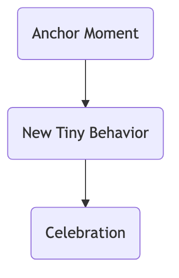

# Tiny Habits

We've all had ambitious goals: starting tomorrow, exercise for an hour daily, read 50 pages, meditate for 30 minutes. However, these grand plans often fail quickly after a few days due to their high barrier to execution and excessive reliance on willpower, ultimately trapping us in a negative cycle of "plan-fail-self-blame." **Tiny Habits** is an extremely simple yet exceptionally powerful behavior design method that overturns traditional habit formation thinking. Proposed by Dr. BJ Fogg, founder of the Stanford University Behavior Design Lab, its core idea is that **to cultivate a long-term, stable habit, the key is not how much willpower you have, but to make the behavior you want to adopt as "tiny" as possible, so tiny that you can almost not fail**.

The essence of the Tiny Habits strategy is to bypass reliance on "motivation" and "willpower," and instead focus on **lowering the barrier to behavior**. It posits that any grand goal can be broken down into a trivial "tiny habit" that can be completed within 60 seconds. For example, reducing the daunting goal of "do 100 push-ups every day" to "**do just 1 push-up every day**." By consistently and easily performing this tiny behavior, which consumes almost no willpower, and immediately giving yourself positive emotional feedback, we can quietly lay a solid "neural pathway" for this new habit in our brains, allowing it to naturally grow and strengthen in the future.

## Tiny Habits Behavior Model (B=MAP)

BJ Fogg proposed a famous behavior model to explain the three elements necessary for any behavior to occur, which also forms the theoretical basis of the Tiny Habits strategy.

**B = MAP**

*   **B - Behavior**: The behavior you want to happen.
*   **M - Motivation**: How much you want to do the behavior.
*   **A - Ability**: How easy it is to do the behavior.
*   **P - Prompt**: Something that reminds you to do the behavior.

This formula tells us that a behavior will only occur when **Motivation, Ability, and Prompt** are all present. However, motivation is extremely unstable and unreliable. Therefore, to make a behavior occur consistently, the most reliable strategy is not to "increase motivation," but to **greatly increase "ability,"** i.e., to make the behavior **extremely easy**.

## How to Design and Practice a Tiny Habit

Designing a tiny habit requires following a clear "**ABC**" recipe.



<!--
```mermaid
graph TD
    subgraph The Tiny Habits Recipe
        A(<b>A - Anchor Moment</b><br/><i>After my [existing daily habit]...</i><br/>- Choose a stable existing habit you do every day<br/>as a "prompt") --> B(<b>B - New Tiny Behavior</b><br/><i>I will immediately do [an extremely tiny behavior]...</i><br/>- Reduce the habit you want to build to its smallest version,<br/>usually completable within 30-60 seconds);
        B --> C(<b>C - Celebration</b><br/><i>After doing it, I will immediately [celebrate]!</i><br/>- Immediately give yourself positive emotional feedback,<br/>to strengthen neural connections and make your brain "love" this behavior);
    end
```
-->

1.  **Step One: Find Your "Anchor Moment"**
    *   An effective "prompt" should not be an alarm clock or a to-do item, but an **existing**, stable daily habit that you perform every day. This existing habit acts like an "anchor" to which you can firmly "attach" your new habit.
    *   **Examples**: "After I brush my teeth every morning...", "After I put on my pajamas every night...", "After I park my car every day...".

2.  **Step Two: Design Your "Tiny Behavior"**
    *   Ruthlessly reduce your grand goal until it becomes "ridiculously small," so small that you have no excuse not to complete it.
    *   **Grand Goal -> Tiny Behavior**:
        *   "Floss all my teeth every day" -> "**Floss just one tooth**"
        *   "Meditate for 15 minutes every day" -> "**Take one deep breath**"
        *   "Read one chapter of a book every day" -> "**Open the book and read one sentence**"
        *   "Clean the entire garage" -> "**Put one misplaced item back in its place**"

3.  **Step Three: Immediately "Celebrate"**
    *   This is the **crucial but most easily overlooked** step. The **moment** you complete the tiny behavior, you must immediately give yourself positive emotional feedback, allowing your brain to feel the joy of "success." This immediate internal reward is key to associating the new behavior with positive emotions, thereby solidifying it into a long-term habit.
    *   **Celebration can be any small action that genuinely makes you feel good**: Say "Yes!" to yourself, clench your fist, make a victory gesture, or simply give a heartfelt smile.

## Application Cases

**Case 1: Cultivating an Exercise Habit**

*   **Bad Plan**: "Starting today, I'll go to the gym for an hour after work every day." (Too high a barrier, easily interrupted by overtime or fatigue)
*   **Tiny Habit Recipe**:
    *   **Anchor**: "After I brush my teeth every night,"
    *   **Tiny Behavior**: "I will immediately do two push-ups."
    *   **Celebration**: "After finishing, immediately tell myself, 'Done! I'm awesome!'"
*   **Result**: This behavior is almost impossible to fail. And once you start, you'll likely find, "Since I'm already down here, I might as well do a few more." But even if you only do two, you've successfully completed today's habit, maintained consistency, and strengthened your identity as an "exerciser."

**Case 2: Developing a Reading Habit**

*   **Bad Plan**: "I'll read 30 pages every night."
*   **Tiny Habit Recipe**:
    *   **Anchor**: "After I lie down in bed every night,"
    *   **Tiny Behavior**: "I will immediately pick up the book by my pillow, open it, and read one page."
    *   **Celebration**: "After reading, smile and nod to myself."
*   **Result**: The focus of this habit is not "how much was read," but "**establishing the daily ritual of picking up a book**." Once the book is picked up, you'll likely naturally continue reading.

**Case 3: Keeping the Kitchen Tidy**

*   **Bad Plan**: "I'll thoroughly clean the kitchen every day."
*   **Tiny Habit Recipe**:
    *   **Anchor**: "After I make myself a cup of tea every night,"
    *   **Tiny Behavior**: "I will immediately wash one bowl in the sink."
    *   **Celebration**: "Look at the clean bowl and feel the joy that tidiness brings."
*   **Result**: This tiny action breaks the "starting inertia" when faced with a pile of dirty dishes. Once you start washing the first one, you're very likely to wash the others as well.

## Advantages and Challenges of Tiny Habits

**Core Advantages**

*   **Extremely High Success Rate**: By lowering the behavior barrier to a minimum, it almost eliminates the possibility of failure, thereby breaking the vicious cycle of "plan-fail-self-blame."
*   **Does Not Rely on Willpower**: It doesn't consume your valuable willpower resources, allowing you to start easily and without pressure.
*   **Utilizes the "Behavior Flywheel" Effect**: Tiny successes lead to positive emotions, and positive emotions, in turn, make you more willing to act, forming a positive, self-reinforcing virtuous cycle.
*   **Shapes Identity**: Completing a tiny exercise behavior every day will gradually make you see yourself as an "exerciser" deep down, and this identity is the fundamental driving force for long-term adherence.

**Potential Challenges**

*   **Disdain for "Tiny"**: Many people, especially those accustomed to setting grand goals, might disdain this "ridiculously small" method, thinking it's "useless." Understanding the behavior design principles behind it is key to overcoming this mindset.
*   **Forgetting to "Celebrate"**: People often perform the behavior but forget the crucial "celebration" step, thus preventing the neural pathway for the habit from being effectively strengthened.

## Extensions and Connections

*   **The Habit Loop**: The "anchor-tiny behavior-celebration" recipe of Tiny Habits is an extremely subtle and practical application of the Habit Loop's "cue-routine-reward" theory.
*   **GTD (Getting Things Done)**: The "Two-Minute Rule" in GTD (if a task can be done in two minutes, do it immediately) is highly consistent with the Tiny Habits' idea of "lowering the barrier to action."

---
*Reference: Dr. BJ Fogg's book "Tiny Habits: The Small Changes That Change Everything" is the sole and most authoritative source for this method. The book elaborates on the underlying B=MAP behavior model and how to systematically design and apply tiny habits to change all aspects of life.*