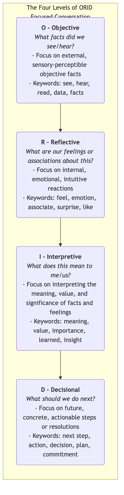
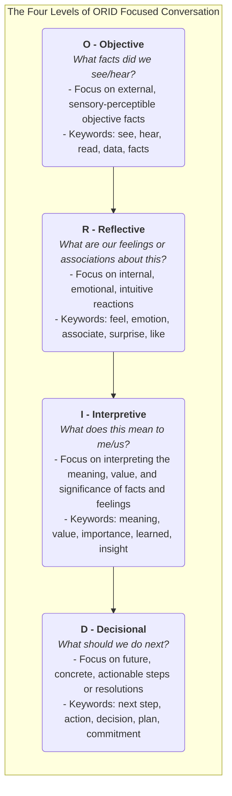

# ORID Focused Conversation Method

In team meetings or debriefing discussions, we often encounter the dilemma where discussions quickly devolve into arguments over solutions, or become a "one-man show" by a few individuals, while many remain silent, leading to meetings that neither reach consensus nor generate true deep thinking. The **ORID Focused Conversation Method** is a powerful and elegant **structured facilitation technique** designed to solve this problem. It systematically guides a discussion through four logically progressive levels, ensuring that the team moves from **objective facts** to **subjective feelings**, then to **interpretive analysis**, and finally to **informed decisions**.

ORID is an acronym for four levels, simulating the natural process of the human brain processing information and forming decisions:

*   **O - Objective**: About facts and data.
*   **R - Reflective**: About internal reactions and emotions.
*   **I - Interpretive**: About meaning, value, and significance.
*   **D - Decisional**: About future actions and resolutions.

By strictly following this "O-R-I-D" sequence in designing and guiding questions, the facilitator can ensure that every participant thinks on the same "channel," avoiding chaotic clashes of different thought levels. It creates a safe, in-depth discussion space, allowing the team's collective wisdom to truly emerge.

## Detailed Explanation of the Four Levels of ORID

The four levels of ORID, like a funnel, guide the discussion from the concrete, objective external world, gradually deepening into the abstract, profound inner world, and finally returning to concrete future actions.

<!--

<!--

<!--

-->
-->
-->

## How to Design and Facilitate an ORID Discussion

Successfully applying ORID hinges on the facilitator's ability to design a series of precise, open-ended, and logical questions for each level.

1.  **Step One: Preparation Phase**
    *   **Clarify Discussion Focus**: Clearly define the core topic of this ORID discussion. For example, "Debriefing our 'Dolphin' project from last quarter."
    *   **Design ORID Questions**: Prepare your list of guiding questions in advance for each of the four levels. Prepare at least 2-3 questions for each level.

2.  **Step Two: O - Objective Level: Establish a Common Factual Basis**
    *   **Purpose**: To ensure all participants start from the same objective, undisputed factual point. This step aims to "clear the mind" and eliminate subjective assumptions.
    *   **Guiding Question Examples**:
        *   "When we look back at the 'Dolphin' project, what specific data or facts did you see?"
        *   "Please recall, during the project, what was the most memorable sentence or scene for you?"
        *   "If we look at the project timeline, what key event nodes occurred?"

3.  **Step Three: R - Reflective Level: Connect Personal Inner Experiences**
    *   **Purpose**: To provide a safe space for the team's emotions and intuitive feelings to be expressed, based on facts. This step helps build team trust and psychological safety.
    *   **Guiding Question Examples**:
        *   "At what stage of the project did you feel most energized or excited?"
        *   "What moment made you feel most anxious, frustrated, or confused?"
        *   "What was your first reaction when you heard the final customer feedback?"

4.  **Step Four: I - Interpretive Level: Uncover Deeper Meaning and Insights**
    *   **Purpose**: This is the "value sublimation" stage of the discussion. Guide the team to extract deeper meanings, patterns, and key learnings from facts and feelings.
    *   **Guiding Question Examples**:
        *   "What is the most important value and meaning of this project's success (or failure) for our team?"
        *   "What is the most valuable lesson we learned from this?"
        *   "How did this project change our understanding of 'customer needs'?"

5.  **Step Five: D - Decisional Level: Form Clear Future Actions**
    *   **Purpose**: To translate all previous discussions into concrete, actionable future steps or resolutions, ensuring the meeting produces practical outcomes.
    *   **Guiding Question Examples**:
        *   "Based on our discussion today, what is the first and most important change we need to make to make our next project more successful?"
        *   "What should we start doing immediately? Stop doing? Continue doing?"
        *   "Regarding the next steps, who is responsible? What is the deadline?"

## Application Cases

**Case 1: Project Retrospective Meeting**

*   **Focus**: Debriefing a recently completed complex project with both successes and failures.
*   **ORID Application**:
    *   **O**: "Let's first review the project data: How long was the final delivery delayed compared to the original plan? How much was the budget overspent? What was the user activity metric?"
    *   **R**: "During the week when the project was most severely delayed, what was the general feeling among everyone?"
    *   **I**: "What was the most important lesson we learned about 'cross-departmental communication' from this delay?"
    *   **D**: "To avoid similar problems in the future, we decided that in all cross-departmental projects, a clear RACI matrix must be established at the initiation stage. This will be handled by the Project Management Office and completed by the end of the next quarter."

**Case 2: Team Learning Sharing Session After Reading a Book**

*   **Focus**: Team members share learnings after jointly reading "The Lean Startup."
*   **ORID Application**:
    *   **O**: "What was the most impressive concept, story, or sentence in the book for you?"
    *   **R**: "When you read about the concept of 'MVP,' what failed product of our own did you associate it with? How did you feel at that time?"
    *   **I**: "What is the biggest inspiration and challenge of the book's core ideas for our current product development process?"
    *   **D**: "We decided to try a 'landing page MVP' experiment for the next new feature development. Product Manager Xiao Wang will be responsible for launching it within two weeks."

**Case 3: Mediation Meeting After a Team Conflict**

*   **Focus**: Helping two colleagues who had a conflict due to work disagreements engage in an open, constructive dialogue.
*   **ORID Application**:
    *   **O**: The facilitator guides both parties to objectively state, "What exactly happened in yesterday afternoon's meeting? What did you say? What did he say?" (State only facts, without judgment).
    *   **R**: "How did you feel internally when you heard the other person say that? (Did you feel wronged, misunderstood, angry?)"
    *   **I**: "What do you think are the truly important but unarticulated needs behind this conflict? What does this mean for your future working relationship?"
    *   **D**: "What behavioral change are you both willing to commit to jointly for more effective future collaboration?"

## Advantages and Challenges of ORID

**Core Advantages**

*   **Enhances Meeting Depth and Quality**: Through structured facilitation, ensures discussions delve deeper, reaching the core issues.
*   **Ensures Full Participation**: The design of the four levels, especially O and R, provides safe and easy opportunities for less vocal or introverted members to speak.
*   **Builds Team Consensus**: Starting from a common factual basis and gradually moving towards a shared decision greatly promotes team consensus building.
*   **Highly Versatile**: Can be applied to almost any scenario requiring in-depth dialogue, such as project retrospectives, strategic discussions, team building, and training sharing.

**Potential Challenges**

*   **High Demands on Facilitator**: The success of ORID heavily relies on the facilitator's proficiency in the process and careful design of questioning techniques. A good facilitator is the soul of an ORID discussion.
*   **Time-Consuming**: An in-depth ORID discussion requires ample time and is not suitable for situations requiring quick, urgent decisions.
*   **Requires Participant Commitment**: Requires all participants to be willing to follow the structure and engage in open, honest sharing.

## Extensions and Connections

*   **Action Research**: ORID is an extremely effective practical tool for the "**Reflect**" stage in action research.
*   **Appreciative Inquiry**: ORID can be combined with the principles of Appreciative Inquiry by designing positive ORID questions focused on strengths and successful experiences to guide a positive, empowering discussion.

---
*Reference: The ORID Focused Conversation Method was developed by the Institute of Cultural Affairs (ICA Canada) in the 1970s and is one of the core tools in their "Technology of Participation (ToP)" series of facilitation methods. Laura Spencer's "Winning Through Participation" and R. Brian Stanfield's "The Art of Focused Conversation" are authoritative references for this method.*