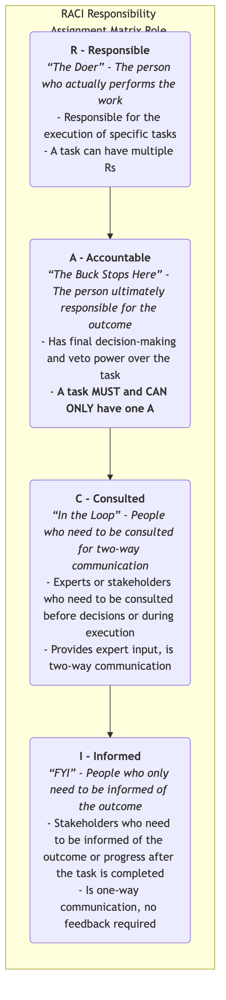
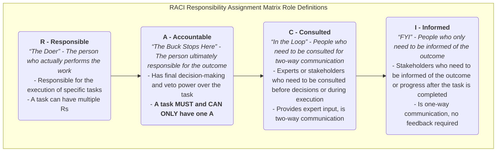

# RACI Matrix

In any project or process of even moderate scale, one of the most common and vexing problems is **unclear responsibilities**. When tasks are delayed, we find that several people thought someone else was responsible; when decisions need to be made, we can't find the person with the final authority; or a simple approval gets bogged down in layers of reporting, wasting a lot of time with irrelevant people. The **RACI Matrix**, also often called the **RACI Chart**, is a simple yet extremely effective **team collaboration and communication tool** designed to solve this common dilemma.

The core objective of RACI is to clearly define and communicate, through a clear matrix, the relationship between various **tasks** and various **roles** within a project or process, ensuring that for every piece of work, its related responsibilities and authorities are clearly assigned to specific individuals. It aims to eliminate the ambiguity of "Whose job is this?" allowing everyone in the team to clearly understand their own and others' responsibilities, thereby greatly improving collaboration efficiency, reducing communication costs, and internal friction.

RACI is an acronym for four different types of responsibility:

*   **R - Responsible**
*   **A - Accountable**
*   **C - Consulted**
*   **I - Informed**

## Detailed Explanation of the Four RACI Roles

The key to understanding RACI lies in precisely understanding these four different levels of responsibility.

<!--

<!--

<!--

-->

## How to Create and Use a RACI Matrix

1.  **Step One: Identify and List All "Tasks" (Vertical Axis)**
    *   Break down the project or process from beginning to end into a series of specific, executable tasks or deliverables. List them as the **rows** of the matrix, on the far left.

2.  **Step Two: Identify and List All "Roles" (Horizontal Axis)**
    *   Identify all stakeholders involved in this project or process, and write their **roles** (not specific names, as personnel may change) as the **columns** of the matrix, at the top. For example, "Project Manager," "Product Manager," "Frontend Developer," "Backend Developer," "Legal Advisor," etc.

3.  **Step Three: Fill in the Matrix One by One, Assigning RACI**
    *   This is the most crucial step. The team needs to work together, row by row (i.e., for each task), to discuss and assign one or more letters from R, A, C, I to each relevant role.
    *   **Key Rules**:
        *   Each row (each task) **MUST have exactly one A**. This is key to ensuring clear responsibilities and avoiding no one being responsible or multiple people being responsible.
        *   Each row must have at least one R to ensure someone executes the task.

4.  **Step Four: Analyze and Optimize the Matrix (Vertical and Horizontal Analysis)**
    *   Once the matrix is initially filled, it needs to be reviewed and optimized to identify potential collaboration issues.
    *   **Analyze by Row (for each task)**:
        *   **No A?**: Means no one is ultimately responsible for this task; an A needs to be assigned immediately.
        *   **Multiple As?**: Means unclear responsibilities, prone to conflict; must be reduced to only one A.
        *   **No R?**: Means this task is just a "castle in the air," with no one to execute it.
        *   **Too many Cs?**: Means the consultation process might be too lengthy, slowing down decision-making. Consider if so many people really need to be consulted?
        *   **Too many Is?**: Means communication costs might be too high. Consider if all these people really need to be informed?
    *   **Analyze by Column (for each role)**:
        *   **Too many Rs for a certain role?**: Means this person might be overloaded; work needs to be reallocated.
        *   **Too many As for a certain role?**: Means power might be too centralized; is this person a bottleneck for decisions?
        *   **A role with no R or A?**: Consider if this role is necessary to be involved in this process?

5.  **Step Five: Reach Consensus and Communicate**
    Ensure that the final version of the RACI matrix is understood and accepted by all relevant participants. Make it an official project document and publicize it, so it becomes the team's "common language" and "code of conduct" for collaboration.

## Application Cases

**Case 1: A Product Launch Process**

| Task/Role         | Product Manager | Marketing Manager | Development Team | Design Team | Legal Advisor |
| ----------------- | -------- | -------- | -------- | -------- | -------- |
| **Write Product Requirements Document** | A        | C        | R        | C        | I        |
| **Design UI/UX**     | A        | I        | C        | R        |          |
| **Develop Product Features**    | A        | I        | R        | C        |          |
| **Develop Marketing Plan**    | C        | A        | I        | C        | R        |
| **Approve Marketing Copy**    | I        | A        |          | I        | C        |

*   **Analysis**: From this matrix, it's clear that the Product Manager is ultimately responsible (A) for product feature development, while the Marketing Manager is ultimately responsible (A) for the marketing plan. The Legal Advisor is "Consulted (C)" on marketing copy and merely "Informed (I)" on the requirements document.

**Case 2: A Home Renovation Project**

*   **Task**: Determine renovation style.
*   **Roles**: Husband, Wife, Designer, Construction Foreman.
*   **RACI Assignment**:
    *   **R (Responsible)**: Designer (responsible for producing design proposals).
    *   **A (Accountable)**: Wife (has final decision-making authority).
    *   **C (Consulted)**: Husband (needs to provide opinions, but no final decision-making authority).
    *   **I (Informed)**: Construction Foreman (needs to be informed of the final style for construction preparation).

**Case 3: Resolving an Online Production Incident**

*   **Task**: Urgently fix an online bug.
*   **Roles**: Technical Director, Operations Engineer, Development Engineer, Customer Service Manager.
*   **RACI Assignment**:
    *   **R**: Development Engineer (responsible for writing and submitting the fix code).
    *   **A**: Technical Director (ultimately responsible for the overall incident resolution and restoration of online services).
    *   **C**: Operations Engineer (needs to be consulted on the impact of the fix on the server environment before deployment).
    *   **I**: Customer Service Manager (needs to be informed of the fix progress to appease customers).

## Advantages and Challenges of the RACI Matrix

**Core Advantages**

*   **Greatly Clarifies Responsibilities**: Clearly defines who does what, who decides, and who needs to be involved, eliminating role ambiguity and overlapping responsibilities.
*   **Improves Decision-Making Efficiency**: By clearly defining a single A, it avoids decision delays or conflicts caused by unclear responsibilities.
*   **Optimizes Communication Paths**: Clearly distinguishes between Cs who need deep involvement and Is who only need one-way notification, reducing unnecessary communication noise.
*   **Facilitates New Member Onboarding**: Provides a clear guide for new team members to quickly understand project operating models and their own responsibilities.

**Potential Challenges**

*   **Can Be Too Rigid**: If implemented too dogmatically, it may limit team flexibility and self-organization. RACI is a communication tool, not a bureaucratic process.
*   **Does Not Solve All Problems**: It only defines "who does what," but not "how to do it" or "when to complete it." It needs to be used in conjunction with other tools like project plans and process flowcharts.
*   **Creation and Maintenance Cost**: For very large and complex projects, creating and maintaining a detailed RACI matrix can be a significant undertaking in itself.

## Extensions and Connections

*   **RACI Variations**:
    *   **RASCI**: Adds an **S - Supportive** role, referring to those who provide resources or support for task execution.
    *   **RACI-VS**: Adds **V - Verifier** and **S - Signatory**, used in scenarios requiring formal testing and approval.
*   **Project Management**: The RACI matrix is one of the core tools for human resource planning and communication management in the Project Management Body of Knowledge (PMBOK).

---
*Reference: The RACI model is believed to have originated from management consulting practices in the 1970s. As a tool for clarifying roles and responsibilities, it is widely applied and recommended in project management, IT service management (e.g., ITIL framework), and organizational design.*