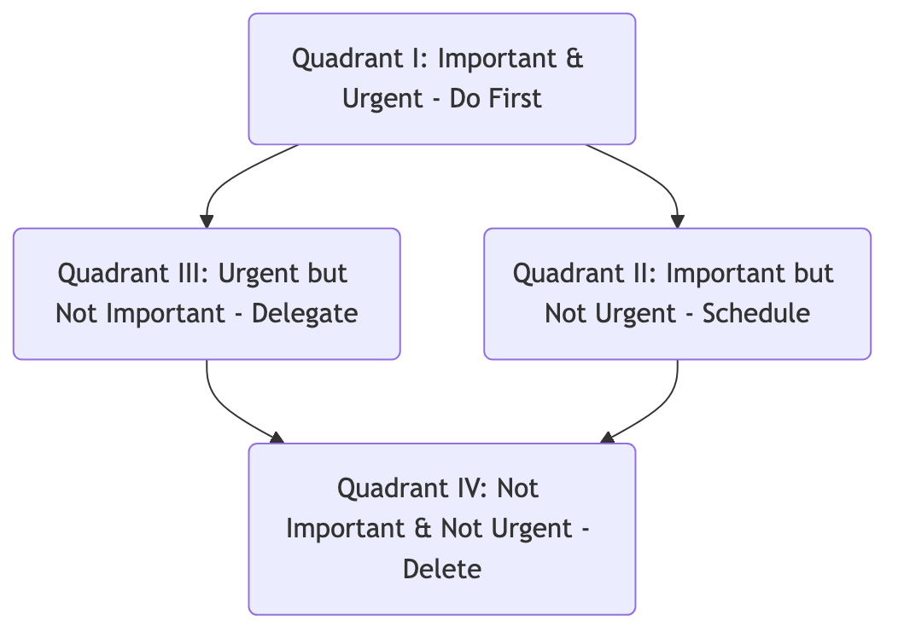

# Eisenhower Matrix

In daily work and life, we often find ourselves overwhelmed by an endless sea of to-do lists, feeling incredibly busy yet seemingly accomplishing nothing. The root of this "busy but unproductive" state often lies in our confusion between **"urgent"** and **"important"** matters, and our habitual prioritization of those constantly "blaring" urgent tasks, while neglecting those truly important for long-term goals. The **Eisenhower Matrix**, also known as the **Urgent/Important Matrix**, is an extremely simple yet profound **personal priority management tool** designed to solve this common dilemma.

The method is attributed to Dwight D. Eisenhower, the 34th President of the United States, who once said: "**I have two kinds of problems: the urgent and the important. The urgent are not important, and the important are never urgent.**" The core of the Eisenhower Matrix is to clearly divide all tasks into four quadrants based on the two dimensions of "**importance**" and "**urgency**," thereby helping us identify what truly deserves our time and effort, and formulate different handling strategies for different tasks. It is a powerful thinking framework that enables us to shift from "passive firefighting" to "proactive planning."

## The Four Quadrants of the Matrix

The Eisenhower Matrix divides all tasks into four logically clear quadrants, providing clear action guidelines for each.



<!--
```mermaid
graph TD
    subgraph Eisenhower Matrix
        direction TB
        subgraph Important
            A(<b>Quadrant I: Important & Urgent</b><br/><i>Do First - Do Immediately</i><br/>- Deadlines for critical projects<br/>- Urgent client crises<br/>- Sudden health issues) --> B(<b>Quadrant II: Important but Not Urgent</b><br/><i>Schedule - Plan to Do</i><br/>- Learning new skills, career planning<br/>- Exercising, maintaining important relationships<br/>- Preventive measures, process optimization);
        end

        subgraph Not Important
            C(<b>Quadrant III: Urgent but Not Important</b><br/><i>Delegate - Delegate to Others</i><br/>- Most meetings and phone calls<br/>- Others' non-core requests<br/>- Some "disguised" urgent chores) --> D(<b>Quadrant IV: Not Important & Not Urgent</b><br/><i>Delete - Avoid Doing</i><br/>- Meaningless social media browsing<br/>- Time-wasting entertainment<br/>- Unnecessary perfectionism);
        end

        A -- Urgent --> C;
        B -- Not Urgent --> D;
    end
```
-->

1.  **Quadrant I: Important & Urgent (The Quadrant of Crises)**
    *   **Content**: These are "crises" and "pressing issues" that must be dealt with immediately. They are both critical to your goals and have imminent deadlines.
    *   **Strategy**: **Do First (Do Immediately)**. You need to focus your energy and prioritize solving these tasks.
    *   **Goal**: An efficient person should **minimize the number of Quadrant I tasks** through efforts in Quadrant II.

2.  **Quadrant II: Important but Not Urgent (The Quadrant of Quality & Leadership)**
    *   **Content**: This is the **most valuable** quadrant. These matters have a profound impact on your long-term goals, personal growth, and quality of life, but they usually don't have an urgent deadline. Examples include learning, planning, building relationships, exercising, improving processes, etc.
    *   **Strategy**: **Schedule (Plan to Do)**. You need to proactively and consciously set aside dedicated time in your calendar to handle these matters.
    *   **Goal**: Successful people will **invest most of their time (60%-80%) in this quadrant**, as this is where true long-term returns are generated.

3.  **Quadrant III: Urgent but Not Important (The Quadrant of Deception)**
    *   **Content**: This is the most deceptive quadrant. These matters often claim to be "urgent" to grab your attention (e.g., a sudden phone call, most meetings, requests from others), but they contribute little to your own core goals.
    *   **Strategy**: **Delegate (Delegate to Others)**. Consider whether these things can be politely declined? Can they be delegated to others? Can they be solved more efficiently (e.g., with an email instead of a meeting)?
    *   **Goal**: Learning to say "no" to tasks in this quadrant is key to improving personal efficiency.

4.  **Quadrant IV: Not Important & Not Urgent (The Quadrant of Waste)**
    *   **Content**: These are purely time-wasting activities that offer no benefit to any of your goals.
    *   **Strategy**: **Delete/Eliminate (Avoid Doing)**. You need to consciously identify and reduce the time spent on these things.
    *   **Goal**: Everyone needs appropriate rest and relaxation, but be wary of unconsciously spending a lot of time in this quadrant.

## How to Apply the Eisenhower Matrix

1.  **Step One: Clear Your Mind, List All Tasks**
    Write down everything you need to do, big or small, on a single list.

2.  **Step Two: Evaluate the Importance and Urgency of Each Task**
    *   **Evaluate Importance**: Ask yourself, "Will doing this bring me closer to my long-term goals (annual goals, life goals)?"
    *   **Evaluate Urgency**: Ask yourself, "Does this have a clear, imminent deadline? Does it require my immediate response?"

3.  **Step Three: Place Tasks into the Four Quadrants**
    Based on your evaluation, place each task from your list into the corresponding quadrant of the matrix.

4.  **Step Four: Plan Your Actions Based on Quadrant Strategy**
    *   First, deal with crises in Quadrant I.
    *   Then, **proactively allocate your main time and energy to Quadrant II tasks**.
    *   Find ways to reduce, delegate, or decline tasks in Quadrant III.
    *   Consciously avoid falling into Quadrant IV.

5.  **Step Five: Regular Review and Adjustment**
    Review and adjust your task matrix weekly or daily. An effective time manager should have a relatively empty Quadrant I because they have prevented most crises from occurring by diligently working in Quadrant II.

## Application Cases

**Case 1: A Project Manager's Day**

*   **Quadrant I**: Handle an online bug blocking the project; report key project progress to the CEO before the deadline.
*   **Quadrant II**: Plan core features for the next iteration; conduct one-on-one meetings with key team members to understand their growth and challenges; learn a new project management tool.
*   **Quadrant III**: Reply to some low-information emails copied to him; attend a departmental meeting not closely related to his project.
*   **Quadrant IV**: Aimlessly browse industry news websites.
*   **Action**: He will first focus on fixing the bug, then proactively set aside 2 hours of "do not disturb time" in the afternoon to focus on Quadrant II planning work.

**Case 2: A Student Preparing for Final Exams**

*   **Quadrant I**: Course paper due tomorrow.
*   **Quadrant II**: Develop a detailed study plan for the core major exam in three weeks; organize and review key knowledge points from this semester.
*   **Quadrant III**: A non-urgent request from the student union asking for help designing a poster.
*   **Quadrant IV**: Aimlessly playing games all night.
*   **Action**: An excellent student will prioritize completing the paper, then dedicate most of their time to the systematic study plan, and politely decline the student union's request or recommend a more suitable person.

**Case 3: CEO of a Startup Company**

*   **Quadrant I**: Deal with a financial crisis that is about to deplete the company's cash flow.
*   **Quadrant II**: Establish connections with potential strategic investors; ponder the strategic direction of the company's next-generation products; build and cultivate a core team culture.
*   **Quadrant III**: Accept a time-consuming interview request from a non-mainstream media outlet.
*   **Quadrant IV**: Indulge in debating trivial topics with people on social media.
*   **Action**: An outstanding CEO, even when dealing with daily crises, must consciously and steadfastly dedicate their most valuable weekly time (e.g., Wednesday mornings) to Quadrant II matters that determine the company's life or death.

## Advantages and Challenges of the Eisenhower Matrix

**Core Advantages**

*   **Simple, Intuitive, Easy to Get Started**: The framework is very clear, and anyone can quickly apply it to their daily task management.
*   **Shifts Mindset, Focuses on Important Things**: The most core value is that it forces us to distinguish between "urgent" and "important," shifting our mindset from "passive reaction" to "proactive planning."
*   **Improves Long-Term Efficiency and Sense of Accomplishment**: By continuously investing in Quadrant II, we can constantly improve our abilities and reduce future crises, thereby entering a virtuous cycle and achieving true, long-term accomplishment.

**Potential Challenges**

*   **Subjectivity of "Importance" Judgment**: If a person lacks clear long-term goals, it will be difficult for them to accurately judge whether something is "important," which may lead them to misjudge many Quadrant III tasks as Quadrant I.
*   **Underestimating the Difficulty of Quadrant II Execution**: Knowing that Quadrant II is important is one thing, but in daily life, resisting the huge temptations of Quadrants I and III and truly investing time and energy in Quadrant II requires great self-discipline and willpower.

## Extensions and Connections

*   **GTD (Getting Things Done)**: GTD provides a more comprehensive and systematic workflow management system for clearing and organizing all your "stuff." The Eisenhower Matrix, on the other hand, can serve as a powerful thinking tool for prioritizing in the "Engage" step of GTD.
*   **Pareto Analysis (80/20 Rule)**: Highly consistent with the philosophy of the Eisenhower Matrix. Typically, the 20% of key activities that yield 80% of the returns are located in Quadrant II.

---
*Reference: Although this methodology is widely attributed to Dwight D. Eisenhower, it was systematically refined and popularized by the renowned management expert Stephen R. Covey. In his global bestseller "The 7 Habits of Highly Effective People," he elaborates on this matrix in detail and presents it as a practical tool for the core habit of "Put First Things First."*