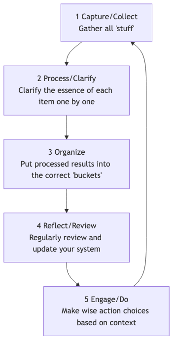
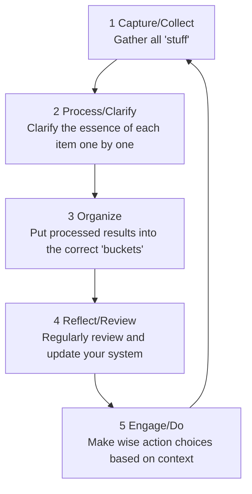
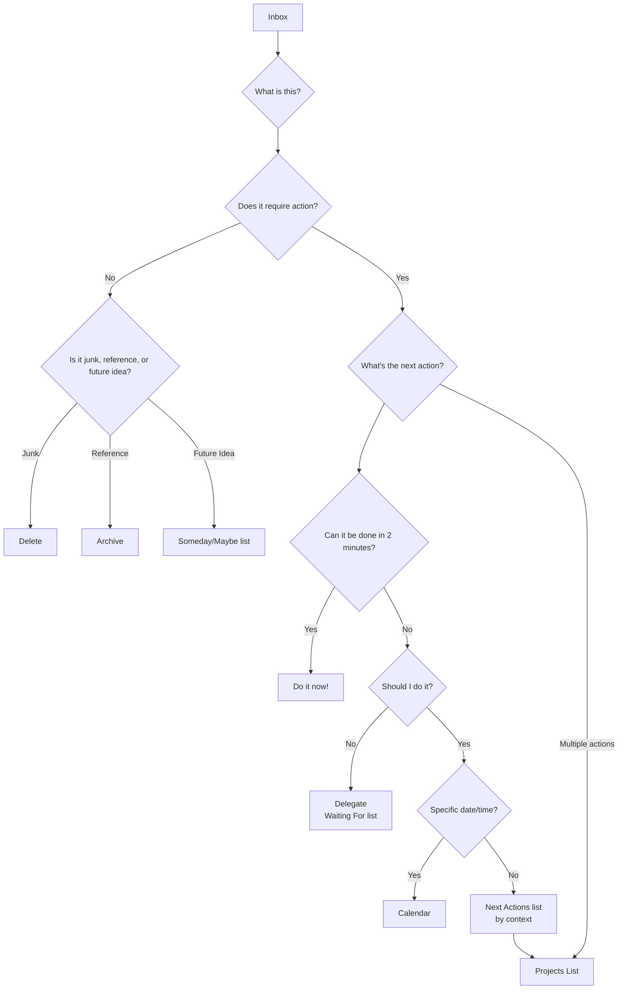

# GTD (Getting Things Done)

Our brain is inherently an excellent "CPU" for **generating ideas**, but it is an extremely poor "hard drive" for **storing information**. When we try to use our brain to remember all our to-dos, appointments, ideas, and commitments, it becomes occupied with these "unfinished matters," leading to stress, anxiety, and mental clutter, making it impossible to focus on the task at hand. **GTD (Getting Things Done)**, created by productivity guru David Allen, is a globally renowned **personal productivity system and workflow management method**.

The core philosophy of GTD is to achieve a **"Mind Like Water"** state of stress-free, highly focused, and efficient work by capturing all pending "stuff" from your mind into an **external, trustworthy system**, and then following a clear, rigorous process to **organize and process** it. It is not a simple time management trick, but a complete operating system designed to free your mind and enable you to calmly handle complex work and life.

## The Five Core Steps of GTD

<!--

-->

1.  **Capture**: Immediately move anything that grabs your attention—whether it's a work task, a personal chore, a sudden inspiration, or a future appointment—out of your brain and into your "**Inbox**." The inbox can be physical (like a file tray, a notebook) or digital (like an email inbox, a to-do app). The key is to ensure your inboxes are as few as possible and can be 100% trusted and emptied.

2.  **Process**: Regularly (at least once a day) "**empty**" your inbox. Strictly follow the **one-item-at-a-time** principle, pick up each "stuff" in your inbox one by one, and ask yourself a core question: "**What is this? Does it require action?**"
    *   If **no action is needed**: It's either **junk** (delete directly), **information that might be needed in the future** (put into a reference file), or an **idea in incubation** (put into a "Someday/Maybe" list).
    *   If **action is needed**: Proceed to the next organizing step.

3.  **Organize**: For items that require action, put them into different "buckets" based on their nature.
    *   **"Two-Minute Rule"**: If the action can be completed **within two minutes**, then **do it immediately**, without any further organization.
    *   **Delegate to others**: If the task should be done by someone else, **delegate** it immediately and put it into a "**Waiting For**" list for tracking.
    *   **Calendar**: For actions with a **specific date or time** (e.g., meetings, appointments), put them into your **calendar**.
    *   **Next Actions List**: For actions that require your personal attention, more than one step, and have no specific date, break them down into the **first, concrete, visible physical action**, and put them into different "Next Actions Lists" according to **context**. Contexts can be "@computer," "@office," "@phone," "@supermarket," etc.
    *   **Projects List**: Any outcome that requires **more than one action** to complete should be defined as a "**Project**" and put into the "Projects List." This list only records the project name; its specific next actions are stored in the corresponding next actions list.

4.  **Reflect**: To maintain the trustworthiness of the system, you must conduct **regular reviews**.
    *   **Daily Review**: Quickly browse your calendar and next actions list daily to plan your day's work.
    *   **Weekly Review**: This is a **crucial part of GTD**. Once a week (usually on weekends), set aside 1-2 hours to conduct a comprehensive, thorough review, update, and cleanup of the entire system, ensuring all projects are under control and all lists are up-to-date.

5.  **Engage**: At any given moment, when you need to decide "What should I do now?", you can make a wise and calm choice from your action list based on the following criteria:
    *   **Context**: Where are you now? What tools do you have? (e.g., if in the office, look at the "@office" list)
    *   **Time Available**: How much free time do you have now? (e.g., if only 10 minutes, choose a task that can be completed quickly)
    *   **Energy Available**: What is your current energy level? (e.g., if energetic, tackle a task that requires high concentration)
    *   **Priority**: Under the above conditions, which task is most important?

### GTD Workflow Processing Diagram

<!--

-->

## Application Cases

**Case 1: A Busy Department Manager**

*   **Capture**: His inbox might include: email inbox, WeChat messages, notes taken during meetings, and sudden ideas that pop into his head.
*   **Process and Organize**:
    *   An email "regarding next quarter's budget notification" -> No action needed -> **Archive** to "Company Finance" reference folder.
    *   An idea "remind subordinate Xiao Zhang to submit weekly report" -> Can be done in 2 minutes -> **Immediately** send a message to Xiao Zhang.
    *   A task "prepare for annual team building" -> Requires multiple steps -> Add "Team Building" to the "**Projects List**"; put the first action "Communicate with HR to get a list of optional venues" into the "**@Office**" next actions list.
    *   An appointment "meeting with client next Wednesday at 3 PM" -> **Put into Calendar**.
*   **Engage**: When he is in the office, has 1 hour of free time, and feels energetic, he can open the "@Office" list and choose to work on "Communicate with HR."

**Case 2: A Freelancer's Project Management**

*   **Projects List**: Might include "Client A's website design project," "Personal blog redesign," "Learn a new programming language," etc.
*   **Next Actions List**:
    *   **@Phone**: Call Client A to confirm feedback on design drafts.
    *   **@Computer-Design**: Based on feedback, revise the website homepage design.
    *   **@Computer-Writing**: Write a blog post about "responsive design."
    *   **@Read/Learn**: Watch the third chapter of the programming course.
*   **Weekly Review**: On Friday afternoon, he checks the progress of all projects, ensuring each project has at least one "next action," and plans the priorities for the next week.

**Case 3: A Student Managing Academics and Life**

*   **Inbox**: Notifications from course WeChat groups, homework assigned by teachers, ideas about club activities, a shopping list for daily necessities.
*   **Projects List**: "Complete History paper," "Prepare for final exams," "Plan freshman welcome party."
*   **Next Actions List**:
    *   **@Library**: Borrow three reference books on the paper topic.
    *   **@Dorm**: Organize math class notes.
    *   **@Supermarket**: Buy toothpaste and shampoo.
*   The **GTD system** helps him clearly separate academic tasks from daily chores and ensures that the right things are done at the right time and in the right place.

## Advantages and Challenges of GTD

**Core Advantages**

*   **Reduces Mental Stress, Frees Up Brain Bandwidth**: By externalizing all "unfinished matters," it greatly reduces the brain's memory burden and the continuous anxiety caused by "fear of forgetting."
*   **Enhances Sense of Control and Calmness**: A trustworthy system assures you that everything is under control, allowing you to approach current tasks more calmly and focused.
*   **Ensures "Important Things" Are Not Missed**: The crucial "Weekly Review" ensures continuous attention and progress on all important projects and long-term goals.
*   **Highly Adaptable and Flexible**: GTD itself does not pre-set priorities but provides a framework that allows you to dynamically and flexibly choose the most appropriate action based on the current context.

**Potential Challenges**

*   **High Initial Cost of Setting Up the System**: The first time you "capture" and set up the complete list system, it may take several hours or even a full day.
*   **Requires Strict Self-Discipline and Habit Formation**: The success of GTD highly depends on whether you can develop the core habits of **continuous capturing** and **regular reviewing**. Once the system is no longer trusted and updated, it will quickly collapse.
*   **Tool Selection Dilemma**: There are many GTD software and tools on the market, and beginners can easily fall into the trap of excessively pursuing the "perfect tool" while neglecting the method itself.

## Extensions and Connections

*   **Eisenhower Matrix**: Can be used in the "Engage" step of GTD as an effective thinking model for judging "priority."
*   **Pomodoro Technique**: Is an excellent specific tactic for executing tasks from the GTD "Next Actions List" that require high concentration.

---
*Reference: David Allen's global bestseller "Getting Things Done: The Art of Stress-Free Productivity" is the sole and most authoritative source for understanding the complete philosophy, process, and best practices behind the GTD method.*