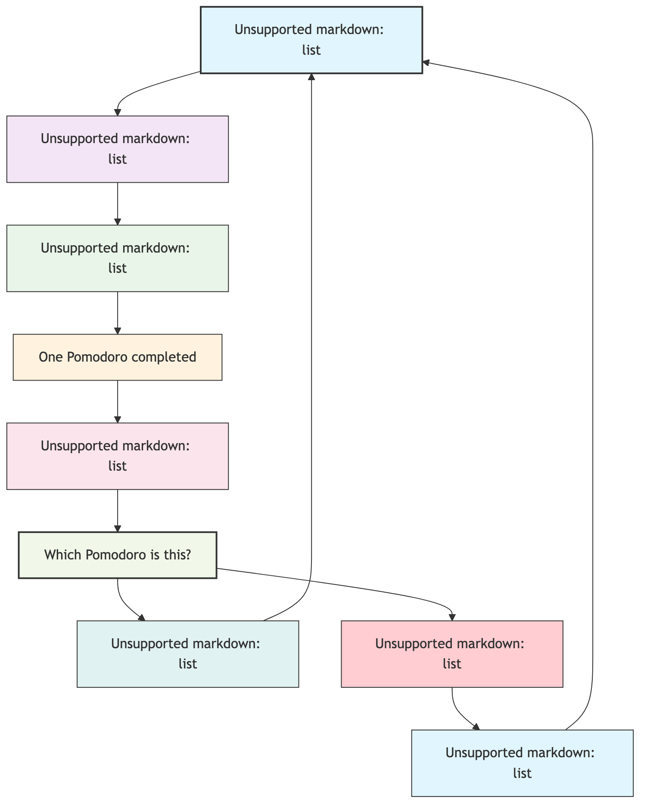

# Pomodoro Technique

We've all been there: facing a daunting and complex task, procrastinating on starting; or while working, our minds wander, easily interrupted by every phone vibration or casual chat from a colleague. As a result, we end the day exhausted, yet our efficiency is far from satisfactory. The **Pomodoro Technique** is an incredibly simple yet exceptionally effective time management method designed to solve this common dilemma.

It doesn't require complex tools or profound theories. Its core lies in using a timer to divide work time into several 25-minute, highly focused "Pomodoros," interspersed with short breaks. This rhythmic cycle of "focus-break" aims to help us overcome procrastination, resist distractions, and maintain a highly efficient work state in a sustainable way.

## The Core Cycle of the Pomodoro Technique

"Pomodoro" means "tomato" in Italian, a name derived from the tomato-shaped kitchen timer used by the method's founder, Francesco Cirillo, during his university days. Its workflow is elegant and concise, forming a complete closed loop.

The core philosophy of this cycle is:
*   **Lowering the Barrier to Entry**: Compared to the grand goal of "I'm going to work all day," the commitment to "I'll focus for 25 minutes first" is clearly easier to get started with.
*   **Protecting Focus**: Within a "Pomodoro," focus is sacred and inviolable. Any interruption means the failure of that Pomodoro, requiring a restart. This forces us to learn to say "no" to distractions.
*   **Making Breaks Essential**: Unlike many people's habit of working straight through, the Pomodoro Technique emphasizes the value of breaks. Short breaks are not a waste of time; they are for recharging for the next focused period, keeping the brain sharp and efficient.

### Pomodoro Technique Flowchart



<!--
```mermaid
graph TD
    A[1. Select a task from your to-do list] --> B(2. Set a 25-minute timer);
    B --> C{3. Work with full concentration<br>until the timer rings};
    C --> D{One "Pomodoro" completed};
    D --> E{4. Mark this Pomodoro on your list};
    E --> F{Which Pomodoro is this?};
    F -- "1st-3rd" --> G[5. Take a 5-minute short break];
    G --> A;
    F -- "4th" --> H[6. Take a 15-30 minute long break];
    H --> I[7. Clear marks, prepare for a new cycle];
    I --> A;
```
-->

## Practicing the Pomodoro Technique: Step-by-Step Guide

Integrating the Pomodoro Technique into your daily routine only requires following these simple steps:

1.  **Plan and Select**
    Before starting your day or a work unit, review your to-do list. Based on priority, select the tasks you will dedicate "Pomodoros" to today.

2.  **Start the First Pomodoro**
    Choose the first task on your list, set your timer (phone app, computer software, or a real kitchen timer) for 25 minutes, and immediately immerse yourself in the work.

3.  **The Sacred 25 Minutes**
    During these 25 minutes, only the current task exists in your world. This is deliberate training for your focus.
    *   **How to handle internal distractions?** When an unrelated thought suddenly pops into your head (e.g., "Oh, I need to remember to buy milk"), don't follow it. Quickly jot down the thought on a piece of paper nearby, then immediately pull your attention back to the task.
    *   **How to handle external distractions?** If a colleague comes over to chat, you can politely tell them: "I'm in a focused session, can I find you in 5 minutes?" If it's a phone call, you can hang up or put it on silent. The key is to defend the integrity of this Pomodoro. If a distraction is urgent and unavoidable, that Pomodoro is void; after handling the urgent matter, you need to start a new Pomodoro from scratch.

4.  **Mandatory Short Break**
    When the timer rings, no matter where you are in your task, you must stop immediately. Mark the just-completed Pomodoro on your task list (e.g., with an "X"). Then, take a 5-minute short break. This break is mandatory; you should stand up, stretch, drink some water, or look out the window. The key is to let your brain disengage from the highly focused state it was just in.

5.  **Cycle and Long Break**
    After the short break, immediately start the next Pomodoro. After every four Pomodoros, take a longer break, about 15 to 30 minutes. You can use this time to take a walk, reply to non-urgent messages, or do something completely relaxing. This long break is crucial for restoring energy and consolidating memory.

## Application Scenarios of the Pomodoro Technique

**Scenario 1: Software Developer Tackling a Complex Feature**

A developer needs to write a complex data synchronization module for a new application. This task seems daunting. He can use the Pomodoro Technique to break it down:
*   **Pomodoro 1-2**: Research technical documentation, design the module's architecture. (After a 20-minute long break)
*   **Pomodoro 3**: Write the core data transfer code.
*   **Pomodoro 4**: Write the data validation code.
*   In this way, he transforms a vague, large task into a series of clear, executable focused sessions.

**Scenario 2: Student Preparing for Final Exams**

A student needs to review an entire textbook on Macroeconomics. Starting directly might feel overwhelming due to the sheer volume of content.
*   **Pomodoro 1**: Quickly skim the first chapter to understand its outline.
*   **Pomodoro 2**: Read and understand the first section of the first chapter in depth, and take notes.
*   **Pomodoro 3**: Complete the exercises for the first section.
*   This method helps the student maintain continuous learning motivation and ensures a balance between study and rest, avoiding long periods of ineffective reading.

**Scenario 3: Designer Completing a Poster Design**

A designer needs to complete an event poster in one afternoon. The design process is full of uncertainties.
*   **Pomodoro 1**: Gather inspiration and materials.
*   **Pomodoro 2**: Brainstorm and sketch 3 different layout drafts.
*   **Pomodoro 3**: Select one draft, refine and color it.
*   **Pomodoro 4**: Adjust details and text layout.
*   Breaks between Pomodoros help the designer step back from the details and view their work with a fresh perspective.

## Advantages and Applicability of the Pomodoro Technique

**Core Advantages**

*   **Overcome Procrastination**: Minimizes the psychological burden of starting work.
*   **Improve Focus**: Deliberately trains the ability to resist distractions within a fixed time.
*   **Quantify Effort**: By recording the number of Pomodoros, you can clearly see your investment in each task.
*   **Reduce Anxiety**: Breaks down large tasks into smaller chunks, giving a greater sense of control.

**Applicability and Limitations**

*   **Ideal Scenarios**: Very suitable for independent tasks that can be clearly broken down and require high concentration, such as writing, coding, reviewing, processing reports, etc.
*   **Challenging Scenarios**: For creative work that requires long periods of uninterrupted thinking (which might interrupt "flow"), or roles that require frequent collaboration and constant responsiveness, a strict 25-minute cycle might not be suitable. In these cases, the duration of the Pomodoro can be flexibly adjusted (e.g., 50 minutes of focus, 10 minutes of rest).

## Extensions and Connections

The Pomodoro Technique can be perfectly combined with other time management and efficiency methods:
*   **GTD (Getting Things Done)**: GTD helps you clear your mind and organize your task list; the Pomodoro Technique is an excellent tactic for executing specific tasks on that list.
*   **Eisenhower Matrix**: When deciding which tasks to complete today, you can use this matrix to help you prioritize and decide which tasks are worth investing valuable Pomodoros in.

---
*Reference: Francesco Cirillo's official book "The Pomodoro Technique" is the best resource for understanding the complete philosophy and practical details behind this method.*