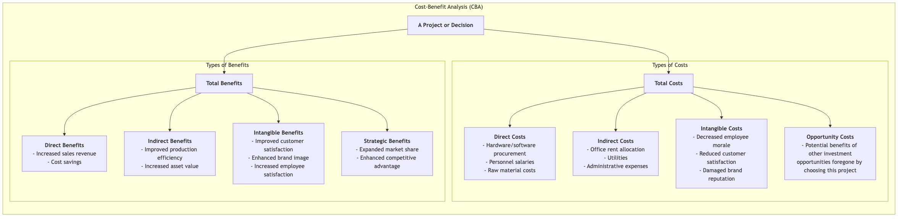
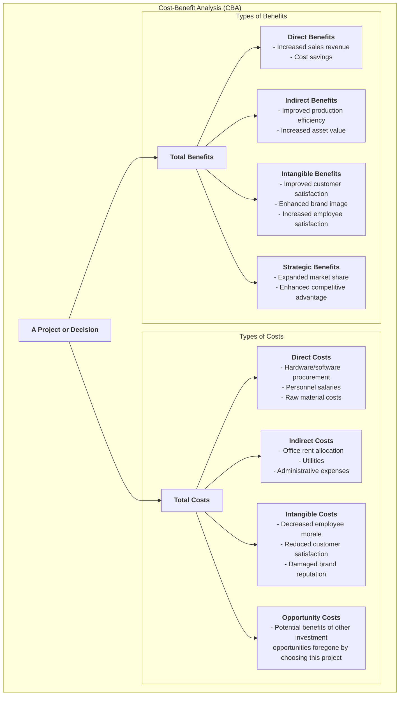

# Cost-Benefit Analysis

In the business world and even in public policy, almost every decision hides a fundamental trade-off: how much **cost** are we willing to pay to gain a certain **benefit**? **Cost-Benefit Analysis (CBA)** is precisely such a systematic decision-making framework, unified by monetary terms. Its core objective is to comprehensively identify, quantify, and compare all costs and benefits of a project or decision to determine if the project is "worth doing" and to provide a rational economic basis for choosing among multiple alternatives.

The logic of cost-benefit analysis is straightforward: if the **total benefits of a project outweigh its total costs**, then it is economically feasible and efficient. It forces decision-makers to move beyond vague qualitative descriptions and convert all relevant positive and negative impacts into comparable monetary values as much as possible. From evaluating a new government infrastructure project to a company deciding whether to invest in a new IT system, cost-benefit analysis is an indispensable rational tool for resource allocation and investment decisions.

## Components of Costs and Benefits

Conducting a comprehensive cost-benefit analysis requires identifying all relevant costs and benefits, including both explicit and implicit ones.

<!--

<!--

<!--

-->
-->
-->

## How to Conduct a Cost-Benefit Analysis

1.  **Step One: Define the Project and Alternatives**
    Clearly define what project or decision you are evaluating. If there are multiple alternatives, each needs to undergo a separate cost-benefit analysis.

2.  **Step Two: Comprehensively Identify All Costs and Benefits**
    Brainstorm with all relevant stakeholders to list all possible positive and negative impacts of the project. At this step, pay special attention to intangible costs and indirect benefits that are easily overlooked.

3.  **Step Three: Monetize Costs and Benefits**
    This is the most challenging step in CBA. You need to assign a reasonable monetary value to each cost and benefit on the list. For direct costs and benefits, this is relatively easy. But for intangible costs and benefits (e.g., "improved customer satisfaction"), some valuation techniques are needed, such as estimating how much customers are willing to pay for better service through market research, or calculating the losses recovered by reducing customer churn.

4.  **Step Four: Consider Time Value and Discounting**
    Since money in the future is worth less than money today, for a project spanning multiple years, future costs and benefits must be discounted to their **present value** using a predetermined **discount rate**. This ensures all costs and benefits are on a comparable time basis.

5.  **Step Five: Calculate Key Decision Metrics and Compare**
    Sum up the present values of all costs and benefits, and calculate one or more of the following key metrics:
    *   **Net Present Value (NPV)**: **Present Value of Total Benefits - Present Value of Total Costs**. If NPV > 0, the project is economically feasible. Among multiple options, the one with the highest NPV is usually chosen.
    *   **Benefit-Cost Ratio (BCR)**: **Present Value of Total Benefits / Present Value of Total Costs**. If BCR > 1, the project is feasible. This ratio is useful when comparing projects of different scales.
    *   **Return on Investment (ROI)**: **(Total Benefits - Total Costs) / Total Costs × 100%**. Visually shows the profitability of the investment.
    *   **Payback Period**: The time required for the cumulative benefits of the project to equal the initial investment.

6.  **Step Six: Conduct Sensitivity Analysis and Make Recommendations**
    Since many estimates (especially for intangible items and the choice of discount rate) involve uncertainty, **sensitivity analysis** is needed. This involves changing some key assumptions (e.g., "What if sales growth is 20% lower than expected?") and observing their impact on the final results (e.g., NPV). Finally, based on all analyses, provide clear, data-backed recommendations to decision-makers.

## Application Cases

**Case 1: Company Deciding Whether to Upgrade its ERP System**

*   **Costs**:
    *   Direct Costs: Software procurement fees, hardware upgrade fees, external consulting and implementation fees, employee training fees.
    *   Intangible Costs: Short-term productivity decrease during system migration, employee resistance to the new system.
*   **Benefits**:
    *   Direct Benefits: Labor cost savings through process automation, reduced capital tied up in inventory through optimization.
    *   Indirect Benefits: Improved data accuracy, increased decision-making efficiency.
    *   Intangible Benefits: Faster customer order processing, improved customer satisfaction.
*   **Analysis**: By monetizing and discounting the above items over the next 5 years, the NPV of the project is calculated. If the NPV is positive, the investment is worthwhile.

**Case 2: Government Evaluating Whether to Build a New Highway**

*   **Costs**:
    *   Direct Costs: Land acquisition fees, construction costs, maintenance costs for decades to come.
    *   Intangible Costs: Damage to the natural environment along the route, social problems caused by relocation, noise and traffic congestion during construction.
*   **Benefits**:
    *   Direct Benefits: Toll revenue.
    *   Indirect Benefits: Savings in transportation time and costs for residents and businesses along the route, stimulated regional economic development and job growth.
    *   Intangible Benefits: Value of lives saved due to reduced traffic accidents.
*   **Analysis**: CBA for public projects is particularly complex because it requires professional estimation of "value of life," "environmental value," etc., in the public policy domain. The final Benefit-Cost Ratio (BCR) is a key basis for deciding whether to proceed with the project.

**Case 3: Individual Deciding Whether to Pursue a Full-time MBA**

*   **Costs**:
    *   Direct Costs: High tuition fees, book fees, living expenses.
    *   Opportunity Costs: All salary income foregone during the MBA study period (usually two years), which is often the largest cost.
*   **Benefits**:
    *   Direct Benefits: Significant increase in expected salary after graduation.
    *   Intangible Benefits: Acquired knowledge and skills, strong alumni network, enhanced personal brand.
*   **Analysis**: The candidate can estimate their entire career's cash flow (with MBA vs. without MBA) and calculate its net present value to determine if this "self-investment" is worthwhile.

## Advantages and Challenges of Cost-Benefit Analysis

**Core Advantages**

*   **Rational and Data-Driven**: Provides a clear, rational economic comparison framework for decision-making, reducing subjective bias.
*   **Comprehensive**: Forces decision-makers to consider all positive and negative impacts of a project, not just the most obvious ones.
*   **Resource Optimization**: Helps allocate limited resources to projects that generate the greatest net benefits.

**Potential Challenges**

*   **Difficulty in Monetization**: The biggest challenge lies in assigning a fair and credible monetary value to intangible, non-market items (e.g., "brand reputation," "environmental protection," "value of life"). This process is often controversial.
*   **Accuracy of Forecasts**: Analysis results are highly dependent on forecasts of future costs and benefits, and these forecasts themselves are full of uncertainty.
*   **Ignoring Fairness Issues**: CBA primarily focuses on overall economic efficiency and may sometimes overlook whether the distribution of costs and benefits among different groups is fair.

## Extensions and Connections

*   **Decision Matrix**: When decision criteria cannot be fully monetized, a decision matrix provides a more flexible alternative.
*   **Cost-Effectiveness Analysis (CEA)**: When project benefits are difficult to monetize (e.g., in healthcare), but their effectiveness can be measured by a consistent non-monetary unit (e.g., "number of successfully cured patients," "life-years gained"), CEA can be used. It calculates "how much it costs to achieve one unit of effect."

---
*Reference: The concept of cost-benefit analysis can be traced back to the 19th-century French engineer Jules Dupuit's evaluation of public works projects. In the 20th century, it was widely applied in public policy evaluation in countries like the UK and US, and became a core tool in project management and corporate investment decisions.*