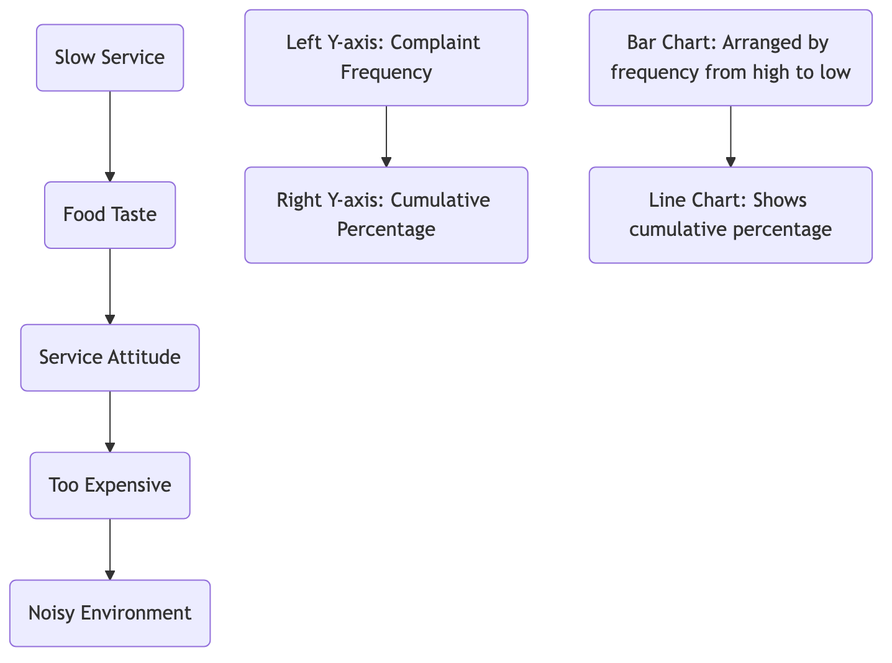

# Pareto Analysis

In our work and life, we often encounter a common and profound pattern: **a few key causes lead to the vast majority of results**. For example, 80% of a company's profits might come from 20% of its customers; 80% of software crashes are caused by 20% of bugs; and 80% of our worries stem from 20% of things. **Pareto Analysis**, based on this "**80/20 rule**," aims to help us identify the **"vital few"** among numerous influencing factors that play a decisive role, thereby concentrating limited time, energy, and resources on areas that yield the greatest benefits.

Pareto analysis is not just a data analysis technique but also an efficient decision-making and management philosophy. It was proposed by management guru Joseph Juran and named after Italian economist Vilfredo Pareto, who discovered in the 19th century that 80% of Italy's land was owned by 20% of the population. The core tool of Pareto analysis is the **Pareto Chart**, which, through a unique combination of bar and line graphs, sorts various causes of a problem by their importance (usually frequency or cost) from high to low, allowing us to easily identify the main issues at a glance.

## Components of a Pareto Chart

Pareto Chart is a special type of chart that cleverly combines two graphical elements to convey rich information.

*   **Bar Chart**:
    *   The X-axis represents different **cause categories** leading to the problem (e.g., different types of customer complaints).
    *   Bars are arranged from left to right in **descending order** of their impact (e.g., frequency of occurrence, cost incurred).
    *   The left Y-axis represents the specific value for each cause category (e.g., frequency).

*   **Line Graph**:
    *   This line is called the **cumulative percentage curve**.
    *   It shows the cumulative percentage of the total impact accounted for by the cause categories from left to right.
    *   The right Y-axis represents the cumulative percentage from 0% to 100%.

By observing this chart, we can quickly locate the steepest rising area of the cumulative percentage curve, and the corresponding bars are the "vital few" that we need to prioritize.

### Pareto Chart Example

Suppose a restaurant analyzed all customer complaints from the last month:



<!--
```mermaid
graph TD
    subgraph Pareto Analysis of Customer Complaint Reasons
        direction LR
        subgraph X-axis (Cause Categories)
            A(Slow Service) --> B(Food Taste) --> C(Service Attitude) --> D(Too Expensive) --> E(Noisy Environment);
        end
        subgraph Y-axis (Frequency and Cumulative Percentage)
            F(Left Y-axis: Complaint Frequency) -- Right Y-axis: Cumulative Percentage --> G;
        end
        subgraph Chart Area
            H["Bar Chart: Arranged by frequency from high to low<br/>(e.g., Slow Service: 50 times, Food Taste: 25 times...)<br/>Line Chart: Shows cumulative percentage<br/>(e.g., At 'Slow Service', cumulative percentage is 50%;<br/>At 'Food Taste', cumulative percentage is 75%...)"]
        end
    end
```
-->
*   **Analysis**: From this (hypothetical) chart, the restaurant manager can clearly see that "slow service" and "food taste" might account for 75% of all complaints. Therefore, instead of spreading efforts to solve all problems, they should concentrate resources on prioritizing the optimization of kitchen service processes and dish development processes.

## How to Conduct a Pareto Analysis

1.  **Step One: Define the Problem to Analyze and Cause Categories**
    Clearly define the core problem you want to solve (e.g., "reduce product defects") and determine the cause categories for classification (e.g., types of defects: scratches, functional failures, missing parts, etc.).

2.  **Step Two: Collect Data and Determine Measurement Units**
    Systematically collect data on the occurrence of each cause category over a period. You need to determine a consistent unit of measurement. The most common is **frequency** (number of occurrences), but in some cases, **cost** (economic loss caused by each reason) might be a more insightful unit.

3.  **Step Three: Organize and Sort Data**
    Sort all cause categories in descending order according to your chosen measurement unit (e.g., frequency). Then, calculate the percentage for each category and the cumulative percentage from high to low.

4.  **Step Four: Draw the Pareto Chart**
    *   Create a combined chart.
    *   Draw the bar chart, with the X-axis representing cause categories and the left Y-axis representing frequency, and draw the bars in the sorted order.
    *   Draw the line graph, marking the cumulative percentage at the center top of each bar, and then connect these points to form the cumulative curve. The right Y-axis indicates 0% to 100%.

5.  **Step Five: Analyze the Chart and Determine Action Focus**
    Analyze the Pareto chart to identify the "vital few" causes that account for approximately 80% of the problems. These are the key areas you need to focus on for root cause analysis (e.g., using "5 Whys" or "Fishbone Diagram") and resolution.

## Application Cases

**Case 1: Bug Management in Software Development**

*   **Problem**: A software product received a large number of user bug reports after launch.
*   **Application**: The development team categorized all bugs by module (e.g., "user login module," "payment module," "data reporting module," etc.) and counted the number of bugs under each module. By drawing a Pareto chart, they found that over 70% of the bugs were concentrated in the "data reporting module." This finding allowed the team to concentrate testing and development resources on prioritizing the refactoring and fixing of this most unstable module, thereby efficiently improving the overall product quality.

**Case 2: Personal Time Management**

*   **Problem**: An individual feels busy every day but is inefficient and doesn't know where their time goes.
*   **Application**: They spent a week recording all their daily time expenditures and categorizing them (e.g., "coding," "meetings," "browsing social media," "processing emails," etc.). After drawing a Pareto chart, they were shocked to find that nearly 60% of their working time was occupied by "ineffective meetings" and "frequent social media checks." This analysis prompted them to selectively attend meetings and use the Pomodoro Technique to reduce distractions, thereby investing more time in truly important work.

**Case 3: Inventory Management Optimization**

*   **Problem**: A retailer wants to reduce its inventory management costs.
*   **Application**: They analyzed the annual sales of all products in their warehouse and drew a Pareto chart. This is known as **ABC Classification**. They found that Class A products (approximately 20% of all product types) contributed about 80% of sales. Based on this, they developed differentiated inventory management strategies: for Class A products, they implemented the strictest inventory monitoring and demand forecasting to ensure no stockouts; for Class C products with very low sales, they adopted a more lenient management strategy, or even considered delisting them.

## Advantages and Challenges of Pareto Analysis

**Core Advantages**

*   **Focus on Key Issues**: The most significant advantage is that it helps us quickly identify the most important driving factors from a multitude of complex problems, avoiding scattered and wasted resources.
*   **Strong Basis for Decision-Making**: Provides clear, visual data evidence to support decisions on "what we should prioritize," making it easy to reach consensus within the team.
*   **Highly Versatile**: Can be applied in almost all fields, including quality management, project management, time management, and sales analysis.

**Potential Challenges**

*   **Looks Only at History, Not Future**: Pareto analysis is based on historical data; it cannot predict new problems that may arise in the future.
*   **Neglect of Qualitative Factors**: It primarily focuses on quantifiable factors (e.g., frequency, cost). For problems that occur infrequently but have extremely severe impacts (e.g., a rare but fatal safety accident), Pareto analysis might underestimate their importance.
*   **Lack of Cause Analysis**: Pareto analysis can only tell you "what" the main problems are, but not "why" these problems occur. It is a tool for identifying problems, not for solving them.

## Extensions and Connections

*   **Root Cause Analysis**: After identifying the "vital few" problems through Pareto analysis, the next step is usually to use tools like **Fishbone Diagram** or **5 Whys** to conduct an in-depth root cause analysis of these key problems.
*   **Quality Management**: Pareto analysis is a fundamental and core tool in quality management systems such as Total Quality Management (TQM) and Six Sigma.

---
*Reference: The concept of Pareto analysis, as one of the seven basic tools of quality management, its ideas and applications are extensively elaborated in the Project Management Body of Knowledge (PMBOK) and various textbooks on quality management and operations management. Joseph Juran's "Quality Control Handbook" made pioneering contributions to the application of this principle in management.*