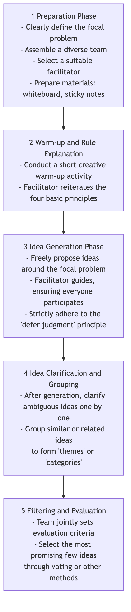

# Brainstorming

When seeking innovation and solving complex problems, our biggest enemy is often the deep-seated, restrictive mental models in our own minds. **Brainstorming** is a classic, powerful, and widely popular **group idea generation technique** designed to break these mental shackles. It was proposed by advertising executive Alex F. Osborn in the 1940s, and its core objective is to encourage participants to generate as many novel, diverse, and even seemingly impractical ideas as possible in a short period, by creating a completely open, free, and non-judgmental discussion atmosphere.

The essence of brainstorming lies in **"quantity first, quality second."** It firmly believes that the quality of ideas can be fostered through the accumulation of quantity. By deferring judgment and encouraging wild ideas, brainstorming can effectively switch a team's creativity from a "critical mode" to a "generative mode," thereby exploring various unknown possibilities in a safe environment and providing rich, diverse raw material for subsequent filtering and deepening.

## Four Basic Principles of Brainstorming

To ensure that brainstorming achieves its intended results, the following four basic principles proposed by Osborn must be strictly adhered to. They are the cornerstone of creating a safe and free environment.

1.  **Defer Judgment**: This is the most core and unshakeable principle. During brainstorming, **absolutely no** criticism, questioning, or judgment of any kind is allowed for any idea proposed, no matter how absurd or impractical it may sound. Judgment will be conducted in the subsequent filtering stage.

2.  **Encourage Wild Ideas**: Encourage participants to think outside the box. Ideas that seem crazy or illogical can often break mental rigidity and inspire others to generate more groundbreaking ideas.

3.  **Go for Quantity**: Set a clear, challenging quantitative goal (e.g., "Generate 100 ideas in 20 minutes"). The more ideas, the greater the probability of high-quality ideas emerging.

4.  **Build on the Ideas of Others**: This is also known as "piggybacking" or "snowballing." Encourage participants to listen carefully to others' ideas and think about how to combine, improve, or extend them, thereby generating new, more refined ideas. This reflects the synergistic effect of "1+1>2."

### Brainstorming Process



<!--
```mermaid
graph TD
    subgraph A Successful Brainstorming Session
        A(<b>1 Preparation Phase</b><br/>- Clearly define the focal problem<br/>- Assemble a diverse team<br/>- Select a suitable facilitator<br/>- Prepare materials: whiteboard, sticky notes) --> B(<b>2 Warm-up and Rule Explanation</b><br/>- Conduct a short creative warm-up activity<br/>- Facilitator reiterates the four basic principles);
        B --> C(<b>3 Idea Generation Phase</b><br/>- Freely propose ideas around the focal problem<br/>- Facilitator guides, ensuring everyone participates<br/>- Strictly adhere to the "defer judgment" principle);
        C --> D(<b>4 Idea Clarification and Grouping</b><br/>- After generation, clarify ambiguous ideas one by one<br/>- Group similar or related ideas<br/>to form "themes" or "categories");
        D --> E(<b>5 Filtering and Evaluation</b><br/>- Team jointly sets evaluation criteria<br/>- Select the most promising few ideas<br/>through voting or other methods);
    end
```
-->

## How to Organize an Effective Brainstorming Session

1.  **Careful Preparation**
    *   **Define a Clear Focal Problem**: The problem should not be too broad or too narrow. For example, refine the overly broad question "How to increase company profit?" to "How can we increase the repeat purchase rate of existing customers by 20%?"
    *   **Assemble a Diverse Team**: Invite 5-10 people from different backgrounds and functions to participate. Diverse perspectives can lead to richer ideas.
    *   **Choose an Excellent Facilitator**: The facilitator does not directly contribute ideas; their role is to guide the process, manage time, encourage participation, and firmly stop any judgmental behavior.

2.  **Create the Right Atmosphere**
    *   Choose a relaxed, comfortable environment, and prepare tools such as whiteboards, sticky notes, and markers.
    *   Before the official start, you can use short creative warm-up games (e.g., "100 uses for a paperclip") to help participants relax and enter a creative thinking mode.

3.  **Generate and Record Ideas**
    *   The facilitator announces the start, and sets a clear time limit (usually 15-30 minutes).
    *   Encourage participants to vocalize any ideas that come to mind, or write them on sticky notes and post them on the wall. The facilitator or designated recorder needs to quickly record all ideas without any modification or deletion.

4.  **Converge and Evaluate**
    *   After the generation phase, move to the convergence phase. First, the facilitator leads everyone to quickly review all ideas, and clarify any ambiguous ones.
    *   Then, categorize and merge similar ideas into a few core thematic directions.
    *   Finally, the team jointly sets a few evaluation criteria (e.g., "feasibility," "innovativeness," "user value") and, through voting (e.g., each person gets a few small dot stickers), selects 2-3 most recognized and promising ideas for further in-depth study.

## Application Cases

**Case 1: Naming a New App**

*   **Focal Problem**: "Come up with a catchy, easy-to-remember name for our social app focused on 'food sharing.'"
*   **Application**: The marketing team conducted a 30-minute brainstorming session. They generated over 80 candidate names, including "Foodie Notes," "Taste Buddies," and "Snap & Eat." In the subsequent filtering, they ultimately chose a name that reflected both product features and social attributes.

**Case 2: Resolving Customer Complaints**

*   **Focal Problem**: "How can we reduce customer complaints about 'slow logistics delivery' by 50%?"
*   **Application**: A cross-functional team consisting of customer service, operations, and logistics personnel brainstormed together. Ideas generated included: "Collaborate with faster express companies," "Establish front-end warehouses," "Optimize packaging processes," and "Offer discount coupons for delayed orders." These ideas provided a rich starting point for formulating specific solutions.

**Case 3: Designing a Marketing Campaign**

*   **Focal Problem**: "How can we plan a creative online marketing campaign for our juice brand for the upcoming summer?"
*   **Application**: Team members let their imaginations run wild, proposing various ideas such as: "Host a 'Summer Special' UGC contest," "Collaborate with popular island travel bloggers for live streams," "Launch packaging that can be frozen into popsicles," and "Initiate a social media challenge about the taste of summer." These ideas, after combination and refinement, eventually formed a complete marketing plan.

## Advantages and Challenges of Brainstorming

**Core Advantages**

*   **Efficient Idea Generation**: Can quickly generate a large number of diverse ideas in a short time.
*   **Promotes Team Collaboration and Cohesion**: Creates an equal, pressure-free environment, helping to enhance team cohesion and collective creativity.
*   **Breaks Mental Rigidity**: By encouraging wild ideas and deferring judgment, it effectively helps teams break free from conventional thinking.

**Potential Challenges**

*   **Risk of "Groupthink"**: If not properly facilitated, a few individuals' opinions might dominate the discussion, or people might tend to propose "safer" ideas.
*   **"Free-Riding" Phenomenon**: In a team, some individuals might be less proactive and simply "free-ride," contributing fewer ideas.
*   **Difficulty in Execution**: Strictly enforcing the "defer judgment" principle requires high skill from the facilitator and a mature team culture.
*   **Lack of Follow-up Work**: Brainstorming itself is only responsible for generating ideas. Without subsequent, systematic filtering, evaluation, and execution mechanisms, even the best ideas remain castles in the air.

## Extensions and Connections

*   **Reverse Brainstorming**: An interesting variation. Instead of asking "How can we succeed?", it asks "How can we completely mess this up?" By identifying all factors that could lead to failure, the team can then think in reverse to devise preventive measures.
*   **Brainwriting**: To prevent eloquent speakers from dominating the discussion, written forms can be used. For example, the 6-3-5 method, where 6 participants each write 3 ideas in 5 minutes, then pass the paper to the next person for inspiration and extension.
*   **Six Thinking Hats**: Can serve as a structured tool for the subsequent "evaluation" phase of brainstorming, guiding the team to comprehensively examine filtered ideas from different angles.
*   **Mind Mapping**: An excellent visual tool for organizing and structuring brainstorming results.

---
*Reference: Alex F. Osborn first systematically elaborated on the principles and methods of brainstorming in his 1953 book "Applied Imagination." It remains one of the most widely used idea generation techniques globally today.*