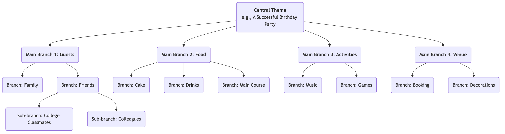

# Mind Mapping

Our brains, when thinking, are not linear and straightforward; instead, they are full of leaps, associations, and divergences. **Mind Mapping** is precisely such a powerful **visual thinking tool** that deeply aligns with our brain's natural working mode. Invented by British scholar Tony Buzan in the 1970s, its core lies in connecting keywords, ideas, images, and colors around a **central theme** in a **radial, progressively layered structure**, thereby organizing a complex topic or a scattered collection of information into a clear, orderly, easy-to-remember, and easy-to-understand "brain map."

The charm of mind mapping lies in its **non-linear** characteristic. It encourages us to associate freely, capture fleeting inspirations, and organize them in an organic, interconnected way. It is not just a tool for recording information but a powerful thinking partner that stimulates creativity, clarifies logic, and enhances memory. From planning and taking reading notes to preparing presentations and brainstorming, mind mapping can greatly improve our thinking efficiency and depth.

## Core Components of a Mind Map

A standard mind map follows a few simple but crucial drawing rules.

1.  **Central Image/Topic**: In the very center of the canvas, use a striking image or keyword to represent your core theme. This is the starting point for all thinking.
2.  **Main Branches**: Thick, curved lines radiating directly from the central theme, representing the main first-level branches or categories of that theme. Each main branch should have a keyword.
3.  **Sub-branches**: Thinner lines extending from the main branches, representing further refinement and elaboration of the main branch content. Branches can extend infinitely, forming a hierarchical tree structure.
4.  **Keywords**: On each branch, use only a concise keyword or short phrase that summarizes the core idea, rather than complete sentences. This helps to stimulate more associations.
5.  **Colors**: Use different colors for different main branches and their sub-branches. Colors can help us categorize and organize, and greatly stimulate visual memory.
6.  **Images**: Use small icons, symbols, and simple drawings as much as possible in various parts of the map. As the saying goes, "a picture is worth a thousand words"; images can greatly enhance the map's interest and memorability.

### Mind Map Structure Example

<!--

<!--

<!--

-->
-->
-->

## How to Draw a Mind Map

1.  **Step One: Start from the Center**
    Take a blank piece of paper and place it horizontally. In the very center, draw an image that represents your core theme, or write down the keyword.

2.  **Step Two: Draw Main Branches**
    Draw several thick, curved lines radiating from the central theme as main branches. Each main branch represents a core category. Write the corresponding keyword above the line.

3.  **Step Three: Add Branches and Keywords**
    Continue drawing thinner branches from each main branch, and write more specific keywords above the lines. Keep the length of the lines and text consistent. This process is like a large tree growing new twigs.

4.  **Step Four: Use Colors and Images**
    Assign different colors to different main branch systems. Draw some simple small icons or symbols wherever you feel appropriate to make your map "come alive."

5.  **Step Five: Free Association, Continuous Expansion**
    Don't be constrained by order; let your thoughts freely jump between different branches. When you think of a new point, immediately find the category it belongs to and add a new branch. The entire process should be relaxed and enjoyable.

## Application Cases

**Case 1: Taking Reading Notes**

*   **Scenario**: After reading a book on "efficient habits," you want to organize and remember the core content.
*   **Application**:
    *   **Central Theme**: The book title "Efficient Habits."
    *   **Main Branches**: Can be the titles of each chapter of the book, such as "The Power of Habits," "The Habit Loop," "How to Build Good Habits," "How to Break Bad Habits."
    *   **Sub-branches**: Under each main branch, use keywords to record the core arguments, key cases, and specific methods of that chapter. For example, under the "Habit Loop" main branch, you can branch out into "Cue," "Routine," and "Reward."
    *   In this way, the logical framework and core knowledge points of the entire book are condensed into a clear diagram, which is very convenient for review and memorization.

**Case 2: Preparing a Presentation or Report**

*   **Scenario**: You need to give a 20-minute report to management on the "Company's Annual Marketing Plan."
*   **Application**:
    *   **Central Theme**: "Annual Marketing Plan."
    *   **Main Branches**: "Market Analysis," "Target Audience," "Core Strategies," "Budget Allocation," "Expected KPIs."
    *   **Sub-branches**: Under each main branch, further refine the points to be elaborated. For example, under "Core Strategies," you can branch out into "Content Marketing," "Social Media Promotion," "Offline Activities," etc.
    *   This mind map forms the complete outline of your presentation. During the presentation, you can look at the map to ensure your logic is clear and no key points are missed.

**Case 3: Organizing a Team Brainstorming Session**

*   **Scenario**: A team needs to generate creative ideas for "How to improve product user experience."
*   **Application**:
    *   **Central Theme**: "Improve User Experience."
    *   **Main Branches**: Can be preset as aspects of user experience, such as "Performance," "Usability," "Visual Design," "Customer Support."
    *   **Process**: Team members freely propose ideas around these main branches, and the facilitator adds these ideas to the corresponding branches of the mind map in real-time as keywords. The visualization and interconnectedness of the mind map can greatly stimulate team members to "piggyback" on ideas, generating more associations and creativity.

## Advantages and Challenges of Mind Mapping

**Core Advantages**

*   **Aligns with Brain Thinking**: The radial structure mimics the connections of brain neurons, making thinking and association more natural and fluid.
*   **Stimulates Creativity**: The non-linear nature encourages free association, helping to break the limitations of linear thinking and generate more ideas.
*   **Enhances Memory**: By combining keywords, colors, images, and other elements, it engages both left and right brain hemispheres, greatly enhancing memory effects.
*   **Clear at a Glance**: Can present a large amount of complex information in a highly condensed, clearly structured way, making it easy to grasp the big picture quickly.

**Potential Challenges**

*   **Highly Personalized**: Mind maps drawn by individuals can have strong subjectivity in their logic and keyword selection, and others may require some explanation to fully understand them initially.
*   **Not Suitable for Presenting Final, Formal Documents**: It is an excellent tool for thinking and conceptualization, but its hand-drawn, non-linear style is generally not suitable for final, formal business reports or academic papers that require strict formatting.
*   **Tool Limitations**: Although there are many mind mapping software tools, hand-drawing is generally considered the most creativity-stimulating way. However, hand-drawn maps are less convenient for modification and sharing than electronic versions.

## Extensions and Connections

*   **Brainstorming**: Mind mapping is an ideal tool for conducting and organizing brainstorming results. Scattered ideas generated during brainstorming can be categorized and structured in real-time using a mind map.
*   **Concept Map**: Similar to a mind map, but focuses more on precisely expressing the **specific relationships** between different concepts (e.g., using text on connecting lines to explain "A causes B" or "B is part of C"). It is more logically rigorous, while mind maps focus more on free association and brainstorming.

---
*Reference: Tony Buzan is known as the "father of mind mapping." His book "The Mind Map Book" is the authoritative bible for this method, detailing its principles, rules, and wide applications in various fields.*