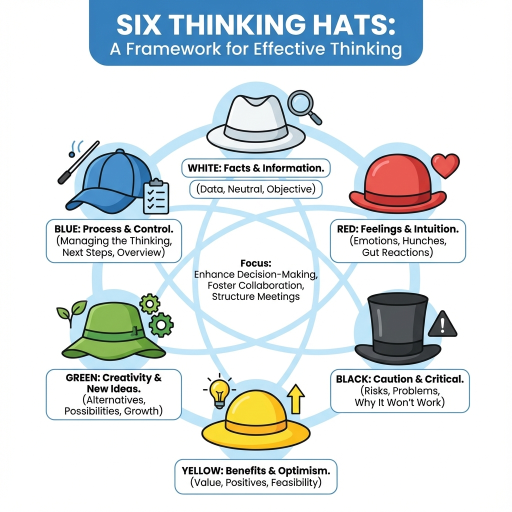

# Six Thinking Hats

In team discussions or individual thinking, our minds often fall into chaos: on one hand, processing information; on the other, generating ideas; simultaneously engaging in critical thinking, and being influenced by various emotions. This "hodgepodge" thinking style is inefficient and highly prone to conflict and opposition. The **Six Thinking Hats**, designed by Dr. Edward de Bono, the "father of creative thinking," is an extremely powerful **Parallel Thinking** tool aimed at solving this dilemma. Its core lies in deliberately breaking down the thinking process into six different, independent "channels," each represented by a virtual "hat" of a specific color.

The essence of parallel thinking is that it requires all participants, at the same time, to "wear" the same hat and think in the same direction. This completely changes the confrontational mode of traditional meetings, where "I oppose your view," into a collaborative mode of "let's all look at the risks of this issue (black hat)." It makes complex thinking processes orderly and efficient, and provides teams with a safe, structured way to comprehensively and thoroughly explore all aspects of a problem.

!!! abstract "Key takeaways"

    - **White** = facts, **Red** = feelings, **Black** = risks, **Yellow** = benefits, **Green** = new ideas, **Blue** = managing the process.
    - **The core rule**: everyone wears the same hat at the same time. It is not about assigning a color to each person.
    - **The Blue Hat** belongs to the facilitator: set goals and the sequence at the start, summarize and decide at the end.
    - **There is no single correct sequence**: choose it to fit the purpose of the meeting (common sequences below).
    - **Most common failures**: turning it into role-play, or letting the Black Hat become criticism of people.

## Detailed Functions of the Six Hats

Each hat represents a unique, clear thinking mode.

1.  **⚪ White Hat - Neutrality and Objectivity**
    *   **Thinking Mode**: Like a blank sheet of paper, purely focuses on **information, facts, and data**.
    *   **Core Questions**: "What facts do we currently have?" "What information do we need to obtain?" "Is this information verifiable?"
    *   **When Wearing the White Hat**: You only state objective facts, without expressing any personal opinions or interpretations. It helps the team establish a common information base.

2.  **🔴 Red Hat - Emotion and Intuition**
    *   **Thinking Mode**: Represents **emotions, intuition, hunches, and "gut feelings."** It is subjective and non-rational.
    *   **Core Questions**: "What is my feeling about this idea?" "How do I feel about this (excited, worried, doubtful)?"
    *   **When Wearing the Red Hat**: You only need to express your feelings, **without providing any reasons or justifications for your feelings**. This provides a legitimate outlet for important, inexpressible intuitive feelings.

3.  **⚫ Black Hat - Caution and Risk**
    *   **Thinking Mode**: This is the "risk assessment" hat, representing **caution, criticism, and logical negativity**.
    *   **Core Questions**: "What are the potential risks and weaknesses of this plan?" "What is the worst-case scenario?" "Why might this idea not work?"
    *   **When Wearing the Black Hat**: Your task is to identify potential difficulties, obstacles, and negative consequences. It helps us stay clear-headed and avoid blind optimism. Black hat thinking must be based on logic, not purely negative emotions.

4.  **🟡 Yellow Hat - Benefits and Value**
    *   **Thinking Mode**: Opposite to the black hat, it represents **optimism, positivity, and constructiveness**. It focuses on finding **value, benefits, and feasibility**.
    *   **Core Questions**: "What are the benefits and value of this idea?" "How can we make it happen?" "What would be the best-case scenario?"
    *   **When Wearing the Yellow Hat**: You need to logically explore the bright spots of an idea. It helps us see opportunities and build confidence for action.

5.  **🟢 Green Hat - Creativity and Growth**
    *   **Thinking Mode**: Like vibrant plants, it represents **creativity, new possibilities, and alternatives**.
    *   **Core Questions**: "Do we have any other options?" "Is there a completely new and different way?" "What if we break the rules?"
    *   **When Wearing the Green Hat**: This is the brainstorming moment, encouraging all sorts of novel, even seemingly impractical ideas. Its task is to sow seeds, not to judge.

6.  **🔵 Blue Hat - Control and Organization**
    *   **Thinking Mode**: Like the sky, it oversees the whole picture. It represents **thinking about the thinking process itself (metacognition)**, acting as the "commander" and "facilitator" of thought.
    *   **Core Questions**: "What is the goal of this discussion?" "In what order should we use these hats?" "What kind of thinking do we need now?" "Let's summarize our current achievements."
    *   **When Wearing the Blue Hat**: You do not participate in the discussion of specific content but are responsible for managing the entire thinking process, ensuring the meeting proceeds efficiently and orderly. The blue hat is typically used at the beginning and end of a meeting, and can also be used during the process to switch directions.

## How to Organize a Six Thinking Hats Meeting

1.  **Start (Blue Hat)**: The meeting facilitator wears the blue hat, clearly explains the problem to be solved and the expected goals to all participants, and announces the sequence of hats to be used. For example, "Our goal today is to evaluate the launch plan for 'New Product A.' I suggest the order: White, Green, Yellow, Black, Red, Blue."

2.  **Information Sharing (White Hat)**: All participants put on the white hat together and share all known facts and data about "New Product A," such as market research reports, R&D costs, competitor situations, etc., to establish a common information platform.

3.  **Idea Generation (Green Hat)**: All participants put on the green hat and brainstorm creatively on "How can we make the launch activities more innovative?" proposing as many ideas as possible.

4.  **Value Discovery (Yellow Hat)**: For the core ideas generated in the green hat stage, everyone puts on the yellow hat and explores the potential benefits and value each idea might bring.

5.  **Risk Assessment (Black Hat)**: Next, everyone puts on the black hat and conducts a cautious risk assessment of these ideas, identifying their potential weaknesses and implementation obstacles.

6.  **Intuition Expression (Red Hat)**: Allow each participant to put on the red hat and quickly express their final intuition about a solution ("I just feel this solution is more exciting!").

7.  **Summarize and Decide (Blue Hat)**: Finally, the facilitator puts on the blue hat again, summarizes the entire discussion process, clarifies the final conclusions, and guides the team to formulate the next action plan.

## Application Cases

**Case 1: Evaluating an Acquisition Proposal**

*   **Blue Hat**: Set the agenda, evaluate whether to acquire Company B.
*   **White Hat**: Financial statements, market share, customer data, acquisition offer, and other factual information about Company B.
*   **Yellow Hat**: Acquisition can bring technological complementarity, market channel expansion, elimination of a competitor, etc.
*   **Black Hat**: Acquisition may bring huge financial risks, corporate cultures of the two companies may be difficult to integrate, and its core technology may be overestimated.
*   **Green Hat**: Besides a full acquisition, can we consider other forms of cooperation such as strategic investment or forming a joint venture?
*   **Red Hat**: I'm very excited about this; it's a once-in-a-lifetime opportunity! / My intuition tells me there's a trap here; I feel uneasy.
*   **Blue Hat**: Summarize all viewpoints, decide to conduct more in-depth due diligence, and assign a team to explore the alternatives proposed by the green hat.

**Case 2: Resolving a Tricky Customer Complaint**

*   **Blue Hat**: The goal is to find a solution that both appeases the customer and prevents similar problems from occurring in the future.
*   **White Hat**: What are the specific details of the customer complaint? Order number, timeline, who were the employees involved?
*   **Red Hat**: I feel very sorry and frustrated; the customer's anger is understandable.
*   **Black Hat**: If we offer a full refund, it might set a bad precedent, leading to uncontrolled costs.
*   **Yellow Hat**: This is an excellent opportunity to regain customer loyalty; if handled well, they might become our "die-hard fan."
*   **Green Hat**: Besides a refund, can we offer a large discount coupon? Can we invite them to participate in the internal testing of our next-generation product? How can we fundamentally eliminate such problems from the process?
*   **Blue Hat**: Decide to immediately apologize to the customer and offer a "refund + coupon" compensation plan, and establish a process improvement project team driven by the green hat ideas.

**Case 3: Personal Career Planning**

*   You can conduct a Six Thinking Hats dialogue with yourself.
*   **White Hat**: What are my current skills, income, and industry trends?
*   **Yellow Hat**: If I pursue a part-time postgraduate degree, what knowledge, connections, and opportunities can it bring me?
*   **Black Hat**: This will require a lot of money and spare time, potentially affecting my family life and current job.
*   **Red Hat**: I'm tired of my current job, and I feel excited at the thought of learning new things!
*   **Green Hat**: Besides postgraduate study, can I consider taking some online certification courses? Or apply for an internal transfer?
*   **Blue Hat**: Okay, my current task is to first research the specific information of the alternatives proposed by the green hat (return to white hat).

**Case 4: Deciding Whether to Build a New App**

*   **Blue Hat**: The goal is to decide whether to invest in building "TaskMaster", a task-management app. Sequence: White, Green, Yellow, Black, Red, Blue.
*   **White Hat**: Who are the competitors? How large is the target user base? What skills and resources would development need?
*   **Green Hat**: Which distinctive features could we add? For example, AI-based prioritization or gamified motivation.
*   **Yellow Hat**: The app solves a real pain point, could attract many users and bring in subscription revenue.
*   **Black Hat**: Competition is fierce, user acquisition is expensive, it may never turn a profit, and some features are technically hard.
*   **Red Hat**: "This is exciting!" / "I'm worried the market is already saturated."
*   **Blue Hat**: The risks are real but so is the opportunity. Next step: build a [minimum viable product](../../Product & User/testing_and_validation/MVP-Tutorial-en.md) in one week and test it with early users before committing fully.

## Advantages and Challenges of the Six Thinking Hats

**Core Advantages**

*   **Greatly Improves Meeting Efficiency**: Parallel thinking avoids endless, destructive arguments, making discussions focused and efficient.
*   **Promotes Comprehensive, In-Depth Thinking**: Ensures that all aspects of a problem are systematically considered, avoiding one-sidedness and omissions.
*   **Provides "Role-Playing" Safety**: It allows people (especially subordinates in a team) to express negative opinions (black hat) or wild ideas (green hat) without inhibition under a safe "role," without fear of being seen as "nitpicking" or "impractical."

**Potential Challenges**

*   **Requires Practice and Facilitation**: For teams accustomed to traditional confrontational discussions, initial use might feel uncomfortable. A good blue hat facilitator is crucial.
*   **Can Be Too Formal**: If the essence of thinking behind each hat is not understood, it might become a rigid, perfunctory exercise.

## Six Hats Cheat Sheet

| Hat | Represents | Core question | Typical moment |
| --- | --- | --- | --- |
| ⚪ White | Facts and information | What do we know? What do we need to know? | At the start, to build a shared factual base |
| 🔴 Red | Emotions and intuition | How do I feel about this? | Quick temperature check, or before a decision |
| ⚫ Black | Caution and risk | What could go wrong? Why might it not work? | When evaluating options |
| 🟡 Yellow | Value and benefits | What are the benefits? How could it work? | When evaluating options, usually before Black |
| 🟢 Green | Creativity and alternatives | What else could we do? | When you need new options, or to fix problems Black raised |
| 🔵 Blue | Process control | What's our goal? Which hat next? | Start, end, and whenever the discussion drifts |

## Hat Sequences for Different Meetings

The sequence should serve the purpose of the discussion. These are well-tested starting points:

| Purpose | Suggested sequence | Notes |
| --- | --- | --- |
| Evaluate an existing proposal | Blue → White → Yellow → Black → Green → Red → Blue | Value before risk; Green improves on Black's concerns |
| Generate new options | Blue → White → Green → Yellow → Black → Red → Blue | Diverge fully before evaluating |
| Make a quick decision | Blue → Red → Black → Yellow → Blue | Surface gut feelings and concerns fast |
| Project retrospective | Blue → White → Red → Yellow → Black → Green → Blue | Facts and feelings first, then lessons and improvements |
| Resolve a conflict | Blue → Red → White → Green → Yellow → Blue | Let emotions out first, then return to facts and solutions |

**Timing tip**: give each hat 3–10 minutes and the Red Hat only 1–2. The facilitator should switch hats when time is up so no stage drags on.

## Common Mistakes

1.  **Assigning one color per person.** The most common misuse. If one person always wears Black and another always wears Yellow, the meeting turns back into a debate. Everyone wears the **same** hat at the same time.
2.  **Black Hat turning into criticism of people.** Black Hat thinking is about the proposal's risks, not the person who proposed it. Redirect "this idea is naive" to "at which step could this plan fail?"
3.  **Skipping the Red Hat.** Rational teams often see feelings as irrelevant, but suppressed emotions resurface later as "rational" objections. One or two minutes of gut reactions usually saves time.
4.  **Yellow Hat as empty praise.** "Great idea" isn't Yellow Hat thinking. Explain what the benefit is and under what conditions it holds.
5.  **No Blue Hat.** Without someone keeping time and summarizing, the group lingers on one hat and the meeting ends without a decision.
6.  **Using the full method for everything.** Simple questions don't need all six hats. A single round of Black Hat is enough to collect concerns quickly.

## Frequently Asked Questions

??? question "Is the order of the Six Thinking Hats fixed?"

    No. De Bono himself stressed that the sequence should match the purpose of the discussion. The only relatively fixed point is that the Blue Hat usually opens and closes. The sequences above are good starting points.

??? question "Do we have to use all six hats?"

    No. You can use a few, or even just one. To gather risks quickly, use only the Black Hat; when you need ideas, run a separate Green Hat round.

??? question "Can I use Six Thinking Hats on my own?"

    Yes. When making a decision, writing a proposal or reviewing a project, going through the six perspectives in turn helps you avoid seeing only what you want to see. Writing down each stage works best.

??? question "How is Six Thinking Hats different from brainstorming?"

    Brainstorming focuses on one thing, generating many ideas, which corresponds only to the Green Hat. Six Thinking Hats is a complete discussion process covering facts, feelings, risks, value, ideas and decisions. Brainstorming can be one way to run the Green Hat stage.

??? question "What's the difference between a Red Hat concern and a Black Hat concern?"

    A Red Hat concern is intuition and needs no justification: "something just feels off". A Black Hat concern must be logical: "if retention is below 20%, we'll never recover acquisition costs". Red Hat intuitions are often expanded into concrete risks during the Black Hat stage.

## Extensions and Connections

*   **[Brainstorming](Brainstorming-Tutorial-en.md)**: Green hat thinking is essentially a mini-brainstorming session focused on idea generation.
*   **[Decision Matrix](../decision_making/Decision-Matrix-Tutorial-en.md)**: After a comprehensive analysis and discussion of a complex problem using the Six Thinking Hats, a decision matrix can be used to quantitatively evaluate and prioritize the final selected alternatives.

---
*Reference: Dr. Edward de Bono's book "Six Thinking Hats" is the authoritative source for this method, detailing the philosophy of parallel thinking and the application techniques of each hat. This method has been adopted by countless top companies and organizations worldwide as a standard meeting and decision-making tool.*