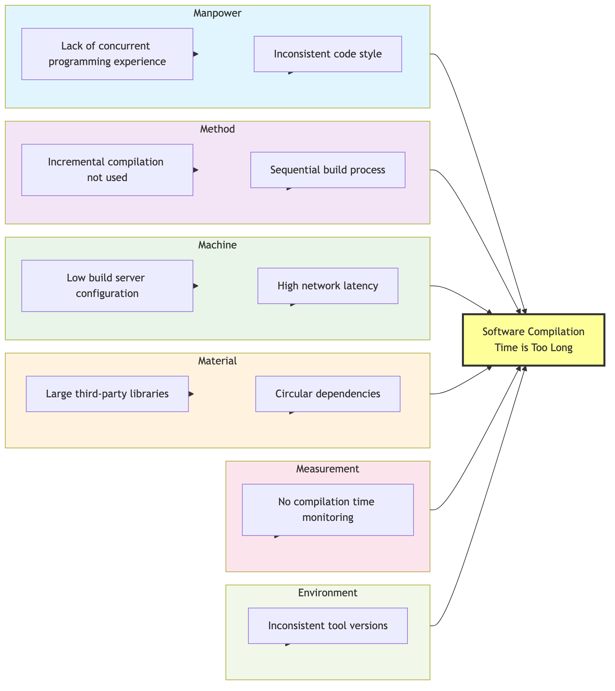

# Fishbone Diagram (Ishikawa Diagram) Analysis Tutorial

## 1. What is a Fishbone Diagram?

The **Fishbone Diagram**, also known as the **Ishikawa Diagram** or **Cause-and-Effect Diagram**, is a classic problem analysis tool used to systematically identify, organize, and display multiple potential causes leading to a specific problem (effect).

It was developed by Dr. Kaoru Ishikawa, a Japanese quality management expert, in the 1960s, and is named for its resemblance to a fish skeleton. The fish head represents the "effect" (problem), while the bones represent the various "causes" leading to that effect.

## 2. Why Use a Fishbone Diagram?

The main value of a Fishbone Diagram lies in:

-   **Structured Thinking**: Provides a clear framework to help teams systematically think about all possible causes of a problem from multiple dimensions.
-   **Visual Analysis**: Presents complex cause-and-effect relationships in an intuitive graphical way, facilitating team understanding and discussion.
-   **Promoting Team Collaboration**: Very suitable for brainstorming sessions, capable of gathering the collective wisdom of the team to uncover causes from different perspectives.
-   **Identifying Root Causes**: By further refining the main causes, it can help the team delve deeper into the fundamental root of the problem.

## 3. Structure of a Fishbone Diagram

A typical Fishbone Diagram consists of the following core parts:

-   **Head**: Points to the right, representing the **problem** or **effect** to be analyzed.
-   **Spine**: A horizontal main line extending from the fish head to the left.
-   **Main Bones**: Several main branches extending diagonally from the spine, representing the **main categories** of causes.
-   **Sub-Branches/Small Bones**: Smaller branches extending from the main bones, representing **specific causes** within each category.

### Common Main Cause Categories (Main Bones)

The classification of main bones can be flexibly adjusted according to the analysis object. Here are some classic classification models:

-   **Manufacturing (6M Model)**:
    -   **Manpower**: Skills, experience, attitude of operators, etc.
    -   **Method**: Work procedures, operating specifications, process parameters, etc.
    -   **Machine**: State, precision, maintenance of equipment, tools, etc.
    -   **Material**: Quality, specifications, suppliers of raw materials, etc.
    -   **Measurement**: Measuring tools, inspection standards, data accuracy, etc.
    -   **Milieu/Mother Nature (Environment)**: Temperature, humidity, lighting, cultural atmosphere of the workplace, etc.

-   **Service Industry (4S or 8P Model)**:
    -   **Suppliers**
    -   **Systems**
    -   **Skills**
    -   **Surroundings**

-   **Marketing (8P Model)**:
    -   **Product**
    -   **Price**
    -   **Place**
    -   **Promotion**
    -   **People**
    -   **Process**
    -   **Physical Evidence**
    -   **Productivity & Quality**

## 4. How to Draw and Use a Fishbone Diagram?

### Step One: Define the Problem (Fish Head)

-   **Clarify the Problem**: First, clearly and specifically define the problem to be analyzed. For example, "Customer satisfaction decreased by 15% this quarter."
-   **Draw the Fish Head**: Draw a box on the right side of a whiteboard or paper, write down the problem, and draw a horizontal spine extending to the left from the box.

### Step Two: Determine the Main Categories of Causes (Main Bones)

-   **Select a Classification Model**: Choose an appropriate classification model (e.g., 6M for manufacturing) based on the nature of the problem.
-   **Draw Main Bones**: Draw several diagonal lines above and below the spine as main bones, and label each main bone with the category name (e.g., "Manpower," "Machine," "Method," etc.).

### Step Three: Brainstorm and Identify Specific Causes (Sub-Branches/Small Bones)

-   **Team Discussion**: Gather relevant team members and brainstorm around each main category.
-   **Questioning Guidance**: You can combine the **Five Whys** by repeatedly asking "why is this happening?" to explore deeper causes.
    -   For example, under the "Manpower" main bone, you can ask: "Why did the operator make a mistake?" -> "Because of insufficient training." -> "Why was training insufficient?" -> "Because there was no standardized training material."
-   **Draw Sub-Branches/Small Bones**: Connect the specific causes identified through discussion as sub-branches or small bones to the corresponding main bone.

### Step Four: Analyze and Determine Key Causes

-   **Review the Fishbone Diagram**: Once all possible causes are listed, the team reviews the entire diagram together.
-   **Identify Key Causes**: Through discussion, voting, or simple data validation, identify the **key causes** (or root causes) that have the greatest impact on the problem and are most likely. Mark them with circles or asterisks.

### Step Five: Formulate Improvement Measures

-   **Develop Action Plan**: Formulate specific, feasible improvement measures and action plans for the identified key causes.

## 5. Practical Case: Analyzing "Software Compilation Time is Too Long"



<!--
```mermaid
graph TD
    subgraph Software Compilation Time is Too Long
        direction LR
        subgraph Manpower
            A[Lack of concurrent programming experience]
            B[Inconsistent code style]
        end
        subgraph Method
            C[Incremental compilation not used]
            D[Sequential build process]
        end
        subgraph Machine
            E[Low build server configuration]
            F[High network latency, slow dependency fetching]
        end
        subgraph Material (refers to code and dependencies here)
            G[Introduced large third-party libraries]
            H[Circular dependencies between modules]
        end
        subgraph Measurement
            I[No compilation time monitoring]
        end
        subgraph Environment
            J[Inconsistent development tool versions]
        end
        A & B --> Manpower
        C & D --> Method
        E & F --> Machine
        G & H --> Material
        I --> Measurement
        J --> Environment
        Manpower & Method & Machine & Material & Measurement & Environment --> K{ }
        K -- Spine --> L[Problem:
Software Compilation Time is Too Long]
    end
    style L fill:#f9f,stroke:#333,stroke-width:2px
```
-->

**Analysis and Conclusion**:
Through the analysis above, the team might find that "low build server configuration," "incremental compilation not used," and "circular dependencies between modules" are the three most impactful key causes, and accordingly formulate plans for hardware upgrades and technical refactoring.

Fishbone Diagram is a flexible and powerful tool that encourages comprehensive thinking, helping teams clarify their thoughts in complex situations and find effective paths to solve problems.
