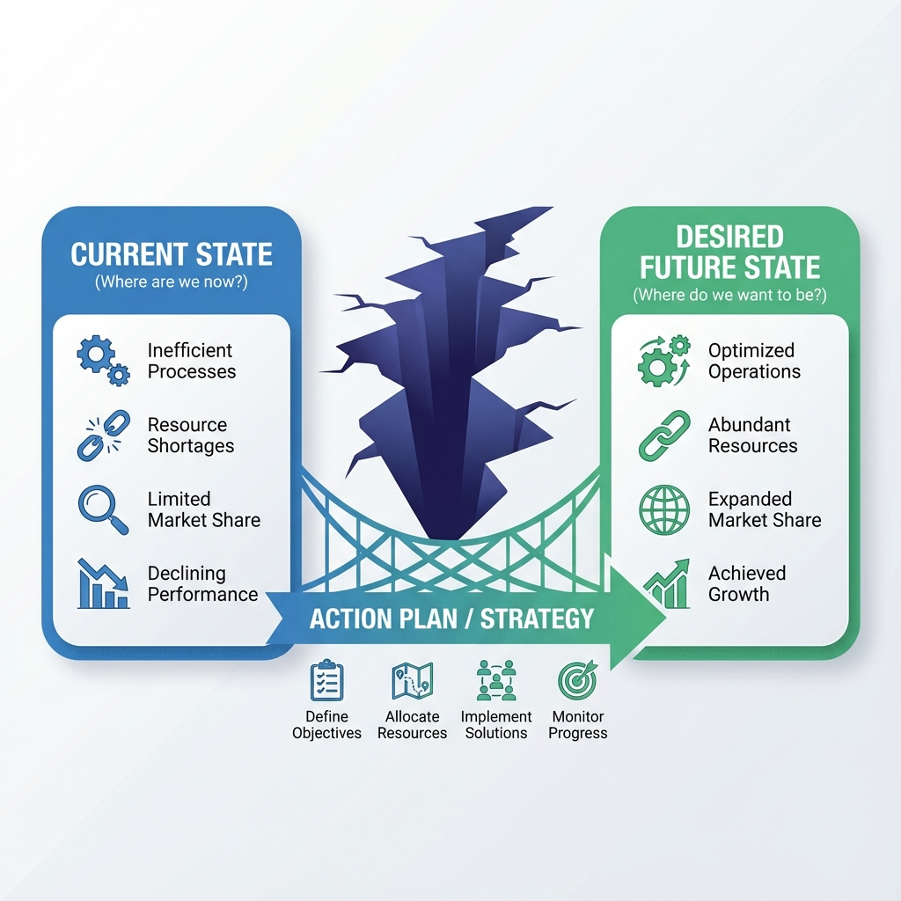

# Gap Analysis

**Gap Analysis** is a strategic management tool that identifies the "**gap**" between an organization's **current state** and its **desired future state** by comparing the two.

The core purpose of the analysis is not only to find the gap itself but also to dig into the reasons behind it and, based on those, formulate strategies and action plans to close it. It is a bridge between "where we are" and "where we want to be." The method is simple enough that almost anyone can use it; doing it well depends on two things: **quantifying both the current and the target state**, and **explaining why the gap exists rather than just measuring how big it is**.

!!! abstract "Key takeaways"

    - **Four questions**: Where are we now? Where do we want to be? How big is the gap, and why? How do we close it?
    - **Both states must be measurable**, otherwise the gap can't be sized and progress can't be checked.
    - **The most important step is finding causes**: pair it with the [Fishbone Diagram](../root_cause_analysis/Fishbone-Diagram-Tutorial-en.md) or the [5 Whys](../root_cause_analysis/5-Whys-Tutorial-en.md).
    - **Common types**: performance gaps, skills gaps, product–market gaps, process gaps, compliance gaps.
    - **You don't have to close every gap at once**: prioritize by impact and effort, and start with the few that matter most.

## Why Use Gap Analysis?

-   **Clarify Direction**: Helps organizations clearly understand the distance between their current state and goals, providing a basis for strategic planning.
-   **Optimize Resource Allocation**: By identifying key gaps, human, financial, and material resources can be allocated more effectively, ensuring investment in areas most in need of improvement.
-   **Performance Improvement**: Applicable to evaluating business processes, product performance, team skills and more, and to driving continuous improvement.
-   **Identify Potential Opportunities**: While analyzing gaps, new market opportunities or unmet customer needs may come to light.

## Common Types of Gap Analysis

Gap analysis works anywhere there is a goal. Depending on what you compare, the most common types are:

| Type | What is compared | Typical question | Typical data sources |
| --- | --- | --- | --- |
| **Performance gap** | Actual results vs. targets or industry benchmarks | Why did we miss our sales target? | Financial data, operating reports |
| **Skills / capability gap** | Current team capabilities vs. role or strategic requirements | Can our team support the new business? | Skills assessments, performance reviews, training records |
| **Product–market gap** | Current product vs. customer needs or competitors | What is our product missing? | User research, competitor analysis, customer feedback |
| **Process gap** | Current process vs. best practice | Why is our delivery slower than our peers'? | Cycle-time measurements, on-site observation |
| **Compliance gap** | Current state vs. regulations or certification standards | What do we still need to pass this certification? | Regulations, audit checklists |

## How to Conduct a Gap Analysis (Four Steps)

### Step One: Describe and Quantify the Current State (Where are we now?)

-   **Comprehensive Assessment**: Objectively and realistically assess the current performance of the area you are analyzing. This step must rely on data and facts, not on impressions.
-   **Specific Metrics**: Use quantifiable metrics to describe the current situation. For example:
    -   *Sales*: Actual sales for this quarter were $800,000.
    -   *Production*: The pass rate for Product A is 95%.
    -   *Skills*: Only 20% of team members have mastered the new software.

### Step Two: Define and Quantify the Future State (Where do we want to be?)

-   **Set Goals**: Clearly and specifically describe the future state you want to reach. Goals should follow the [SMART principle](../../Personal & Team Productivity/goal_management/SMART-Goals-Tutorial-en.md) (Specific, Measurable, Achievable, Relevant, Time-bound).
-   **Specific Metrics**: Use quantifiable metrics here too.
    -   *Sales*: The sales target for this quarter is $1,000,000.
    -   *Production*: The target pass rate for Product A is 99%.
    -   *Skills*: The goal is for 80% of team members to master the new software.
-   **Where targets come from**: strategic plans, targets set by management, industry benchmarks, competitors, customer requirements. Note the source in your analysis, because it affects how reasonable the target is.

### Step Three: Identify and Analyze the Gap

-   **Calculate the Gap**: Spell out the difference between the current and future states.
    -   *Sales Gap*: A $200,000 shortfall.
    -   *Production Gap*: A 4-percentage-point pass-rate gap.
    -   *Skills Gap*: 60% of team members need training.
-   **Investigate Causes**: This is the most critical step. What are the root causes of each gap?
    -   *Sales shortfall*: insufficient marketing, weak sales incentives, competitor price cuts, and so on.
    -   *Pass-rate gap*: aging equipment, non-standard operating procedures, raw material quality, and so on.
-   **Use tools to find causes**: When causes come from many directions, list them with a fishbone diagram; when the causal chain is fairly clear, use the 5 Whys; when a large gap needs breaking down, use a [logic tree](Logic-Tree-Tutorial-en.md) built on a formula (e.g. sales = customers × conversion rate × average order value).

### Step Four: Build and Execute an Action Plan to Close the Gap

-   **Brainstorm Solutions**: Propose specific solutions addressing the root causes of each gap.
-   **Prioritize and Resource**: Evaluate the cost, benefit and feasibility of each option, set priorities and allocate resources. When there are many gaps, a simple impact × effort quadrant helps.
-   **Develop the Plan**: Define an owner, deadline and expected outcome for each action.
    -   *Action Plan Example*:
        1.  **Action**: Launch a new digital marketing campaign. **Owner**: Marketing. **Deadline**: End of next month.
        2.  **Action**: Revise the sales commission scheme. **Owner**: HR. **Deadline**: Start of next quarter.
        3.  **Action**: Retrain all production-line staff on operating procedures. **Owner**: Production. **Deadline**: Within three weeks.
-   **Review regularly**: Re-measure the metrics at each checkpoint. If the gap isn't shrinking, either the cause was wrong or the action wasn't carried out, so go back to Step Three.

## Gap Analysis Template

| Area / metric | Current state | Target state | Gap | Main cause | Action to close the gap | Owner | Due date | Priority |
| --- | --- | --- | --- | --- | --- | --- | --- | --- |
| Quarterly sales | $800k | $1M | −$200k | Low conversion of new leads | Improve sales scripts and follow-up process | Sales | Start of next quarter | High |
| Product pass rate | 95% | 99% | −4 pts | Declining equipment precision | Equipment overhaul + operator retraining | Production | 3 weeks | High |
| … | | | | | | | | |

**Checklist**

- [ ] The current state is described with data, not "pretty good" or "rather poor"
- [ ] The target state has a clear time frame
- [ ] Every gap has a cause, not just a size
- [ ] Every action has an owner and a due date
- [ ] A date is set to re-measure the gap

## Practical Examples

### Example 1: Website User Experience Gap Analysis

-   **Current State**:
    -   User satisfaction score: 3.5/5.0.
    -   Bounce rate: 60%.
    -   Mobile conversion rate: 1%.
-   **Future State**:
    -   User satisfaction score: 4.5/5.0.
    -   Bounce rate: 40%.
    -   Mobile conversion rate: 3%.
-   **Gaps and Causes**:
    -   **Satisfaction gap (1.0 point)**: slow page loads, confusing navigation.
    -   **Bounce-rate gap (20 points)**: content doesn't match user expectations, too many ads.
    -   **Conversion gap (2 points)**: the mobile checkout flow is too complex.
-   **Action Plan**:
    1.  Optimize images and code to speed up page loads.
    2.  Redesign the navigation bar to be more intuitive.
    3.  Simplify the mobile checkout flow and cut steps.
    4.  Use [A/B testing](../../Product & User/testing_and_validation/AB-Testing-Tutorial-en.md) to compare page layouts and reduce bounce rate.

### Example 2: Team Skills Gap Analysis

A company plans to move part of its business to data-driven decision-making next year and needs to know whether its operations team can keep up.

-   **Define the target capabilities.** Based on the new business, operations staff need four skills: data extraction (SQL), data visualization, A/B test design, and metric decomposition. Each is rated on a 1–4 scale (1 = aware, 4 = can coach others); the target is level 3 or above on every skill.
-   **Assess the current state.** Self-assessment plus manager assessment for the 10 team members gives:

| Skill | Target level | Team average | Meeting target | Gap |
| --- | --- | --- | --- | --- |
| SQL data extraction | 3 | 1.6 | 2 / 10 | Largest |
| Data visualization | 3 | 2.4 | 4 / 10 | Medium |
| A/B test design | 3 | 1.8 | 1 / 10 | Large |
| Metric decomposition | 3 | 2.8 | 7 / 10 | Small |

-   **Analyze the causes.** The SQL and A/B testing gaps are largest because operations has always relied on the data team for queries, so staff never practiced. Metric decomposition is already part of their weekly reviews.
-   **Action plan.** A six-week internal SQL bootcamp with read-only database access so people learn on real data; the data team runs two real A/B projects as worked examples; metric decomposition stays as is. Reassess in three months.

This kind of analysis is often presented as a **skills matrix** (people × skills), which shows the team's overall capability profile and weak spots at a glance.

## Common Mistakes

1.  **Current state by feel, target by guesswork.** "Our service is decent" and "become an industry leader" make the gap impossible to calculate and progress impossible to check.
2.  **Measuring the gap but not explaining it.** Knowing you are "$200k short" isn't enough. Different causes call for completely different actions; skip the cause analysis and the plan usually becomes "try harder".
3.  **Trying to close every gap at once.** Spreading effort evenly across many gaps closes none of them. Rank by impact and effort and focus on the critical few.
4.  **Treating the target as untouchable.** Sometimes the gap is large because the target is unrealistic. If the analysis shows that, propose adjusting it.
5.  **Filing the report away.** Gap analysis is a cycle, not a document. Without review dates you'll never know whether the actions worked.
6.  **Only looking inward.** Comparing only with your own history can hide the fact that the whole industry is improving. Use benchmarks or competitors as a reference where possible.

## Frequently Asked Questions

??? question "What is the difference between gap analysis and SWOT analysis?"

    SWOT takes stock of strengths, weaknesses, opportunities and threats to answer "what is our situation?". Gap analysis compares the current state with a target to answer "what is missing and how do we close it?". A common sequence is to use SWOT to choose direction and goals, then gap analysis to plan how to reach them.

??? question "Can individuals use gap analysis?"

    Yes. For career planning, list the capabilities your target role requires (target state), honestly rate yourself today (current state), and the biggest gaps are what to invest in learning over the next year.

??? question "How should I set the target state?"

    Draw on strategy, industry benchmarks, competitors, customer requirements or your own best historical performance. It should be challenging but achievable and time-bound. If the gap is too large to close by the deadline, revisit the target or the timeline.

??? question "How often should we run a gap analysis?"

    It depends on the subject: performance gaps monthly or quarterly, capability gaps every six to twelve months, and a dedicated one before any major strategic change or new project.

??? question "The gap is huge. Where do I start?"

    Use a logic tree to split the big gap into smaller ones and find causes for each. Then rank them by impact × effort and start with high-impact, low-effort items to get early results before tackling the hardest parts.

## Extensions and Connections

*   **[SWOT Analysis](../../Strategy & Business/strategic_analysis/SWOT-Analysis-Tutorial-en.md)**: Use SWOT to understand your situation and choose a direction, then gap analysis to turn it into an executable plan.
*   **[SMART Goals](../../Personal & Team Productivity/goal_management/SMART-Goals-Tutorial-en.md)**: A good target state follows the SMART principle, which is what makes the gap measurable.
*   **[OKR](../../Personal & Team Productivity/goal_management/OKR-Tutorial-en.md)** and the **[Balanced Scorecard](../../Strategy & Business/strategic_execution/Balanced-Scorecard-Tutorial-en.md)**: The key gaps you find can become objectives and key results for the next cycle.
*   **[Fishbone Diagram](../root_cause_analysis/Fishbone-Diagram-Tutorial-en.md)** and **[5 Whys](../root_cause_analysis/5-Whys-Tutorial-en.md)**: The two most common tools for analyzing why a gap exists.
*   **[Problem Solving](Problem-Solving-en.md)**: Gap analysis is essentially a way of defining a problem, and can lead straight into a full problem-solving process.

---

*Reference: Gap analysis is a foundational method widely used in strategic management, quality management and human resource management, with mature applications in ISO certification preparation, organizational capability planning and corporate strategy.*
