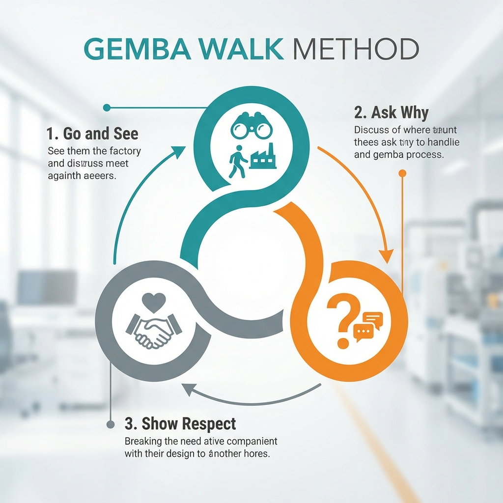

# Gemba Walk Management Method Tutorial

!!! abstract "Key takeaways"

    - **Gemba** (現場) means "the real place": where value is created.
    - **Go, see, ask why, show respect**: observe the process, not judge the people.
    - **Ask open questions** and listen more than you talk.
    - **Focus on one process or theme per walk**, and record what you see.
    - **Follow up**: a walk without action teaches people that it's a ritual.

## 1. What is a Gemba Walk?

**Gemba Walk** is a core management practice originating from Japanese Lean Manufacturing. "Gemba" (现场) in Japanese means "the real place," where value is created, such as a factory floor, a hospital ward, or a software development office.

A Gemba Walk is not a simple tour or inspection, but a structured, purposeful activity of going deep into the actual workplace. Managers personally go to the work site and, through **observing**, **asking why**, and **showing respect**, gain a deep understanding of work processes, identify opportunities for improvement, and empower frontline employees.

## 2. Why Go to the "Gemba"?

Traditional management often relies on reports, meetings, and data. However, this information is often filtered and delayed. The core value of a Gemba Walk lies in:

-   **Obtaining First-Hand Information**: Seeing firsthand how processes work, discovering waste (Muda), unevenness (Mura), and overburden (Muri) that cannot be reflected in reports.
-   **Understanding Real Processes**: Learning the gap between standard operating procedures (SOPs) and actual operations.
-   **Promoting Communication and Trust**: By directly communicating with frontline employees, managers show respect for their work and build trust.
-   **Identifying Problems Immediately**: Recognizing problems as they emerge, rather than waiting for them to escalate into major crises.
-   **Fostering a Culture of Continuous Improvement (Kaizen)**: Encouraging everyone to participate in the process of identifying and solving problems.

## 3. Three Key Elements of a Gemba Walk

An effective Gemba Walk must include the following three core elements:

1.  **Go and See**
    -   The purpose is not to supervise or judge, but to understand.
    -   Observe the Value Stream: Observe how a product or service is created from beginning to end.
    -   Focus on the process, not on blaming individuals.

2.  **Ask Why**
    -   Ask open-ended questions, starting with "what," "how," "why," rather than closed-ended "yes/no" questions.
    -   The purpose of asking questions is to clarify and understand, not to test or challenge employees.
    -   Can be combined with the "Five Whys" to explore the root causes of problems.

3.  **Show Respect**
    -   Believe that frontline employees are the most professional experts in their positions.
    -   Listen carefully to their ideas, concerns, and suggestions.
    -   Thank them for their time and shared information.
    -   **Remember: A Gemba Walk is not a tool for finding and punishing employees who make mistakes.**

## 4. How to Conduct an Effective Gemba Walk?

### Step One: Plan and Prepare

-   **Determine Theme and Purpose**: Don't wander aimlessly. Set a clear theme for each walk, such as "safety hazards," "production bottlenecks," "material waste," or "new employee training effectiveness."
-   **Inform the Team**: Notify the relevant teams in advance, letting them know you will be visiting and the theme of the walk. This helps reduce their anxiety and allows them to prepare.

### Step Two: Execute the Walk

-   **Follow the Value Stream**: Observe along the path of product or service creation.
-   **Focus on Observation**: Carefully observe the processes, tools, environment, and interactions of personnel.
-   **Ask In-Depth Questions**:
    -   "Can you show me how this process works?"
    -   "What is the goal of this step?"
    -   "Have you encountered any difficulties here?"
    -   "If anything could be changed, what would you wish for?"
-   **Record Observations**: Use a notebook or camera to record your observations and findings, but avoid constantly looking down to record while talking to employees; maintain eye contact.

### Step Three: Follow-up and Reflection

-   **Organize Notes**: Immediately organize your observation records after the walk.
-   **Share with the Team**: Share your findings and insights with the broader team (including other managers).
-   **Empower, Don't Command**: Don't immediately offer solutions. The best approach is to guide the team to discover problems and propose solutions themselves. You can ask, "Do you have any good ideas for the problem we just saw?"
-   **Take Action and Follow Up**: Support and follow up on the implementation of improvement suggestions proposed by the team. Small improvements should be implemented as soon as possible to build positive momentum.

## 5. Gemba Walk "Don'ts" Checklist

-   **Do not** blame or criticize employees on site.
-   **Do not** immediately propose solutions or change processes on site.
-   **Do not** use it as a basis for individual performance evaluation.
-   **Do not** only talk to supervisors and ignore frontline employees.
-   **Do not** conduct it without a clear purpose.

By consistently conducting effective Gemba Walks, managers can step out of the "ivory tower of the office" and truly become catalysts for continuous organizational improvement.## Good Questions to Ask on a Gemba Walk

| Purpose | Questions |
| --- | --- |
| Understand the work | "Can you walk me through what you're doing?" "What does a normal day look like?" |
| Standards | "How do you know this step is done correctly?" "Where is the standard written down?" |
| Problems | "What gets in your way?" "What happened the last time something went wrong?" |
| Flow | "Where do you wait?" "Where does work pile up?" |
| Improvement | "If you could change one thing, what would it be?" "What help do you need from me?" |

## Observation Template

| Field | Notes |
| --- | --- |
| Date, area, process observed | |
| Purpose of this walk | |
| What I saw (facts) | |
| Waste observed (waiting, motion, rework, inventory…) | |
| What people told me | |
| Questions to follow up | |
| Agreed actions, owner, date | |

## Examples

**Example 1: Manufacturing line.** A plant manager walks the assembly line focusing on rework. She notices operators walking to a shared cabinet for a torque tool several times an hour. Asking why reveals the cabinet was moved during a layout change. A tool holder at each station cuts walking time and reduces skipped torque checks.

**Example 2: Customer service office.** A support director sits with agents for an hour. He sees agents switching among four systems to answer one billing question. The follow-up is a single "customer view" screen, prioritized with IT, which shortens average handling time.

**Example 3: Hospital ward.** A nurse manager observes the morning medication round and notices frequent trips to the pharmacy for missing items. The team introduces a pre-round checklist and a fixed restock time, reducing interruptions during the round.

## Frequently Asked Questions

??? question "What does gemba mean?"

    "Gemba" (also spelled genba) is Japanese for "the actual place", the place where work happens: the factory floor, the call center, the ward, the code repository.

??? question "How often should leaders do Gemba walks?"

    Regularly and predictably, such as daily for team leaders, weekly for department managers and monthly for executives, with a clear purpose each time.

??? question "Is a Gemba walk the same as management by walking around (MBWA)?"

    They're related. MBWA emphasizes visibility and informal contact; a Gemba walk is more structured, focused on a specific process, waste and standards, and on supporting improvement.

??? question "How does a Gemba walk relate to kaizen?"

    Gemba walks reveal problems and improvement opportunities at their source; [kaizen](../../Strategy & Business/quality_and_operations/Kaizen-Tutorial-en.md) is the continuous effort to act on them.

## Extensions and Connections

*   **[Kaizen](../../Strategy & Business/quality_and_operations/Kaizen-Tutorial-en.md)**: Gemba walks are a primary source of improvement ideas for kaizen.
*   **[Lean Operations](../../Strategy & Business/quality_and_operations/Lean-Operations-Tutorial-en.md)**: "Go and see" (genchi genbutsu) is a core principle of lean and the Toyota Production System.
*   **[5 Whys](../root_cause_analysis/5-Whys-Tutorial-en.md)**: When you observe a problem at the gemba, the 5 Whys help trace it to a root cause on the spot.
*   **[Ethnography](../../Product & User/specialized_qualitative_methods/Ethnography-Tutorial-en.md)**: Both rely on observing work in its natural setting rather than relying on reports.

