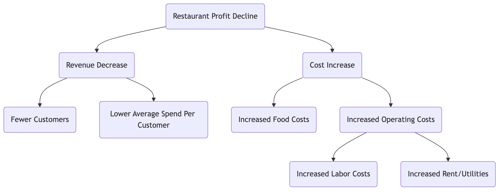
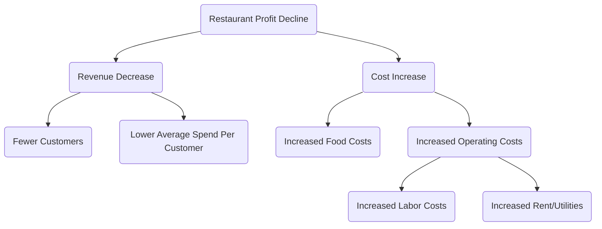
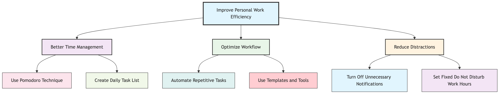

# Logic Tree Analysis Tutorial

## 1. What is a Logic Tree?

**Logic Tree** is a powerful, visual analytical tool used to systematically break down a complex problem or issue into smaller, more manageable parts. Its core principle is **MECE (Mutually Exclusive, Collectively Exhaustive)**, meaning that the decomposed parts do not overlap and are not omitted.

A logic tree helps us build a clear framework for thinking, ensuring the rigor and comprehensiveness of the analysis.

## 2. Main Types of Logic Trees

Logic trees are mainly divided into two types, used to solve problems of different natures:

### a. Problem Tree (Diagnostic Tree)

-   **Purpose**: Used to diagnose and explore "**why**" a problem occurs.

-   **Structure**: Starting from a core problem (the root), it continuously breaks down to find potential causes leading to the problem. Each layer of branches is a deeper explanation of the previous layer's problem.

-   **Applicable Scenarios**: Root cause analysis, performance decline diagnosis, troubleshooting, etc.

### b. "How" Tree (Solution Tree)

-   **Purpose**: Used to conceptualize and plan "**how**" to achieve a goal or solve a problem.
-   **Structure**: Starting from an overall goal (the root), it breaks down into specific, actionable strategies or action plans.
-   **Applicable Scenarios**: Strategic planning, goal setting, project planning, finding solutions, etc.

## 3. How to Build a Logic Tree?

### Step One: Clearly Define the Core Problem or Goal

-   **Problem Tree**: Clearly state the "problem" to be analyzed. For example: "Why is our website's user churn rate increasing?"
-   **"How" Tree**: Clearly define the "goal" to be achieved. For example: "How can we increase the website's monthly active users by 20%?"
-   Use this problem or goal as the starting point (root) of the logic tree.

### Step Two: Perform the First Level of Decomposition (Apply MECE Principle)

-   **Brainstorm**: Around the core problem/goal, think about what main components it can be broken down into.
-   **Apply MECE Principle**: Ensure that the branches of the first level are mutually exclusive (no overlap) and collectively exhaustive (no important aspects are omitted).
    -   **Example (Problem Tree)**: User churn rate increase can be broken down into: "New user churn" and "Existing user churn."
    -   **Example ("How" Tree)**: Increasing monthly active users can be broken down into: "Attract new users," "Increase existing user activity," and "Recall churned users."

### Step Three: Decompose Layer by Layer

-   **Continue Asking Questions**: For each branch, continue asking "Why is this happening?" (Problem Tree) or "How exactly can this be done?" ("How" Tree), to perform deeper levels of decomposition.
-   **Maintain Clear Structure**: Continue to apply the MECE principle at each level until the problem is broken down to a sufficiently specific level that can be verified with data or directly acted upon.

### Step Four: Validate Hypotheses and Prioritize

-   **Data Validation**: For problem trees, collect data to verify which branches are the true causes.
-   **Evaluate Solutions**: For "how" trees, evaluate the feasibility, cost, and expected effect of each action plan.
-   **Determine Critical Path**: Identify the key causes or key actions that have the greatest impact on solving the problem or achieving the goal, and prioritize them.

## 4. Practical Cases

### Case 1: Problem Tree - Analyzing "Why is restaurant profit declining?"



<!--


<!--


<!--

-->
-->
-->

**Analysis**: Through this tree diagram, managers can clearly see the main drivers of profit decline and can collect data for each branch (e.g., "Fewer Customers") for deeper analysis.

### Case 2: "How" Tree - Planning "How to Improve Personal Work Efficiency?"



<!--
```mermaid
graph TD
    A(Improve Personal Work Efficiency) --> B(Better Time Management)
    A --> C(Optimize Workflow)
    A --> D(Reduce Distractions)

    B --> E(Use Pomodoro Technique)
    B --> F(Create Daily Task List)

    C --> G(Automate Repetitive Tasks)
    C --> H(Use Templates and Tools)

    D --> I(Turn Off Unnecessary Notifications)
    D --> J(Set Fixed "Do Not Disturb" Work Hours)
```
-->

**Analysis**: This tree diagram breaks down an abstract goal into a series of specific, actionable steps, helping individuals create clear improvement plans.

Logic trees are one of the core skills essential for consultants, product managers, and strategic planners, as they can greatly enhance the depth and breadth of thinking.