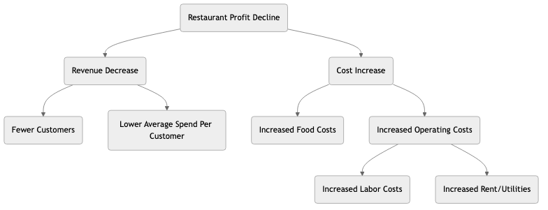
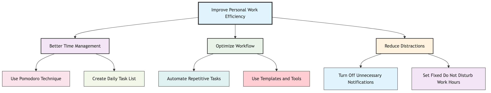

# Logic Tree Analysis

Faced with questions like "why did profit fall?" or "how do we double our users?", most people instinctively throw out a few causes or ideas from experience. The trouble is that experience points to familiar directions, and the real cause or the best idea may sit in a blind spot. A **logic tree** is a visual analysis tool that systematically breaks a complex problem or question into smaller, more manageable parts, until each part can be verified with data or acted on directly.

Its core principle is **MECE (Mutually Exclusive, Collectively Exhaustive)**: the parts don't overlap, and together they leave nothing out. Logic trees are a signature tool of consulting firms such as McKinsey, and among the most practical structured-thinking tools for product managers, operators and managers.

!!! abstract "Key takeaways"

    - **Three common trees**: the problem tree (why), the how tree (how), and the hypothesis tree (is it true?).
    - **MECE**: branches at each level don't overlap and don't leave gaps. The easiest way to achieve it is to decompose with a formula or a process.
    - **How deep to go**: until every leaf can be verified with data or assigned to someone to do.
    - **After building it**: prune a problem tree with data and prioritize a how tree; don't try to work on every branch at once.
    - **A natural partner**: once the analysis is done, use the [Pyramid Principle](../../Foundations/logical_thinking/Pyramid-Principle-Tutorial-en.md) to communicate the conclusion.

## What Is the MECE Principle?

MECE is the heart of a logic tree and also where most mistakes happen.

*   **Mutually Exclusive**: Branches at the same level don't overlap. Any specific cause belongs under exactly one branch.
*   **Collectively Exhaustive**: Together, the branches at one level cover every possibility of the level above.

Take "analyzing a company's employees" as an example:

| How it is split | MECE? | Why |
| --- | --- | --- |
| By age: under 30 / 30–45 / over 45 | ✓ | Everyone falls into exactly one group, and no one is left out |
| By role: managers / engineers / sales | ✗ | An engineering manager belongs to two groups (not exclusive); admin and finance are missing (not exhaustive) |
| By tenure: under 1 year / 1–3 years / over 3 years | ✓ | No overlaps, no gaps |
| By status: top performers / employees who need improvement | ✗ | The large group of "solid performers" in the middle is missing |

**A practical trick**: if you're unsure, add an "other" branch to guarantee exhaustiveness, then check how much ends up in it. If "other" is large, the dimension you chose isn't a good one.

## Three Types of Logic Trees

### Problem Tree (Diagnostic Tree)

- **Purpose**: To diagnose **why** a problem occurs.
- **Structure**: Starting from a core problem (the root), break it down repeatedly to find potential causes. Each level answers the level above in more depth.
- **Use cases**: Root cause analysis, diagnosing performance declines, troubleshooting.

### How Tree (Solution Tree)

- **Purpose**: To generate and plan **how** to achieve a goal or solve a problem.
- **Structure**: Starting from an overall goal (the root), break it down into specific, executable strategies or actions.
- **Use cases**: Strategic planning, goal setting, project planning, finding solutions.

### Hypothesis Tree

- **Purpose**: When information is limited and time is short, start with the most likely answer and break it into sub-hypotheses that must be verified.
- **Structure**: The root is a hypothesis (e.g. "profit fell mainly because raw materials got more expensive"); beneath it are the conditions that must be true for the hypothesis to hold.
- **Use cases**: Early stages of consulting projects, quick decisions, situations where you need a conclusion with minimal data. Its strength is that you **only collect data that can prove or disprove the hypothesis**; the risk is that if the initial hypothesis is far off, you must be willing to throw it out and start again.

## Five Ways to Decompose a Problem

Not knowing which dimension to split on is the most common sticking point. These five methods cover most situations:

| Method | Idea | Example |
| --- | --- | --- |
| **Formula** | Split using a mathematical relationship; MECE by construction | Profit = revenue − cost; revenue = traffic × conversion × average order value |
| **Process** | Split along the sequence of steps | Conversion = impression → click → sign-up → activation → payment |
| **Segment** | Split by the people or objects involved | Users = new + returning; channels = online + offline |
| **Binary** | Split into "A" and "not A" | Internal / external causes; controllable / uncontrollable factors |
| **Existing framework** | Use an established framework as the first level | 4P for marketing problems; [Porter's Five Forces](../../Strategy & Business/strategic_analysis/Porters-Five-Forces-Tutorial-en.md) for industries; [PESTEL](../../Strategy & Business/strategic_analysis/PESTEL-Analysis-Tutorial-en.md) for the macro environment |

**Prefer formulas.** A formula is MECE by definition, and every branch maps directly to data, which makes it the hardest method to get wrong.

## How to Build a Logic Tree

### Step One: Define the Core Problem or Goal

- **Problem tree**: State the problem clearly, e.g. "Why is our website's user churn rate rising?"
- **How tree**: Define the goal clearly, e.g. "How can we increase monthly active users by 20%?"
- Make this the root of the tree. Be specific: "business is bad" is a poor root; "East region sales fell 15% year over year in Q3" is a good one.

### Step Two: Decompose the First Level (Apply MECE)

- **Choose a dimension**: Use one of the five methods above, trying a formula first.
- **Check MECE**: Make sure first-level branches don't overlap and don't leave anything important out.
  - **Problem tree example**: Rising churn can be split into "new-user churn" and "existing-user churn".
  - **How tree example**: Growing MAU can be split into "acquire new users", "increase engagement of existing users" and "win back lapsed users".

### Step Three: Decompose Layer by Layer

- **Keep asking**: For each branch ask "why?" (problem tree) or "how, specifically?" (how tree).
- **Each level may use a different dimension**: split by formula at level one and by segment or process at level two, but use only one dimension within a level.
- **Stop at actionability**: Keep going until every leaf can be checked with data or handed to someone to execute. Three or four levels are usually enough.

### Step Four: Verify and Prioritize

- **Prune with data**: For a problem tree, collect data to see which branches are real causes, and cut those the data rules out.
- **Evaluate options**: For a how tree, assess each action's feasibility, cost and expected impact.
- **Find the critical path**: Identify the causes or actions with the biggest effect and set priorities.

## Practical Examples

### Example 1: Problem Tree – "Why Is the Restaurant's Profit Falling?"

Using a formula for the first level means every branch maps to concrete data:

*   **Profit is falling**
    *   **Revenue is down**
        *   **Fewer customers**: fewer new customers (less exposure on review sites? a new competitor nearby?); fewer regulars (changes in taste? worse service?)
        *   **Lower average spend**: fewer dishes per order (menu structure?); fewer premium dishes sold (signature dish quality slipping?)
    *   **Costs are up**
        *   **Food costs**: higher purchase prices; more waste (over-ordering? poor storage?)
        *   **Labor costs**
        *   **Rent and other fixed costs**

**Analysis**: Last month's data shows customer numbers roughly flat and costs barely changed, but **average spend down 18%**, driven by falling sales of the signature dishes. The manager focuses on that branch and prunes the rest. Digging in reveals that the signature dishes changed after a new chef joined, and the share of reviews saying "not as good as before" rose sharply.

### Example 2: How Tree – "How Can I Improve My Personal Productivity?"

*   **Improve personal productivity**
    *   **Do the right things (choosing)**: list tasks before starting each day and sort them with the [Eisenhower Matrix](../../Personal & Team Productivity/time_management/Eisenhower-Matrix-Tutorial-en.md); review goals weekly and drop what no longer matters.
    *   **Do things faster (executing)**: stay focused with the [Pomodoro Technique](../../Personal & Team Productivity/time_management/Pomodoro-Technique-Tutorial-en.md); turn repetitive work into templates or automation.
    *   **Waste less (interruptions)**: turn off unnecessary notifications; block a fixed daily focus period; batch email and messages instead of replying instantly.

**Analysis**: Splitting into "choosing – executing – interruptions" covers the main sources of productivity loss. You don't need to do everything at once; start with one or two low-effort, high-impact actions such as turning off notifications.

### Example 3: How Tree – "How Do We Grow App MAU by 20%?"

*   **MAU = new active users + retained users + reactivated users**
    *   **Acquire more users**: new acquisition channels, better app-store pages, referral rewards
    *   **Improve retention**: better onboarding, more reasons to come back each week (fresh content, reminders)
    *   **Win back lapsed users**: segment by reason for leaving, targeted comeback offers

**Analysis**: After decomposing with the formula, the team checks the data: new users are growing, but month-one retention is only 25%, so most new users leave immediately. Resources go to the "improve retention – onboarding" branch instead of more acquisition spending.

## Logic Tree Template

| Level | Content | Dimension used | MECE? | How to verify / owner |
| --- | --- | --- | --- | --- |
| Root | A specific, measurable problem or goal | — | — | — |
| Level 1 | Branch A / Branch B / Branch C | Formula / process / segment / binary / framework | ✓ / ✗ | |
| Level 2 | A1 / A2 … | | | |
| Level 3 | Leaves that can be verified or executed directly | | | Data needed / person responsible |

**Checklist**

- [ ] The root is a specific, measurable problem, not a vague feeling
- [ ] Each level uses only one dimension
- [ ] Every level has been checked for overlaps and gaps
- [ ] Every leaf can be verified with data or executed directly
- [ ] Unimportant branches have been pruned based on data or priority

## Common Mistakes

1.  **Mixing dimensions within a level.** Putting "revenue down", "fewer new customers" and "worse service" side by side mixes formula, segment and cause, which guarantees overlap.
2.  **MECE for its own sake.** A neatly split tree that has little to do with the decision is useless. The dimension should point to data or to action.
3.  **Going too deep.** Six or seven levels make the tree unwieldy. Three or four are usually enough; expand only the important branches.
4.  **Building without verifying.** Every branch of a problem tree is only a possibility. Trying to fix all branches without pruning spreads resources too thin.
5.  **Leaves that can't be acted on.** "Improve team motivation" can't be executed; keep breaking it down into concrete actions.
6.  **Treating it like a mind map.** Mind maps allow free association and overlap; logic trees demand strict hierarchy and MECE. They serve different purposes.

## Logic Tree vs. Fishbone Diagram vs. Mind Map

| | Logic Tree | [Fishbone Diagram](../root_cause_analysis/Fishbone-Diagram-Tutorial-en.md) | [Mind Map](../ideation/Mind-Mapping-Tutorial-en.md) |
| --- | --- | --- | --- |
| Main purpose | Break down a problem or goal | List the possible causes of a problem | Free association, organizing ideas |
| Structural rules | Strict hierarchy, MECE at each level | Causes grouped into categories | Free; overlaps allowed |
| Direction | Causes or solutions | Causes only | Any |
| Typical use | Analysis reports, planning, consulting | Quality problems, failure analysis | Brainstorming, reading notes, knowledge maps |

## Frequently Asked Questions

??? question "What is the relationship between a logic tree and MECE?"

    MECE is the rule a logic tree must follow: branches at each level are mutually exclusive and collectively exhaustive. The logic tree is the tool; MECE is the test of whether you've used it correctly.

??? question "How many levels should a logic tree have?"

    There's no fixed rule; usually three or four. Stop when each leaf can be verified with data or acted on directly. Going further only adds complexity.

??? question "What tools can I use to draw a logic tree?"

    A whiteboard or paper is the most flexible. Digitally, mind-mapping tools such as XMind, Miro or draw.io work well, or simply a nested list in a document, which is how the examples on this page are written.

??? question "How is a logic tree different from the Pyramid Principle?"

    They look similar but run in opposite directions. A logic tree is for analysis: start from the problem and break it down to find causes or solutions. The Pyramid Principle is for communication: put the conclusion on top and support it with arguments below, so others accept it more easily.

??? question "How do I know whether my breakdown is MECE?"

    Ask two questions. Can any specific case belong to only one branch (exclusive)? Does every case have a branch to go to (exhaustive)? If you need a large "other" branch to make it exhaustive, choose a different dimension.

## Extensions and Connections

*   **[Pyramid Principle](../../Foundations/logical_thinking/Pyramid-Principle-Tutorial-en.md)**: A logic tree helps you think the problem through; the Pyramid Principle helps you present the conclusion.
*   **[5 Whys](../root_cause_analysis/5-Whys-Tutorial-en.md)**: Any branch of a problem tree can be drilled down vertically with the 5 Whys to reach a root cause.
*   **[Fishbone Diagram](../root_cause_analysis/Fishbone-Diagram-Tutorial-en.md)**: Also used to find causes, grouping them by category; well suited to team discussions.
*   **[Problem Solving](Problem-Solving-en.md)**: The logic tree is the core tool for the "break the problem down" step of structured problem solving.
*   **[Mind Mapping](../ideation/Mind-Mapping-Tutorial-en.md)**: A common workflow is to diverge freely with a mind map first, then tidy the result into a MECE logic tree.

---

*Reference: The logic tree and the MECE principle were systematized and popularized at McKinsey & Company; Barbara Minto gave the classic account of MECE in *The Pyramid Principle*. Today they are standard analytical methods in management consulting, product management and operations.*
