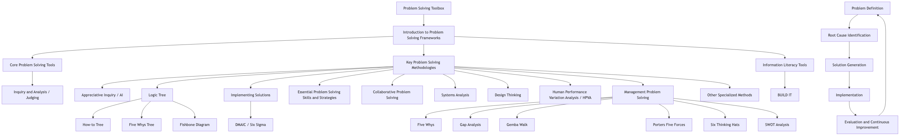

# Problem Solving Toolbox: Practical Methods and Strategy Tutorial

## Tutorial Overview

This tutorial aims to provide a comprehensive set of problem-solving tools and methodologies, covering various approaches from basic analytical techniques to human-centered and collaborative frameworks. We will delve into the core principles, purposes, and practical applications of these tools, and combine them with common problem-solving stages and essential skills to help you enhance your ability to solve complex problems.

**Table 1: Overview of Key Problem-Solving Tools and Methodologies**

| Tool/Methodology Name          | Category                   | Brief Definition/Core Focus                                            |
| ------------------------ | ---------------------- | ------------------------------------------------------------ |
| Inquiry & Analysis/Judging          | Basic Analysis               | Systematically collecting and analyzing evidence to draw informed conclusions and judgments.                   |
| Appreciative Inquiry (AI)         | Human-centered, Positive Psychology     | Solving problems by focusing on strengths and successes, inspiring positive change.                 |
| Logic Tree                   | Structured Analysis, Diagnosis       | Visually breaking down problems into manageable parts to discover solutions or root causes. |
| Collaborative Problem Solving           | Collaboration, Team             | Bringing together individuals with diverse skills, knowledge, and perspectives to solve complex problems collaboratively.           |
| Systems Analysis                 | Structured Analysis, Diagnosis       | Understanding system functions by breaking down components, identifying inefficiencies, and guiding improvements.         |
| Design Thinking                 | Human-centered, Innovation         | User experience at the core, developing solutions through empathy, experimentation, and iteration.       |
| Human Performance Variation Analysis (HPVA) | Root Cause Analysis, Human Resources | Systematically uncovering the root causes of human performance issues and controlling them to prevent recurrence.         |
| Management Problem Solving             | Strategy, Management             | Applying various techniques and data to identify, analyze, and solve organizational and business challenges.         |
| BUILD IT                 | Information Literacy, Resource Acquisition     | Providing access to resources for problem-solving.                                 |



<!--
```mermaid
graph TD
    A[Problem Solving Toolbox] --> B[Introduction to Problem Solving Frameworks]
    B --> C[Core Problem Solving Tools]
    B --> D[Key Problem Solving Methodologies]
    B --> E[Information Literacy Tools]

    C --> C1[Inquiry & Analysis/Judging]

    D --> D1[Appreciative Inquiry (AI)]
    D --> D2[Logic Tree]
    D --> D3[Implementing Solutions]
    D --> D4[Essential Problem Solving Skills & Strategies]
    D --> D5[Collaborative Problem Solving]
    D --> D6[Systems Analysis]
    D --> D7[Design Thinking]
    D --> D8[Human Performance Variation Analysis (HPVA)]
    D --> D9[Management Problem Solving]
    D --> D10[Other Specialized Methods]

    E --> E1[BUILD IT]

    D2 --> D2a["How-to" Tree]
    D2 --> D2b[Five Whys Tree]
    D2 --> D2c[Fishbone Diagram]

    D3 --> D3a[DMAIC (Six Sigma)]

    D9 --> D9a[Five Whys]
    D9 --> D9b[Gap Analysis]
    D9 --> D9c[Gemba Walk]
    D9 --> D9d[Porter's Five Forces]
    D9 --> D9e[Six Thinking Hats]
    D9 --> D9f[SWOT Analysis]

    C1 -- Supports --> D1
    C1 -- Supports --> D6
    C1 -- Supports --> D7

    D1 -- Positive Psychology --> D
    D7 -- Human-Centered --> D
    D5 -- Collaboration --> D
    D8 -- Human Factors --> D

    D2 -- Structured Analysis --> D
    D6 -- Structured Analysis --> D
    D3a -- Data-Driven --> D

    E1 -- Provides Resources --> C1
    E1 -- Provides Resources --> D

    subgraph Common Problem Solving Steps (Cross-Framework)
        F1[Problem Definition]
        F2[Root Cause Identification]
        F3[Solution Generation]
        F4[Implementation]
        F5[Evaluation/Continuous Improvement]
    end

    D1 --> F1 & F2 & F3 & F4 & F5
    D2 --> F1 & F2 & F3 & F4 & F5
    D3 --> F1 & F2 & F3 & F4 & F5
    D4 --> F1 & F2 & F3 & F4 & F5
    D5 --> F1 & F2 & F3 & F4 & F5
    D6 --> F1 & F2 & F3 & F4 & F5
    D7 --> F1 & F2 & F3 & F4 & F5
    D8 --> F1 & F2 & F3 & F4 & F5
    D9 --> F1 & F2 & F3 & F4 & F5
    D10 --> F1 & F2 & F3 & F4 & F5

    F1 --> F2 --> F3 --> F4 --> F5
    F5 --> F1(Iterative Improvement)

    style A fill:#f9f,stroke:#333,stroke-width:2px
    style B fill:#bbf,stroke:#333,stroke-width:2px
    style C fill:#bbf,stroke:#333,stroke-width:2px
    style D fill:#bbf,stroke:#333,stroke-width:2px
    style E fill:#bbf,stroke:#333,stroke-width:2px
    style C1 fill:#ccf,stroke:#333,stroke-width:1px
    style D1 fill:#cfc,stroke:#333,stroke-width:1px
    style D2 fill:#cfc,stroke:#333,stroke-width:1px
    style D3 fill:#cfc,stroke:#333,stroke-width:1px
    style D4 fill:#cfc,stroke:#333,stroke-width:1px
    style D5 fill:#cfc,stroke:#333,stroke-width:1px
    style D6 fill:#cfc,stroke:#333,stroke-width:1px
    style D7 fill:#cfc,stroke:#333,stroke-width:1px
    style D8 fill:#cfc,stroke:#333,stroke-width:1px
    style D9 fill:#cfc,stroke:#333,stroke-width:1px
    style D10 fill:#cfc,stroke:#333,stroke-width:1px
    style E1 fill:#ffc,stroke:#333,stroke-width:1px

    style D2a fill:#eee,stroke:#333,stroke-width:1px
    style D2b fill:#eee,stroke:#333,stroke-width:1px
    style D2c fill:#eee,stroke:#333,stroke-width:1px
    style D3a fill:#eee,stroke:#333,stroke-width:1px
    style D9a fill:#eee,stroke:#333,stroke-width:1px
    style D9b fill:#eee,stroke:#333,stroke-width:1px
    style D9c fill:#eee,stroke:#333,stroke-width:1px
    style D9d fill:#eee,stroke:#333,stroke-width:1px
    style D9e fill:#eee,stroke:#333,stroke-width:1px
    style D9f fill:#eee,stroke:#333,stroke-width:1px

    style F1 fill:#fcc,stroke:#333,stroke-width:1px
    style F2 fill:#fcc,stroke:#333,stroke-width:1px
    style F3 fill:#fcc,stroke:#333,stroke-width:1px
    style F4 fill:#fcc,stroke:#333,stroke-width:1px
    style F5 fill:#fcc,stroke:#333,stroke-width:1px
```
-->

## 1. Introduction to Problem Solving Frameworks

Problem-solving is a crucial skill, highly valued across various fields from academic research to corporate leadership. Employers seek employees who can enhance problem-solving abilities through observation, inference, prediction, classification, and communication, and who can analyze information through data preparation, description, and hypothesis and model testing [1]. Today's rapidly changing business world demands that companies be highly adaptable and capable of solving new problems daily [2].

This tutorial will systematically explore these diverse tools, detailing their definitions, purposes, core principles, usage, advantages, and applicable scenarios.

Understanding "problem-solving ability" is evolving. Research indicates that employers value skills such as "observation, inference, prediction, classification, and communication," as well as subsequent data analysis capabilities [1]. Furthermore, studies emphasize that by 2025, "complex problem-solving" will be one of the most valued skills by employers, alongside "analytical thinking, creativity, and leadership" [2]. This suggests that effective problem-solving in a modern context is not merely a technical exercise but a comprehensive, interdisciplinary capability highly dependent on soft skills. Successful problem-solving processes are not just about finding answers but about the entire process of inquiry, analysis, collaboration, and adaptation, requiring a blend of cognitive (analytical, critical thinking), interpersonal (communication, collaboration), and emotional (overcoming fear, managing frustration) skills. This transforms problem-solving from a purely logical exercise into a socio-technical task.

## 2. Core Problem Solving Tools: Inquiry & Analysis/Judging

### Definition

-   **Inquiry:** A systematic process of exploring a problem, object, or work by collecting and analyzing evidence to draw informed conclusions or judgments [1].
-   **Analysis:** The process of breaking down a complex subject or problem into its constituent parts to gain a better understanding [1].

### Purpose

The purpose of inquiry and analysis is to enhance problem-solving abilities by systematically collecting and analyzing evidence to draw informed conclusions and judgments. This includes preparing, describing, and testing data, hypotheses, and models [1].

### Usage/Core Principles

Its core principle is to systematically collect and analyze evidence to draw informed conclusions and judgments. This involves foundational skills such as observation, inference, prediction, classification, and communication. Following this, the process moves into more structured data handling stages: data preparation, description, and hypothesis/model testing [1].

### Advantages and Applicable Scenarios

Inquiry and analysis emphasize systematic evidence collection and analysis, making it fundamental to any data-driven decision-making, research, or investigative process. It underpins scientific inquiry and rigorous business analysis.

Inquiry and analysis can be considered a foundational meta-skill. This tutorial first elaborates on the definition and purpose of inquiry and analysis, then lists other resources that provide additional tools and methodologies [1]. This structure indicates that inquiry and analysis is not just a tool but a fundamental cognitive process that supports many other specialized problem-solving methodologies. For example, appreciative inquiry will "inquire" into strengths, systems analysis will "analyze" components, and design thinking will "analyze" user needs. Therefore, proficiency in "inquiry and analysis" provides a powerful intellectual framework that can be applied to different problem domains and combined with more specialized tools. This highlights the importance of critical thinking as a prerequisite for the effective application of any problem-solving framework.

## 3. Key Problem Solving Methodologies

### 3.1. Appreciative Inquiry (AI)

### Definition

Appreciative Inquiry is a positive energy problem-solving approach that focuses on identifying strengths and successes to drive positive change and innovation, rather than dwelling on weaknesses [1]. It is one of the key positive organizational approaches for organizational development and collective learning [3].

### Purpose

The purpose of Appreciative Inquiry is to build on strengths and what is working well to solve problems, foster collective engagement, and "affirm, energize, and accelerate desired learning" [1]. It helps individuals, teams, and organizations naturally move towards positive development [4].

### Usage/Core Principles (4D Model)

Appreciative Inquiry is often explained through the "Four D's" model, which is a visual representation of its steps [1]:

-   **Discovery:** Seeking and identifying what gives life to an organization, focusing on current positives and strengths, i.e., "the best of what is" [3]. This stage involves asking positive questions to uncover strengths and aspirations [3].
-   **Dream:** Imagining a potential positive future, considering "what might be" if strengths are developed and grown [3]. The goal is to achieve a shared vision [3].
-   **Design:** Taking the first steps to bring the vision to reality, determining the steps needed to transition from the current state to the envisioned future [3].
-   **Destiny (or Deliver):** Building the future through innovation and action, making the desired state a reality through commitment and refinement [3].

### Core Principles (Beyond the 4D Model)

-   **Constructionist Principle:** Our subjective beliefs about reality shape our actions, thoughts, and behaviors [3].
-   **Simultaneity Principle:** Inquiry and change happen simultaneously.
-   **Poetic Principle:** Organizations are open books, continuously co-authored.
-   **Anticipatory Principle:** The image of the future guides current action.
-   **Positive Principle:** Positive emotions and social connections are crucial for change [3].

### Classification

Collaborative problem-solving, positive energy problem-solving, positive organizational development model [1].

### Advantages

-   Builds on strengths, fostering a positive mindset [1].
-   Encourages collaboration and constructive discussion [3].
-   Leads to positive change and innovation by focusing on what works [3].
-   Increases commitment and ownership as participants co-create the vision [3].
-   Can help shift from a deficit-centered mindset [3].

### Applicable Scenarios

Performance feedback and improvement, organizational development, collective learning, and any scenario requiring positive change and building on existing strengths [3].

The psychological foundation of Appreciative Inquiry presents a counter-narrative to traditional problem-solving. Appreciative Inquiry's "positive energy approach" and "building on strengths" contrast with "traditional problem-solving focused on weaknesses" or "constantly emphasizing someone's shortcomings" [1]. The literature also mentions shifting "mindsets and vocabulary away from a deficit-centered mindset" [3]. This highlights a fundamental psychological principle: focusing on deficits can lead to stagnation and lack of motivation, while focusing on strengths can foster confidence and development [4]. This suggests that Appreciative Inquiry is not just a different method, but a different philosophy of change management rooted in positive psychology. It leverages the human tendency to pursue growth and aspirations, implying that problem-solving is as much about psychological framing and collective energy as it is about analytical rigor. This means that for "interpersonal problems" or organizational culture issues, Appreciative Inquiry might be more effective than pure root cause analysis because it directly addresses the human element.

### 3.2. Logic Trees for Solution Identification

### Definition

Logic trees are a visual and structured method for breaking down problems into manageable parts to help uncover insights for solutions [5]. They are also known as "issue trees" or "decision trees" [6].

### Purpose

Logic trees aim to systematically and logically break down problems, identify their constituent factors and root causes, and list comprehensive options or solutions [5]. They help structure thinking and research efforts [6].

### Usage/Core Principles

-   **Root:** The problem, question, or hypothesis (e.g., "How do we close the EBITDA gap?") [5].
-   **Branches:** Represent key issues or components, broken down into smaller, mutually exclusive and collectively exhaustive (MECE) parts until analyzable solutions or root causes are reached [5].
-   **MECE Principle:** Ensures branches do not overlap (mutually exclusive) and cover all possibilities (collectively exhaustive) [6]. This is crucial for comprehensive analysis.
-   **Iterative Decomposition:** Continuously break down each branch until testable hypotheses or actionable solutions are identified [5].
-   **Prioritization:** Analyze the value and impact of each potential solution, then identify areas for deeper investigation [5].

### Types

-   **Issue Trees:** Very effective for complex problems without initial solution hypotheses, providing a structure for problem decomposition [5].
-   **"How-to" Trees:** This type of logic tree is often used to identify solutions [1]. These typically branch out to show how high-level goals can be achieved.
-   **Five Whys Tree:** An iterative technique that explores cause-and-effect relationships by repeatedly asking "why?" until a root cause, rather than just a symptom, is discovered [5]. It is a process of systems thinking [5].
-   **Fishbone Diagram (Ishikawa Diagram):** Combines the Five Whys with a cause-and-effect diagram to map multiple root causes leading to a single problem, particularly useful for complex problems without a single cause [5].

### Advantages

Visual clarity, systematic decomposition, ensures comprehensiveness (MECE), facilitates root cause identification, helps prioritize solutions, and structures complex problems for analysis [5].

### Applicable Scenarios

Dealing with complex problems, root cause analysis, structuring research questions, policy analysis, and any scenario requiring systematic decomposition of a problem into its components for comprehensive understanding and solution generation [5].

Logic trees and root cause analysis have a synergistic relationship as problem decomposition tools. There is a "how-to" tree within logic trees, often used to identify solutions [1]. Other literature explicitly links logic trees (including issue trees) to decomposing problems and identifying root causes [5]. The literature details the Five Whys and Fishbone Diagrams as specific types of logic trees used for root cause analysis [5]. Furthermore, research indicates that logic trees help "structure problems, their root causes, and potential solutions" [6]. This suggests that logic trees are not only used for generating solutions but are also powerful analytical tools for understanding the underlying structure and origin of problems. Logic trees are versatile frameworks that can be used for both problem diagnosis (root cause analysis) and solution generation ("how-to" trees). Their structured, MECE approach ensures thorough analysis, avoiding the omission of critical factors, making them indispensable in complex problem-solving where symptoms often mask true underlying causes. This highlights the importance of thoroughly defining the problem before attempting to solve it, as emphasized in the literature ("What problem are we solving? Why are we solving it now?") [6].

### 3.3. Implementing Solutions: The Final Stage of Problem Solving

### Purpose

This section aims to outline the final stage of problem-solving frameworks, concluding the problem-solving series [1]. This includes moving from identifying solutions to putting them into practice and ensuring their effectiveness.

### Core Principles/Usage (Common Stages)

This final stage of problem-solving aims to provide high-level purpose [1], but other literature provides detailed, common multi-step problem-solving processes that clarify these "final stages":

-   **Step 1: Define the Problem:** What is the problem, how was it discovered, when did it start, data availability [7].
-   **Step 2: Clarify the Problem:** Fully understand, prioritize, gather necessary data/resources [8].
-   **Step 3: Define the Goal:** Ultimate objective, desired future state, what will be achieved, timeline [8].
-   **Step 4: Identify Root Causes:** Possible causes, prioritization, validation with data [8].
-   **Step 5: Develop Action Plan:** List actions, assign responsibilities, timeline, status [8].
-   **Step 6: Execute Action Plan:** Implement, verify completion [7].
-   **Step 7: Evaluate Results:** Monitor, collect data, assess if goals are met, unexpected consequences, remove containment measures [7].
-   **Step 8: Continuous Improvement:** Look for additional implementation opportunities, ensure the problem does not recur, communicate lessons learned, and repeat the process if needed [8].

### Frameworks with Implementation Stages

-   **DMAIC (Six Sigma):** Improve phase (generate, test, optimize solutions, plan implementation) and Control phase (ensure new processes are followed, evaluate results for long-term improvement) [9].
-   **McKinsey Problem Solving Framework:** Formulate hypotheses, analyze data, implement solutions [9].
-   **CIRCLES Method:** List solutions, evaluate trade-offs, decide what to execute [9].

### Advantages

Ensures solutions are not only identified but also effectively implemented, monitored, and sustained. Promotes iterative improvement and learning from results.

### Applicable Scenarios

All problem-solving contexts, especially those requiring structured execution, monitoring, and long-term sustainability of solutions [8].

The iterative and cyclical nature of effective problem-solving extends beyond the initial solution. The final stage of problem-solving, the eight-step process, explicitly includes "evaluating results" and "continuous improvement," even suggesting repeating the process if goals are not met or further improvement is needed [8]. The DMAIC framework also has a "control phase" to ensure long-term improvement [9]. This goes beyond a linear "solve and done" model. Problem-solving is rarely a one-time event. Effective approaches recognize that solutions may need refinement and that implemented solutions can also generate new problems. The emphasis on continuous improvement and monitoring transforms problem-solving into an ongoing organizational learning process, fostering resilience and adaptability, rather than just reactive fixes. This highlights the importance of feedback loops and organizational memory in sustained performance.

### 3.4. Essential Problem Solving Skills and Strategies

### Purpose

This section aims to discuss problem-solving strategies, recognizing that all problems share common characteristics: goals and obstacles [1].

### Core Skills

Analytical skills, innovative thinking, decision-making ability, teamwork, critical thinking, creativity, research, planning, reflection, and patience [2].

### Common Characteristics of Problems

All problems have two common characteristics: a **goal** (desired state) and **obstacles** (factors hindering goal achievement) [1].

### Effective Strategies

-   **Decompose Problems:** Break down complex problems into smaller, more manageable parts [7].
-   **Brainstorm/Generate Multiple Solutions:** Encourage divergent thinking before converging on a single solution [7].
-   **Evaluate Pros and Cons:** Critically weigh options, assessing impact, risks, and feasibility [7].
-   **Leverage Past Solutions/Heuristics:** Draw upon successful past approaches or established frameworks [7].
-   **Work Backwards:** Start from the desired solution and identify the steps to achieve it [7].
-   **Trial and Error:** Systematically test solutions, best suited for challenges with clear criteria and limited options [7].
-   **Five Whys:** Repeatedly ask "why?" to identify root causes [7].
-   **Visualize Problems:** Use diagrams, flowcharts, or maps to deal with complex, interconnected situations [7].
-   **Means-End Analysis:** Define current and desired states, then identify obstacles [7].

### Common Problem Solving Barriers

-   **Lack of Motivation:** Caused by stress, boredom, or fatigue; overcome by focusing on the end goal or creative thinking [10].
-   **Lack of Knowledge:** Insufficient information, experience, or skills [10].
-   **Lack of Resources:** Insufficient information, tools, or unwillingness to seek help [10].
-   **Emotional Barriers:** Anxiety, stress, frustration; overcome by focusing on goals and addressing root causes [10].
-   **Cultural and Social Barriers:** Biases, social norms, cognitive biases, prioritizing traditional beliefs over scientific evidence [10].
-   **Fear of Failure:** Prevents risk-taking and trying new things; overcome through practice, visualization, and positive self-talk [7].
-   **Fixed Mindset, Confirmation Bias, Groupthink:** Cognitive biases that limit solution exploration [7].

### Overcoming Barriers

Identify and define the problem, collaborate and communicate, embrace flexibility, invest resources, seek help [10]. Skill enhancement includes learning from experts, active practice, seeking feedback, and analyzing others' successes [7].

The effectiveness of problem-solving is influenced by the interplay of cognitive and non-cognitive factors. All problems share the universal characteristics of "goals and obstacles" [1]. Other literature extensively lists barriers that are not purely intellectual, such as lack of motivation, emotional barriers, fear of failure, cultural biases, and groupthink [7]. Strategies to overcome these barriers include psychological approaches like visualization and positive self-talk, and social approaches like collaboration. This indicates that problem-solving is not merely a cognitive exercise; it is also deeply influenced by psychological states, social dynamics, and organizational culture. A professional understanding of problem-solving must account for these human factors. This implies that problem-solving training should extend beyond analytical techniques to encompass emotional intelligence, resilience, and collaborative skills, especially in complex organizational settings. The ability to manage these non-cognitive barriers may be as important as the analytical tools themselves.

## 4. Diverse Problem Solving Methods from Academic Resources

### 4.1. Collaborative Problem Solving

### Definition

Collaborative problem-solving is a dynamic approach that brings together individuals with diverse skills, knowledge, and perspectives to collectively identify, analyze, and solve complex problems [1]. It emphasizes open communication, creative thinking, and shared responsibility for finding solutions [11].

### Purpose

It aims to address complex challenges that no single individual can conceive of alone, by pooling resources and ideas, exploring a wider range of possibilities, and arriving at more innovative and effective outcomes [11]. It enhances decision-making and innovation capabilities [12].

### Key Elements

-   **Shared Goal:** All participants work towards a common objective [11].
-   **Open Communication:** Freely sharing ideas, concerns, and feedback without fear of judgment [11].
-   **Diverse Perspectives:** Incorporating different viewpoints and expertise to enrich the problem-solving process [11].
-   **Active Listening:** Seriously considering each other's ideas [11].
-   **Critical Thinking:** Analyzing root causes and developing innovative solutions [12].
-   **Consensus Building:** Enabling team members to agree on mutually beneficial decisions [12].

### Advantages

-   **More Thorough Problem Analysis:** Diversity of thought helps uncover overlooked aspects and potential pitfalls [11].
-   **Increased Creativity:** Encourages free flow of ideas, building on others' suggestions, and thinking outside the box [11].
-   **Better Decisions:** Considers multiple alternatives, decisions are based on broader information and expertise, and risks/benefits are more thoroughly assessed [11].
-   **Higher Engagement and Ownership:** Team members feel valued and committed to successful implementation [11].
-   **Stronger Team Dynamics:** Builds trust, improves communication, and fosters a sense of shared purpose [11].
-   **Enhanced Learning:** Provides opportunities to learn from each other's expertise and develop new skills [11].
-   **Better Conflict Resolution:** Helps handle disagreements constructively [12].

### Challenges

Time-consuming, conflicting opinions, groupthink, uneven participation [12].

### Future Trends

Technology integration (AI-driven tools), remote team collaboration, adaptive leadership, gamification [12].

### Classification

Collaborative problem-solving [1].

### Applicable Scenarios

Complex challenges in business, education, project management, and any scenario requiring collective intelligence and diverse input [11].

Collaborative problem-solving is a response to increasingly complex and interdependent problems. Research indicates that collaborative problem-solving is a "transformative approach for teams facing complex challenges," and that "complex problems often require multifaceted solutions that no single individual can conceive of alone" [11]. Other literature emphasizes its application in "business, organizational, and educational settings to enhance decision-making and innovation," and that it "involves diverse perspectives, ensuring more comprehensive and sustainable solutions" [12]. The rise of collaborative problem-solving is a direct response to the growing complexity and interconnectedness of modern problems, which often transcend individual expertise or departmental silos. It reflects an understanding that innovative and robust solutions are more likely to emerge from collective intelligence and diverse viewpoints than from isolated efforts. This suggests that for organizations seeking to solve "wicked problems" that are difficult to address with simple, single-expert solutions, fostering a culture of psychological safety and effective communication is crucial.

### 4.2. Systems Analysis

### Definition

Systems analysis is the process of examining a system, breaking it down into components to understand its functions, identifying inefficiencies, clarifying goals and requirements, and guiding improvements [1]. It bridges the gap between a problem and an informed, effective solution [13].

### Purpose

-   **Problem Identification:** Uncovering issues like redundant functions, inconsistent data flows, or fragile integrations by examining the system in context [13].
-   **Alignment with Business Goals:** Ensuring that technological implementations support broader organizational objectives and deliver value [13].
-   **Risk Mitigation:** Thoroughly examining the system before introducing changes, anticipating potential failures, assessing the impact of proposed modifications, and making informed recommendations [13].
-   **Facilitating Communication:** Establishing a shared understanding among technical teams, stakeholders, and users through models, process flows, or documentation [13].

### Usage/Process

-   **System Identification:** Defining the boundaries of the system being analyzed (what's included, what's external, what are the interfaces) [13].
-   **Data Collection:** Gathering information through various techniques such as interviews, observations, log reviews, document reviews, and walk-throughs [13].
-   **Modeling:** Creating representations of the system (e.g., data models, use cases) [14].
-   **System Analysis:** Interpreting models and data to identify inefficiencies, performance bottlenecks, security risks, or mismatches between user expectations and system functionality, and outlining potential improvements [13].

### Classification

Collaborative problem-solving, systems analysis [1].

### Advantages

Provides a structured approach to understanding complex systems, identifies root causes of system problems, ensures solutions align with strategic goals, and mitigates implementation risks.

### Applicable Scenarios

Developing or improving computer-based information systems, re-engineering business and manufacturing processes (e.g., Y2K upgrades), and any area requiring the development or optimization of complex entities [14].

Systems analysis serves as a bridge between technical and organizational problem domains. Research emphasizes that systems analysis "bridges the gap between a problem and an informed, effective solution" and ensures that "technological implementations align with business goals" [13]. Other literature points out its application in "all development areas" and its close relation to "requirements analysis" [14]. The process involves understanding how components interact and how they effectively support the "overall purpose" [13]. Systems analysis is crucial for ensuring that technological solutions are not developed in a vacuum but are deeply integrated with and support organizational objectives and user needs. It recognizes that problems often arise from the interplay between technical components, human processes, and organizational structures. This holistic perspective is vital for avoiding sub-optimization, where a technically sound solution fails to address the actual business or human problem, thereby highlighting its relevance in organizational psychology and management.

### 4.3. Design Thinking

### Definition

Design Thinking is a human-centered framework and mindset that prioritizes empathy, experimentation, and iteration to develop solutions [1]. It challenges traditional problem-solving by emphasizing understanding human needs rather than assumptions [15].

### Purpose

It aims to integrate multiple perspectives and place the user experience at the core of the solution development process, leading to breakthrough innovations rather than just incremental improvements [15].

### Usage/Five Key Stages

-   **Empathize:** Deep user research and engagement to truly understand users' contexts, challenges, and aspirations. This includes conducting interviews, observing behaviors, or immersing oneself in the user's environment [15].
-   **Define:** Clearly articulate the problem by synthesizing insights from user research, often redefining the initial problem statement to open up new possibilities for innovation [15].
-   **Ideate:** Create space for diverse ideas, multifaceted perspectives, and unexpected connections, encouraging quantity over quality in the initial stages to generate a rich pool of potential solutions [15].
-   **Prototype:** Materialize ideas through simple, low-fidelity models (sketches, paper models, role-playing) to quickly test hypotheses and gather meaningful feedback from users [15].
-   **Test:** Iteratively test prototypes with users to identify issues early, build momentum, and refine solutions [15].

### Classification

Design Thinking for problem-solving.

### Advantages

Human-centered, fosters deep user understanding, encourages breaking free from conventional constraints, facilitates ambiguity and exploration, enables rapid iteration and early problem identification, and leads to breakthrough innovations [15].

### Applicable Scenarios

Developing new products or services, improving user experience, and solving "wicked" or ill-defined problems where human needs are at the core and innovative solutions are required [1].

Design Thinking represents a paradigm shift from problem-centered to user-centered solution generation. Research explicitly states that "Design Thinking fundamentally changes this paradigm by integrating multiple perspectives and placing the user experience at the core of the solution development process" [15]. It "challenges traditional problem-solving methods by emphasizing understanding human needs rather than jumping directly to solutions based on assumptions" [15]. The "Empathize" stage is highlighted as a "distinction from traditional methods" [15]. Traditional problem-solving typically starts with a defined problem and seeks logical solutions. Design Thinking, conversely, begins with the user and their needs, allowing the problem definition itself to evolve through empathy and research. This indicates a shift from a purely analytical, deductive approach to a more inductive, empathetic, and iterative one. It implies that for problems involving human interaction, behavior, or experience, understanding the "why" from the user's perspective is crucial, often leading to solutions that address underlying needs rather than just surface symptoms.

### 4.4. Human Performance Variation Analysis (HPVA)

### Definition

Human Performance Variation Analysis is a systematic root cause analysis process specifically designed to effectively and continuously uncover the root causes of human performance issues and control them to prevent recurrence [1].

### Purpose

To provide a logical and verifiable process for assessing human performance or non-performance from a root cause analysis perspective, a capability often lacking in organizations [17]. It aims to address human performance issues within organizations [16].

### Usage/Three Stages

-   **Performance Variation Assessment:** The initial stage of identifying and understanding human performance issues [16].
-   **Performance Variation Analysis:** The core analytical stage of uncovering root causes [16]. This requires detailed examination and attention, similar to problem-solving in other fields [17].
-   **Performance Variation Resolution:** Focuses on controlling identified causes to prevent recurrence [16].

### Classification

Human performance problem-solving, variation analysis [1].

### Advantages

Provides a systematic, data-driven approach to complex human performance issues, moving beyond blame to identify systemic causes. Aims for sustainable solutions by preventing recurrence.

### Applicable Scenarios

Addressing any issues related to employee performance, productivity, errors, or any organizational challenge where human behavior is a significant contributing factor [1]. Particularly valuable for executives, as the ability to solve problems, especially human performance problems, is a highly sought-after trait [17].

Human Performance Variation Analysis is a specialized application of root cause analysis to the human factor aspect of organizational systems. Human Performance Variation Analysis is classified as a method of human performance problem-solving and variation analysis [1]. Other literature explicitly states that it is a "systematic root cause analysis process" applied to "human performance issues" [16]. Some literature even mentions that human performance issues "require the same detailed examination and attention as problems in other fields" [17]. This highlights the recognition that while general root cause analysis techniques (like Five Whys or Fishbone Diagrams) are powerful, human performance issues often have unique complexities that require specialized frameworks. HPVA acknowledges that human behavior is not random but influenced by systemic factors, and thus, performance variations can be scientifically analyzed and addressed. This bridges the gap between organizational psychology and operational efficiency, emphasizing that the human element is a critical component of any system, requiring specialized analytical tools for effective problem-solving.

### 4.5. Management Problem Solving

### Importance

Crucial in leadership roles, as businesses constantly face challenges, requiring adaptive individuals who can identify and solve problems to avoid harm [2]. The rapidly changing business world demands that managers deal with new situations [2]. Complex problem-solving is one of the most valued skills by employers [2].

### Core Steps (General)

Management problem-solving techniques typically follow core steps [2]:

-   Identify and define the problem.
-   Consider possible solutions.
-   Evaluate options.
-   Select the best solution.
-   Implement the solution.
-   Evaluate results.

### Common Techniques

-   **Five Whys:** Useful when the problem is clear but the root cause is not; finds the root by asking "why?" five times [2].
-   **Gap Analysis:** Compares current performance with expected or desired performance to determine how to reallocate resources or adjust expectations [2].
-   **Gemba Walk:** Managers observe processes in the "real place" to identify value streams and areas for improvement from the ground up [2].
-   **Porter's Five Forces:** Identifies competitors for a business or service and determines how the organization can adjust to stay ahead [2].
-   **Six Thinking Hats:** Encourages parallel thinking, viewing problems from different angles (logic, emotion, creativity) by wearing different "thinking hats" [2].
-   **SWOT Analysis:** A common strategic planning and management tool that helps businesses identify strengths, weaknesses, opportunities, and threats [2].

### Role of Data

Data drives daily business decisions and other areas. Analysis is also used in problem-solving. When data is clearly understood and communicated, it is a powerful tool for identifying larger trends and making informed decisions [2]. It is also crucial for performance monitoring and optimization.

### Classification

Management problem-solving [1].

Management problem-solving is about strategic adaptation in a dynamic environment. Research emphasizes that "the dominant theme today is change—and the speed of change—meaning new problems must be solved daily" [2]. The literature lists strategic planning tools like Porter's Five Forces and SWOT analysis, not just operational problem-solving methods. This indicates that management problem-solving goes beyond addressing immediate issues; it actively adapts to market changes and competitive landscapes. Effective management problem-solving relies less on rigid formulas and more on strategic agility and the ability to diagnose problems within a broader organizational and competitive context. The inclusion of tools like the Six Thinking Hats emphasizes the need for diverse perspectives and creative thinking, moving beyond purely analytical approaches. This implies that leaders must cultivate a flexible toolkit and a mindset that embraces ambiguity and continuous learning to navigate complex, rapidly changing business environments.

### 4.6. Other Specialized Methods

-   **Decision-Making and Problem-Solving Strategies:** A broad category, often involving structured approaches to selecting the best course of action among alternatives [1]. Research mentions "evaluating trade-offs" and "deciding what to execute" as part of problem-solving frameworks [9].
-   **Group Problem Solving:** Focuses on leveraging collective intelligence to solve problems [1]. This is closely related to collaborative problem-solving [11].
-   **Effective Self and Co-Regulation in Collaborative Learning Groups:** Explores how students manage their own and group processes to solve interdisciplinary tasks [1]. This highlights the metacognitive and social aspects of group work.
-   **Management of Project Problem Solving Patterns:** Focuses on recurring problems in project management environments [1]. This implies the need for pattern recognition and standardized responses to common project deficiencies.
-   **Solving Difficult Interpersonal Problems/Supervisory Problem Solving:** Emphasizes interpersonal challenges and the use of "supervisory inner sensing" [1]. This points to the importance of emotional intelligence and soft skills in solving human-centered problems.
-   **Thinking and Managing: Verbal Protocol Analysis of Managerial Problem Solving:** Suggests a research-based approach to understanding how managers think about problems [1].
-   **Trust and Managerial Problem Solving:** Emphasizes the critical role of trust in effective managerial problem-solving, potentially influencing communication, collaboration, and decision-making [1].

The field of problem-solving is becoming increasingly specialized and nuanced. This tutorial lists various specialized areas, such as "group problem solving," "self and co-regulation," "project problem solving patterns," "supervisory problem solving," and "trust and managerial problem solving" [1]. These are not generic problem-solving methods but applications in specific contexts or focusing on particular aspects (e.g., interpersonal dynamics, project life cycles, learning environments). This indicates that as problems become more complex and domain-specific, the field of problem-solving is evolving to provide highly specialized tools and frameworks. This means that while general problem-solving skills are foundational, true expertise often lies in the ability to select and apply the most appropriate and nuanced methods for specific contexts and challenges, recognizing the unique challenges posed by human factors, organizational structures, or project constraints. It also implies that effective problem-solving education should include a broad range of principles and specialized applications.

## 5. Information Literacy Tools: BUILD IT

### Purpose

BUILD IT is an online guide that provides access to relevant resources and services [1].

### Role in Problem Solving

While BUILD IT itself is not a direct problem-solving tool, it provides access to a wealth of resources (journals, e-books, tutorials) that can aid in inquiry, analysis, and the application of various problem-solving methods [1]. It acts as a meta-resource, enabling access to the knowledge needed for problem-solving.

Information literacy is a fundamental enabling factor for modern problem-solving. BUILD IT provides access to resources that aid inquiry and analysis [1]. In an age of information overload, the ability to locate, evaluate, and synthesize relevant information (i.e., information literacy) is crucial for effective problem-solving. Many problem-solving steps, such as "clarifying the problem," "identifying root causes," and "analyzing data," inherently rely on accessing and understanding information [7]. This suggests that, beyond specific methodologies, information literacy is a foundational skill prerequisite for effective problem-solving in any knowledge-intensive domain. Without the ability to find and critically evaluate information, even the most robust problem-solving frameworks cannot be effectively applied. This indicates that educational institutions correctly integrate information literacy as a core competency, recognizing its role in empowering individuals to navigate complex problem spaces.

## 6. Conclusion and Synthesis

This tutorial reveals the rich diversity of problem-solving methodologies. These methods include basic analytical skills (inquiry and analysis, logic trees) as well as specialized, human-centered, and collaborative approaches (appreciative inquiry, design thinking, human performance variation analysis, management problem-solving).

Despite their differences, many frameworks share common core steps: problem definition, root cause identification, solution generation, action planning, implementation, and evaluation/continuous improvement [2]. The importance of data-driven decision-making and critical thinking is also a recurring theme [2].

### Distinctions and Complementarity

-   Some tools are primarily diagnostic (e.g., logic trees for root cause analysis, systems analysis for identifying inefficiencies).
-   Others are generative (e.g., appreciative inquiry for positive solutions, design thinking for innovative ideas).
-   Many methods emphasize the human factor, acknowledging psychological barriers and the power of collaboration (appreciative inquiry, collaborative problem-solving, design thinking, human performance variation analysis).
-   The choice of tool often depends on the nature of the problem (e.g., technical vs. interpersonal, simple vs. complex, deficit-centered vs. strength-based).

### Importance of a Flexible Toolbox

A professional problem-solver does not rely on a single method but possesses a versatile toolbox, capable of selecting and adapting the most appropriate method for specific contexts and challenges. This adaptability is crucial in a rapidly changing world [2].

**Table 2: Common Problem-Solving Process Steps Across Frameworks**

| Common Steps          | 8-Step Problem Solving Process [8] | DMAIC [9]            | McKinsey Problem Solving Framework [9] | CIRCLES Method [9]      | Management Problem Solving [2]           |
| ----------------- | ------------------ | ------------------ | -------------------- | ------------------ | ------------------------ |
| **Problem Definition**      | Define the problem, clarify the problem | Define Phase           | Identify and understand the problem       | Understand the situation, frame the problem | Identify and define the problem           |
| **Root Cause Analysis**  | Identify root causes       | Analyze Phase           | Analyze data, develop hypotheses   | Identify root causes       | Identify root causes (e.g., Five Whys) |
| **Solution Generation**  | Develop action plan       | Improve Phase           | Develop hypotheses, analyze data   | List solutions       | Consider possible solutions       |
| **Implementation**          | Execute action plan       | Improve Phase, Control Phase | Implement solutions         | Decide what to execute       | Implement solutions             |
| **Evaluation/Continuous Improvement** | Evaluate results, continuous improvement | Control Phase           | Evaluate results             | Gather feedback, evaluate success | Evaluate results                 |

The integration of "hard" analytical methods with "soft" human-centered approaches is increasingly evident in modern problem-solving. The inquiry and analysis method initially emphasized the importance of systematic evidence and data [1]. However, this tutorial will introduce methods such as appreciative inquiry (positive psychology), design thinking (empathy, user-centered), collaborative problem-solving (team dynamics, communication), and human performance variation analysis (human performance root causes). Management problem-solving also includes techniques like the Six Thinking Hats (creativity, emotion), as well as analytical tools (SWOT, gap analysis) [2]. This indicates that modern problem-solving is moving beyond purely logical, quantitative, or technical approaches. There is a clear convergence and integration between analytical methods and human-centered and collaborative strategies. This reflects an understanding that many complex problems are socio-technical in nature, requiring both rigorous analysis of data/systems and a deep understanding of human behavior, motivation, and collaboration. The most effective problem-solvers are those who can fluently navigate both domains and integrate their insights. This holistic perspective is crucial for addressing the multifaceted challenges of the 21st century.

Problem-solving is a continuous learning and adaptation process for individuals and organizations. In the "Implementing Solutions" section, research emphasizes "evaluating results" and "continuous improvement," even including repeating the process if goals are not met [8]. Other research indicates that collaborative problem-solving provides team members with opportunities to "learn from each other's expertise" and "develop new skills" [11]. Furthermore, the literature emphasizes that effective managers must "deal with new situations" and that "the dominant theme today is change—and the speed of change" [2]. This suggests that problem-solving is not just a task to be completed but a fundamental mechanism for individual and organizational learning and adaptation. Every problem solved or even attempted provides valuable feedback, deepening understanding, improving processes, and building capabilities for future challenges. This continuous learning loop is crucial for maintaining resilience and sustained success in dynamic environments, positioning problem-solving as a core organizational capability rather than just a set of discrete tools. It highlights the importance of cultivating a "growth mindset" at both individual and collective levels.


1. Inquiry & Analysis/Judging - Problem Solving Toolbox - LibGuides at ..., accessed June 28, 2025, https://libguides.bellevue.edu/c.php?g=148652&p=973476
2. Effective Problem-Solving Techniques in Business, accessed June 28, 2025, https://business.purdue.edu/master-of-business/online-masters-in-business-administration/posts/problem-solving-techniques-in-business.php
3. What Is Appreciative Inquiry? (Definition, Examples & Model) - Positive Psychology, accessed June 28, 2025, https://positivepsychology.com/appreciative-inquiry/
4. Explaining the 4D Appreciative Inquiry Model - Leaderskill, accessed June 28, 2025, https://www.leaderskill.com.au/explaining-the-4d-appreciative-inquiry-model/
5. 12 Different Logic Trees and Reasoning Concepts | by Scott Millett - Medium, accessed June 28, 2025, https://scottmillett.medium.com/12-different-logic-trees-and-reasoning-concepts-fa3aebcbd6f0
6. Pre-Work | Problem Solving 101 Root Cause Analysis & Logic Trees - Projects at Harvard, accessed June 28, 2025, https://projects.iq.harvard.edu/files/sila/files/fullerton_problem_solving_101_pre_reading.pdf
7. 17 Smart Problem-Solving Strategies: Master Complex Problems - Onethread, accessed June 28, 2025, https://www.onethreadapp.com/blog/problem-solving-techniques-strategies/
8. 8-Step Problem Solving Process | University Human Resources, accessed June 28, 2025, https://hr.uiowa.edu/development/consultations-support/consultation-resources/8-step-problem-solving-process
9. Problem Solving Framework: 7 Techniques for Product Teams - Userpilot, accessed June 28, 2025, https://userpilot.com/blog/problem-solving-framework/
10. 6 Common Problem Solving Barriers and How Can Managers Beat them? - Risely, accessed June 28, 2025, https://www.risely.me/problem-solving-barriers-and-ways-to-overcome-them/
11. Collaborative Problem Solving: A Guide to Effective Teamwork - Xmind, accessed June 28, 2025, https://xmind.com/blog/collaborative-problem-solving-overview
12. Key Term - Collaborative Problem Solving - Aurora Training Advantage, accessed June 28, 2025, https://auroratrainingadvantage.com/leadership/key-term/collaborative-problem-solving/
13. What Is a Systems Analysis? | Built In, accessed June 28, 2025, https://builtin.com/articles/systems-analysis
14. Systems analysis - Wikipedia, accessed June 28, 2025, https://en.wikipedia.org/wiki/Systems_analysis
15. The Power of Design Thinking in Problem-Solving - Villanova University, accessed June 28, 2025, https://www1.villanova.edu/university/professional-studies/about/news-events/2025/0113.html
16. Human performance variation analysis : a process for human performance problem solving, accessed June 28, 2025, https://repository.up.ac.za/items/0cb0301d-9403-4072-a3c4-d2ed191f3831
17. Human performance variation analysis: A process for human performance problem solving, accessed June 28, 2025, https://www.researchgate.net/publication/47727880_Human_performance_variation_analysis_A_process_for_human_performance_problem_solving