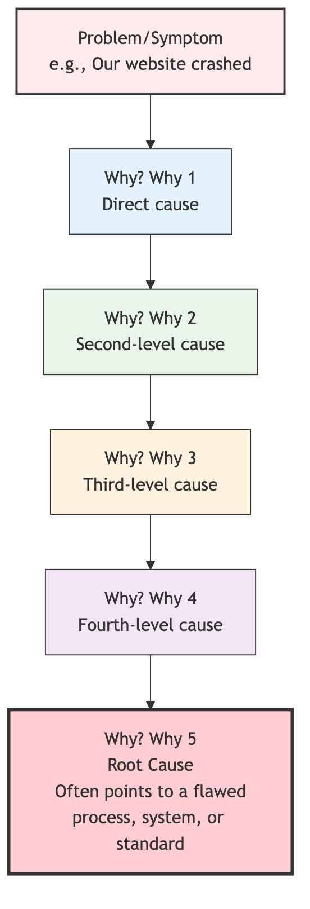

# 5 Whys

When dealing with daily problems, we often fall into a vicious cycle of "treating the symptoms but not the root cause": we fix a problem, but soon after, the same problem reappears in the same or a similar way. This is usually because we only dealt with the **surface symptoms** of the problem, without touching the **root cause** that led to it. **5 Whys** is an extremely simple, yet profoundly insightful **Root Cause Analysis (RCA)** technique. It was proposed by Sakichi Toyoda, the founder of Toyota Motor Corporation, and is a core problem-solving tool in the Toyota Production System (TPS).

The core idea of the 5 Whys method is to continuously and iteratively ask "**Why?**" about an existing problem, delving deeper layer by layer, like peeling an onion, until the underlying root cause is found. If this root cause is addressed, it can completely prevent the problem from recurring. It doesn't strictly require asking exactly five times; sometimes the root can be found in three whys, and sometimes it may require more. The essence lies in the **spirit of persistent inquiry, not being satisfied with superficial answers**. It is a powerful thinking tool that shifts a team's focus from "Whose fault is it?" to "Why did it happen?", and from "firefighting" to "fire prevention."

## The Logical Chain of 5 Whys

The 5 Whys process builds a clear cause-and-effect chain from symptom to root cause. The answer to each "Why" forms the subject of the next "Why."



<!--
```mermaid
graph TD
    subgraph The Causal Chain of 5 Whys
        A(<b>Problem/Symptom</b><br/>e.g., Our website crashed) --> B(<b>Why? (Why 1)</b><br/>Direct cause);
        B --> C(<b>Why? (Why 2)</b><br/>Second-level cause);
        C --> D(<b>Why? (Why 3)</b><br/>...);
        D --> E(<b>Why? (Why 4)</b><br/>...);
        E --> F(<b>Why? (Why 5)</b><br/><b>Root Cause</b><br/>Often points to a flawed<br/><b>process, system, or standard</b>);
    end
```
-->

## How to Conduct a 5 Whys Analysis

1.  **Step 1: Form a Team, Define the Problem**
    *   Gather a small group of frontline personnel who are familiar with the problem and its context.
    *   Jointly write a precise **problem statement** using clear, objective language. For example, "On October 26, 2023, at 10:00 AM, the customer order system server crashed."

2.  **Step 2: Start Continuously Asking "Why?"**
    *   **First "Why?"**: Ask the first "Why?" about the problem statement.
        *   *Question*: "Why did the customer order system server crash?"
        *   *Answer*: "Because the server's CPU usage reached 100%."

    *   **Second "Why?"**: Use the previous answer as the new subject and continue asking.
        *   *Question*: "Why did the server's CPU usage reach 100%?"
        *   *Answer*: "Because a SQL query in the database entered an infinite loop."

    *   **Third "Why?"**:
        *   *Question*: "Why did this SQL query enter an infinite loop?"
        *   *Answer*: "Because there was a logical flaw in the query when processing a special type of user data."

    *   **Fourth "Why?"**:
        *   *Question*: "Why was this flawed code deployed to the production environment?"
        *   *Answer*: "Because our code review process did not cover this specific test case."

    *   **Fifth "Why?"**:
        *   *Question*: "Why did our code review process have such an oversight?"
        *   *Answer*: "Because we haven't established a standardized **code review checklist** that includes all necessary inspection items."

3.  **Step 3: Identify the Root Cause and Formulate Countermeasures**
    *   **Identify the Root Cause**: In the example above, the root cause was identified as "lack of a standardized code review checklist." This is a **process-level** issue. If we had only fixed the logical flaw in the SQL (the answer to the third "Why"), it's highly likely that other similar, insufficiently tested code issues would arise in the future.
    *   **Formulate Countermeasures**: Develop a specific, actionable corrective measure for the root cause. For example, "The technical lead will take charge of creating a standard code review checklist, including database performance, security, and boundary condition testing, within this week, and all teams must follow it in the future."

## Application Cases

**Case 1: Corrosion of the Stone Walls of the Jefferson Memorial in Washington D.C.**

*   **Problem**: The stone walls of the memorial were severely corroded.
*   **Why? (1)** Because cleaners used high-strength detergents too frequently to wash the walls.
*   **Why? (2)** Because there was a large amount of bird droppings on the walls every day, necessitating frequent cleaning.
*   **Why? (3)** Because a large number of swallows gathered around the memorial, feeding on spiders that bred there.
*   **Why? (4)** Because a large number of spiders were attracted by the memorial's lights, they liked to gather in bright places to spin webs at dusk.
*   **Why? (5)** Because the memorial's lighting system was set to turn on an hour before sunset.
*   **Root Cause**: Improper setting of the lighting system's turn-on time.
*   **Solution**: Adjust the memorial's lights to turn on after sunset. This simple, process-oriented change fundamentally solved the stone wall corrosion problem.

**Case 2: A Puddle of Oil on the Factory Floor**

*   **Problem**: There was a puddle of oil on the factory floor.
*   **Why? (1)** Because a machine's oil pipe joint was leaking.
*   **Why? (2)** Because the gasket in that oil pipe joint was old and cracked.
*   **Why? (3)** Because the company purchased a batch of low-quality, cheap gaskets.
*   **Why? (4)** Because the company's procurement policy's only requirement was "lowest price wins."
*   **Why? (5)** Because the procurement department's performance was only linked to how much procurement cost they "saved" for the company, and had nothing to do with the quality and lifespan of spare parts.
*   **Root Cause**: Unreasonable performance appraisal system for the procurement department.
*   **Solution**: Revise procurement policies and performance systems to include supplier quality, reliability, and long-term costs in the evaluation system.

**Case 3: A Student Fails a Final Exam**

*   **Problem**: Xiao Ming failed his math final exam.
*   **Why? (1)** Because he only started reviewing in the last week before the exam, which was not enough time.
*   **Why? (2)** Because he didn't understand much of the content taught in class.
*   **Why? (3)** Because he always played with his phone during class and couldn't concentrate.
*   **Why? (4)** Because he fundamentally disliked math and had no interest in it.
*   **Why? (5)** Because in junior high, he was severely criticized by a teacher after failing a math test, which caused a psychological shadow and fear of math.
*   **Root Cause**: Early negative learning experiences led to psychological barriers.
*   **Solution**: May require psychological counseling and building self-confidence, and re-establishing his interest in math by starting with more basic knowledge points where he can experience success.

## Advantages and Challenges of 5 Whys

**Core Advantages**

*   **Simple and Easy to Use**: Does not require complex statistical tools or specialized knowledge; any team can quickly get started.
*   **Gets to the Root**: Helps teams penetrate the surface symptoms of a problem to find high-leverage solutions that can fundamentally solve the problem.
*   **Promotes Understanding, Not Blame**: Shifts the focus from "who made the mistake" to "why did the process allow the mistake to happen," helping to build a healthier, issue-focused problem-solving culture.

**Potential Challenges**

*   **May Have Multiple Root Causes**: For complex problems, the root cause may not be singular but an interconnected system. In such cases, the 5 Whys may oversimplify the problem.
*   **Depends on Participant Knowledge**: The depth of the analysis highly depends on the participating team's understanding of the actual process and situation.
*   **May Stop Midway**: The team might stop asking "Why?" after finding a seemingly reasonable but not the most fundamental cause.

## Extensions and Connections

*   **Fishbone Diagram (Ishikawa Diagram)**: When a problem may be caused by multiple different, parallel reasons from various areas, a fishbone diagram can first be used to systematically brainstorm and organize all possible potential causes. Then, the 5 Whys can be used to deeply investigate the most suspicious causes.
*   **Lean Production** and **Six Sigma**: The 5 Whys is one of the most commonly used and fundamental tools for root cause analysis in both of these quality and operational improvement methodologies.

---
*Source Reference: The 5 Whys method, as one of the cornerstones of the Toyota Production System (TPS), was conceived by Sakichi Toyoda and popularized by Taiichi Ohno in his work. It is a core embodiment of problem-solving and continuous improvement culture in lean thinking.*