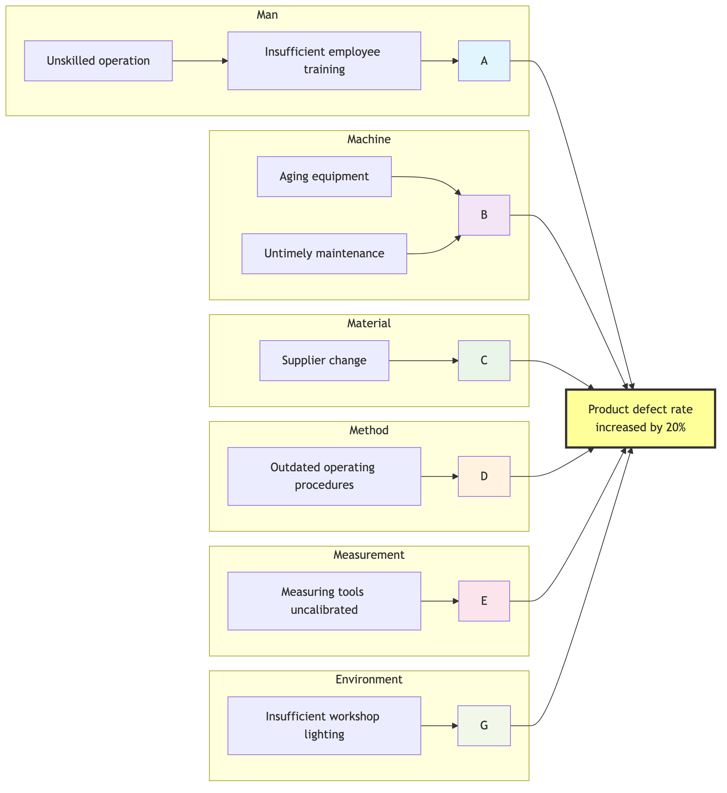

# Fishbone Diagram (Ishikawa Diagram)

When a complex problem occurs, its underlying causes are often not singular, but result from multiple interconnected factors from different areas. If we rely solely on intuition, we can easily overlook some key potential causes. The **Fishbone Diagram**, also known as the **Ishikawa Diagram** after its inventor Dr. Kaoru Ishikawa, is a powerful, visual **Root Cause Analysis** tool. Its core objective is to help teams **systematically and comprehensively** brainstorm and organize all potential causes leading to a specific problem (effect) through a structured framework resembling a fish skeleton.

The appeal of the Fishbone Diagram lies in its **structured brainstorming** process. It provides a series of classic cause categories (the "main bones" of the fish) that guide the team to think from different, predefined perspectives, thereby avoiding blind spots in thinking. By presenting all possible factors such as "Man, Machine, Material, Method, Environment" on a single diagram, the team can gain a holistic and comprehensive understanding of the problem's complexity, and on this basis, further identify the key causes most worthy of in-depth investigation and verification. It is an excellent tool for organizing a team's scattered ideas into a logical, orderly "problem panorama."

## Structure of a Fishbone Diagram

A fishbone diagram consists of several illustrative, fixed parts:

*   **Fish Head**: Located on the far right of the diagram, usually enclosed in a box, containing the **problem or effect** we want to analyze. For example, "Product defect rate increased by 20% this month."
*   **Spine**: A horizontal main line extending from the fish head to the left.
*   **Main Bones**: Several main branches extending diagonally from the spine, representing the major **cause categories** that contribute to the problem. These categories provide structure for thinking.
*   **Sub-Branches/Small Bones**: Smaller branches extending from the main bones, representing more specific **potential causes** brainstormed by team members under each major category.

### Classic Cause Classification Models (Main Bones)

Depending on the industry of the analysis object, different classic models can be flexibly chosen for the main bone classification of the fishbone diagram:

*   **"6M" Model commonly used in manufacturing**:

    *   **Manpower**: Skills, experience, responsibility, fatigue of operators, etc.
    *   **Machine**: Aging, precision, maintenance status of production equipment, etc.
    *   **Material**: Quality, specifications, supplier stability of raw materials, etc.
    *   **Method**: Work procedures, operating instructions, process parameter settings, etc.
    *   **Measurement**: Accuracy of measuring tools, inspection standards, accuracy of data recording, etc.
    *   **Milieu/Mother Nature**: Temperature, humidity, lighting of the workplace, organizational culture, etc.

*   **"4S" or "8P" Models commonly used in service industries**:

    *   **4S**: Suppliers, Systems, Surroundings, Skills.
    *   **8P**: Product (product/service), Price, Place (channel), Promotion, People, Process, Physical Evidence, Productivity & Quality.



<!--
```mermaid
graph TD
    subgraph Fishbone Diagram (6M Model)
        direction LR
        A(Man) --> F(Problem/Effect);
        B(Machine) --> F;
        C(Material) --> F;
        D(Method) --> F;
        E(Measurement) --> F;
        G(Environment) --> F;

        subgraph A Man
            A1(Insufficient employee training) --> A;
            A2(Unskilled operation) --> A1;
        end
        subgraph B Machine
            B1(Aging equipment) --> B;
            B2(Untimely maintenance) --> B;
        end
        subgraph C Material
            C1(Supplier change) --> C;
        end
        subgraph D Method
            D1(Outdated operating procedures) --> D;
        end
        subgraph E Measurement
            E1(Measuring tools uncalibrated) --> E;
        end
        subgraph G Environment
            G1(Insufficient workshop lighting) --> G;
        end
    end
```
-->

## How to Draw and Use a Fishbone Diagram

1.  **Step 1: Clearly Define the "Fish Head" (Problem)**
    Work with the team to reach a clear, specific, and unambiguous consensus on the problem to be analyzed. Write this problem statement in the "fish head" position on the right side of the whiteboard.

2.  **Step 2: Draw the "Spine" and "Main Bones" (Cause Categories)**
    Draw the main line, and based on your industry and problem characteristics, choose an appropriate classification model (e.g., 6M), draw several main bones, and label them with category names.

3.  **Step 3: Brainstorm and Fill in the "Sub-Branches/Small Bones" (Specific Causes)**
    *   This is the core part of the fishbone diagram. The facilitator guides the team, around **each** main bone category, to brainstorm all possible specific causes.
    *   **Key Technique**: Under each specific cause, you can combine the **5 Whys** method to ask continuous "Why?" questions to find deeper causes. For example, under the "Man" main bone, one cause might be "employee operational error." You can continue to ask "Why did the error occur?" to get the deeper cause "because of insufficient training," and draw it as a small bone.
    *   Connect all thought-out causes as sub-branches or small bones to the corresponding main bone.

4.  **Step 4: Analyze the Fishbone Diagram, Identify Key Causes**
    When the fishbone diagram is filled, it provides a panoramic view of the problem's causes. At this point, the team needs to review the entire diagram together and, through discussion, voting, or simple data verification, to identify those **most likely** to lead to the problem, or have the greatest impact, the **"vital few" causes**. These key causes can be circled with a different colored pen.

5.  **Step 5: Develop a Plan for Subsequent Verification and Improvement**
    The fishbone diagram itself is a brainstorming and analysis tool; it cannot directly solve the problem. Next, the team needs to develop specific verification plans for the circled key causes (e.g., go to the site to collect data to verify whether a hypothesis is true), and on this basis, formulate the final improvement measures.

## Application Cases

**Case 1: Analyzing the Problem of "High Software App Crash Rate"**

*   **Fish Head**: App in the latest version launched, user crash rate increased by 50%.
*   **Main Bones**: A variation of the software development model can be used, such as: Code, Build, Test, Environment, People.
*   **Analysis**: Through team brainstorming, it might be found under the "Code" main bone that "new third-party library has memory leaks"; under the "Test" main bone, it might be found that "automated test cases do not cover low-end Android models." After further data verification, the team finally determined that "memory leaks" were the main cause of crashes.

**Case 2: Analyzing "Poor Performance of a Marketing Campaign"**

*   **Fish Head**: This "Double Eleven" (Singles' Day) promotion's sales did not meet the target.
*   **Main Bones**: The 4P model of marketing can be used: Product, Price, Place, Promotion.
*   **Analysis**: The team might find that under the "Price" main bone, there was "coupon rules were too complex for users to understand"; under the "Place" main bone, there was "social media advertising did not accurately reach the target audience." Through this analysis, the team can provide clear "pitfall avoidance guidelines" for the next campaign.

**Case 3: Analyzing "Increased Post-Surgical Infection Rate in Patients"**

*   **Fish Head**: This quarter's orthopedic ward's post-surgical infection rate increased by 5% compared to the previous quarter.
*   **Main Bones**: Use the 6M model for the medical field.
*   **Analysis**: A cross-functional team consisting of doctors, nurses, and infection control experts, jointly drew a fishbone diagram. They might eventually find that "inadequate execution of pre-surgical skin disinfection procedures" under the "Method" main bone, and "untimely replacement of ward ventilation system filters" under the "Environment" main bone, are the two most suspicious key causes. Next, they will focus on these two points for data collection and on-site observation.

## Advantages and Challenges of Fishbone Diagram

**Core Advantages**


*   **Structured and Comprehensive**: Provides a clear structure that guides the team to think systematically from multiple dimensions, effectively avoiding omissions.
*   **Promotes Team Participation and Consensus**: An excellent team collaboration tool that can gather everyone's wisdom and reach consensus on the complexity of the problem.
*   **Visual**: Presents complex causal relationships in a very intuitive and clear way.

**Potential Challenges**


*   **Can Become Overly Complex**: For an extremely complex problem, the fishbone diagram can become very large and cluttered, losing its clear focus.
*   **Cannot Reflect the Weight of Causes**: The fishbone diagram itself, does not show which cause has a greater impact. It needs to be combined with other tools like Pareto analysis to determine priorities.
*   **Only a Collection of "Hypotheses"**: All "causes" on the fishbone diagram, before being validated by data, are still only "potential, suspicious" causes, not facts.

## Extensions and Connections

*   **5 Whys**: The golden partner of the fishbone diagram. When using the fishbone diagram for horizontal, broad cause brainstorming, the 5 Whys can be used at any time to conduct a vertical, in-depth root cause analysis for a specific cause.
*   **Brainstorming**: The fishbone diagram provides a structured framework for brainstorming, making idea generation more orderly and focused.
*   **Pareto Analysis**: After identifying all potential causes with a fishbone diagram, data can be collected, and Pareto analysis used to determine which are the "vital few" causes that lead to 80% of the problems.

---
*Source Reference: Dr. Kaoru Ishikawa was one of the pioneers of the post-war quality management movement in Japan. The fishbone diagram, as one of the "Seven Quality Control Tools" he invented, is widely used in quality management and continuous improvement activities worldwide, and is an indispensable basic tool in Total Quality Management (TQM) and Six Sigma practices.*