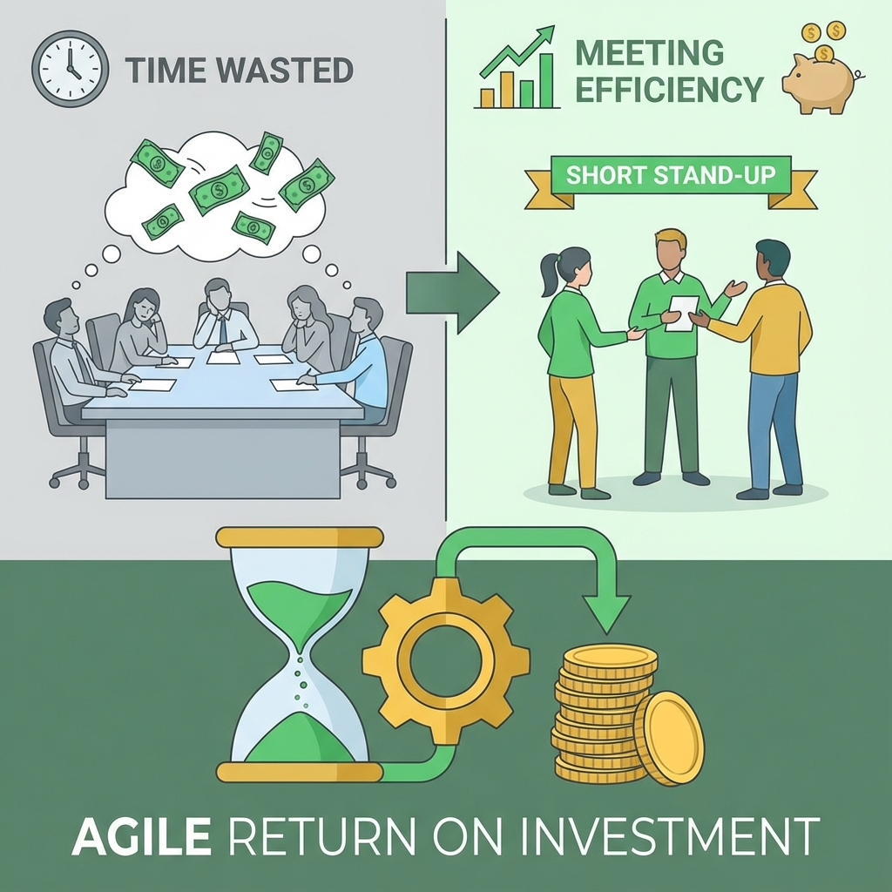

# Agile Transformation ROI Calculator

Estimate the potential financial impact of improving team efficiency through better meeting structures and agile ceremonies. Enter your team's figures below; the calculation runs entirely in your browser.

    
Calculator

    

        <label>
            Team Size (People):
            <input type="number" id="team-size" value="7" min="1" style="width: 100%; padding: 0.5rem;">
        </label>
        <label>
            Avg Hourly Rate ($):
            <input type="number" id="hourly-rate" value="60" min="0" style="width: 100%; padding: 0.5rem;">
        </label>
        <label>
            Weekly Meeting Hours (per person):
            <input type="number" id="meeting-hours" value="10" min="0" style="width: 100%; padding: 0.5rem;">
        </label>
        <label>
            Expected Efficiency Gain (%):
            <input type="number" id="efficiency-gain" value="20" min="0" max="100" style="width: 100%; padding: 0.5rem;">
        </label>
        <button id="calculate-btn" class="md-button md-button--primary" style="margin-top: 1rem;">Calculate ROI</button>
    

    

        <h3 style="margin-top: 0;">Projected Savings</h3>
        
Current Annual Meeting Cost: <strong id="annual-cost"></strong>

        
Potential Annual Savings: <strong id="annual-savings"></strong>

        
Hours Returned to the Team per Year: <strong id="hours-saved"></strong>

    

## How It Works

The calculator estimates the direct labor cost of meeting time and how much of it could be redirected to productive work:

| Quantity | Formula |
| --- | --- |
| Annual meeting hours | team size × weekly meeting hours per person × 52 |
| Annual meeting cost | annual meeting hours × average hourly rate |
| Potential annual savings | annual meeting cost × expected efficiency gain |

Agile ceremonies are designed to replace long, unfocused meetings with short, purposeful ones: a 15-minute Daily Scrum instead of an hour-long status meeting, a timeboxed planning session instead of open-ended discussions, and a retrospective that makes improvement a habit.

## Worked Example

A team of 7 people, an average loaded rate of $60/hour, and 10 hours of meetings per person per week:

*   Annual meeting hours: 7 × 10 × 52 = **3,640 hours**
*   Annual meeting cost: 3,640 × $60 = **$218,400**
*   With a 20% efficiency gain: **$43,680** a year, or about **728 hours** returned to the team.

## How to Choose Realistic Inputs

*   **Hourly rate**: use a *loaded* rate (salary plus benefits and overhead), typically 1.25–1.4 times base pay.
*   **Meeting hours**: check calendars for two typical weeks rather than estimating from memory.
*   **Efficiency gain**: 10–25% is a reasonable range for teams that introduce timeboxing, clear agendas and fewer status meetings. Be conservative when presenting to stakeholders.

## What This Number Does and Doesn't Tell You

*   **It does** show the scale of time spent in meetings and the value of reclaiming even a small share of it.
*   **It doesn't** capture the larger benefits of agile, such as faster feedback, fewer defects, earlier delivery of value and better morale, which are often worth far more than meeting savings.
*   **It doesn't** include transition costs such as training, coaching and a temporary dip in productivity.

For a fuller business case, combine this estimate with a [cost-benefit analysis](../../Problem Solving & Decision Making/decision_making/Cost-Benefit-Analysis-Tutorial-en.md) that includes transition costs and delivery benefits.

## Frequently Asked Questions

??? question "Is the meeting cost really a cost if people are paid anyway?"

    It's an opportunity cost: hours spent in unproductive meetings aren't available for work that creates value. The calculator expresses that time in money to make it comparable.

??? question "What efficiency gain should I assume?"

    Start with 10–20%. Measure actual meeting hours before and after a change for a few sprints and replace the estimate with real data.

??? question "Do agile teams have fewer meetings?"

    Not always fewer, but more structured and purposeful. Some teams spend about the same time in meetings but replace status updates with planning, problem solving and feedback, which is a different kind of return.

## Extensions and Connections

*   **[Agile](Agile-Tutorial-en.md)**: The values and principles behind agile ceremonies.
*   **[Scrum](Scrum-Tutorial-en.md)**: The events (Sprint Planning, Daily Scrum, Review, Retrospective) and their timeboxes.
*   **[Cost-Benefit Analysis](../../Problem Solving & Decision Making/decision_making/Cost-Benefit-Analysis-Tutorial-en.md)**: Building a complete business case for an agile transformation.
