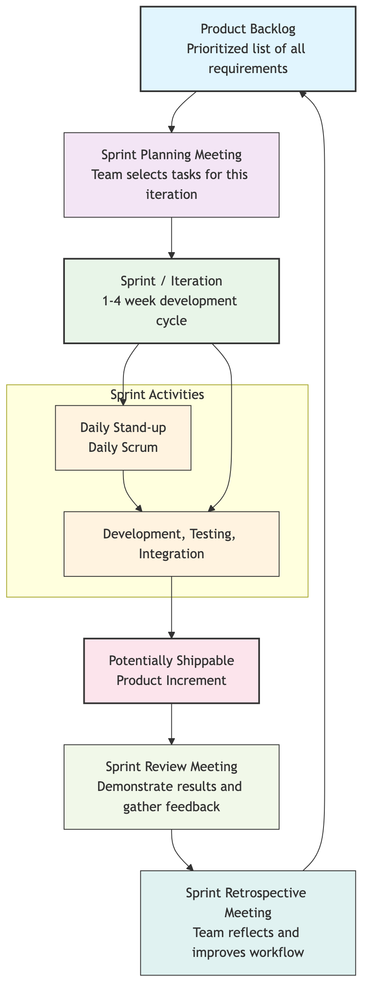

# Agile Development

Before the 21st century, software development generally adopted the "**Waterfall Model**"—a linear, phase-by-phase process, much like building a bridge: spending months or even years on detailed requirements analysis and design, followed by lengthy development and testing, and finally delivering a "perfect" finished product to the client. However, in the internet era, where demands change rapidly and markets are full of uncertainty, the drawbacks of this model became increasingly apparent: it was slow to react, carried huge risks, and often resulted in the final product being delivered long after it had diverged from real user needs. **Agile Development** emerged as a revolutionary software development movement to address this challenge.

Agile is not a specific method or process, but a set of **values and principles** aimed at embracing change, enhancing customer value, and promoting efficient collaboration. It originated from the "**Manifesto for Agile Software Development**" published in 2001. Its core idea is to abandon the obsession with "perfect plans" and instead continuously and rapidly deliver working software through **short-cycle, iterative, incremental** development processes, constantly gathering feedback and making adjustments along the way. It breaks down a large, unpredictable "big project" into a series of short, manageable "sprints," thereby maintaining development flexibility and adaptability in an ever-changing market.

## The Agile Software Development Manifesto

The soul of Agile is embodied in its concise four core values and twelve supporting principles.

**Four Core Values**:

> We are uncovering better ways of developing software by doing it and helping others do it. Through this work we have come to value:
>
> **Individuals and interactions** over processes and tools
> **Working software** over comprehensive documentation
> **Customer collaboration** over contract negotiation
> **Responding to change** over following a plan
>
> That is, while there is value in the items on the right, we value the items on the left more.

These four values profoundly reflect the essence of Agile thinking: human-centered, value-driven, collaboration-based, and adaptability-oriented.

### Agile Development Iteration Cycle



<!--
```mermaid
graph TD
    subgraph Agile Development Iterative and Incremental Cycle
        A(<b>Product Backlog</b><br/>A prioritized list of<br/>all requirements) --> B(<b>Sprint Planning Meeting</b><br/>Team selects tasks to complete<br/>from top of Backlog for this iteration);
        B --> C(<b>Sprint / Iteration</b><br/>A fixed-time, 1-4 week<br/>development cycle);
        subgraph Sprint / Iteration (1-4 weeks)
            direction LR
            C1(Daily Stand-up<br/>Daily Scrum) --> C2(Development, Testing, Integration);
        end
        C --> C1 & C2;
        C2 --> D(<b>Potentially Shippable Product Increment</b>);
        D --> E(<b>Sprint Review Meeting</b><<br/>Demonstrate results to stakeholders<br/>and gather feedback);
        E --> F(<b>Sprint Retrospective Meeting</b><br/>Team reflects and improves<br/>its own workflow);
        F --> A;
    end
```
-->

## The Twelve Principles of Agile

These twelve principles are specific guidelines for realizing Agile values, including:

1.  Our highest priority is to satisfy the customer through early and continuous delivery of valuable software.
2.  Welcome changing requirements, even late in development. Agile processes harness change for the customer's competitive advantage.
3.  Deliver working software frequently, from a couple of weeks to a couple of months, with a preference to the shorter timescale.
4.  Business people and developers must work together daily throughout the project.
5.  Build projects around motivated individuals. Give them the environment and support they need, and trust them to get the job done.
6.  The most efficient and effective method of conveying information to and within a development team is face-to-face conversation.
7.  Working software is the primary measure of progress.
8.  Agile processes promote sustainable development. The sponsors, developers, and users should be able to maintain a constant pace indefinitely.
9.  Continuous attention to technical excellence and good design enhances agility.
10. Simplicity—the art of maximizing the amount of work not done—is essential.
11. The best architectures, requirements, and designs emerge from self-organizing teams.
12. At regular intervals, the team reflects on how to become more effective, then tunes and adjusts its behavior accordingly.

## Common Agile Development Frameworks

Agile is a set of philosophies, not a specific process. Under the guidance of Agile thinking, many specific, actionable development frameworks have emerged, the most famous of which include:

*   **Scrum**: Currently the most popular and widely applied Agile framework. It provides a clear, iterative collaboration framework for teams by defining a series of roles (e.g., Product Owner, Scrum Master), events (e.g., Sprint Planning, Daily Scrum), and artifacts (e.g., Product Backlog).
*   **Kanban**: An Agile method that focuses more on visualizing workflow and optimizing continuous delivery efficiency. It emphasizes limiting Work In Progress (WIP) and processing work with a "pull" system, aiming to maximize the efficiency of value flow.
*   **Extreme Programming (XP)**: An Agile framework that focuses more on excellent engineering practices. It advocates a series of specific practices, such as Test-Driven Development (TDD), Pair Programming, Continuous Integration, etc., to ensure high software quality and sustainability.

## Application Cases

**Case 1: Feature Development for an E-commerce Website**

*   **Traditional Waterfall Model**: Spend 3 months on detailed requirements analysis, designing a perfect blueprint with all features including "personalized recommendations," "live commerce," and "virtual try-on." Then spend 6 months on development, and finally, upon launch, discover that the most needed feature by users was actually just a smoother payment process.
*   **Agile Model**:
    *   **Sprint 1 (2 weeks)**: The team focuses on one thing—optimizing the payment process. After two weeks, a new version with 50% faster payment speed is launched.
    *   **Sprint 2 (2 weeks)**: Based on user feedback, the next highest priority is "product search." The team spends two weeks developing and launching a smarter search function.
    *   **...And so on**: The team delivers a working software increment with real value to users in each iteration and continuously adjusts subsequent development directions based on market feedback.

**Case 2: Spotify's "Squad" Model**

*   **Scenario**: Spotify, the world's largest music streaming service, is a prime example of an Agile organizational culture.
*   **Application**: They divide the entire R&D team into many small, highly skilled, cross-functional, self-organizing "Squads." Each squad acts like a mini-startup, having end-to-end autonomy over a specific feature or business domain (e.g., "search function" or "user playlists"). This model greatly improved development efficiency, innovation capability, and employees' sense of ownership.

**Case 3: A Hardware Startup Team**

*   **Scenario**: A team wants to develop a new smartwatch.
*   **Application**: They didn't start by designing and producing the final product. Instead, they adopted an Agile approach, first using off-the-shelf parts to quickly create a minimalist **hardware MVP (Minimum Viable Product)** that could validate core needs, and immediately gave it to seed users for trial. By observing real user feedback, they continuously iterated on hardware design and software features, thereby avoiding huge mold and production cost losses due to early incorrect decisions.

## Advantages and Challenges of Agile

**Core Advantages**

*   **Stronger Adaptability and Flexibility**: Can calmly embrace changing requirements and quickly respond to the market.
*   **Earlier and More Continuous Value Delivery**: Customers can use core features earlier and receive continuous updates.
*   **Higher Customer Satisfaction**: Ensures the final product is what customers truly want through close customer collaboration.
*   **Lower Risk**: Short-cycle iterations avoid investing too many resources in the wrong direction, significantly reducing the risk of project failure.
*   **Higher Team Morale**: Empowers self-organizing teams, enhancing members' autonomy and sense of accomplishment.

**Potential Challenges**

*   **Requires Profound Cultural and Mindset Shift**: The success of Agile is far more than just a change in process; it requires managers and team members to shift their mindset from "command-and-control" to "trust-and-empowerment."
*   **Higher Demands on Individuals**: Members of Agile teams need stronger communication skills, collaborative spirit, and cross-functional skills.
*   **Lack of Documentation**: If misunderstood, it can lead to a lack of necessary documentation, causing difficulties for future maintenance and handover.
*   **Difficulty in Long-Term Forecasting**: Due to its nature of embracing change, Agile makes it difficult to provide precise, long-term delivery time and cost commitments at the beginning of a project.

## Extensions and Connections

*   **The Lean Startup**: Highly aligned with Agile thinking, the "build-measure-learn" feedback loop of Lean Startup can be seen as the application of Agile development at the business model validation level.
*   **DevOps**: Is an extension of Agile thinking in the fields of software development (Dev) and IT operations (Ops). It aims to break down barriers between development and operations through changes in culture, practices, and tools, achieving faster, more reliable software delivery and deployment.

---
*Reference: The "Manifesto for Agile Software Development" is the common source and guiding charter for all Agile practices. Signatories of the manifesto, such as Kent Beck, Martin Fowler, and Jeff Sutherland, are among the most important masters and thinkers in the Agile field.*